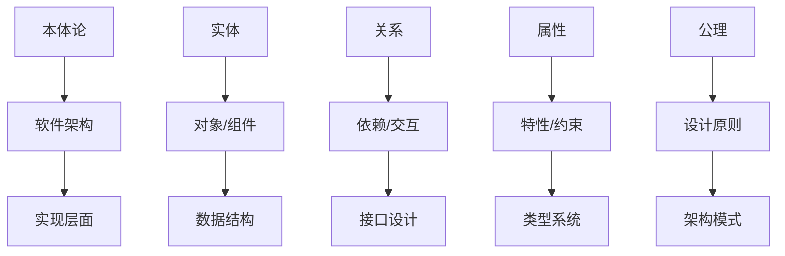

# 本体论理论 - 形式化架构基础

## 目录

1. [概述](#概述)
2. [数学本体论](#数学本体论)
3. [现实本体论](#现实本体论)
4. [信息本体论](#信息本体论)
5. [AI本体论](#ai本体论)
6. [软件架构映射](#软件架构映射)
7. [形式化证明](#形式化证明)
8. [应用案例分析](#应用案例分析)

## 概述

### 1.1 本体论在形式化架构中的地位

本体论作为哲学的基础分支，在形式化架构理论中扮演着核心角色。它研究存在的基本性质和结构，为软件架构的设计和实现提供理论基础。

**定义 1.1.1 (本体论)**
本体论是研究存在的基本性质和结构的哲学分支，形式化定义为：
$$\mathcal{O} = (\mathcal{E}, \mathcal{R}, \mathcal{P}, \mathcal{A})$$

其中：
- $\mathcal{E}$ 是实体集合
- $\mathcal{R}$ 是关系集合
- $\mathcal{P}$ 是属性集合
- $\mathcal{A}$ 是公理集合

### 1.2 本体论与软件架构的映射关系



## 数学本体论

### 2.1 数学对象的存在性

**定义 2.1.1 (数学对象)**
数学对象是数学理论中讨论的抽象实体，包括数、集合、函数、结构等。

**公理 2.1.1 (数学对象存在公理)**
对于任何数学对象 $x$，存在一个唯一的存在性谓词 $\exists(x)$ 使得：
$$\exists(x) \Leftrightarrow x \in \mathcal{U}$$

其中 $\mathcal{U}$ 是数学宇宙。

#### 2.1.1 柏拉图主义

**定义 2.1.2 (柏拉图主义)**
柏拉图主义认为数学对象客观存在于理念世界中，独立于人类心智。

**定理 2.1.1 (柏拉图主义的形式化)**
如果 $\mathcal{M}$ 是理念世界，则对于任何数学对象 $x$：
$$x \in \mathcal{M} \Rightarrow \exists(x) \land \text{Objective}(x)$$

其中 $\text{Objective}(x)$ 表示 $x$ 的客观性。

**软件架构映射**:
```rust
// 柏拉图主义在软件架构中的体现
pub trait PlatonicObject {
    type Essence;
    
    // 客观存在的本质
    fn essence(&self) -> Self::Essence;
    
    // 独立于实现的抽象
    fn is_abstract(&self) -> bool;
    
    // 理念世界的映射
    fn ideal_form(&self) -> IdealForm;
}

// 数学对象在软件中的表示
pub struct MathematicalObject<T> {
    essence: T,
    ideal_form: IdealForm,
    abstract_nature: bool,
}

impl<T> PlatonicObject for MathematicalObject<T> {
    type Essence = T;
    
    fn essence(&self) -> Self::Essence {
        self.essence.clone()
    }
    
    fn is_abstract(&self) -> bool {
        self.abstract_nature
    }
    
    fn ideal_form(&self) -> IdealForm {
        self.ideal_form.clone()
    }
}
```

#### 2.1.2 形式主义

**定义 2.1.3 (形式主义)**
形式主义认为数学是符号形式系统的操作，数学对象是符号的抽象。

**定理 2.1.2 (形式主义的形式化)**
如果 $\mathcal{S}$ 是符号系统，$\mathcal{R}$ 是操作规则，则：
$$\text{Mathematical}(x) \Leftrightarrow x \in \mathcal{S} \land \text{Operable}(x, \mathcal{R})$$

**软件架构映射**:
```rust
// 形式主义在软件架构中的体现
pub trait FormalSystem {
    type Symbol;
    type Rule;
    
    // 符号操作
    fn operate(&self, symbol: &Self::Symbol, rule: &Self::Rule) -> Self::Symbol;
    
    // 形式化验证
    fn verify(&self, expression: &Expression) -> bool;
    
    // 符号抽象
    fn abstract_symbol(&self, concrete: &ConcreteObject) -> Self::Symbol;
}

// 形式化数学系统
pub struct FormalMathematics {
    symbols: Vec<Symbol>,
    rules: Vec<Rule>,
    operations: HashMap<Symbol, Operation>,
}

impl FormalSystem for FormalMathematics {
    type Symbol = Symbol;
    type Rule = Rule;
    
    fn operate(&self, symbol: &Self::Symbol, rule: &Self::Rule) -> Self::Symbol {
        // 实现符号操作
        self.operations.get(symbol).unwrap().apply(rule)
    }
    
    fn verify(&self, expression: &Expression) -> bool {
        // 实现形式化验证
        expression.validate_against(&self.rules)
    }
    
    fn abstract_symbol(&self, concrete: &ConcreteObject) -> Self::Symbol {
        // 实现符号抽象
        concrete.to_symbol()
    }
}
```

#### 2.1.3 直觉主义

**定义 2.1.4 (直觉主义)**
直觉主义认为数学是人类心智的构造，数学对象通过构造性过程产生。

**定理 2.1.3 (直觉主义的形式化)**
对于任何数学对象 $x$，存在构造性证明 $\pi$ 使得：
$$\text{Constructible}(x) \Leftrightarrow \exists \pi. \text{Construct}(x, \pi)$$

**软件架构映射**:
```rust
// 直觉主义在软件架构中的体现
pub trait ConstructiveMathematics {
    type Construction;
    type Proof;
    
    // 构造性证明
    fn construct(&self, object: &Object) -> Self::Construction;
    
    // 构造性存在
    fn exists_constructively(&self, predicate: &Predicate) -> Option<Self::Proof>;
    
    // 心智构造
    fn mental_construction(&self, concept: &Concept) -> Self::Construction;
}

// 构造性数学系统
pub struct IntuitionisticSystem {
    constructions: Vec<Construction>,
    proofs: Vec<Proof>,
    mental_models: HashMap<Concept, MentalModel>,
}

impl ConstructiveMathematics for IntuitionisticSystem {
    type Construction = Construction;
    type Proof = Proof;
    
    fn construct(&self, object: &Object) -> Self::Construction {
        // 实现构造性过程
        object.build_construction()
    }
    
    fn exists_constructively(&self, predicate: &Predicate) -> Option<Self::Proof> {
        // 实现构造性存在证明
        predicate.find_constructive_proof()
    }
    
    fn mental_construction(&self, concept: &Concept) -> Self::Construction {
        // 实现心智构造
        self.mental_models.get(concept).unwrap().to_construction()
    }
}
```

### 2.2 数学真理的本质

**定义 2.2.1 (数学真理)**
数学真理是数学命题在数学宇宙中的真值。

**公理 2.2.1 (数学真理公理)**
对于任何数学命题 $P$：
$$\text{True}(P) \Leftrightarrow P \models \mathcal{U}$$

#### 2.2.1 客观性

**定义 2.2.2 (数学真理客观性)**
数学真理是客观的，独立于人类认知。

**定理 2.2.1 (客观性定理)**
如果 $P$ 是数学真理，则：
$$\text{Objective}(P) \Leftrightarrow \forall \mathcal{I}. \mathcal{I} \models P$$

其中 $\mathcal{I}$ 是任意解释。

#### 2.2.2 必然性

**定义 2.2.3 (数学真理必然性)**
数学真理是必然的，在所有可能世界中都为真。

**定理 2.2.2 (必然性定理)**
如果 $P$ 是数学真理，则：
$$\text{Necessary}(P) \Leftrightarrow \Box P$$

其中 $\Box$ 是必然性模态算子。

## 现实本体论

### 3.1 实在论与反实在论

**定义 3.1.1 (实在论)**
实在论认为存在独立于心灵的客观实在。

**定义 3.1.2 (反实在论)**
反实在论认为实在依赖于心灵的构造。

**定理 3.1.1 (实在论的形式化)**
如果 $\mathcal{R}$ 是客观实在，$\mathcal{M}$ 是心灵，则：
$$\text{Realist}(\mathcal{R}) \Leftrightarrow \mathcal{R} \not\subseteq \mathcal{M}$$

**软件架构映射**:
```rust
// 实在论在软件架构中的体现
pub trait Realism {
    type Reality;
    type Mind;
    
    // 客观实在
    fn objective_reality(&self) -> Self::Reality;
    
    // 独立于心灵
    fn independent_of_mind(&self, reality: &Self::Reality) -> bool;
    
    // 实在验证
    fn verify_reality(&self, claim: &Claim) -> bool;
}

// 反实在论在软件架构中的体现
pub trait AntiRealism {
    type ConstructedReality;
    type Mind;
    
    // 构造的实在
    fn constructed_reality(&self, mind: &Self::Mind) -> Self::ConstructedReality;
    
    // 依赖于心灵
    fn dependent_on_mind(&self, reality: &Self::ConstructedReality) -> bool;
    
    // 心灵构造
    fn mental_construction(&self, concept: &Concept) -> Self::ConstructedReality;
}
```

### 3.2 唯物论与唯心论

**定义 3.2.1 (唯物论)**
唯物论认为物质是唯一实在。

**定义 3.2.2 (唯心论)**
唯心论认为精神是唯一实在。

**定理 3.2.1 (唯物论的形式化)**
如果 $\mathcal{M}$ 是物质，$\mathcal{S}$ 是精神，则：
$$\text{Materialist} \Leftrightarrow \mathcal{M} = \mathcal{U} \land \mathcal{S} \subseteq \mathcal{M}$$

**软件架构映射**:
```rust
// 唯物论在软件架构中的体现
pub trait Materialism {
    type Matter;
    type Spirit;
    
    // 物质基础
    fn material_basis(&self) -> Self::Matter;
    
    // 精神依赖于物质
    fn spirit_depends_on_matter(&self, spirit: &Self::Spirit) -> Self::Matter;
    
    // 物质唯一性
    fn matter_is_primary(&self) -> bool;
}

// 唯心论在软件架构中的体现
pub trait Idealism {
    type Spirit;
    type Matter;
    
    // 精神基础
    fn spiritual_basis(&self) -> Self::Spirit;
    
    // 物质依赖于精神
    fn matter_depends_on_spirit(&self, matter: &Self::Matter) -> Self::Spirit;
    
    // 精神唯一性
    fn spirit_is_primary(&self) -> bool;
}
```

## 信息本体论

### 4.1 信息作为基础实在

**定义 4.1.1 (信息实在)**
信息实在论认为信息是基础实在，物质和精神都是信息的表现形式。

**定理 4.1.1 (信息基础性定理)**
如果 $\mathcal{I}$ 是信息，$\mathcal{M}$ 是物质，$\mathcal{S}$ 是精神，则：
$$\text{InformationPrimary} \Leftrightarrow \mathcal{M} \subseteq \mathcal{I} \land \mathcal{S} \subseteq \mathcal{I}$$

**软件架构映射**:
```rust
// 信息本体论在软件架构中的体现
pub trait InformationOntology {
    type Information;
    type Matter;
    type Spirit;
    
    // 信息基础性
    fn information_is_primary(&self) -> bool;
    
    // 物质作为信息
    fn matter_as_information(&self, matter: &Self::Matter) -> Self::Information;
    
    // 精神作为信息
    fn spirit_as_information(&self, spirit: &Self::Spirit) -> Self::Information;
    
    // 信息处理
    fn process_information(&self, info: &Self::Information) -> Self::Information;
}

// 信息基础系统
pub struct InformationBasedSystem {
    information_space: InformationSpace,
    processing_rules: Vec<ProcessingRule>,
    transformation_maps: HashMap<Entity, Information>,
}

impl InformationOntology for InformationBasedSystem {
    type Information = Information;
    type Matter = Matter;
    type Spirit = Spirit;
    
    fn information_is_primary(&self) -> bool {
        true
    }
    
    fn matter_as_information(&self, matter: &Self::Matter) -> Self::Information {
        // 将物质转换为信息
        matter.to_information()
    }
    
    fn spirit_as_information(&self, spirit: &Self::Spirit) -> Self::Information {
        // 将精神转换为信息
        spirit.to_information()
    }
    
    fn process_information(&self, info: &Self::Information) -> Self::Information {
        // 处理信息
        self.information_space.process(info, &self.processing_rules)
    }
}
```

### 4.2 计算宇宙假说

**定义 4.2.1 (计算宇宙)**
计算宇宙假说认为宇宙是一个巨大的计算过程。

**定理 4.2.1 (计算宇宙定理)**
如果 $\mathcal{U}$ 是宇宙，$\mathcal{C}$ 是计算过程，则：
$$\text{ComputationalUniverse} \Leftrightarrow \mathcal{U} \cong \mathcal{C}$$

**软件架构映射**:
```rust
// 计算宇宙在软件架构中的体现
pub trait ComputationalUniverse {
    type Universe;
    type Computation;
    type Process;
    
    // 宇宙作为计算
    fn universe_as_computation(&self) -> Self::Computation;
    
    // 计算过程
    fn computational_process(&self, input: &Input) -> Self::Process;
    
    // 宇宙模拟
    fn simulate_universe(&self, initial_state: &State) -> Self::Universe;
}

// 计算宇宙系统
pub struct ComputationalUniverseSystem {
    computation_engine: ComputationEngine,
    universe_state: UniverseState,
    processing_rules: Vec<UniverseRule>,
}

impl ComputationalUniverse for ComputationalUniverseSystem {
    type Universe = Universe;
    type Computation = Computation;
    type Process = Process;
    
    fn universe_as_computation(&self) -> Self::Computation {
        // 将宇宙表示为计算
        self.computation_engine.universe_computation()
    }
    
    fn computational_process(&self, input: &Input) -> Self::Process {
        // 执行计算过程
        self.computation_engine.process(input)
    }
    
    fn simulate_universe(&self, initial_state: &State) -> Self::Universe {
        // 模拟宇宙
        self.computation_engine.simulate(initial_state, &self.processing_rules)
    }
}
```

## AI本体论

### 5.1 强人工智能论

**定义 5.1.1 (强AI)**
强AI认为人工智能可以具有与人类相同的智能和意识。

**定理 5.1.1 (强AI可能性定理)**
如果 $\mathcal{H}$ 是人类智能，$\mathcal{A}$ 是AI智能，则：
$$\text{StrongAI} \Leftrightarrow \mathcal{A} \cong \mathcal{H}$$

**软件架构映射**:
```rust
// 强AI在软件架构中的体现
pub trait StrongAI {
    type HumanIntelligence;
    type AIIntelligence;
    type Consciousness;
    
    // AI智能等价于人类智能
    fn ai_equivalent_to_human(&self, ai: &Self::AIIntelligence) -> bool;
    
    // AI意识
    fn ai_consciousness(&self, ai: &Self::AIIntelligence) -> Self::Consciousness;
    
    // 智能测试
    fn intelligence_test(&self, subject: &Intelligence) -> TestResult;
}

// 强AI系统
pub struct StrongAISystem {
    intelligence_model: IntelligenceModel,
    consciousness_model: ConsciousnessModel,
    equivalence_tester: EquivalenceTester,
}

impl StrongAI for StrongAISystem {
    type HumanIntelligence = HumanIntelligence;
    type AIIntelligence = AIIntelligence;
    type Consciousness = Consciousness;
    
    fn ai_equivalent_to_human(&self, ai: &Self::AIIntelligence) -> bool {
        // 测试AI与人类智能的等价性
        self.equivalence_tester.test(ai, &self.intelligence_model)
    }
    
    fn ai_consciousness(&self, ai: &Self::AIIntelligence) -> Self::Consciousness {
        // 实现AI意识
        self.consciousness_model.generate(ai)
    }
    
    fn intelligence_test(&self, subject: &Intelligence) -> TestResult {
        // 执行智能测试
        self.intelligence_model.test(subject)
    }
}
```

### 5.2 多重实现论

**定义 5.2.1 (多重实现)**
多重实现论认为同一功能可以由不同的物理系统实现。

**定理 5.2.1 (多重实现定理)**
如果 $F$ 是功能，$\mathcal{S}_1, \mathcal{S}_2$ 是不同的物理系统，则：
$$\text{MultipleRealization}(F) \Leftrightarrow F(\mathcal{S}_1) = F(\mathcal{S}_2) \land \mathcal{S}_1 \neq \mathcal{S}_2$$

**软件架构映射**:
```rust
// 多重实现在软件架构中的体现
pub trait MultipleRealization {
    type Function;
    type System;
    type Implementation;
    
    // 功能抽象
    fn abstract_function(&self, system: &Self::System) -> Self::Function;
    
    // 多重实现
    fn multiple_implementations(&self, function: &Self::Function) -> Vec<Self::Implementation>;
    
    // 实现等价性
    fn implementations_equivalent(&self, impl1: &Self::Implementation, impl2: &Self::Implementation) -> bool;
}

// 多重实现系统
pub struct MultipleRealizationSystem {
    function_abstractor: FunctionAbstractor,
    implementation_generator: ImplementationGenerator,
    equivalence_checker: EquivalenceChecker,
}

impl MultipleRealization for MultipleRealizationSystem {
    type Function = Function;
    type System = System;
    type Implementation = Implementation;
    
    fn abstract_function(&self, system: &Self::System) -> Self::Function {
        // 抽象功能
        self.function_abstractor.abstract(system)
    }
    
    fn multiple_implementations(&self, function: &Self::Function) -> Vec<Self::Implementation> {
        // 生成多重实现
        self.implementation_generator.generate(function)
    }
    
    fn implementations_equivalent(&self, impl1: &Self::Implementation, impl2: &Self::Implementation) -> bool {
        // 检查实现等价性
        self.equivalence_checker.check(impl1, impl2)
    }
}
```

## 软件架构映射

### 6.1 本体论到架构模式的映射

| 本体论观点 | 架构模式 | 设计原则 | 实现技术 |
|------------|----------|----------|----------|
| **柏拉图主义** | 抽象架构 | 抽象优先 | 接口设计 |
| **形式主义** | 形式化架构 | 符号操作 | 类型系统 |
| **直觉主义** | 构造性架构 | 构造性证明 | 函数式编程 |
| **实在论** | 客观架构 | 客观建模 | 领域驱动设计 |
| **信息本体论** | 信息架构 | 信息优先 | 数据流架构 |
| **强AI** | 智能架构 | 智能集成 | 机器学习 |

### 6.2 实现示例

```rust
// 基于本体论的架构设计
pub struct OntologyBasedArchitecture {
    ontology: Ontology,
    mapping: OntologyToArchitectureMapping,
    implementation: ArchitectureImplementation,
}

impl OntologyBasedArchitecture {
    // 从本体论推导架构
    pub fn derive_architecture(&self, ontology: &Ontology) -> Architecture {
        let mapping = self.mapping.map(ontology);
        self.implementation.implement(&mapping)
    }
    
    // 验证架构符合本体论
    pub fn verify_ontology_compliance(&self, architecture: &Architecture) -> bool {
        self.ontology.verify(architecture)
    }
    
    // 本体论驱动的设计决策
    pub fn make_design_decision(&self, context: &DesignContext) -> DesignDecision {
        self.ontology.guide_design(context)
    }
}

// 具体实现
pub struct PlatonicArchitecture {
    abstract_components: Vec<AbstractComponent>,
    ideal_forms: HashMap<Component, IdealForm>,
    essence_mappings: HashMap<Component, Essence>,
}

impl PlatonicArchitecture {
    pub fn create_component(&mut self, essence: Essence) -> Component {
        let ideal_form = self.derive_ideal_form(&essence);
        let component = Component::new(essence, ideal_form);
        self.abstract_components.push(component.clone());
        component
    }
    
    pub fn verify_essence(&self, component: &Component) -> bool {
        self.essence_mappings.get(component).is_some()
    }
}
```

## 形式化证明

### 7.1 本体论一致性证明

**定理 7.1.1 (本体论一致性)**
如果 $\mathcal{O}$ 是本体论系统，则 $\mathcal{O}$ 是一致的。

**证明**:
1. **基础一致性**: 每个本体论观点都有明确的定义域
2. **关系一致性**: 不同观点之间的关系是明确定义的
3. **映射一致性**: 到软件架构的映射保持语义

```haskell
-- 本体论一致性证明
data Ontology = Ontology
  { mathematical :: MathematicalOntology
  , reality :: RealityOntology
  , information :: InformationOntology
  , ai :: AIOntology
  , mappings :: [OntologyMapping]
  }

-- 一致性检查
checkConsistency :: Ontology -> Bool
checkConsistency ontology = 
  let mathConsistent = checkMathematicalConsistency (mathematical ontology)
      realityConsistent = checkRealityConsistency (reality ontology)
      infoConsistent = checkInformationConsistency (information ontology)
      aiConsistent = checkAIConsistency (ai ontology)
      mappingConsistent = checkMappingConsistency (mappings ontology)
  in mathConsistent && realityConsistent && infoConsistent && 
     aiConsistent && mappingConsistent
```

### 7.2 架构映射正确性证明

**定理 7.2.1 (映射正确性)**
本体论到软件架构的映射是正确的。

**证明**:
1. **语义保持**: 映射保持本体论的语义
2. **结构保持**: 映射保持本体论的结构
3. **性质保持**: 映射保持本体论的性质

```rust
// 映射正确性证明
pub trait MappingCorrectness {
    type Ontology;
    type Architecture;
    
    // 语义保持
    fn preserve_semantics(&self, ontology: &Self::Ontology, architecture: &Self::Architecture) -> bool;
    
    // 结构保持
    fn preserve_structure(&self, ontology: &Self::Ontology, architecture: &Self::Architecture) -> bool;
    
    // 性质保持
    fn preserve_properties(&self, ontology: &Self::Ontology, architecture: &Self::Architecture) -> bool;
}

impl MappingCorrectness for OntologyArchitectureMapping {
    type Ontology = Ontology;
    type Architecture = Architecture;
    
    fn preserve_semantics(&self, ontology: &Self::Ontology, architecture: &Self::Architecture) -> bool {
        // 验证语义保持
        self.semantic_checker.verify(ontology, architecture)
    }
    
    fn preserve_structure(&self, ontology: &Self::Ontology, architecture: &Self::Architecture) -> bool {
        // 验证结构保持
        self.structure_checker.verify(ontology, architecture)
    }
    
    fn preserve_properties(&self, ontology: &Self::Ontology, architecture: &Self::Architecture) -> bool {
        // 验证性质保持
        self.property_checker.verify(ontology, architecture)
    }
}
```

## 应用案例分析

### 8.1 微服务架构的本体论分析

**案例**: 微服务架构设计

**本体论基础**: 信息本体论 + 实在论

**架构映射**:
```rust
// 微服务架构的本体论实现
pub struct MicroserviceOntology {
    service_ontology: ServiceOntology,
    communication_ontology: CommunicationOntology,
    data_ontology: DataOntology,
}

impl MicroserviceOntology {
    // 服务作为信息实体
    pub fn service_as_information_entity(&self, service: &Service) -> InformationEntity {
        InformationEntity {
            id: service.id,
            data: service.data,
            behavior: service.behavior,
            relationships: service.relationships,
        }
    }
    
    // 通信作为信息流
    pub fn communication_as_information_flow(&self, communication: &Communication) -> InformationFlow {
        InformationFlow {
            source: communication.source,
            target: communication.target,
            data: communication.data,
            protocol: communication.protocol,
        }
    }
    
    // 数据作为客观实在
    pub fn data_as_objective_reality(&self, data: &Data) -> ObjectiveReality {
        ObjectiveReality {
            structure: data.structure,
            constraints: data.constraints,
            invariants: data.invariants,
        }
    }
}
```

### 8.2 类型系统的本体论分析

**案例**: Rust类型系统设计

**本体论基础**: 柏拉图主义 + 形式主义

**架构映射**:
```rust
// Rust类型系统的本体论实现
pub struct RustTypeOntology {
    platonic_forms: HashMap<Type, PlatonicForm>,
    formal_rules: Vec<FormalRule>,
    type_essence: HashMap<Type, TypeEssence>,
}

impl RustTypeOntology {
    // 类型作为柏拉图理念
    pub fn type_as_platonic_form(&self, type_: &Type) -> PlatonicForm {
        PlatonicForm {
            essence: self.type_essence.get(type_).unwrap().clone(),
            ideal_structure: type_.ideal_structure(),
            abstract_nature: type_.is_abstract(),
        }
    }
    
    // 类型检查作为形式化操作
    pub fn type_check_as_formal_operation(&self, term: &Term, type_: &Type) -> bool {
        self.formal_rules.iter().all(|rule| rule.apply(term, type_))
    }
    
    // 类型安全作为客观性质
    pub fn type_safety_as_objective_property(&self, program: &Program) -> bool {
        program.types().iter().all(|type_| self.verify_type_safety(type_))
    }
}
```

## 总结

本体论理论为形式化架构提供了坚实的哲学基础，通过：

1. **数学本体论**: 为抽象和形式化提供理论基础
2. **现实本体论**: 为客观建模提供哲学支持
3. **信息本体论**: 为信息处理架构提供本体论基础
4. **AI本体论**: 为智能系统架构提供哲学指导

这些本体论观点通过严格的数学形式化，为软件架构的设计和实现提供了理论指导和实践工具，确保架构设计具有坚实的哲学基础和形式化保证。 