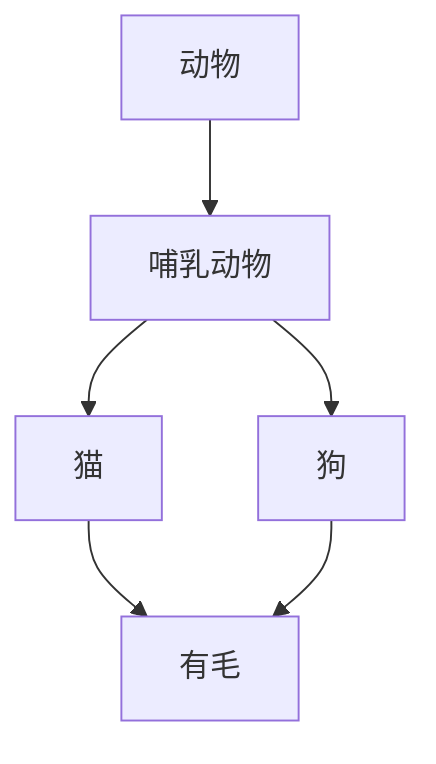

# 认知科学基础理论

## 1. 认知科学概述

### 1.1 定义与范围

**定义 1.1 (认知科学)**
认知科学是研究心智、智能和认知过程的跨学科科学，涉及哲学、心理学、神经科学、计算机科学、语言学、人类学等学科。

**定义 1.2 (认知过程)**
认知过程是指信息获取、处理、存储、检索和使用的心理过程，包括感知、注意、记忆、思维、语言、决策等。

### 1.2 认知科学的核心问题

1. **心智的本质**：心智是什么？意识如何产生？
2. **知识的表示**：知识如何在心智中表示？
3. **认知架构**：认知系统的结构如何？
4. **智能的本质**：什么是智能？如何实现智能？

## 2. 认知架构理论

### 2.1 符号系统假设

**假设 2.1 (符号系统假设)**
智能行为可以通过符号操作来实现，认知过程本质上是符号的操纵和转换。

**形式化表述**：
$$\text{Cognitive System} = \langle \Sigma, \mathcal{R}, \mathcal{I} \rangle$$

其中：

- $\Sigma$ 是符号集合
- $\mathcal{R}$ 是操作规则集合
- $\mathcal{I}$ 是解释函数

### 2.2 连接主义模型

**定义 2.1 (神经网络)**
神经网络是由相互连接的神经元组成的计算模型：

$$y_j = f\left(\sum_{i=1}^{n} w_{ij} x_i + b_j\right)$$

其中：

- $x_i$ 是输入信号
- $w_{ij}$ 是连接权重
- $b_j$ 是偏置项
- $f$ 是激活函数

**定理 2.1 (通用近似定理)**
具有单隐层的前馈神经网络可以近似任意连续函数。

### 2.3 具身认知理论

**定义 2.2 (具身认知)**
认知过程不仅依赖于大脑，还依赖于身体和环境的交互。

**形式化模型**：
$$\text{Cognition} = \text{Brain} \times \text{Body} \times \text{Environment}$$

## 3. 知识表示理论

### 3.1 语义网络

**定义 3.1 (语义网络)**
语义网络是知识的有向图表示：

$$G = \langle V, E, L \rangle$$

其中：

- $V$ 是概念节点集合
- $E$ 是关系边集合
- $L$ 是标签函数

**示例**：



### 3.2 框架理论

**定义 3.2 (框架)**
框架是知识的结构化表示：

$$\text{Frame} = \langle \text{Name}, \text{Slots}, \text{Facets} \rangle$$

**Rust实现示例**：

```rust
pub struct Frame {
    name: String,
    slots: HashMap<String, Slot>,
}

pub struct Slot {
    name: String,
    value: Option<Value>,
    constraints: Vec<Constraint>,
    default_value: Option<Value>,
}

pub enum Value {
    String(String),
    Number(f64),
    Boolean(bool),
    Reference(String), // 指向其他框架
}
```

### 3.3 逻辑表示

**定义 3.3 (一阶逻辑知识库)**
知识库是一阶逻辑公式的集合：

$$\mathcal{KB} = \{\phi_1, \phi_2, \ldots, \phi_n\}$$

**示例**：
$$\forall x (\text{Mammal}(x) \rightarrow \text{HasHair}(x))$$
$$\text{Mammal}(\text{cat})$$

## 4. 认知过程建模

### 4.1 感知过程

**定义 4.1 (感知函数)**
感知是将外部刺激转换为内部表示的过程：

$$P: \mathcal{S} \rightarrow \mathcal{R}$$

其中：

- $\mathcal{S}$ 是刺激空间
- $\mathcal{R}$ 是表示空间

**定理 4.1 (感知不变性)**
感知系统对刺激的某些变换具有不变性。

### 4.2 记忆过程

**定义 4.2 (记忆系统)**
记忆系统包括工作记忆和长期记忆：

$$\text{Memory} = \langle \text{WM}, \text{LTM}, \text{Encoding}, \text{Retrieval} \rangle$$

**工作记忆容量**：
$$\text{Capacity} = 7 \pm 2 \text{ chunks}$$

### 4.3 推理过程

**定义 4.3 (推理规则)**
推理是从已知前提推导出新结论的过程：

$$\frac{\phi_1, \phi_2, \ldots, \phi_n}{\psi}$$

**推理类型**：

1. **演绎推理**：从一般到特殊
2. **归纳推理**：从特殊到一般
3. **溯因推理**：从结果到原因

## 5. 认知科学的应用

### 5.1 人工智能

**定义 5.1 (认知AI)**
认知AI是模拟人类认知过程的人工智能系统。

**核心特征**：

- 符号处理能力
- 学习能力
- 推理能力
- 适应能力

### 5.2 人机交互

**定义 5.2 (认知负荷)**
认知负荷是认知系统处理信息时的心理资源消耗。

**认知负荷理论**：
$$\text{Total Load} = \text{Intrinsic Load} + \text{Extraneous Load} + \text{Germane Load}$$

### 5.3 教育技术

**定义 5.3 (认知学习)**
认知学习是基于认知科学原理的学习方法。

**学习原则**：

1. **主动学习**：学习者主动参与
2. **情境学习**：在真实情境中学习
3. **协作学习**：通过协作促进学习

## 6. 认知科学的哲学问题

### 6.1 心身问题

**问题 6.1 (心身问题)**
心智和身体的关系是什么？

**主要观点**：

1. **二元论**：心智和身体是分离的
2. **物理主义**：心智是物理过程
3. **功能主义**：心智是功能状态

### 6.2 意识问题

**问题 6.2 (困难问题)**
为什么物理过程会产生主观体验？

**形式化表述**：
$$\text{Why } P \rightarrow Q?$$

其中：

- $P$ 是物理过程
- $Q$ 是主观体验

### 6.3 自由意志

**问题 6.3 (自由意志问题)**
人类行为是自由的还是被决定的？

**决定论**：
$$\text{If } \text{Determinism} \text{ then } \neg \text{Free Will}$$

**相容论**：
$$\text{Determinism} \land \text{Free Will}$$

## 7. 认知科学的未来发展

### 7.1 计算认知科学

**定义 7.1 (计算认知科学)**
使用计算方法研究认知过程。

**核心方法**：

- 认知建模
- 计算仿真
- 数据分析

### 7.2 社会认知科学

**定义 7.2 (社会认知)**
研究社会情境中的认知过程。

**研究领域**：

- 社会知觉
- 社会推理
- 社会记忆

### 7.3 认知神经科学

**定义 7.3 (认知神经科学)**
研究认知过程的神经基础。

**研究方法**：

- 脑成像技术
- 神经电生理学
- 神经心理学

## 8. 结论

认知科学为理解心智和智能提供了重要的理论基础。通过形式化建模和实证研究，认知科学不仅推动了人工智能的发展，也为教育、医疗、人机交互等领域提供了重要的指导。

认知科学的核心贡献在于：

1. **统一的理论框架**：整合多个学科的理论
2. **形式化建模**：提供精确的数学模型
3. **实证验证**：通过实验验证理论
4. **应用指导**：为实际应用提供指导

---

**参考文献**：

1. Newell, A., & Simon, H. A. (1976). Computer science as empirical inquiry: Symbols and search. Communications of the ACM, 19(3), 113-126.
2. Rumelhart, D. E., McClelland, J. L., & PDP Research Group. (1986). Parallel distributed processing: Explorations in the microstructure of cognition. MIT Press.
3. Clark, A. (1997). Being there: Putting brain, body, and world together again. MIT Press.
4. Chalmers, D. J. (1995). Facing up to the problem of consciousness. Journal of consciousness studies, 2(3), 200-219.
