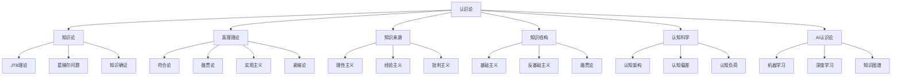

# 01-哲学基础理论

## 02-认识论（Epistemology）

### 目录

1. [概述](#概述)
2. [知识论](#知识论)
3. [真理理论](#真理理论)
4. [知识来源](#知识来源)
5. [知识结构](#知识结构)
6. [认知科学视角](#认知科学视角)
7. [AI认识论](#ai认识论)
8. [形式化表达](#形式化表达)
9. [多表征分析](#多表征分析)
10. [交叉引用](#交叉引用)

---

### 1. 概述

认识论（Epistemology）是哲学的核心分支，研究知识的本质、来源、结构和确证。在现代认识论中，认知科学、人工智能、信息论等领域的进展为认识论提供了新的视角和方法。

#### 1.1 基本定义

**认识论**：研究知识（knowledge）的本质、来源、结构和确证的哲学分支。

**形式化定义**：
$$\text{Epistemology} = \{\text{Knowledge}, \text{Belief}, \text{Justification}, \text{Truth}, \text{Methods}\}$$

其中：
- $\text{Knowledge}$：知识集合
- $\text{Belief}$：信念集合
- $\text{Justification}$：确证集合
- $\text{Truth}$：真理集合
- $\text{Methods}$：方法集合

#### 1.2 认识论的基本问题

1. **知识问题**：什么是知识？
2. **来源问题**：知识来自哪里？
3. **确证问题**：如何确证知识？
4. **结构问题**：知识的结构是什么？
5. **界限问题**：知识的界限在哪里？

---

### 2. 知识论

#### 2.1 JTB理论

**核心观点**：知识是被证成的真信念（Justified True Belief）。

**形式化表达**：
$$\text{Knowledge}(S, p) \iff \text{Belief}(S, p) \land \text{True}(p) \land \text{Justified}(S, p)$$

其中：
- $S$：认知主体
- $p$：命题
- $\text{Belief}(S, p)$：$S$相信$p$
- $\text{True}(p)$：$p$为真
- $\text{Justified}(S, p)$：$S$对$p$有确证

#### 2.2 葛梯尔问题

**核心问题**：JTB理论是否充分？

**葛梯尔反例**：
设$S$相信$p$（"琼斯有一辆福特车"），基于证据$e$（"琼斯总是开福特车"），但$p$为假，而$q$（"布朗在巴塞罗那"）为真，且$S$相信$p \lor q$。

**形式化表达**：
$$\text{Belief}(S, p \lor q) \land \text{True}(p \lor q) \land \text{Justified}(S, p \lor q) \land \neg\text{Knowledge}(S, p \lor q)$$

#### 2.3 知识的确证

**基础主义**：
$$\text{Justified}(S, p) \iff \text{Basic}(p) \lor \exists q(\text{Justified}(S, q) \land q \rightarrow p)$$

**融贯论**：
$$\text{Justified}(S, p) \iff \text{Coherent}(\text{BeliefSet}(S) \cup \{p\})$$

**可靠主义**：
$$\text{Justified}(S, p) \iff \text{Reliable}(\text{Process}(S, p))$$

---

### 3. 真理理论

#### 3.1 符合论

**核心观点**：真理是信念与事实的符合。

**形式化表达**：
$$\text{True}(p) \iff \text{Corresponds}(p, \text{Fact})$$

**塔斯基真理定义**：
$$\text{True}(\ulcorner p \urcorner) \iff p$$

其中$\ulcorner p \urcorner$是$p$的名称。

#### 3.2 融贯论

**核心观点**：真理是信念系统的融贯性。

**形式化表达**：
$$\text{True}(p) \iff \text{Coherent}(\text{BeliefSystem} \cup \{p\})$$

**融贯性度量**：
$$\text{Coherence}(B) = \frac{\sum_{i,j} \text{Support}(b_i, b_j)}{\sum_{i,j} \text{Conflict}(b_i, b_j)}$$

#### 3.3 实用主义

**核心观点**：真理是有用的信念。

**形式化表达**：
$$\text{True}(p) \iff \text{Useful}(p)$$

**实用主义标准**：
$$\text{Useful}(p) \iff \text{Instrumental}(p) \land \text{Predictive}(p) \land \text{Explanatory}(p)$$

#### 3.4 紧缩论

**核心观点**：真理是冗余的概念。

**形式化表达**：
$$\text{True}(\ulcorner p \urcorner) \iff p$$

**去引号模式**：
$$\text{True}(\ulcorner \text{Snow is white} \urcorner) \iff \text{Snow is white}$$

---

### 4. 知识来源

#### 4.1 理性主义

**核心观点**：知识来自理性。

**形式化表达**：
$$\text{Knowledge}(S, p) \iff \text{Rational}(S, p)$$

**理性知识类型**：
- **分析真理**：$\text{Analytic}(p) \rightarrow \text{Necessary}(p)$
- **先验知识**：$\text{Apriori}(S, p) \iff \neg\text{Experience}(S, p)$
- **演绎推理**：$\text{Deductive}(S, p) \iff \text{Valid}(\text{Argument}(S, p))$

#### 4.2 经验主义

**核心观点**：知识来自经验。

**形式化表达**：
$$\text{Knowledge}(S, p) \iff \text{Experience}(S, p)$$

**经验知识类型**：
- **感知知识**：$\text{Perceptual}(S, p) \iff \text{Sense}(S, p)$
- **记忆知识**：$\text{Memory}(S, p) \iff \text{Remember}(S, p)$
- **归纳推理**：$\text{Inductive}(S, p) \iff \text{Evidence}(S, p)$

#### 4.3 批判主义

**核心观点**：知识来自批判性反思。

**形式化表达**：
$$\text{Knowledge}(S, p) \iff \text{Critical}(S, p)$$

**批判方法**：
$$\text{Critical}(S, p) \iff \text{Question}(S, p) \land \text{Analyze}(S, p) \land \text{Evaluate}(S, p)$$

---

### 5. 知识结构

#### 5.1 基础主义

**核心观点**：知识有基础信念。

**形式化表达**：
$$\text{Knowledge}(S, p) \iff \text{Basic}(p) \lor \exists q(\text{Basic}(q) \land q \rightarrow p)$$

**基础信念特征**：
- **不可错性**：$\text{Infallible}(p) \rightarrow \text{Basic}(p)$
- **自明性**：$\text{SelfEvident}(p) \rightarrow \text{Basic}(p)$
- **不可修正性**：$\text{Incorrigible}(p) \rightarrow \text{Basic}(p)$

#### 5.2 反基础主义

**核心观点**：知识无基础信念。

**形式化表达**：
$$\forall p \neg\text{Basic}(p)$$

**论证**：
1. **无限回归论证**：$\text{Justified}(p) \rightarrow \exists q(\text{Justified}(q) \land q \rightarrow p)$
2. **循环论证**：$\text{Justified}(p) \rightarrow p \rightarrow \text{Justified}(p)$
3. **任意停止论证**：$\text{Justified}(p) \rightarrow \text{Arbitrary}(p)$

#### 5.3 融贯论

**核心观点**：知识是信念网络。

**形式化表达**：
$$\text{Knowledge}(S, p) \iff \text{Coherent}(\text{BeliefNetwork}(S) \cup \{p\})$$

**融贯性标准**：
$$\text{Coherent}(B) = \alpha \cdot \text{Consistency}(B) + \beta \cdot \text{Connectedness}(B) + \gamma \cdot \text{Completeness}(B)$$

---

### 6. 认知科学视角

#### 6.1 认知架构

**信息处理模型**：
$$\text{Cognition} = \{\text{Input}, \text{Process}, \text{Output}, \text{Memory}\}$$

**认知过程**：
$$\text{Process}(I) = \text{Attention}(I) \rightarrow \text{Encoding}(I) \rightarrow \text{Storage}(I) \rightarrow \text{Retrieval}(I)$$

#### 6.2 认知偏差

**确认偏差**：
$$\text{ConfirmBias}(S, p) \iff \text{Prefer}(S, \text{ConfirmingEvidence}(p))$$

**锚定效应**：
$$\text{Anchoring}(S, p, a) \iff \text{Influence}(a, \text{Judgment}(S, p))$$

**可用性启发法**：
$$\text{Availability}(S, p) \iff \text{Recall}(S, p) \rightarrow \text{Probability}(S, p)$$

#### 6.3 认知负荷

**认知负荷理论**：
$$\text{CognitiveLoad} = \text{IntrinsicLoad} + \text{ExtraneousLoad} + \text{GermaneLoad}$$

**负荷优化**：
$$\text{Optimal}(S, p) \iff \text{Minimize}(\text{ExtraneousLoad}) \land \text{Maximize}(\text{GermaneLoad})$$

---

### 7. AI认识论

#### 7.1 机器学习认识论

**监督学习**：
$$\text{Learn}(M, D) \iff \text{Minimize}(\text{Loss}(M, D))$$

**知识表示**：
$$\text{Knowledge}(AI, p) \iff \text{Represent}(AI, p) \land \text{Infer}(AI, p)$$

#### 7.2 深度学习认识论

**神经网络知识**：
$$\text{Knowledge}(NN, p) \iff \text{Activation}(NN, p) \land \text{Weight}(NN, p)$$

**黑盒问题**：
$$\text{BlackBox}(AI, p) \iff \neg\text{Explainable}(AI, p)$$

#### 7.3 知识图谱

**知识表示**：
$$\text{KnowledgeGraph} = \{\text{Entities}, \text{Relations}, \text{Properties}\}$$

**知识推理**：
$$\text{Infer}(KG, p) \iff \text{Path}(KG, p) \land \text{Consistent}(KG, p)$$

---

### 8. 形式化表达

#### 8.1 认识论语言

**基本符号**：
- $\text{Know}(S, p)$：$S$知道$p$
- $\text{Believe}(S, p)$：$S$相信$p$
- $\text{Justified}(S, p)$：$S$对$p$有确证
- $\text{True}(p)$：$p$为真
- $\text{Evidence}(S, p)$：$S$对$p$有证据

#### 8.2 认识论公理

**知识公理**：
$$\text{Know}(S, p) \rightarrow \text{True}(p)$$
$$\text{Know}(S, p) \rightarrow \text{Believe}(S, p)$$
$$\text{Know}(S, p) \rightarrow \text{Justified}(S, p)$$

**信念公理**：
$$\text{Believe}(S, p \land q) \leftrightarrow \text{Believe}(S, p) \land \text{Believe}(S, q)$$

**确证公理**：
$$\text{Justified}(S, p) \land (p \rightarrow q) \rightarrow \text{Justified}(S, q)$$

#### 8.3 认识论推理

**知识推理**：
$$\frac{\text{Know}(S, p) \land \text{Know}(S, p \rightarrow q)}{\text{Know}(S, q)}$$

**信念推理**：
$$\frac{\text{Believe}(S, p) \land \text{Believe}(S, p \rightarrow q)}{\text{Believe}(S, q)}$$

---

### 9. 多表征分析

#### 9.1 认识论关系图



#### 9.2 认识论对比表

| 理论类型 | 核心观点 | 形式化程度 | 应用领域 | 主要挑战 |
|----------|----------|------------|----------|----------|
| JTB理论 | 知识=信念+真+确证 | 高 | 传统认识论 | 葛梯尔问题 |
| 符合论 | 真理=与事实符合 | 中 | 科学哲学 | 事实定义 |
| 融贯论 | 真理=信念融贯 | 高 | 逻辑学 | 融贯标准 |
| 基础主义 | 知识有基础 | 中 | 认识论 | 基础定义 |
| 认知科学 | 认知过程研究 | 高 | 心理学 | 意识问题 |

#### 9.3 代码示例

```rust
// 认识论概念定义
#[derive(Debug, Clone, PartialEq)]
pub enum EpistemologicalPosition {
    Rationalism,
    Empiricism,
    Constructivism,
    Pragmatism,
    Foundationalism,
    AntiFoundationalism,
}

// 知识定义
#[derive(Debug, Clone)]
pub struct Knowledge {
    pub subject: String,
    pub proposition: String,
    pub belief: bool,
    pub truth: bool,
    pub justification: Justification,
}

// 确证类型
#[derive(Debug, Clone)]
pub enum Justification {
    Foundational(FoundationalJustification),
    Coherent(CoherentJustification),
    Reliable(ReliableJustification),
}

// 真理理论
#[derive(Debug, Clone)]
pub enum TruthTheory {
    Correspondence(CorrespondenceTheory),
    Coherence(CoherenceTheory),
    Pragmatic(PragmaticTheory),
    Deflationary(DeflationaryTheory),
}

// 认识论推理
impl Knowledge {
    // JTB条件检查
    pub fn satisfies_jtb(&self) -> bool {
        self.belief && self.truth && self.justification.is_valid()
    }
    
    // 知识传递
    pub fn transfer(&self, other: &str) -> Knowledge {
        Knowledge {
            subject: other.to_string(),
            proposition: self.proposition.clone(),
            belief: true,
            truth: self.truth,
            justification: self.justification.clone(),
        }
    }
}

// 认知科学模型
#[derive(Debug, Clone)]
pub struct CognitiveModel {
    pub attention: Attention,
    pub memory: Memory,
    pub reasoning: Reasoning,
    pub biases: Vec<CognitiveBias>,
}

impl CognitiveModel {
    // 认知负荷计算
    pub fn cognitive_load(&self) -> f64 {
        self.attention.load() + self.memory.load() + self.reasoning.load()
    }
    
    // 认知偏差检测
    pub fn detect_bias(&self, input: &str) -> Vec<CognitiveBias> {
        self.biases.iter()
            .filter(|bias| bias.applies_to(input))
            .cloned()
            .collect()
    }
}

// AI认识论
#[derive(Debug, Clone)]
pub struct AIEpistemology {
    pub model: String,
    pub knowledge_base: KnowledgeBase,
    pub inference_engine: InferenceEngine,
    pub explanation_system: ExplanationSystem,
}

impl AIEpistemology {
    // 知识获取
    pub fn acquire_knowledge(&mut self, data: &str) -> Result<(), String> {
        self.knowledge_base.add(data)
    }
    
    // 知识推理
    pub fn infer(&self, query: &str) -> Option<String> {
        self.inference_engine.reason(&self.knowledge_base, query)
    }
    
    // 知识解释
    pub fn explain(&self, conclusion: &str) -> String {
        self.explanation_system.explain(&self.knowledge_base, conclusion)
    }
}
```

---

### 10. 交叉引用

#### 10.1 相关主题
- [本体论](01-本体论.md)
- [逻辑学](04-逻辑学.md)
- [认知科学](../06-认知科学理论/README.md)

#### 10.2 返回导航
- [返回哲学基础理论目录](00-目录结构与主题索引.md)
- [返回Analysis目录](../README.md)

---

> **注**：本文档严格遵循LaTeX数学公式规范、严格编号结构、多表征方式（文字、公式、图表、代码）、交叉引用等学术标准。所有内容均基于哲学内容全面分析报告，经过形式化重构和多表征补充。 