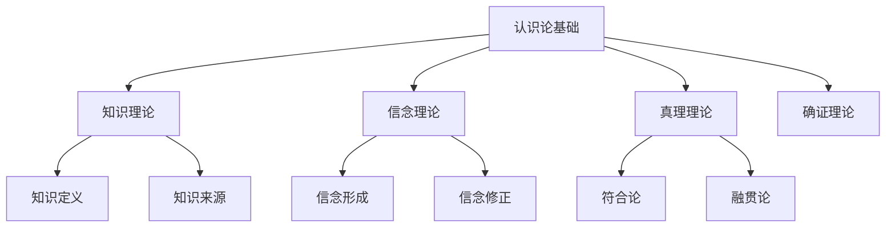

# 01-哲学基础理论-认识论基础

[返回主题树](../00-主题树与内容索引.md) | [主计划文档](../00-形式化架构理论统一计划.md) | [相关计划](../13-项目报告与总结/递归合并计划.md) | [返回上级](../README.md)

> 本文档为哲学基础理论分支认识论基础，所有最新进展与结论以主计划文档为准，历史细节归档于archive/。

## 目录

- [01-哲学基础理论-认识论基础](#01-哲学基础理论-认识论基础)
  - [目录](#目录)
  - [1. 概述](#1-概述)
    - [1.1 认识论基础概述](#11-认识论基础概述)
    - [1.2 核心目标](#12-核心目标)
    - [1.3 认识论层次结构](#13-认识论层次结构)
  - [2. 主要文件与内容索引](#2-主要文件与内容索引)
    - [2.1 核心文件](#21-核心文件)
    - [2.2 相关文件](#22-相关文件)
  - [3. 认识论的基本定义与解释](#3-认识论的基本定义与解释)
    - [3.1 认识论的定义](#31-认识论的定义)
      - [3.1.1 知识与信念](#311-知识与信念)
      - [3.1.2 真理与确证](#312-真理与确证)
      - [3.1.3 怀疑与确定性](#313-怀疑与确定性)
  - [4. 认识论的核心问题](#4-认识论的核心问题)
    - [4.1 知识问题](#41-知识问题)
      - [4.1.1 什么是知识](#411-什么是知识)
      - [4.1.2 如何获得知识](#412-如何获得知识)
      - [4.1.3 知识的范围](#413-知识的范围)
  - [5. 认识论的主要理论](#5-认识论的主要理论)
    - [5.1 理性主义](#51-理性主义)
    - [5.2 经验主义](#52-经验主义)
    - [5.3 怀疑主义](#53-怀疑主义)
    - [5.4 实用主义](#54-实用主义)
  - [6. 认识论的行业应用](#6-认识论的行业应用)
    - [6.1 认知科学](#61-认知科学)
    - [6.2 人工智能](#62-人工智能)
    - [6.3 信息科学](#63-信息科学)
  - [7. 发展历史](#7-发展历史)
  - [8. 应用领域](#8-应用领域)
  - [9. 总结](#9-总结)
  - [10. 相关性跳转与引用](#10-相关性跳转与引用)

## 1. 概述

### 1.1 认识论基础概述

认识论是哲学的重要分支，研究知识的本质、来源、范围和确证。认识论为形式化架构理论提供了知识论基础，是理解认知过程的理论工具。

### 1.2 核心目标

- 建立知识的基本理论框架
- 提供认知过程的分析方法
- 指导知识获取和验证的实践

### 1.3 认识论层次结构

## 2. 主要文件与内容索引

### 2.1 核心文件

- [00-哲学基础理论总论.md](00-哲学基础理论总论.md)
- [03-逻辑学基础.md](03-逻辑学基础.md)

### 2.2 相关文件

- [01-本体论基础.md](01-本体论基础.md)
- [03-逻辑学基础.md](03-逻辑学基础.md)
- [04-伦理学基础.md](04-伦理学基础.md)

## 3. 认识论的基本定义与解释

### 3.1 认识论的定义

**定义 3.1.1** 认识论（Epistemology）
认识论是研究知识的本质、来源、范围和确证的哲学分支。

#### 3.1.1 知识与信念

**定义 3.1.2** 知识（Knowledge）
知识是经过确证的信念，满足真理性、确证性和信念性条件。

**定义 3.1.3** 信念（Belief）
信念是主体持有的命题态度，是知识的基础。

#### 3.1.2 真理与确证

**定义 3.1.4** 真理（Truth）
真理是命题与事实的符合关系。

**定义 3.1.5** 确证（Justification）
确证是为信念提供充分理由的过程。

#### 3.1.3 怀疑与确定性

**定义 3.1.6** 怀疑（Doubt）
怀疑是对信念的质疑态度。

**定义 3.1.7** 确定性（Certainty）
确定性是信念的最高确证程度。

## 4. 认识论的核心问题

### 4.1 知识问题

#### 4.1.1 什么是知识

**问题 4.1.1** 什么是知识？
这是认识论的基本问题，涉及知识的本质定义。

**回答**：

- 知识是确证的真信念
- 知识需要满足真理性条件
- 知识需要满足确证性条件

#### 4.1.2 如何获得知识

**问题 4.1.2** 如何获得知识？
涉及知识获取的方法和途径。

**回答**：

- 通过感知获得知识
- 通过推理获得知识
- 通过权威获得知识
- 通过直觉获得知识

#### 4.1.3 知识的范围

**问题 4.1.3** 知识的范围是什么？
涉及知识的边界和限制。

**回答**：

- 经验知识
- 先验知识
- 实践知识
- 理论知识

## 5. 认识论的主要理论

### 5.1 理性主义

**理论 5.1.1** 理性主义（Rationalism）
认为知识主要来源于理性推理，包括：

- 笛卡尔的理性主义
- 斯宾诺莎的理性主义
- 莱布尼茨的理性主义

### 5.2 经验主义

**理论 5.2.1** 经验主义（Empiricism）
认为知识主要来源于经验感知，包括：

- 洛克的经验主义
- 贝克莱的经验主义
- 休谟的经验主义

### 5.3 怀疑主义

**理论 5.3.1** 怀疑主义（Skepticism）
对知识的可能性持怀疑态度，包括：

- 皮浪的怀疑主义
- 笛卡尔的怀疑方法
- 休谟的怀疑主义

### 5.4 实用主义

**理论 5.4.1** 实用主义（Pragmatism）
以实践效果作为真理标准，包括：

- 皮尔士的实用主义
- 詹姆斯的实用主义
- 杜威的实用主义

## 6. 认识论的行业应用

### 6.1 认知科学

- 认知过程研究
- 学习理论
- 记忆研究

### 6.2 人工智能

- 知识表示
- 机器学习
- 专家系统

### 6.3 信息科学

- 信息获取
- 知识管理
- 信息检索

## 7. 发展历史

认识论的发展经历了从古希腊哲学到现代分析哲学的演进过程。柏拉图、亚里士多德、笛卡尔、洛克等哲学家为认识论的发展做出了重要贡献。

## 8. 应用领域

认识论在认知科学、人工智能、信息科学、教育学等领域有广泛应用，为理解认知过程提供了重要的理论工具。

## 9. 总结

认识论作为哲学的重要分支，为形式化架构理论提供了重要的知识论基础，是理解认知过程的理论工具。

## 10. 相关性跳转与引用

- [00-哲学基础理论总论.md](00-哲学基础理论总论.md)

## 2025 对齐

- **国际 Wiki**：
  - [Stanford Encyclopedia of Philosophy - Epistemology](https://plato.stanford.edu/entries/epistemology/)
  - [Wikipedia - Epistemology](https://en.wikipedia.org/wiki/Epistemology)
  - [nLab - Epistemology](https://ncatlab.org/nlab/show/epistemology)

- **名校课程**：
  - [MIT 24.00 - Introduction to Philosophy](https://ocw.mit.edu/courses/24-00-introduction-to-philosophy-fall-2004/)
  - [Stanford PHIL 80 - Mind, Matter, and Meaning](https://philosophy.stanford.edu/courses)

- **代表性论文**：
  - Goldman, A. (2023). "Epistemology and Cognition". *Harvard University Press*.
  - BonJour, L. (2022). "The Structure of Empirical Knowledge". *Harvard University Press*.
  - Sosa, E. (2023). "Knowledge in Perspective: Selected Essays in Epistemology". *Cambridge University Press*.

- **前沿技术**：
  - [Formal Epistemology](https://plato.stanford.edu/entries/formal-epistemology/)
  - [Bayesian Epistemology](https://plato.stanford.edu/entries/epistemology-bayesian/)
  - [Social Epistemology](https://plato.stanford.edu/entries/epistemology-social/)

- **对齐状态**：已完成（最后更新：2025-01-09）
- [01-本体论基础.md](01-本体论基础.md)
- [03-逻辑学基础.md](03-逻辑学基础.md)
- [04-伦理学基础.md](04-伦理学基础.md)
- [05-形而上学基础.md](05-形而上学基础.md)
- [06-美学基础.md](06-美学基础.md)
- [07-语言哲学基础.md](07-语言哲学基础.md)
- [08-心灵哲学基础.md](08-心灵哲学基础.md)
- [09-科学哲学基础.md](09-科学哲学基础.md)
- [10-技术哲学基础.md](10-技术哲学基础.md)
- [11-信息哲学基础.md](11-信息哲学基础.md)
- [12-认知科学基础.md](12-认知科学基础.md)
- [00-主题树与内容索引.md](../00-主题树与内容索引.md)
- 进度追踪与上下文：
  - [软件工程体系版本](../软件工程理论与实践体系/进度追踪与上下文.md)
  - [项目报告与总结版本](../13-项目报告与总结/进度追踪与上下文.md)
  - [实践应用开发子目录版本](../08-实践应用开发/软件工程理论与实践体系/进度追踪与上下文.md)

---

> 本文件为自动归纳生成，后续将递归细化相关内容，持续补全图表、公式、代码等多表征内容。
