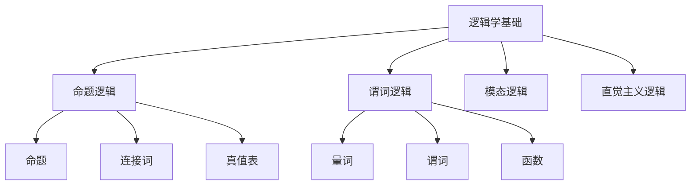

# 01-哲学基础理论-逻辑学基础

[返回主题树](../00-主题树与内容索引.md) | [主计划文档](../00-形式化架构理论统一计划.md) | [相关计划](../13-项目报告与总结/递归合并计划.md) | [返回上级](../README.md)

> 本文档为哲学基础理论分支逻辑学基础，所有最新进展与结论以主计划文档为准，历史细节归档于archive/。

## 目录

- [01-哲学基础理论-逻辑学基础](#01-哲学基础理论-逻辑学基础)
  - [目录](#目录)
  - [1. 概述](#1-概述)
    - [1.1 逻辑学基础概述](#11-逻辑学基础概述)
    - [1.2 核心目标](#12-核心目标)
    - [1.3 逻辑学层次结构](#13-逻辑学层次结构)
  - [2. 主要文件与内容索引](#2-主要文件与内容索引)
    - [2.1 核心文件](#21-核心文件)
    - [2.2 相关文件](#22-相关文件)
  - [3. 逻辑学的基本定义与解释](#3-逻辑学的基本定义与解释)
    - [3.1 逻辑学的定义](#31-逻辑学的定义)
      - [3.1.1 形式逻辑](#311-形式逻辑)
      - [3.1.2 哲学逻辑](#312-哲学逻辑)
      - [3.1.3 计算逻辑](#313-计算逻辑)
  - [4. 逻辑学的基础概念](#4-逻辑学的基础概念)
    - [4.1 命题逻辑](#41-命题逻辑)
      - [4.1.1 命题定义](#411-命题定义)
      - [4.1.2 逻辑连接词](#412-逻辑连接词)
      - [4.1.3 真值表](#413-真值表)
  - [5. 逻辑学的主要理论](#5-逻辑学的主要理论)
    - [5.1 谓词逻辑](#51-谓词逻辑)
    - [5.2 模态逻辑](#52-模态逻辑)
    - [5.3 直觉主义逻辑](#53-直觉主义逻辑)
    - [5.4 多值逻辑](#54-多值逻辑)
  - [6. 逻辑学的行业应用](#6-逻辑学的行业应用)
    - [6.1 计算机科学](#61-计算机科学)
    - [6.2 人工智能](#62-人工智能)
    - [6.3 形式化验证](#63-形式化验证)
  - [7. 发展历史](#7-发展历史)
  - [8. 应用领域](#8-应用领域)
  - [9. 总结](#9-总结)
  - [10. 相关性跳转与引用](#10-相关性跳转与引用)

## 1. 概述

### 1.1 逻辑学基础概述

逻辑学是研究推理形式和规律的科学，为形式化架构理论提供了推理的基础工具。逻辑学不仅支撑数学推理，也是计算机科学和人工智能的重要理论基础。

### 1.2 核心目标

- 建立逻辑推理的基本理论框架
- 提供形式化推理的工具
- 支持计算机科学和人工智能应用

### 1.3 逻辑学层次结构

## 2. 主要文件与内容索引

### 2.1 核心文件

- [00-哲学基础理论总论.md](00-哲学基础理论总论.md)
- [04-伦理学基础.md](04-伦理学基础.md)

### 2.2 相关文件

- [01-本体论基础.md](01-本体论基础.md)
- [02-认识论基础.md](02-认识论基础.md)
- [04-伦理学基础.md](04-伦理学基础.md)

## 3. 逻辑学的基本定义与解释

### 3.1 逻辑学的定义

**定义 3.1.1** 逻辑学（Logic）
逻辑学是研究推理形式和规律的科学，关注论证的有效性和正确性。

#### 3.1.1 形式逻辑

**定义 3.1.2** 形式逻辑（Formal Logic）
形式逻辑研究推理的形式结构，不关注内容的具体含义。

**特点**：

- 抽象性
- 形式化
- 符号化

#### 3.1.2 哲学逻辑

**定义 3.1.3** 哲学逻辑（Philosophical Logic）
哲学逻辑研究逻辑的哲学基础和应用。

**问题**：

- 逻辑的本质
- 真理的定义
- 推理的合理性

#### 3.1.3 计算逻辑

**定义 3.1.4** 计算逻辑（Computational Logic）
计算逻辑研究逻辑在计算机科学中的应用。

**应用**：

- 程序验证
- 定理证明
- 知识表示

## 4. 逻辑学的基础概念

### 4.1 命题逻辑

#### 4.1.1 命题定义

**定义 4.1.1** 命题（Proposition）
命题是具有真假值的陈述句。

**例子**：

- "今天下雨"：真或假
- "2+2=4"：真
- "地球是平的"：假

#### 4.1.2 逻辑连接词

**定义 4.1.2** 逻辑连接词
逻辑连接词用于组合命题，形成复合命题。

**基本连接词**：

- 否定：¬（非）
- 合取：∧（与）
- 析取：∨（或）
- 蕴含：→（如果...那么）
- 等价：↔（当且仅当）

#### 4.1.3 真值表

**定义 4.1.3** 真值表
真值表是表示复合命题真值的表格。

**例子**：

| p | q | p∧q | p∨q | p→q |
|---|---|-----|-----|-----|
| T | T |  T  |  T  |  T  |
| T | F |  F  |  T  |  F  |
| F | T |  F  |  T  |  T  |
| F | F |  F  |  F  |  T  |

## 5. 逻辑学的主要理论

### 5.1 谓词逻辑

**理论 5.1.1** 谓词逻辑（Predicate Logic）
谓词逻辑扩展了命题逻辑，引入了量词和谓词。

**特点**：

- 全称量词：∀（对所有）
- 存在量词：∃（存在）
- 谓词：P(x), Q(x,y)

### 5.2 模态逻辑

**理论 5.2.1** 模态逻辑（Modal Logic）
模态逻辑研究必然性和可能性。

**算子**：

- 必然性：□（必然）
- 可能性：◇（可能）

### 5.3 直觉主义逻辑

**理论 5.3.1** 直觉主义逻辑（Intuitionistic Logic）
直觉主义逻辑拒绝排中律，要求构造性证明。

**特点**：

- 拒绝排中律
- 构造性证明
- 直觉主义数学

### 5.4 多值逻辑

**理论 5.4.1** 多值逻辑（Many-Valued Logic）
多值逻辑允许命题有多个真值。

**应用**：

- 模糊逻辑
- 概率逻辑
- 量子逻辑

## 6. 逻辑学的行业应用

### 6.1 计算机科学

- 程序验证
- 编译器设计
- 数据库查询

### 6.2 人工智能

- 知识表示
- 推理系统
- 专家系统

### 6.3 形式化验证

- 模型检查
- 定理证明
- 程序正确性

## 7. 发展历史

逻辑学的发展经历了从亚里士多德的三段论到现代形式逻辑的演进过程。布尔、弗雷格、哥德尔等学者为现代逻辑学的发展做出了重要贡献。

## 8. 应用领域

逻辑学在计算机科学、人工智能、数学、哲学等领域有广泛应用，是现代信息技术的重要理论基础。

## 9. 总结

逻辑学基础作为哲学的重要分支，为形式化架构理论提供了重要的推理工具，是理解形式化方法的基础理论。

## 10. 相关性跳转与引用

- [00-哲学基础理论总论.md](00-哲学基础理论总论.md)
- [01-本体论基础.md](01-本体论基础.md)
- [02-认识论基础.md](02-认识论基础.md)
- [04-伦理学基础.md](04-伦理学基础.md)
- [05-形而上学基础.md](05-形而上学基础.md)
- [06-美学基础.md](06-美学基础.md)
- [07-语言哲学基础.md](07-语言哲学基础.md)
- [08-心灵哲学基础.md](08-心灵哲学基础.md)
- [09-科学哲学基础.md](09-科学哲学基础.md)
- [10-技术哲学基础.md](10-技术哲学基础.md)
- [11-信息哲学基础.md](11-信息哲学基础.md)
- [12-认知科学基础.md](12-认知科学基础.md)
- [00-主题树与内容索引.md](../00-主题树与内容索引.md)
- 进度追踪与上下文：
  - [软件工程体系版本](../软件工程理论与实践体系/进度追踪与上下文.md)
  - [项目报告与总结版本](../13-项目报告与总结/进度追踪与上下文.md)
  - [实践应用开发子目录版本](../08-实践应用开发/软件工程理论与实践体系/进度追踪与上下文.md)

---

> 本文件为自动归纳生成，后续将递归细化相关内容，持续补全图表、公式、代码等多表征内容。
