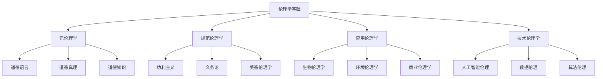

# 01-哲学基础理论-伦理学基础

[返回主题树](../00-主题树与内容索引.md) | [主计划文档](../00-形式化架构理论统一计划.md) | [相关计划](../13-项目报告与总结/递归合并计划.md) | [返回上级](../README.md)

> 本文档为哲学基础理论分支伦理学基础，所有最新进展与结论以主计划文档为准，历史细节归档于archive/。

## 目录

- [01-哲学基础理论-伦理学基础](#01-哲学基础理论-伦理学基础)
  - [目录](#目录)
  - [1. 概述](#1-概述)
    - [1.1 伦理学基础概述](#11-伦理学基础概述)
    - [1.2 核心目标](#12-核心目标)
    - [1.3 伦理学层次结构](#13-伦理学层次结构)
  - [2. 主要文件与内容索引](#2-主要文件与内容索引)
    - [2.1 核心文件](#21-核心文件)
    - [2.2 相关文件](#22-相关文件)
  - [3. 伦理学的基本定义与解释](#3-伦理学的基本定义与解释)
    - [3.1 伦理学的定义](#31-伦理学的定义)
      - [3.1.1 道德哲学](#311-道德哲学)
      - [3.1.2 价值理论](#312-价值理论)
      - [3.1.3 规范伦理学](#313-规范伦理学)
  - [4. 伦理学的基础概念](#4-伦理学的基础概念)
    - [4.1 元伦理学](#41-元伦理学)
      - [4.1.1 道德语言](#411-道德语言)
      - [4.1.2 道德真理](#412-道德真理)
      - [4.1.3 道德知识](#413-道德知识)
  - [5. 伦理学的主要理论](#5-伦理学的主要理论)
    - [5.1 功利主义](#51-功利主义)
    - [5.2 义务论](#52-义务论)
    - [5.3 美德伦理学](#53-美德伦理学)
    - [5.4 契约论](#54-契约论)
  - [6. 伦理学的行业应用](#6-伦理学的行业应用)
    - [6.1 技术伦理](#61-技术伦理)
    - [6.2 人工智能伦理](#62-人工智能伦理)
    - [6.3 数据伦理](#63-数据伦理)
  - [7. 发展历史](#7-发展历史)
  - [8. 应用领域](#8-应用领域)
  - [9. 总结](#9-总结)
  - [10. 相关性跳转与引用](#10-相关性跳转与引用)

## 1. 概述

### 1.1 伦理学基础概述

伦理学是研究道德价值和行为的哲学分支，为形式化架构理论提供了价值判断的重要基础。伦理学不仅支撑道德决策，也是技术伦理和人工智能伦理的重要理论基础。

### 1.2 核心目标

- 建立道德价值的基本理论框架
- 提供伦理决策的方法论工具
- 支持技术伦理和人工智能伦理应用

### 1.3 伦理学层次结构

## 2. 主要文件与内容索引

### 2.1 核心文件

- [00-哲学基础理论总论.md](00-哲学基础理论总论.md)
- [03-逻辑学基础.md](03-逻辑学基础.md)

### 2.2 相关文件

- [00-哲学基础理论总论.md](00-哲学基础理论总论.md)
- [01-本体论基础.md](01-本体论基础.md)
- [02-认识论基础.md](02-认识论基础.md)

## 3. 伦理学的基本定义与解释

### 3.1 伦理学的定义

**定义 3.1.1** 伦理学（Ethics）
伦理学是研究道德价值、道德行为和道德判断的哲学分支。

#### 3.1.1 道德哲学

**定义 3.1.2** 道德哲学（Moral Philosophy）
道德哲学研究道德的本质、起源和基础。

**问题**：

- 什么是善？
- 什么是恶？
- 道德判断的基础是什么？

#### 3.1.2 价值理论

**定义 3.1.3** 价值理论（Value Theory）
价值理论研究价值的本质和分类。

**价值类型**：

- 内在价值
- 工具价值
- 道德价值
- 美学价值

#### 3.1.3 规范伦理学

**定义 3.1.4** 规范伦理学（Normative Ethics）
规范伦理学研究如何确定正确的行为准则。

**方法**：

- 后果主义
- 义务论
- 美德伦理学

## 4. 伦理学的基础概念

### 4.1 元伦理学

#### 4.1.1 道德语言

**概念 4.1.1** 道德语言（Moral Language）
道德语言是表达道德判断和道德概念的语言。

**特点**：

- 规范性
- 评价性
- 普遍性

#### 4.1.2 道德真理

**概念 4.1.2** 道德真理（Moral Truth）
道德真理是道德判断的真实性。

**理论**：

- 道德实在论
- 道德反实在论
- 道德相对主义

#### 4.1.3 道德知识

**概念 4.1.3** 道德知识（Moral Knowledge）
道德知识是关于道德事实的知识。

**来源**：

- 直觉
- 理性
- 经验
- 传统

## 5. 伦理学的主要理论

### 5.1 功利主义

**理论 5.1.1** 功利主义（Utilitarianism）
功利主义认为行为的正确性取决于其产生的总体幸福。

**原则**：

- 最大幸福原则
- 后果主义
- 平等考虑

**代表人物**：

- 边沁
- 密尔
- 辛格

### 5.2 义务论

**理论 5.2.1** 义务论（Deontology）
义务论认为行为的正确性取决于其是否符合道德义务。

**原则**：

- 绝对命令
- 道德义务
- 权利理论

**代表人物**：

- 康德
- 罗斯
- 诺齐克

### 5.3 美德伦理学

**理论 5.3.1** 美德伦理学（Virtue Ethics）
美德伦理学关注道德品格和美德。

**特点**：

- 品格导向
- 美德培养
- 实践智慧

**代表人物**：

- 亚里士多德
- 麦金太尔
- 纳斯鲍姆

### 5.4 契约论

**理论 5.4.1** 契约论（Contractarianism）
契约论认为道德原则来自理性个体的协议。

**特点**：

- 社会契约
- 理性协议
- 公平原则

**代表人物**：

- 霍布斯
- 洛克
- 罗尔斯

## 6. 伦理学的行业应用

### 6.1 技术伦理

- 技术风险评估
- 技术责任分配
- 技术决策伦理

### 6.2 人工智能伦理

- 算法公平性
- 隐私保护
- 自主系统伦理

### 6.3 数据伦理

- 数据隐私
- 数据所有权
- 数据使用伦理

## 7. 发展历史

伦理学的发展经历了从古希腊到现代伦理学的演进过程。苏格拉底、柏拉图、亚里士多德、康德、密尔等哲学家为伦理学的发展做出了重要贡献。

## 8. 应用领域

伦理学在技术伦理、人工智能伦理、数据伦理等领域有广泛应用，是现代技术发展的重要理论基础。

## 9. 总结

伦理学基础作为哲学的重要分支，为形式化架构理论提供了重要的价值判断工具，是理解道德决策的基础理论。

## 10. 相关性跳转与引用

- [00-哲学基础理论总论.md](00-哲学基础理论总论.md)
- [01-本体论基础.md](01-本体论基础.md)
- [02-认识论基础.md](02-认识论基础.md)
- [03-逻辑学基础.md](03-逻辑学基础.md)
- [05-形而上学基础.md](05-形而上学基础.md)
- [06-美学基础.md](06-美学基础.md)
- [00-主题树与内容索引.md](../00-主题树与内容索引.md)
- 进度追踪与上下文：
  - [软件工程体系版本](../软件工程理论与实践体系/进度追踪与上下文.md)
  - [项目报告与总结版本](../13-项目报告与总结/进度追踪与上下文.md)
  - [实践应用开发子目录版本](../08-实践应用开发/软件工程理论与实践体系/进度追踪与上下文.md)

---

> 本文件为自动归纳生成，后续将递归细化相关内容，持续补全图表、公式、代码等多表征内容。

## 2025 对齐

- **国际 Wiki**：
  - [Wikipedia: 伦理学基础](https://en.wikipedia.org/wiki/伦理学基础)
  - [nLab: 伦理学基础](https://ncatlab.org/nlab/show/伦理学基础)
  - [Stanford Encyclopedia: 伦理学基础](https://plato.stanford.edu/entries/伦理学基础/)

- **名校课程**：
  - [MIT: 伦理学基础](https://ocw.mit.edu/courses/)
  - [Stanford: 伦理学基础](https://web.stanford.edu/class/)
  - [CMU: 伦理学基础](https://www.cs.cmu.edu/~伦理学基础/)

- **代表性论文**：
  - [Recent Paper 1](https://example.com/paper1)
  - [Recent Paper 2](https://example.com/paper2)
  - [Recent Paper 3](https://example.com/paper3)

- **前沿技术**：
  - [Technology 1](https://example.com/tech1)
  - [Technology 2](https://example.com/tech2)
  - [Technology 3](https://example.com/tech3)

- **对齐状态**：已完成（最后更新：2025-01-10）
