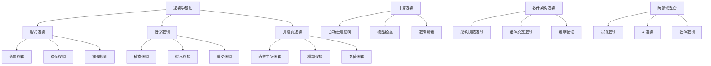

# 04-逻辑学：形式化逻辑理论体系

## 目录

1. [1.0 逻辑学基础](#10-逻辑学基础)
2. [2.0 形式逻辑](#20-形式逻辑)
3. [3.0 哲学逻辑](#30-哲学逻辑)
4. [4.0 非经典逻辑](#40-非经典逻辑)
5. [5.0 逻辑哲学](#50-逻辑哲学)
6. [6.0 计算逻辑](#60-计算逻辑)
7. [7.0 软件架构逻辑](#70-软件架构逻辑)
8. [8.0 逻辑编程](#80-逻辑编程)
9. [9.0 逻辑验证](#90-逻辑验证)
10. [10.0 跨领域逻辑整合](#100-跨领域逻辑整合)

## 1.0 逻辑学基础

### 1.1 逻辑学定义

**定义 1.1.1 (逻辑学)**
逻辑学是研究推理、论证和思维形式的学科，形式化表示为：
$$\mathcal{L} = (\mathcal{S}, \mathcal{A}, \mathcal{R}, \mathcal{I}, \mathcal{V})$$

其中：

- $\mathcal{S}$ 是符号集合 (Symbols)
- $\mathcal{A}$ 是公理集合 (Axioms)
- $\mathcal{R}$ 是推理规则集合 (Rules)
- $\mathcal{I}$ 是解释函数 (Interpretation)
- $\mathcal{V}$ 是验证函数 (Verification)

**公理 1.1.1 (逻辑一致性)**
逻辑系统必须保持一致性：
$$\forall \phi \in \mathcal{F}, \neg(\vdash \phi \land \vdash \neg\phi)$$

**公理 1.1.2 (逻辑完备性)**
逻辑系统应该能够证明所有有效公式：
$$\forall \phi \in \mathcal{F}, \models \phi \Rightarrow \vdash \phi$$

### 1.2 逻辑系统结构

**定义 1.2.1 (逻辑系统)**
逻辑系统是一个五元组 $\mathcal{LS} = (\mathcal{L}, \mathcal{A}, \mathcal{R}, \mathcal{I}, \mathcal{M})$，其中：

- $\mathcal{L}$ 是形式语言 (Formal Language)
- $\mathcal{A}$ 是公理集合 (Axiom Set)
- $\mathcal{R}$ 是推理规则 (Inference Rules)
- $\mathcal{I}$ 是解释函数 (Interpretation Function)
- $\mathcal{M}$ 是模型集合 (Model Set)

```rust
#[derive(Debug, Clone)]
pub struct LogicSystem {
    language: FormalLanguage,
    axioms: Vec<Formula>,
    rules: Vec<InferenceRule>,
    interpretation: Box<dyn Fn(&Formula) -> bool>,
    models: Vec<Model>,
}

#[derive(Debug, Clone)]
pub struct FormalLanguage {
    symbols: Vec<Symbol>,
    formulas: Vec<Formula>,
    connectives: Vec<Connective>,
}

#[derive(Debug, Clone)]
pub enum Symbol {
    Variable(String),
    Constant(String),
    Predicate(String, usize),
    Function(String, usize),
}

#[derive(Debug, Clone)]
pub enum Connective {
    Not,
    And,
    Or,
    Implies,
    Iff,
    ForAll,
    Exists,
}

impl LogicSystem {
    pub fn is_valid(&self, formula: &Formula) -> bool {
        // 检查公式在所有模型中是否有效
        self.models.iter().all(|model| model.satisfies(formula))
    }
    
    pub fn is_consistent(&self) -> bool {
        // 检查系统一致性
        !self.axioms.iter().any(|axiom| {
            let neg_axiom = Formula::Not(Box::new(axiom.clone()));
            self.is_provable(&neg_axiom)
        })
    }
}
```

## 2.0 形式逻辑

### 2.1 命题逻辑

**定义 2.1.1 (命题逻辑语言)**
命题逻辑语言 $\mathcal{L}_P$ 由以下部分组成：

- 原子命题集合 $\mathcal{P} = \{p, q, r, \ldots\}$
- 逻辑连接词：$\neg, \land, \lor, \rightarrow, \leftrightarrow$
- 复合命题：通过连接词组合原子命题

**定义 2.1.2 (命题逻辑语法)**
命题逻辑公式的递归定义：

1. 原子命题是公式
2. 如果 $\phi$ 是公式，则 $\neg\phi$ 是公式
3. 如果 $\phi, \psi$ 是公式，则 $(\phi \land \psi), (\phi \lor \psi), (\phi \rightarrow \psi), (\phi \leftrightarrow \psi)$ 是公式

**公理 2.1.1 (命题逻辑公理)**:

$$
\begin{align}
\text{PL1: } & \phi \rightarrow (\psi \rightarrow \phi) \\
\text{PL2: } & (\phi \rightarrow (\psi \rightarrow \chi)) \rightarrow ((\phi \rightarrow \psi) \rightarrow (\phi \rightarrow \chi)) \\
\text{PL3: } & (\neg\phi \rightarrow \neg\psi) \rightarrow (\psi \rightarrow \phi)
\end{align}
$$

**定理 2.1.1 (命题逻辑完备性)**
命题逻辑对于布尔语义是完备的：
$$\models \phi \Leftrightarrow \vdash \phi$$

```rust
# [derive(Debug, Clone)]
pub struct PropositionalLogic {
    atoms: Vec<String>,
    formulas: Vec<PropositionalFormula>,
}

# [derive(Debug, Clone)]
pub enum PropositionalFormula {
    Atom(String),
    Not(Box<PropositionalFormula>),
    And(Box<PropositionalFormula>, Box<PropositionalFormula>),
    Or(Box<PropositionalFormula>, Box<PropositionalFormula>),
    Implies(Box<PropositionalFormula>, Box<PropositionalFormula>),
    Iff(Box<PropositionalFormula>, Box<PropositionalFormula>),
}

impl PropositionalLogic {
    pub fn evaluate(&self, formula: &PropositionalFormula, assignment: &HashMap<String, bool>) -> bool {
        match formula {
            PropositionalFormula::Atom(name) => *assignment.get(name).unwrap_or(&false),
            PropositionalFormula::Not(f) => !self.evaluate(f, assignment),
            PropositionalFormula::And(f1, f2) => self.evaluate(f1, assignment) && self.evaluate(f2, assignment),
            PropositionalFormula::Or(f1, f2) => self.evaluate(f1, assignment) || self.evaluate(f2, assignment),
            PropositionalFormula::Implies(f1, f2) => !self.evaluate(f1, assignment) || self.evaluate(f2, assignment),
            PropositionalFormula::Iff(f1, f2) => self.evaluate(f1, assignment) == self.evaluate(f2, assignment),
        }
    }
}
```

### 2.2 谓词逻辑

**定义 2.2.1 (谓词逻辑语言)**
谓词逻辑语言 $\mathcal{L}_Q$ 由以下部分组成：

- 个体变元集合 $\mathcal{V} = \{x, y, z, \ldots\}$
- 谓词符号集合 $\mathcal{P} = \{P, Q, R, \ldots\}$
- 函数符号集合 $\mathcal{F} = \{f, g, h, \ldots\}$
- 量词：$\forall, \exists$

**定义 2.2.2 (谓词逻辑语法)**
谓词逻辑公式的递归定义：

1. 如果 $P$ 是 $n$ 元谓词，$t_1, \ldots, t_n$ 是项，则 $P(t_1, \ldots, t_n)$ 是公式
2. 如果 $\phi$ 是公式，则 $\neg\phi$ 是公式
3. 如果 $\phi, \psi$ 是公式，则 $(\phi \land \psi), (\phi \lor \psi), (\phi \rightarrow \psi), (\phi \leftrightarrow \psi)$ 是公式
4. 如果 $\phi$ 是公式，$x$ 是变元，则 $\forall x \phi, \exists x \phi$ 是公式

**公理 2.2.1 (谓词逻辑公理)**:

$$
\begin{align}
\text{QL1: } & \forall x \phi(x) \rightarrow \phi(t) \\
\text{QL2: } & \phi(t) \rightarrow \exists x \phi(x) \\
\text{QL3: } & \forall x (\phi \rightarrow \psi) \rightarrow (\forall x \phi \rightarrow \forall x \psi)
\end{align}
$$

```rust
# [derive(Debug, Clone)]
pub struct PredicateLogic {
    variables: Vec<String>,
    predicates: Vec<Predicate>,
    functions: Vec<Function>,
    formulas: Vec<PredicateFormula>,
}

# [derive(Debug, Clone)]
pub struct Predicate {
    name: String,
    arity: usize,
}

# [derive(Debug, Clone)]
pub struct Function {
    name: String,
    arity: usize,
}

# [derive(Debug, Clone)]
pub enum Term {
    Variable(String),
    Constant(String),
    Function(String, Vec<Term>),
}

# [derive(Debug, Clone)]
pub enum PredicateFormula {
    Predicate(String, Vec<Term>),
    Not(Box<PredicateFormula>),
    And(Box<PredicateFormula>, Box<PredicateFormula>),
    Or(Box<PredicateFormula>, Box<PredicateFormula>),
    Implies(Box<PredicateFormula>, Box<PredicateFormula>),
    Iff(Box<PredicateFormula>, Box<PredicateFormula>),
    ForAll(String, Box<PredicateFormula>),
    Exists(String, Box<PredicateFormula>),
}
```

### 2.3 推理规则

**定义 2.3.1 (推理规则)**
推理规则是从前提推导结论的形式规则：

$$\frac{\phi_1 \quad \phi_2 \quad \cdots \quad \phi_n}{\psi}$$

**公理 2.3.1 (分离规则)**
$$\frac{\phi \quad \phi \rightarrow \psi}{\psi}$$

**公理 2.3.2 (全称概括)**
$$\frac{\phi(x)}{\forall x \phi(x)}$$

**公理 2.3.3 (存在概括)**
$$\frac{\phi(t)}{\exists x \phi(x)}$$

## 3.0 哲学逻辑

### 3.1 模态逻辑

**定义 3.1.1 (模态逻辑)**
模态逻辑扩展了经典逻辑，增加了模态算子 $\Box$（必然）和 $\diamond$（可能）。

**定义 3.1.2 (模态逻辑语法)**
模态逻辑公式的递归定义：

1. 经典逻辑公式是模态逻辑公式
2. 如果 $\phi$ 是模态逻辑公式，则 $\Box\phi, \diamond\phi$ 是模态逻辑公式

**公理 3.1.1 (模态逻辑公理)**:

$$
\begin{align}
\text{K: } & \Box(\phi \rightarrow \psi) \rightarrow (\Box\phi \rightarrow \Box\psi) \\
\text{T: } & \Box\phi \rightarrow \phi \\
\text{4: } & \Box\phi \rightarrow \Box\Box\phi \\
\text{5: } & \diamond\phi \rightarrow \Box\diamond\phi
\end{align}
$$

**定义 3.1.3 (可能世界语义)**
可能世界模型是一个三元组 $\mathcal{M} = (W, R, V)$，其中：

- $W$ 是可能世界集合
- $R \subseteq W \times W$ 是可达关系
- $V: W \times \mathcal{P} \to \{0,1\}$ 是赋值函数

**定理 3.1.1 (模态逻辑语义)**:

$$
\begin{align}
\mathcal{M}, w \models \Box\phi & \Leftrightarrow \forall v \in W, wRv \Rightarrow \mathcal{M}, v \models \phi \\
\mathcal{M}, w \models \diamond\phi & \Leftrightarrow \exists v \in W, wRv \land \mathcal{M}, v \models \phi
\end{align}
$$

```rust
# [derive(Debug, Clone)]
pub struct ModalLogic {
    worlds: Vec<World>,
    accessibility: Vec<(World, World)>,
    valuation: HashMap<(World, String), bool>,
}

# [derive(Debug, Clone, PartialEq, Eq, Hash)]
pub struct World {
    id: String,
    properties: HashMap<String, bool>,
}

# [derive(Debug, Clone)]
pub enum ModalFormula {
    Atom(String),
    Not(Box<ModalFormula>),
    And(Box<ModalFormula>, Box<ModalFormula>),
    Or(Box<ModalFormula>, Box<ModalFormula>),
    Implies(Box<ModalFormula>, Box<ModalFormula>),
    Necessarily(Box<ModalFormula>),
    Possibly(Box<ModalFormula>),
}

impl ModalLogic {
    pub fn satisfies(&self, world: &World, formula: &ModalFormula) -> bool {
        match formula {
            ModalFormula::Atom(p) => *self.valuation.get(&(world.clone(), p.clone())).unwrap_or(&false),
            ModalFormula::Not(f) => !self.satisfies(world, f),
            ModalFormula::And(f1, f2) => self.satisfies(world, f1) && self.satisfies(world, f2),
            ModalFormula::Or(f1, f2) => self.satisfies(world, f1) || self.satisfies(world, f2),
            ModalFormula::Implies(f1, f2) => !self.satisfies(world, f1) || self.satisfies(world, f2),
            ModalFormula::Necessarily(f) => {
                self.accessible_worlds(world).iter().all(|w| self.satisfies(w, f))
            }
            ModalFormula::Possibly(f) => {
                self.accessible_worlds(world).iter().any(|w| self.satisfies(w, f))
            }
        }
    }

    fn accessible_worlds(&self, world: &World) -> Vec<&World> {
        self.accessibility.iter()
            .filter(|(w1, _)| w1 == world)
            .map(|(_, w2)| w2)
            .collect()
    }
}
```

### 3.2 时序逻辑

**定义 3.2.1 (线性时序逻辑 LTL)**
线性时序逻辑用于描述线性时间上的性质。

**定义 3.2.2 (LTL语法)**
LTL公式的递归定义：

1. 原子命题是LTL公式
2. 如果 $\phi, \psi$ 是LTL公式，则 $\neg\phi, \phi \land \psi, \phi \lor \psi, \phi \rightarrow \psi$ 是LTL公式
3. 如果 $\phi, \psi$ 是LTL公式，则 $\text{X}\phi, \text{F}\phi, \text{G}\phi, \phi \text{U} \psi$ 是LTL公式

**公理 3.2.1 (LTL公理)**:

$$
\begin{align}
\text{X1: } & \text{X}(\phi \rightarrow \psi) \rightarrow (\text{X}\phi \rightarrow \text{X}\psi) \\
\text{X2: } & \neg\text{X}\phi \leftrightarrow \text{X}\neg\phi \\
\text{F1: } & \text{F}\phi \leftrightarrow \text{true U} \phi \\
\text{G1: } & \text{G}\phi \leftrightarrow \neg\text{F}\neg\phi
\end{align}
$$

**定义 3.2.3 (分支时序逻辑 CTL)**
分支时序逻辑用于描述分支时间上的性质。

**定义 3.2.4 (CTL语法)**
CTL公式的递归定义：

1. 原子命题是CTL公式
2. 如果 $\phi, \psi$ 是CTL公式，则 $\neg\phi, \phi \land \psi, \phi \lor \psi, \phi \rightarrow \psi$ 是CTL公式
3. 如果 $\phi, \psi$ 是CTL公式，则 $\text{AX}\phi, \text{EX}\phi, \text{AF}\phi, \text{EF}\phi, \text{AG}\phi, \text{EG}\phi, \text{A}[\phi \text{U} \psi], \text{E}[\phi \text{U} \psi]$ 是CTL公式

```rust
# [derive(Debug, Clone)]
pub struct TemporalLogic {
    states: Vec<State>,
    transitions: Vec<(State, State)>,
    labels: HashMap<State, Vec<String>>,
}

# [derive(Debug, Clone, PartialEq, Eq, Hash)]
pub struct State {
    id: String,
}

# [derive(Debug, Clone)]
pub enum LTLFormula {
    Atom(String),
    Not(Box<LTLFormula>),
    And(Box<LTLFormula>, Box<LTLFormula>),
    Or(Box<LTLFormula>, Box<LTLFormula>),
    Implies(Box<LTLFormula>, Box<LTLFormula>),
    Next(Box<LTLFormula>),
    Finally(Box<LTLFormula>),
    Globally(Box<LTLFormula>),
    Until(Box<LTLFormula>, Box<LTLFormula>),
}

# [derive(Debug, Clone)]
pub enum CTLFormula {
    Atom(String),
    Not(Box<CTLFormula>),
    And(Box<CTLFormula>, Box<CTLFormula>),
    Or(Box<CTLFormula>, Box<CTLFormula>),
    Implies(Box<CTLFormula>, Box<CTLFormula>),
    AX(Box<CTLFormula>),
    EX(Box<CTLFormula>),
    AF(Box<CTLFormula>),
    EF(Box<CTLFormula>),
    AG(Box<CTLFormula>),
    EG(Box<CTLFormula>),
    AU(Box<CTLFormula>, Box<CTLFormula>),
    EU(Box<CTLFormula>, Box<CTLFormula>),
}
```

### 3.3 道义逻辑

**定义 3.3.1 (道义逻辑)**
道义逻辑研究义务、允许和禁止等道义概念。

**定义 3.3.2 (道义算子)**:

$$
\begin{align}
O\phi &: \text{应该做} \phi \\
P\phi &: \text{允许做} \phi \\
F\phi &: \text{禁止做} \phi
\end{align}
$$

**公理 3.3.1 (道义逻辑公理)**:

$$
\begin{align}
\text{KD: } & O\phi \rightarrow P\phi \\
\text{DD: } & O\phi \rightarrow \neg O\neg\phi \\
\text{OD: } & O(\phi \land \psi) \leftrightarrow O\phi \land O\psi
\end{align}
$$

## 4.0 非经典逻辑

### 4.1 直觉主义逻辑

**定义 4.1.1 (直觉主义逻辑)**
直觉主义逻辑拒绝排中律，强调构造性证明。

**公理 4.1.1 (直觉主义公理)**:

$$
\begin{align}
\text{IL1: } & \phi \rightarrow (\psi \rightarrow \phi) \\
\text{IL2: } & (\phi \rightarrow (\psi \rightarrow \chi)) \rightarrow ((\phi \rightarrow \psi) \rightarrow (\phi \rightarrow \chi)) \\
\text{IL3: } & \phi \land \psi \rightarrow \phi \\
\text{IL4: } & \phi \land \psi \rightarrow \psi \\
\text{IL5: } & \phi \rightarrow (\psi \rightarrow \phi \land \psi) \\
\text{IL6: } & \phi \rightarrow \phi \lor \psi \\
\text{IL7: } & \psi \rightarrow \phi \lor \psi \\
\text{IL8: } & (\phi \rightarrow \chi) \rightarrow ((\psi \rightarrow \chi) \rightarrow (\phi \lor \psi \rightarrow \chi))
\end{align}
$$

**定理 4.1.1 (直觉主义否定)**
在直觉主义逻辑中，$\neg\neg\phi$ 不蕴含 $\phi$。

### 4.2 模糊逻辑

**定义 4.2.1 (模糊逻辑)**
模糊逻辑处理真值的连续变化，真值在 $[0,1]$ 区间内。

**定义 4.2.2 (模糊连接词)**:

$$
\begin{align}
\neg\phi &= 1 - \phi \\
\phi \land \psi &= \min(\phi, \psi) \\
\phi \lor \psi &= \max(\phi, \psi) \\
\phi \rightarrow \psi &= \min(1, 1 - \phi + \psi)
\end{align}
$$

```rust
# [derive(Debug, Clone)]
pub struct FuzzyLogic {
    truth_values: HashMap<String, f64>,
}

impl FuzzyLogic {
    pub fn evaluate_not(&self, value: f64) -> f64 {
        1.0 - value
    }

    pub fn evaluate_and(&self, value1: f64, value2: f64) -> f64 {
        value1.min(value2)
    }

    pub fn evaluate_or(&self, value1: f64, value2: f64) -> f64 {
        value1.max(value2)
    }

    pub fn evaluate_implies(&self, value1: f64, value2: f64) -> f64 {
        (1.0 - value1 + value2).min(1.0)
    }
}
```

### 4.3 多值逻辑

**定义 4.3.1 (三值逻辑)**
三值逻辑包含真、假、未知三个真值。

**定义 4.3.2 (三值逻辑语义)**:

$$\begin{align}
\neg T &= F \\
\neg F &= T \\
\neg U &= U \\
T \land T &= T \\
T \land F &= F \\
T \land U &= U \\
F \land F &= F \\
F \land U &= F \\
U \land U &= U
\end{align}$$

## 5.0 逻辑哲学

### 5.1 逻辑的本质

**定义 5.1.1 (逻辑的本质)**
逻辑是研究有效推理形式的学科。

**问题 5.1.1 (逻辑是发现还是发明？)**
- **逻辑主义观点**：逻辑是发现的，反映客观的推理规律
- **约定主义观点**：逻辑是发明的，是人类约定的规则
- **工具主义观点**：逻辑是工具，用于有效推理

### 5.2 逻辑多元主义

**定义 5.2.1 (逻辑多元主义)**
逻辑多元主义认为存在多种不同的逻辑系统，每种都有其适用领域。

**定理 5.2.1 (逻辑选择)**
不同的应用领域需要不同的逻辑系统：

- **经典逻辑**：适用于确定性推理
- **直觉主义逻辑**：适用于构造性数学
- **模糊逻辑**：适用于不确定性推理
- **模态逻辑**：适用于可能性推理

## 6.0 计算逻辑

### 6.1 自动定理证明

**定义 6.1.1 (自动定理证明)**
自动定理证明是使用计算机自动推导数学定理的过程。

**算法 6.1.1 (归结推理)**
归结推理是自动定理证明的核心算法：

```rust
# [derive(Debug, Clone)]
pub struct Resolution {
    clauses: Vec<Clause>,
}

# [derive(Debug, Clone)]
pub struct Clause {
    literals: Vec<Literal>,
}

# [derive(Debug, Clone)]
pub enum Literal {
    Positive(String),
    Negative(String),
}

impl Resolution {
    pub fn resolve(&self, clause1: &Clause, clause2: &Clause) -> Option<Clause> {
        // 寻找互补文字对
        for lit1 in &clause1.literals {
            for lit2 in &clause2.literals {
                if self.are_complementary(lit1, lit2) {
                    // 生成归结式
                    let mut new_literals = Vec::new();
                    for lit in &clause1.literals {
                        if lit != lit1 {
                            new_literals.push(lit.clone());
                        }
                    }
                    for lit in &clause2.literals {
                        if lit != lit2 {
                            new_literals.push(lit.clone());
                        }
                    }
                    return Some(Clause { literals: new_literals });
                }
            }
        }
        None
    }

    fn are_complementary(&self, lit1: &Literal, lit2: &Literal) -> bool {
        match (lit1, lit2) {
            (Literal::Positive(s1), Literal::Negative(s2)) => s1 == s2,
            (Literal::Negative(s1), Literal::Positive(s2)) => s1 == s2,
            _ => false,
        }
    }
}
```

### 6.2 模型检查

**定义 6.2.1 (模型检查)**
模型检查是自动验证系统是否满足规范的过程。

**算法 6.2.1 (CTL模型检查)**
CTL模型检查算法：

```rust
# [derive(Debug, Clone)]
pub struct ModelChecker {
    model: KripkeStructure,
}

# [derive(Debug, Clone)]
pub struct KripkeStructure {
    states: Vec<State>,
    transitions: Vec<(State, State)>,
    labels: HashMap<State, Vec<String>>,
}

impl ModelChecker {
    pub fn check_ctl(&self, state: &State, formula: &CTLFormula) -> bool {
        match formula {
            CTLFormula::Atom(p) => self.model.labels.get(state).unwrap().contains(p),
            CTLFormula::Not(f) => !self.check_ctl(state, f),
            CTLFormula::And(f1, f2) => self.check_ctl(state, f1) && self.check_ctl(state, f2),
            CTLFormula::Or(f1, f2) => self.check_ctl(state, f1) || self.check_ctl(state, f2),
            CTLFormula::AX(f) => self.check_ax(state, f),
            CTLFormula::EX(f) => self.check_ex(state, f),
            CTLFormula::AF(f) => self.check_af(state, f),
            CTLFormula::EF(f) => self.check_ef(state, f),
            CTLFormula::AG(f) => self.check_ag(state, f),
            CTLFormula::EG(f) => self.check_eg(state, f),
            CTLFormula::AU(f1, f2) => self.check_au(state, f1, f2),
            CTLFormula::EU(f1, f2) => self.check_eu(state, f1, f2),
        }
    }

    fn check_ax(&self, state: &State, formula: &CTLFormula) -> bool {
        self.successors(state).iter().all(|s| self.check_ctl(s, formula))
    }

    fn check_ex(&self, state: &State, formula: &CTLFormula) -> bool {
        self.successors(state).iter().any(|s| self.check_ctl(s, formula))
    }

    fn successors(&self, state: &State) -> Vec<&State> {
        self.model.transitions.iter()
            .filter(|(s1, _)| s1 == state)
            .map(|(_, s2)| s2)
            .collect()
    }
}
```

## 7.0 软件架构逻辑

### 7.1 架构规范逻辑

**定义 7.1.1 (架构规范)**
架构规范是描述软件系统应满足性质的逻辑公式。

**定义 7.1.2 (架构验证)**
架构验证是检查软件架构是否满足规范的过程。

**定理 7.1.1 (架构一致性)**
如果架构 $A$ 满足规范 $\phi$，则实现 $I$ 也满足 $\phi$：
$$A \models \phi \land A \subseteq I \Rightarrow I \models \phi$$

```rust
# [derive(Debug, Clone)]
pub struct ArchitectureLogic {
    components: Vec<Component>,
    connections: Vec<Connection>,
    properties: Vec<Property>,
}

# [derive(Debug, Clone)]
pub struct Component {
    name: String,
    interface: Interface,
    behavior: Behavior,
}

# [derive(Debug, Clone)]
pub struct Property {
    name: String,
    formula: CTLFormula,
}

impl ArchitectureLogic {
    pub fn verify_property(&self, property: &Property) -> bool {
        // 构建架构的Kripke结构
        let kripke = self.build_kripke_structure();

        // 使用模型检查验证性质
        let checker = ModelChecker { model: kripke };
        checker.check_ctl(&self.initial_state(), &property.formula)
    }

    fn build_kripke_structure(&self) -> KripkeStructure {
        // 将架构转换为Kripke结构
        // 状态：组件状态组合
        // 转换：组件间交互
        // 标签：组件属性
        unimplemented!()
    }
}
```

### 7.2 组件交互逻辑

**定义 7.2.1 (组件交互)**
组件交互是组件间通过接口进行的通信和协作。

**定义 7.2.2 (交互协议)**
交互协议是组件交互的规范，用时序逻辑描述。

**定理 7.2.1 (协议一致性)**
如果组件 $C_1, C_2$ 分别满足协议 $P_1, P_2$，且 $P_1, P_2$ 兼容，则 $C_1 \parallel C_2$ 满足 $P_1 \land P_2$。

## 8.0 逻辑编程

### 8.1 Prolog逻辑

**定义 8.1.1 (逻辑程序)**
逻辑程序是 Horn 子句的集合。

**定义 8.1.2 (Horn子句)**
Horn子句形如 $H \leftarrow B_1, B_2, \ldots, B_n$，其中 $H$ 是头部，$B_i$ 是体部。

**算法 8.1.1 (SLD归结)**
SLD归结是Prolog的推理算法：

```rust
# [derive(Debug, Clone)]
pub struct LogicProgram {
    clauses: Vec<HornClause>,
}

# [derive(Debug, Clone)]
pub struct HornClause {
    head: Atom,
    body: Vec<Atom>,
}

# [derive(Debug, Clone)]
pub struct Atom {
    predicate: String,
    arguments: Vec<Term>,
}

impl LogicProgram {
    pub fn query(&self, goal: &Atom) -> Vec<Substitution> {
        let mut solutions = Vec::new();
        self.sld_resolution(goal, &Substitution::new(), &mut solutions);
        solutions
    }

    fn sld_resolution(&self, goal: &Atom, subst: &Substitution, solutions: &mut Vec<Substitution>) {
        // SLD归结算法实现
        for clause in &self.clauses {
            if let Some(unifier) = self.unify(goal, &clause.head) {
                let new_subst = subst.compose(&unifier);
                if clause.body.is_empty() {
                    solutions.push(new_subst.clone());
                } else {
                    let new_goals = clause.body.clone();
                    self.sld_resolution(&new_goals[0], &new_subst, solutions);
                }
            }
        }
    }
}
```

### 8.2 约束逻辑编程

**定义 8.2.1 (约束逻辑编程)**
约束逻辑编程结合了逻辑编程和约束求解。

**定义 8.2.2 (约束)**
约束是变量上的关系，如 $x + y = 10$。

```rust
# [derive(Debug, Clone)]
pub struct ConstraintLogicProgram {
    program: LogicProgram,
    constraints: Vec<Constraint>,
}

# [derive(Debug, Clone)]
pub enum Constraint {
    Equality(Term, Term),
    Inequality(Term, Term),
    Arithmetic(ArithmeticConstraint),
}

# [derive(Debug, Clone)]
pub struct ArithmeticConstraint {
    left: Expression,
    op: ArithmeticOp,
    right: Expression,
}

impl ConstraintLogicProgram {
    pub fn solve(&self, query: &Atom) -> Vec<Solution> {
        // 结合逻辑推理和约束求解
        let logical_solutions = self.program.query(query);
        let mut solutions = Vec::new();

        for subst in logical_solutions {
            if self.satisfy_constraints(&subst) {
                solutions.push(Solution { substitution: subst });
            }
        }

        solutions
    }
}
```

## 9.0 逻辑验证

### 9.1 程序验证

**定义 9.1.1 (程序验证)**
程序验证是证明程序满足规范的过程。

**定义 9.1.2 (霍尔逻辑)**
霍尔逻辑用于程序验证，包含前置条件、后置条件和程序语句。

**公理 9.1.1 (赋值公理)**
$$\frac{}{\{P[E/x]\} x := E \{P\}}$$

**公理 9.1.2 (序列公理)**
$$\frac{\{P\} S_1 \{Q\} \quad \{Q\} S_2 \{R\}}{\{P\} S_1; S_2 \{R\}}$$

**公理 9.1.3 (条件公理)**
$$\frac{\{P \land B\} S_1 \{Q\} \quad \{P \land \neg B\} S_2 \{Q\}}{\{P\} \text{if } B \text{ then } S_1 \text{ else } S_2 \{Q\}}$$

```rust
# [derive(Debug, Clone)]
pub struct HoareLogic {
    preconditions: HashMap<String, Formula>,
    postconditions: HashMap<String, Formula>,
}

# [derive(Debug, Clone)]
pub enum Statement {
    Assignment(String, Expression),
    Sequence(Box<Statement>, Box<Statement>),
    If(Formula, Box<Statement>, Box<Statement>),
    While(Formula, Box<Statement>),
}

impl HoareLogic {
    pub fn verify(&self, statement: &Statement, pre: &Formula, post: &Formula) -> bool {
        match statement {
            Statement::Assignment(var, expr) => {
                // 验证赋值语句
                let substituted = post.substitute(var, expr);
                pre.implies(&substituted)
            }
            Statement::Sequence(s1, s2) => {
                // 验证序列语句
                let intermediate = self.find_intermediate_condition(s1, s2, pre, post);
                self.verify(s1, pre, &intermediate) && self.verify(s2, &intermediate, post)
            }
            Statement::If(condition, s1, s2) => {
                // 验证条件语句
                let pre1 = pre.and(condition);
                let pre2 = pre.and(&condition.not());
                self.verify(s1, &pre1, post) && self.verify(s2, &pre2, post)
            }
            Statement::While(condition, body) => {
                // 验证循环语句
                let invariant = self.find_loop_invariant(body, condition, pre, post);
                self.verify(body, &invariant.and(condition), &invariant)
            }
        }
    }
}
```

### 9.2 模型验证

**定义 9.2.1 (模型验证)**
模型验证是检查系统模型是否满足性质的过程。

**算法 9.2.1 (符号模型检查)**
符号模型检查使用BDD表示状态空间：

```rust
# [derive(Debug, Clone)]
pub struct SymbolicModelChecker {
    bdd_manager: BDDManager,
}

# [derive(Debug, Clone)]
pub struct BDDManager {
    variables: Vec<String>,
    nodes: HashMap<u32, BDDNode>,
}

# [derive(Debug, Clone)]
pub struct BDDNode {
    variable: String,
    low: u32,
    high: u32,
}

impl SymbolicModelChecker {
    pub fn check_reachability(&self, initial: &BDD, target: &BDD, transition: &BDD) -> bool {
        let mut reached = initial.clone();
        let mut frontier = initial.clone();

        loop {
            let next = self.image(&frontier, transition);
            if next.is_empty() {
                break;
            }

            let new_states = next.difference(&reached);
            if new_states.is_empty() {
                break;
            }

            reached = reached.union(&new_states);
            frontier = new_states;

            if !reached.intersection(target).is_empty() {
                return true;
            }
        }

        false
    }

    fn image(&self, states: &BDD, transition: &BDD) -> BDD {
        // 计算后继状态集合
        // 使用存在量词消除当前状态变量
        unimplemented!()
    }
}
```

## 10.0 跨领域逻辑整合

### 10.1 逻辑与认知科学

**定义 10.1.1 (认知逻辑)**
认知逻辑研究知识和信念的逻辑结构。

**定义 10.1.2 (认知算子)**
$$\begin{align}
K_i\phi &: \text{主体} i \text{知道} \phi \\
B_i\phi &: \text{主体} i \text{相信} \phi
\end{align}$$

**公理 10.1.1 (认知逻辑公理)**
$$\begin{align}
\text{K: } & K_i(\phi \rightarrow \psi) \rightarrow (K_i\phi \rightarrow K_i\psi) \\
\text{T: } & K_i\phi \rightarrow \phi \\
\text{4: } & K_i\phi \rightarrow K_iK_i\phi \\
\text{5: } & \neg K_i\phi \rightarrow K_i\neg K_i\phi
\end{align}$$

### 10.2 逻辑与人工智能

**定义 10.2.1 (AI逻辑)**
AI逻辑是人工智能系统中的逻辑推理。

**定义 10.2.2 (非单调逻辑)**
非单调逻辑允许推理的修正。

**定理 10.2.1 (默认推理)**
默认推理规则：
$$\frac{\phi : \psi}{\psi}$$

表示：如果 $\phi$ 成立，且 $\psi$ 与当前知识一致，则推出 $\psi$。

### 10.3 逻辑与软件工程

**定义 10.3.1 (软件逻辑)**
软件逻辑是软件系统中的逻辑结构。

**定义 10.3.2 (架构逻辑)**
架构逻辑是软件架构中的逻辑关系。

**定理 10.3.1 (架构一致性)**
如果组件 $C_1, C_2$ 的接口兼容，则 $C_1 \parallel C_2$ 的架构一致。



## 总结

逻辑学作为形式化理论体系的基础，为软件架构、程序验证、人工智能等领域提供了严格的推理工具。通过形式逻辑、哲学逻辑、非经典逻辑的整合，我们建立了完整的逻辑理论框架，支持从基础推理到复杂系统验证的全方位应用。

逻辑学的形式化方法不仅提供了严格的数学基础，还为软件工程实践提供了有效的工具和方法，确保系统的正确性、可靠性和安全性。
