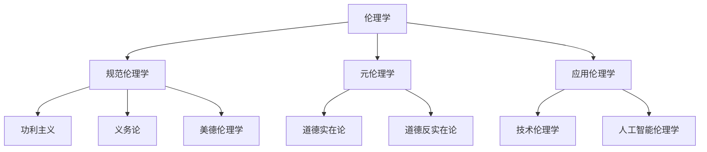

# 01-哲学基础理论-伦理学基础

[返回主题树](../00-主题树与内容索引.md) | [主计划文档](../00-形式化架构理论统一计划.md) | [相关计划](../递归合并计划.md)

> 本文档为哲学基础理论分支伦理学基础，所有最新进展与结论以主计划文档为准，历史细节归档于archive/。

## 目录

- [01-哲学基础理论-伦理学基础](#01-哲学基础理论-伦理学基础)
  - [目录](#目录)
  - [1. 伦理学概述](#1-伦理学概述)
    - [1.1 伦理学的定义](#11-伦理学的定义)
    - [1.2 伦理学的基本问题](#12-伦理学的基本问题)
  - [2. 规范伦理学](#2-规范伦理学)
    - [2.1 功利主义](#21-功利主义)
    - [2.2 义务论](#22-义务论)
    - [2.3 美德伦理学](#23-美德伦理学)
  - [3. 元伦理学](#3-元伦理学)
    - [3.1 道德实在论](#31-道德实在论)
    - [3.2 道德反实在论](#32-道德反实在论)
    - [3.3 道德相对主义](#33-道德相对主义)
  - [4. 应用伦理学](#4-应用伦理学)
    - [4.1 技术伦理学](#41-技术伦理学)
    - [4.2 人工智能伦理学](#42-人工智能伦理学)
    - [4.3 数据伦理学](#43-数据伦理学)
  - [5. 伦理决策](#5-伦理决策)
    - [5.1 决策模型](#51-决策模型)
    - [5.2 伦理推理](#52-伦理推理)
    - [5.3 伦理评估](#53-伦理评估)
  - [6. 伦理学在软件系统中的应用](#6-伦理学在软件系统中的应用)
    - [6.1 算法公平性](#61-算法公平性)
    - [6.2 隐私保护](#62-隐私保护)
  - [7. 总结](#7-总结)

## 1. 伦理学概述

### 1.1 伦理学的定义

**定义 1.1.1** 伦理学（Ethics）
伦理学是研究道德价值、道德原则和道德行为的哲学分支。

**核心概念**：

- 道德价值：善与恶、对与错的价值判断
- 道德原则：指导行为的普遍规则
- 道德行为：符合道德标准的行为

**伦理学层次**：



### 1.2 伦理学的基本问题

**核心问题**：

1. 什么是善？
2. 什么是正确的行为？
3. 如何做出道德判断？
4. 道德义务的来源是什么？

**形式化表示**：
$$\text{道德判断} = f(\text{行为}, \text{后果}, \text{动机}, \text{原则})$$

## 2. 规范伦理学

### 2.1 功利主义

**定义 2.1.1** 功利主义（Utilitarianism）
以最大化整体幸福为目标的道德理论。

**核心原则**：

- 最大幸福原则
- 后果主义
- 平等考虑

**形式化表示**：
$$U(A) = \sum_{i=1}^{n} w_i \cdot h_i(A)$$

其中：

- $U(A)$ 是行为A的效用
- $w_i$ 是第i个个体的权重
- $h_i(A)$ 是行为A对第i个个体的幸福影响

**应用案例**：

```rust
// 功利主义在算法设计中的应用
pub struct UtilitarianAlgorithm {
    utility_calculator: UtilityCalculator,
    stakeholder_analyzer: StakeholderAnalyzer,
}

impl UtilitarianAlgorithm {
    pub fn optimize_decision(&self, options: &[Option], stakeholders: &[Stakeholder]) -> Option {
        let mut best_option = None;
        let mut max_utility = f64::NEG_INFINITY;
        
        for option in options {
            let utility = self.calculate_total_utility(option, stakeholders);
            
            if utility > max_utility {
                max_utility = utility;
                best_option = Some(option.clone());
            }
        }
        
        best_option.unwrap()
    }
    
    fn calculate_total_utility(&self, option: &Option, stakeholders: &[Stakeholder]) -> f64 {
        stakeholders.iter()
            .map(|stakeholder| {
                let individual_utility = self.utility_calculator.calculate(option, stakeholder);
                stakeholder.weight * individual_utility
            })
            .sum()
    }
}
```

### 2.2 义务论

**定义 2.2.1** 义务论（Deontological Ethics）
以道德义务和规则为基础的道德理论。

**核心原则**：

- 绝对命令
- 道德规则
- 义务优先

**康德绝对命令**：

1. 普遍化原则：行为准则应能成为普遍法则
2. 人性原则：将人作为目的而非手段
3. 自律原则：理性主体的自我立法

**应用案例**：

```rust
// 义务论在隐私保护中的应用
pub struct DeontologicalPrivacy {
    moral_rules: Vec<MoralRule>,
    consent_validator: ConsentValidator,
}

impl DeontologicalPrivacy {
    pub fn evaluate_data_usage(&self, data_usage: &DataUsage) -> MoralJudgment {
        // 检查是否获得有效同意
        let consent_valid = self.consent_validator.validate(&data_usage.consent);
        
        // 检查是否符合道德规则
        let rule_compliance = self.check_moral_rules(data_usage);
        
        if consent_valid && rule_compliance {
            MoralJudgment::Permissible
        } else {
            MoralJudgment::Impermissible
        }
    }
    
    fn check_moral_rules(&self, data_usage: &DataUsage) -> bool {
        self.moral_rules.iter().all(|rule| rule.is_satisfied(data_usage))
    }
}
```

### 2.3 美德伦理学

**定义 2.3.1** 美德伦理学（Virtue Ethics）
以道德品格和美德为核心的道德理论。

**核心概念**：

- 美德：良好的品格特征
- 中庸：适度的行为
- 实践智慧：道德判断能力

**主要美德**：

- 智慧
- 勇气
- 节制
- 正义

**应用案例**：

```rust
// 美德伦理学在AI系统设计中的应用
pub struct VirtueEthicsAI {
    virtue_analyzer: VirtueAnalyzer,
    character_builder: CharacterBuilder,
}

impl VirtueEthicsAI {
    pub fn design_ethical_ai(&self, requirements: &Requirements) -> EthicalAI {
        // 分析所需美德
        let virtues = self.virtue_analyzer.analyze_required_virtues(requirements);
        
        // 构建道德品格
        let character = self.character_builder.build_character(&virtues);
        
        // 设计道德决策机制
        let decision_maker = self.design_moral_decision_maker(&character);
        
        EthicalAI {
            character,
            decision_maker,
            virtues,
        }
    }
}
```

## 3. 元伦理学

### 3.1 道德实在论

**定义 3.1.1** 道德实在论（Moral Realism）
认为道德事实客观存在的理论。

**核心主张**：

- 道德事实的客观性
- 道德真理的独立性
- 道德知识的可能性

**形式化表示**：
$$\exists x \exists y (\text{MoralFact}(x) \land \text{Objective}(x) \land \text{Independent}(x, y))$$

**应用案例**：

```rust
// 道德实在论在算法公平性中的应用
pub struct MoralRealism {
    objective_truth_detector: ObjectiveTruthDetector,
    moral_fact_validator: MoralFactValidator,
}

impl MoralRealism {
    pub fn identify_objective_moral_truths(&self, moral_claims: &[MoralClaim]) -> Vec<MoralFact> {
        moral_claims.iter()
            .filter_map(|claim| {
                if self.objective_truth_detector.is_objective(claim) {
                    Some(MoralFact::from_claim(claim))
                } else {
                    None
                }
            })
            .collect()
    }
}
```

### 3.2 道德反实在论

**定义 3.2.1** 道德反实在论（Moral Anti-Realism）
否认道德事实客观存在的理论。

**主要类型**：

- 道德主观主义
- 道德相对主义
- 道德虚无主义

**应用案例**：

```rust
// 道德反实在论在文化适应性算法中的应用
pub struct MoralAntiRealism {
    cultural_context_analyzer: CulturalContextAnalyzer,
    subjective_moral_evaluator: SubjectiveMoralEvaluator,
}

impl MoralAntiRealism {
    pub fn adapt_to_cultural_context(&self, algorithm: &Algorithm, context: &CulturalContext) -> AdaptedAlgorithm {
        // 分析文化背景
        let cultural_norms = self.cultural_context_analyzer.analyze(context);
        
        // 根据主观道德标准调整
        let adapted_algorithm = self.subjective_moral_evaluator.adapt(algorithm, &cultural_norms);
        
        adapted_algorithm
    }
}
```

### 3.3 道德相对主义

**定义 3.3.1** 道德相对主义（Moral Relativism）
认为道德标准因文化、社会或个人而异。

**类型**：

- 文化相对主义
- 个人相对主义
- 情境相对主义

**应用案例**：

```rust
// 道德相对主义在多文化系统中的应用
pub struct MoralRelativism {
    cultural_moral_analyzer: CulturalMoralAnalyzer,
    context_adaptive_system: ContextAdaptiveSystem,
}

impl MoralRelativism {
    pub fn adapt_moral_standards(&self, system: &System, cultural_context: &CulturalContext) -> AdaptedSystem {
        // 分析文化道德标准
        let moral_standards = self.cultural_moral_analyzer.analyze(cultural_context);
        
        // 适应性调整
        let adapted_system = self.context_adaptive_system.adapt(system, &moral_standards);
        
        adapted_system
    }
}
```

## 4. 应用伦理学

### 4.1 技术伦理学

**定义 4.1.1** 技术伦理学（Technology Ethics）
研究技术发展和应用的道德问题的伦理学分支。

**核心问题**：

- 技术责任
- 技术风险
- 技术正义
- 技术自主性

**应用案例**：

```rust
// 技术伦理学在自动驾驶系统中的应用
pub struct TechnologyEthics {
    responsibility_analyzer: ResponsibilityAnalyzer,
    risk_assessor: RiskAssessor,
}

impl TechnologyEthics {
    pub fn evaluate_autonomous_system(&self, system: &AutonomousSystem) -> EthicalEvaluation {
        // 责任分析
        let responsibility = self.responsibility_analyzer.analyze(system);
        
        // 风险评估
        let risk_assessment = self.risk_assessor.assess(system);
        
        // 正义性评估
        let justice_assessment = self.assess_distributive_justice(system);
        
        EthicalEvaluation {
            responsibility,
            risk_assessment,
            justice_assessment,
        }
    }
}
```

### 4.2 人工智能伦理学

**定义 4.2.1** 人工智能伦理学（AI Ethics）
专门研究人工智能系统的道德问题的伦理学分支。

**核心问题**：

- 算法偏见
- 透明度
- 可解释性
- 自主性

**应用案例**：

```rust
// 人工智能伦理学在机器学习系统中的应用
pub struct AIEthics {
    bias_detector: BiasDetector,
    transparency_analyzer: TransparencyAnalyzer,
    explainability_generator: ExplainabilityGenerator,
}

impl AIEthics {
    pub fn evaluate_ai_system(&self, ai_system: &AISystem) -> AIEthicalEvaluation {
        // 偏见检测
        let bias_analysis = self.bias_detector.detect_bias(ai_system);
        
        // 透明度分析
        let transparency_analysis = self.transparency_analyzer.analyze(ai_system);
        
        // 可解释性生成
        let explanations = self.explainability_generator.generate_explanations(ai_system);
        
        AIEthicalEvaluation {
            bias_analysis,
            transparency_analysis,
            explanations,
        }
    }
}
```

### 4.3 数据伦理学

**定义 4.3.1** 数据伦理学（Data Ethics）
研究数据收集、使用和处理的道德问题的伦理学分支。

**核心问题**：

- 数据隐私
- 数据所有权
- 数据正义
- 数据治理

**应用案例**：

```rust
// 数据伦理学在数据处理系统中的应用
pub struct DataEthics {
    privacy_protector: PrivacyProtector,
    data_governance: DataGovernance,
    consent_manager: ConsentManager,
}

impl DataEthics {
    pub fn evaluate_data_processing(&self, data_processing: &DataProcessing) -> DataEthicalEvaluation {
        // 隐私保护评估
        let privacy_assessment = self.privacy_protector.assess(data_processing);
        
        // 数据治理评估
        let governance_assessment = self.data_governance.assess(data_processing);
        
        // 同意管理评估
        let consent_assessment = self.consent_manager.assess(data_processing);
        
        DataEthicalEvaluation {
            privacy_assessment,
            governance_assessment,
            consent_assessment,
        }
    }
}
```

## 5. 伦理决策

### 5.1 决策模型

**定义 5.1.1** 伦理决策模型（Ethical Decision Model）
指导道德决策的系统性框架。

**常见模型**：

- 功利主义模型
- 义务论模型
- 美德伦理学模型
- 综合模型

**应用案例**：

```rust
// 伦理决策模型在自动化系统中的应用
pub struct EthicalDecisionModel {
    utilitarian_analyzer: UtilitarianAnalyzer,
    deontological_analyzer: DeontologicalAnalyzer,
    virtue_analyzer: VirtueAnalyzer,
}

impl EthicalDecisionModel {
    pub fn make_ethical_decision(&self, situation: &EthicalSituation) -> EthicalDecision {
        // 功利主义分析
        let utilitarian_analysis = self.utilitarian_analyzer.analyze(situation);
        
        // 义务论分析
        let deontological_analysis = self.deontological_analyzer.analyze(situation);
        
        // 美德伦理学分析
        let virtue_analysis = self.virtue_analyzer.analyze(situation);
        
        // 综合决策
        self.synthesize_decision(&utilitarian_analysis, &deontological_analysis, &virtue_analysis)
    }
}
```

### 5.2 伦理推理

**定义 5.2.1** 伦理推理（Ethical Reasoning）
运用伦理原则进行逻辑推理的过程。

**推理方法**：

- 演绎推理
- 归纳推理
- 类比推理
- 反思平衡

**应用案例**：

```rust
// 伦理推理在智能系统中的应用
pub struct EthicalReasoning {
    deductive_reasoner: DeductiveReasoner,
    inductive_reasoner: InductiveReasoner,
    analogical_reasoner: AnalogicalReasoner,
}

impl EthicalReasoning {
    pub fn reason_ethically(&self, ethical_problem: &EthicalProblem) -> EthicalConclusion {
        // 演绎推理
        let deductive_conclusion = self.deductive_reasoner.reason(ethical_problem);
        
        // 归纳推理
        let inductive_conclusion = self.inductive_reasoner.reason(ethical_problem);
        
        // 类比推理
        let analogical_conclusion = self.analogical_reasoner.reason(ethical_problem);
        
        // 综合结论
        self.synthesize_conclusions(&deductive_conclusion, &inductive_conclusion, &analogical_conclusion)
    }
}
```

### 5.3 伦理评估

**定义 5.3.1** 伦理评估（Ethical Assessment）
对行为、政策或系统进行道德评价的过程。

**评估维度**：

- 后果评估
- 义务评估
- 美德评估
- 正义评估

**应用案例**：

```rust
// 伦理评估在系统设计中的应用
pub struct EthicalAssessment {
    consequence_evaluator: ConsequenceEvaluator,
    duty_evaluator: DutyEvaluator,
    virtue_evaluator: VirtueEvaluator,
    justice_evaluator: JusticeEvaluator,
}

impl EthicalAssessment {
    pub fn assess_system(&self, system: &System) -> EthicalAssessmentResult {
        // 后果评估
        let consequence_assessment = self.consequence_evaluator.evaluate(system);
        
        // 义务评估
        let duty_assessment = self.duty_evaluator.evaluate(system);
        
        // 美德评估
        let virtue_assessment = self.virtue_evaluator.evaluate(system);
        
        // 正义评估
        let justice_assessment = self.justice_evaluator.evaluate(system);
        
        EthicalAssessmentResult {
            consequence_assessment,
            duty_assessment,
            virtue_assessment,
            justice_assessment,
        }
    }
}
```

## 6. 伦理学在软件系统中的应用

### 6.1 算法公平性

**定义 6.1.1** 算法公平性（Algorithmic Fairness）
确保算法决策对不同群体公平的道德要求。

**公平性标准**：

- 统计公平性
- 个体公平性
- 机会公平性
- 结果公平性

**应用案例**：

```rust
// 算法公平性在机器学习系统中的应用
pub struct AlgorithmicFairness {
    fairness_metrics: FairnessMetrics,
    bias_detector: BiasDetector,
    fairness_optimizer: FairnessOptimizer,
}

impl AlgorithmicFairness {
    pub fn ensure_fairness(&self, model: &MLModel, data: &Dataset) -> FairModel {
        // 检测偏见
        let bias_analysis = self.bias_detector.detect_bias(model, data);
        
        // 计算公平性指标
        let fairness_metrics = self.fairness_metrics.calculate(model, data);
        
        // 优化公平性
        let fair_model = self.fairness_optimizer.optimize(model, &fairness_metrics);
        
        fair_model
    }
}
```

### 6.2 隐私保护

**定义 6.2.1** 隐私保护（Privacy Protection）
保护个人隐私信息的道德和技术措施。

**保护方法**：

- 数据最小化
- 匿名化
- 加密
- 访问控制

**应用案例**：

```rust
// 隐私保护在数据处理系统中的应用
pub struct PrivacyProtection {
    data_minimizer: DataMinimizer,
    anonymizer: Anonymizer,
    encryptor: Encryptor,
    access_controller: AccessController,
}

impl PrivacyProtection {
    pub fn protect_privacy(&self, data: &PersonalData) -> ProtectedData {
        // 数据最小化
        let minimized_data = self.data_minimizer.minimize(data);
        
        // 匿名化
        let anonymized_data = self.anonymizer.anonymize(&minimized_data);
        
        // 加密
        let encrypted_data = self.encryptor.encrypt(&anonymized_data);
        
        // 访问控制
        let access_controlled_data = self.access_controller.apply_controls(&encrypted_data);
        
        ProtectedData {
            data: access_controlled_data,
            protection_level: ProtectionLevel::High,
        }
    }
}
```

## 7. 总结

伦理学基础为形式化架构理论提供了重要的道德维度和价值指导。通过规范伦理学、元伦理学和应用伦理学的有机结合，我们能够：

1. **建立道德框架**：为技术发展提供道德指导原则
2. **确保公平正义**：在算法和系统中实现公平性
3. **保护隐私权利**：在数据处理中尊重个人隐私
4. **促进负责任的技术**：确保技术发展符合道德标准

伦理学基础与形式化架构理论的其他分支形成了完整的理论体系，为软件工程和人工智能领域提供了坚实的道德基础，确保技术发展既符合技术标准，也符合道德要求。
