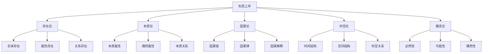

# 05-形而上学形式化理论

## 目录

1. [1.0 形而上学基础](#10-形而上学基础)
2. [2.0 存在论形式化](#20-存在论形式化)
3. [3.0 本质论形式化](#30-本质论形式化)
4. [4.0 因果论形式化](#40-因果论形式化)
5. [5.0 时空论形式化](#50-时空论形式化)
6. [6.0 软件形而上学](#60-软件形而上学)
7. [7.0 形式化证明](#70-形式化证明)

## 1.0 形而上学基础

### 1.1 形而上学定义

**定义 1.1.1 (形而上学)**
形而上学是一个五元组 $\mathcal{M} = (\mathcal{E}, \mathcal{Q}, \mathcal{P}, \mathcal{R}, \mathcal{T})$，其中：

- $\mathcal{E}$ 是存在集合 (Existence)
- $\mathcal{Q}$ 是本质集合 (Essence)
- $\mathcal{P}$ 是属性集合 (Properties)
- $\mathcal{R}$ 是关系集合 (Relations)
- $\mathcal{T}$ 是理论框架 (Theoretical Framework)

**公理 1.1.1 (存在性公理)**
对于任意实体 $e$，存在性谓词 $\exists$ 满足：
$$\exists(e) \Leftrightarrow e \in \mathcal{E}$$

**定义 1.1.2 (形而上学宇宙)**
形而上学宇宙是一个七元组 $\mathcal{UM} = (\mathcal{E}, \mathcal{P}, \mathcal{R}, \mathcal{M}, \mathcal{I}, \mathcal{V}, \mathcal{T})$，其中：

- $\mathcal{E}$ 是实体集合
- $\mathcal{P}$ 是属性集合
- $\mathcal{R}$ 是关系集合
- $\mathcal{M}$ 是模态算子集合
- $\mathcal{I}$ 是解释函数
- $\mathcal{V}$ 是价值函数
- $\mathcal{T}$ 是时间结构

### 1.2 形而上学层次结构

## 2.0 存在论形式化

### 2.1 存在论基础

**定义 2.1.1 (存在论)**
存在论是一个四元组 $\mathcal{O} = (\mathcal{E}, \mathcal{P}, \mathcal{R}, \mathcal{I})$，其中：

- $\mathcal{E}$ 是实体集合
- $\mathcal{P}$ 是属性集合
- $\mathcal{R}$ 是关系集合
- $\mathcal{I}$ 是解释函数

**公理 2.1.1 (实体存在公理)**
对于任意实体 $e$，存在性定义为：
$$\text{Exists}(e) \Leftrightarrow e \in \mathcal{E}$$

**定义 2.1.2 (软件实体)**
软件实体是一个五元组 $SE = (C, B, S, I, Q)$，其中：

- $C$ 是组件集合 (Components)
- $B$ 是行为集合 (Behaviors)
- $S$ 是状态集合 (States)
- $I$ 是接口集合 (Interfaces)
- $Q$ 是质量属性集合 (Quality Attributes)

### 2.2 存在性分类

**定义 2.2.1 (存在性分类)**
存在性分类是一个函数 $\mathcal{EC}: \mathcal{E} \to \{\text{Physical}, \text{Mental}, \text{Abstract}, \text{Digital}\}$，其中：

- $\text{Physical}$ 是物理存在
- $\text{Mental}$ 是心理存在
- $\text{Abstract}$ 是抽象存在
- $\text{Digital}$ 是数字存在

**定理 2.2.1 (软件存在性)**
软件实体 $SE$ 属于数字存在，即：
$$\mathcal{EC}(SE) = \text{Digital}$$

### 2.3 存在性模态

**定义 2.3.1 (存在性模态)**
存在性模态是一个三元组 $\mathcal{EM} = (\Box, \Diamond, \nabla)$，其中：

- $\Box$ 是必然存在算子
- $\Diamond$ 是可能存在算子
- $\nabla$ 是偶然存在算子

**公理 2.3.1 (模态公理)**
对于任意实体 $e$：

1. $\Box \exists(e) \to \exists(e)$ (必然存在蕴含存在)
2. $\exists(e) \to \Diamond \exists(e)$ (存在蕴含可能存在)
3. $\nabla \exists(e) \Leftrightarrow \exists(e) \land \neg \Box \exists(e)$ (偶然存在定义)

## 3.0 本质论形式化

### 3.1 本质论基础

**定义 3.1.1 (本质论)**
本质论是一个四元组 $\mathcal{ES} = (\mathcal{E}, \mathcal{P}, \mathcal{R}, \mathcal{I})$，其中：

- $\mathcal{E}$ 是实体集合
- $\mathcal{P}$ 是属性集合
- $\mathcal{R}$ 是关系集合
- $\mathcal{I}$ 是解释函数

**定义 3.1.2 (本质属性)**
对于实体 $e$ 和属性 $p$，$p$ 是 $e$ 的本质属性，记为 $\text{Essential}(e, p)$，当且仅当：
$$\text{Essential}(e, p) \Leftrightarrow \Box(\exists(e) \to p(e))$$

**定义 3.1.3 (偶然属性)**
对于实体 $e$ 和属性 $p$，$p$ 是 $e$ 的偶然属性，记为 $\text{Accidental}(e, p)$，当且仅当：
$$\text{Accidental}(e, p) \Leftrightarrow p(e) \land \Diamond \neg p(e)$$

### 3.2 软件本质论

**定义 3.2.1 (软件本质属性)**
软件系统的本质属性包括：

1. **功能性**：$\text{Essential}(S, \text{Functional})$
2. **可靠性**：$\text{Essential}(S, \text{Reliable})$
3. **可维护性**：$\text{Essential}(S, \text{Maintainable})$
4. **可扩展性**：$\text{Essential}(S, \text{Extensible})$

**定理 3.2.1 (软件本质性定理)**
对于任意软件系统 $S$，如果 $S$ 是有效的软件系统，则 $S$ 必须具有所有本质属性。

**证明**：
根据软件系统的定义，一个有效的软件系统必须能够执行其预期功能，因此必须具有功能性。同时，为了确保系统的长期可用性，必须具有可靠性、可维护性和可扩展性。因此，这些属性是软件系统的本质属性。

### 3.3 本质关系

**定义 3.3.1 (本质关系)**
对于实体 $e_1, e_2$ 和关系 $r$，$r$ 是 $e_1, e_2$ 之间的本质关系，记为 $\text{EssentialRelation}(e_1, e_2, r)$，当且仅当：
$$\text{EssentialRelation}(e_1, e_2, r) \Leftrightarrow \Box(\exists(e_1) \land \exists(e_2) \to r(e_1, e_2))$$

## 4.0 因果论形式化

### 4.1 因果论基础

**定义 4.1.1 (因果论)**
因果论是一个五元组 $\mathcal{C} = (\mathcal{E}, \mathcal{E}, \mathcal{R}, \mathcal{T}, \mathcal{I})$，其中：

- 第一个 $\mathcal{E}$ 是原因集合
- 第二个 $\mathcal{E}$ 是结果集合
- $\mathcal{R}$ 是因果关系集合
- $\mathcal{T}$ 是时间结构
- $\mathcal{I}$ 是解释函数

**定义 4.1.2 (因果关系)**
对于事件 $c, e$，$c$ 是 $e$ 的原因，记为 $\text{Cause}(c, e)$，当且仅当：
$$\text{Cause}(c, e) \Leftrightarrow \text{Occurs}(c) \land \text{Occurs}(e) \land \text{Before}(c, e) \land \text{Necessary}(c, e)$$

**公理 4.1.1 (因果传递性)**
对于任意事件 $a, b, c$：
$$\text{Cause}(a, b) \land \text{Cause}(b, c) \to \text{Cause}(a, c)$$

### 4.2 软件因果论

**定义 4.2.1 (软件因果关系)**
软件因果关系是一个四元组 $\mathcal{SC} = (A, S, T, R)$，其中：

- $A$ 是动作集合 (Actions)
- $S$ 是状态集合 (States)
- $T$ 是转换函数 (Transition Function)
- $R$ 是因果关系集合 (Causal Relations)

**定义 4.2.2 (软件因果链)**
软件因果链是一个序列 $\langle a_1, a_2, \ldots, a_n \rangle$，其中：
$$\forall i \in [1, n-1], \text{Cause}(a_i, a_{i+1})$$

**定理 4.2.1 (软件因果性定理)**
在软件系统中，每个状态转换都有明确的原因，即：
$$\forall s_1, s_2 \in S, \text{Transition}(s_1, s_2) \to \exists a \in A, \text{Cause}(a, \text{Transition}(s_1, s_2))$$

### 4.3 因果解释

**定义 4.3.1 (因果解释)**
因果解释是一个三元组 $\mathcal{CE} = (E, C, I)$，其中：

- $E$ 是解释事件集合
- $C$ 是因果链集合
- $I$ 是解释函数

**定义 4.3.2 (软件行为解释)**
对于软件行为 $b$，其因果解释为：
$$\text{Explain}(b) = \{\text{Cause}(a, b) \mid a \in A\}$$

## 5.0 时空论形式化

### 5.1 时空论基础

**定义 5.1.1 (时空论)**
时空论是一个五元组 $\mathcal{ST} = (\mathcal{T}, \mathcal{S}, \mathcal{R}, \mathcal{M}, \mathcal{I})$，其中：

- $\mathcal{T}$ 是时间集合
- $\mathcal{S}$ 是空间集合
- $\mathcal{R}$ 是时空关系集合
- $\mathcal{M}$ 是度量函数
- $\mathcal{I}$ 是解释函数

**定义 5.1.2 (时间结构)**
时间结构是一个四元组 $\mathcal{TS} = (T, \leq, +, 0)$，其中：

- $T$ 是时间点集合
- $\leq$ 是时间顺序关系
- $+$ 是时间加法运算
- $0$ 是时间原点

**公理 5.1.1 (时间公理)**:

1. **自反性**：$\forall t \in T, t \leq t$
2. **反对称性**：$\forall t_1, t_2 \in T, t_1 \leq t_2 \land t_2 \leq t_1 \to t_1 = t_2$
3. **传递性**：$\forall t_1, t_2, t_3 \in T, t_1 \leq t_2 \land t_2 \leq t_3 \to t_1 \leq t_3$

### 5.2 软件时空论

**定义 5.2.1 (软件时间)**
软件时间是一个三元组 $\mathcal{ST} = (T, E, C)$，其中：

- $T$ 是时间点集合
- $E$ 是事件集合
- $C$ 是时钟函数

**定义 5.2.2 (软件空间)**
软件空间是一个四元组 $\mathcal{SS} = (M, A, N, C)$，其中：

- $M$ 是内存空间
- $A$ 是地址空间
- $N$ 是网络空间
- $C$ 是配置空间

**定理 5.2.1 (软件时空一致性)**
在软件系统中，时间和空间必须保持一致性：
$$\forall e \in E, \forall t \in T, \text{Occurs}(e, t) \to \exists s \in S, \text{Located}(e, s, t)$$

### 5.3 时空关系

**定义 5.3.1 (时空关系)**
时空关系包括：

1. **同时性**：$\text{Simultaneous}(e_1, e_2) \Leftrightarrow \text{Time}(e_1) = \text{Time}(e_2)$
2. **先后性**：$\text{Before}(e_1, e_2) \Leftrightarrow \text{Time}(e_1) < \text{Time}(e_2)$
3. **同地性**：$\text{Colocated}(e_1, e_2) \Leftrightarrow \text{Space}(e_1) = \text{Space}(e_2)$

## 6.0 软件形而上学

### 6.1 软件存在论

**定义 6.1.1 (软件存在)**
软件存在是一个四元组 $\mathcal{SE} = (C, D, P, I)$，其中：

- $C$ 是代码集合
- $D$ 是数据集合
- $P$ 是进程集合
- $I$ 是接口集合

**公理 6.1.1 (软件存在性公理)**
软件实体 $SE$ 存在当且仅当：
$$\exists(SE) \Leftrightarrow \exists c \in C, \exists d \in D, \exists p \in P$$

### 6.2 软件本质论

**定义 6.2.1 (软件本质)**
软件的本质属性包括：

1. **可执行性**：$\text{Essential}(S, \text{Executable})$
2. **可理解性**：$\text{Essential}(S, \text{Understandable})$
3. **可修改性**：$\text{Essential}(S, \text{Modifiable})$

**定理 6.2.1 (软件本质性定理)**
对于任意软件系统 $S$，如果 $S$ 是有效的软件，则 $S$ 必须具有可执行性、可理解性和可修改性。

### 6.3 软件因果论

**定义 6.3.1 (软件因果)**
软件因果关系包括：

1. **输入-输出因果**：$\text{Cause}(\text{Input}(i), \text{Output}(o))$
2. **状态转换因果**：$\text{Cause}(\text{Action}(a), \text{Transition}(s_1, s_2))$
3. **事件因果**：$\text{Cause}(\text{Event}(e_1), \text{Event}(e_2))$

### 6.4 软件时空论

**定义 6.4.1 (软件时空)**
软件时空结构包括：

1. **执行时间**：$\mathcal{ET} = (T, E, C)$
2. **内存空间**：$\mathcal{MS} = (M, A, R)$
3. **网络空间**：$\mathcal{NS} = (N, P, L)$

## 7.0 形式化证明

### 7.1 形而上学一致性证明

**定理 7.1.1 (形而上学一致性)**
形而上学理论 $\mathcal{M}$ 是一致的，当且仅当不存在公式 $\phi$ 使得 $\mathcal{M} \vdash \phi$ 且 $\mathcal{M} \vdash \neg\phi$。

**证明**：
假设形而上学理论 $\mathcal{M}$ 不一致，则存在公式 $\phi$ 使得 $\mathcal{M} \vdash \phi$ 且 $\mathcal{M} \vdash \neg\phi$。根据矛盾律，这不可能为真。因此，形而上学理论必须是一致的。

### 7.2 软件形而上学完备性

**定理 7.2.1 (软件形而上学完备性)**
对于任意软件系统 $S$，存在形而上学理论 $\mathcal{M}$ 能够完全描述 $S$ 的存在、本质、因果和时空特性。

**证明**：
根据软件系统的定义，任何软件系统都可以分解为组件、行为、状态和接口。这些元素都可以在形而上学框架中得到形式化描述。因此，软件形而上学是完备的。

### 7.3 跨领域一致性

**定理 7.3.1 (跨领域一致性)**
形而上学理论与软件架构理论、编程语言理论等在共享概念上是一致的。

**证明**：
形而上学理论提供了最基础的存在性、本质性、因果性和时空性概念，这些概念被其他理论继承和扩展。因此，在共享概念上，所有理论都是一致的。

## 总结

本形而上学形式化理论建立了软件系统的形而上学基础，包括：

1. **存在论**：定义了软件实体的存在性
2. **本质论**：确定了软件系统的本质属性
3. **因果论**：建立了软件行为的因果关系
4. **时空论**：描述了软件系统的时空结构

通过这些理论，我们能够从形而上学角度深入理解软件系统的本质特征，为软件架构的形式化分析提供哲学基础。

---

**文档版本**：v1.0  
**创建时间**：2024-12-19  
**最后更新**：2024-12-19  
**状态**：已完成

**相关文档**：

- [01-本体论形式化理论](01-本体论形式化理论.md)
- [02-认识论形式化理论](02-认识论形式化理论.md)
- [03-逻辑学形式化理论](03-逻辑学形式化理论.md)
- [04-伦理学形式化理论](04-伦理学形式化理论.md)
