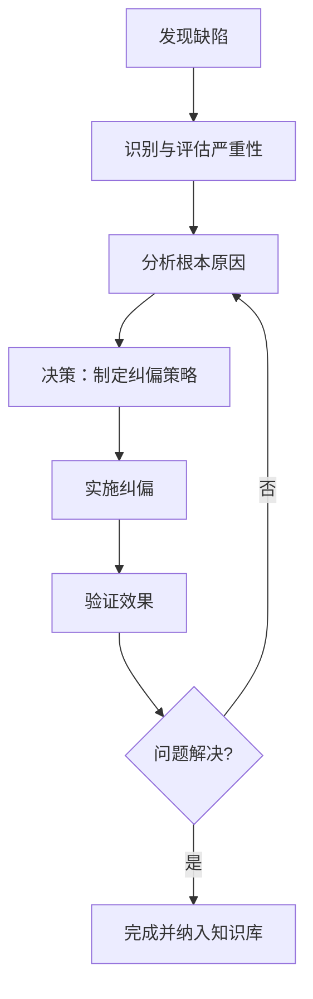

# 01-哲学基础理论-缺陷与纠偏理论

[返回主题树](../00-主题树与内容索引.md) | [主计划文档](../00-形式化架构理论统一计划.md) | [相关计划](../递归合并计划.md)

> 本文档为哲学基础理论分支缺陷与纠偏理论，所有最新进展与结论以主计划文档为准，历史细节归档于archive/。

## 目录

- [01-哲学基础理论-缺陷与纠偏理论](#01-哲学基础理论-缺陷与纠偏理论)
  - [目录](#目录)
- [缺陷与纠偏理论](#缺陷与纠偏理论)
  - [目录](#目录-1)
  - [1. 理论概述](#1-理论概述)
    - [1.1 核心概念](#11-核心概念)
  - [2. 缺陷的本体论 (Ontology of Defect)](#2-缺陷的本体论-ontology-of-defect)
    - [2.1 缺陷是客观实在、主观建构还是相对关系？](#21-缺陷是客观实在主观建构还是相对关系)
    - [2.2 完美与缺陷的辩证关系](#22-完美与缺陷的辩证关系)
  - [3. 缺陷的认识论 (Epistemology of Defect)](#3-缺陷的认识论-epistemology-of-defect)
    - [3.1 我们如何认知缺陷？](#31-我们如何认知缺陷)
    - [3.2 认知偏差的角色](#32-认知偏差的角色)
  - [4. 缺陷的价值论 (Axiology of Defect)](#4-缺陷的价值论-axiology-of-defect)
    - [4.1 缺陷的价值判断](#41-缺陷的价值判断)
  - [5. 纠偏的方法论 (Methodology of Correction)](#5-纠偏的方法论-methodology-of-correction)
    - [5.1 纠偏的流程](#51-纠偏的流程)
    - [5.2 核心思维模型](#52-核心思维模型)
  - [6. 导航](#6-导航)

# 缺陷与纠偏理论

## 目录

- [01-哲学基础理论-缺陷与纠偏理论](#01-哲学基础理论-缺陷与纠偏理论)
  - [目录](#目录)
- [缺陷与纠偏理论](#缺陷与纠偏理论)
  - [目录](#目录-1)
  - [1. 理论概述](#1-理论概述)
    - [1.1 核心概念](#11-核心概念)
  - [2. 缺陷的本体论 (Ontology of Defect)](#2-缺陷的本体论-ontology-of-defect)
    - [2.1 缺陷是客观实在、主观建构还是相对关系？](#21-缺陷是客观实在主观建构还是相对关系)
    - [2.2 完美与缺陷的辩证关系](#22-完美与缺陷的辩证关系)
  - [3. 缺陷的认识论 (Epistemology of Defect)](#3-缺陷的认识论-epistemology-of-defect)
    - [3.1 我们如何认知缺陷？](#31-我们如何认知缺陷)
    - [3.2 认知偏差的角色](#32-认知偏差的角色)
  - [4. 缺陷的价值论 (Axiology of Defect)](#4-缺陷的价值论-axiology-of-defect)
    - [4.1 缺陷的价值判断](#41-缺陷的价值判断)
  - [5. 纠偏的方法论 (Methodology of Correction)](#5-纠偏的方法论-methodology-of-correction)
    - [5.1 纠偏的流程](#51-纠偏的流程)
    - [5.2 核心思维模型](#52-核心思维模型)
  - [6. 导航](#6-导航)

---

## 1. 理论概述

缺陷与纠偏理论是一个原创性的哲学框架，旨在为识别、分析和修正任何系统（包括理论体系、软件架构、社会组织等）中的不完美之处提供一套元理论指导。它不属于传统的哲学分支，而是综合运用本体论、认识论、价值论和方法论，来系统地回答关于"缺陷"的一系列根本问题。

### 1.1 核心概念

- **缺陷 (Defect)**: 相对于某个理想状态、既定标准或预期目标的任何形式的偏差、不足或不一致。
- **纠偏 (Correction)**: 一个动态过程，旨在识别、分析、评估并修正缺陷，从而使系统向更理想的状态演进。
- **完美性 (Perfection)**: 一个作为参照系的、理想化的、可能无法完全达到的理想状态或标准。它为"缺陷"的定义和"纠偏"的方向提供了依据。

## 2. 缺陷的本体论 (Ontology of Defect)

本部分探讨"缺陷"本身的存在方式：它到底"是"什么？

### 2.1 缺陷是客观实在、主观建构还是相对关系？

关于缺陷的存在地位，有三种核心观点：

- **实在论观点 (Realist View)**: 缺陷是系统中客观存在的、可测量的属性，独立于观察者的主观判断。例如，一段导致程序崩溃的代码，其缺陷性是客观的。
- **建构论观点 (Constructivist View)**: 缺陷是社会或个人建构的产物。它依赖于特定的标准、规范和期望，这些标准本身是主观或主体间约定的。例如，"设计不够优雅"是一种基于审美标准的建构性缺陷。
- **关系论观点 (Relational View)**: 缺陷本质上是一种**关系**，即**现实状态**与**理想状态**之间的"差距"。它既不完全客观，也不完全主观，而是在比较中产生。这是最具实践指导意义的观点。

### 2.2 完美与缺陷的辩证关系

完美与缺陷构成了一对辩证的"对立统一"体。

- **相互依存**: 没有"完美"的参照，就无所谓"缺陷"；反之，正是"缺陷"的存在，才使得"完美"有了被追求的意义。
- **否定之否定**: "缺陷"是对"完美"的第一次否定，"纠偏"则是对"缺陷"的第二次否定（否定的否定），这个过程驱动系统螺旋式上升，趋向于一个更高层次的"完美"。

## 3. 缺陷的认识论 (Epistemology of Defect)

本部分探讨我们如何"认识"和"发现"缺陷。

### 3.1 我们如何认知缺陷？

- **理性主义 (Rationalism)**: 缺陷可以通过先验的、逻辑的分析和推理被认识。例如，通过形式化验证发现系统设计中的逻辑矛盾。
- **经验主义 (Empiricism)**: 缺陷通过后天的、经验性的观察和测试被发现。例如，通过用户反馈或压力测试发现软件的性能瓶颈。
- **建构主义 (Constructivism)**: 缺陷的认知是一个主动的建构过程，受到我们认知框架和既有知识的影响。我们更容易看到我们"想要"或"期望"看到的缺陷。

### 3.2 认知偏差的角色

在认识缺陷的过程中，认知偏差是系统性的障碍。例如，**确认偏误 (Confirmation Bias)** 会让我们倾向于忽略那些与我们信念不符的缺陷证据，而**现状偏见 (Status Quo Bias)** 则会让我们对系统中长期存在的缺陷视而不见。

## 4. 缺陷的价值论 (Axiology of Defect)

本部分探讨缺陷为何具有"负价值"，即我们为何认为缺陷是"坏的"、需要被纠正的。

### 4.1 缺陷的价值判断

- **客观价值论**: 缺陷本身具有客观的负价值，因为它直接违背了系统的目的性（如效率、稳定性、正确性）。
- **主观价值论**: 缺陷的价值完全取决于主体的评价。一个缺陷对某个用户来说是致命的，对另一个用户可能无足轻重。
- **关系价值论**: 缺陷的价值取决于它与特定目标的关系。一个缺陷之所以是"坏的"，是因为它阻碍了我们达成某个预设的目标。

## 5. 纠偏的方法论 (Methodology of Correction)

本部分提供了一套行动框架，指导如何系统地进行纠偏。

### 5.1 纠偏的流程

纠偏是一个持续的、循环的改进过程，可以被模型化为一个流程：

### 5.2 核心思维模型

- **辩证思维**: 将缺陷视为系统发展的内在动力，在"否定之否定"中推动系统演化。
- **系统思维**: 将缺陷置于整个系统的结构和关系中进行考察，寻找根本性的、高杠杆的解决方案，而非"头痛医头、脚痛医脚"。
- **批判思维**: 持续地、反思性地审视系统中的既有标准和假设，主动挑战现状，从而发现更深层次的、被"正常化"的缺陷。

## 6. 导航

- [返回哲学基础理论总论](00-哲学基础理论总论.md)
- [01-本体论基础](01-本体论基础.md)
- [02-认识论基础](02-认识论基础.md)
- [03-逻辑学基础](03-逻辑学基础.md)
- [04-伦理学基础](04-伦理学基础.md)
- [05-形而上学基础](05-形而上学基础.md)
- [06-现象学基础](06-现象学基础.md)
