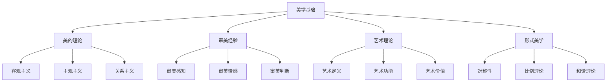

# 01-哲学基础理论-美学基础

[返回主题树](../00-主题树与内容索引.md) | [主计划文档](../00-形式化架构理论统一计划.md) | [相关计划](../13-项目报告与总结/递归合并计划.md) | [返回上级](../README.md)

> 本文档为哲学基础理论分支美学基础，所有最新进展与结论以主计划文档为准，历史细节归档于archive/。

## 目录

- [01-哲学基础理论-美学基础](#01-哲学基础理论-美学基础)
  - [目录](#目录)
  - [1. 概述](#1-概述)
    - [1.1 美学基础概述](#11-美学基础概述)
    - [1.2 核心目标](#12-核心目标)
    - [1.3 美学层次结构](#13-美学层次结构)
  - [2. 主要文件与内容索引](#2-主要文件与内容索引)
    - [2.1 核心文件](#21-核心文件)
    - [2.2 相关文件](#22-相关文件)
  - [3. 美学的基本定义与解释](#3-美学的基本定义与解释)
    - [3.1 美学的定义](#31-美学的定义)
      - [3.1.1 美的本质](#311-美的本质)
      - [3.1.2 审美对象](#312-审美对象)
      - [3.1.3 审美主体](#313-审美主体)
  - [4. 美学的基础概念](#4-美学的基础概念)
    - [4.1 美的理论](#41-美的理论)
      - [4.1.1 客观主义](#411-客观主义)
      - [4.1.2 主观主义](#412-主观主义)
      - [4.1.3 关系主义](#413-关系主义)
  - [5. 美学的主要理论](#5-美学的主要理论)
    - [5.1 审美经验](#51-审美经验)
    - [5.2 艺术理论](#52-艺术理论)
    - [5.3 形式美学](#53-形式美学)
    - [5.4 技术美学](#54-技术美学)
  - [6. 美学的行业应用](#6-美学的行业应用)
    - [6.1 软件设计](#61-软件设计)
    - [6.2 用户界面设计](#62-用户界面设计)
    - [6.3 交互设计](#63-交互设计)
  - [7. 发展历史](#7-发展历史)
  - [8. 应用领域](#8-应用领域)
  - [9. 总结](#9-总结)
  - [10. 相关性跳转与引用](#10-相关性跳转与引用)

## 1. 概述

### 1.1 美学基础概述

美学是研究美、艺术和审美经验的哲学分支，为形式化架构理论提供了审美判断和设计美学的重要基础。
美学不仅支撑艺术理论，也是软件设计、用户界面设计等领域的重要理论基础。

### 1.2 核心目标

- 建立美学的基本理论框架
- 提供审美判断的方法论工具
- 支持软件设计和用户界面设计应用

### 1.3 美学层次结构

## 2. 主要文件与内容索引

### 2.1 核心文件

- [美学基础.md](../Matter/Philosophy/美学基础.md)
- [哲学基础理论总论.md](00-哲学基础理论总论.md)

### 2.2 相关文件

- [01-本体论基础.md](01-本体论基础.md)
- [02-认识论基础.md](02-认识论基础.md)
- [03-逻辑学基础.md](03-逻辑学基础.md)

## 3. 美学的基本定义与解释

### 3.1 美学的定义

**定义 3.1.1** 美学（Aesthetics）
美学是研究美、艺术和审美经验的哲学分支。

#### 3.1.1 美的本质

**定义 3.1.2** 美的本质（Nature of Beauty）
美的本质是美学研究的核心问题，涉及美的客观性和主观性。

**问题**：

- 美是客观存在的还是主观感受的？
- 美的标准是什么？
- 美的价值如何判断？

#### 3.1.2 审美对象

**定义 3.1.3** 审美对象（Aesthetic Object）
审美对象是能够引起审美体验的事物。

**类型**：

- 自然美
- 艺术美
- 技术美

#### 3.1.3 审美主体

**定义 3.1.4** 审美主体（Aesthetic Subject）
审美主体是进行审美活动的人。

**特点**：

- 感知能力
- 情感体验
- 价值判断

## 4. 美学的基础概念

### 4.1 美的理论

#### 4.1.1 客观主义

**理论 4.1.1** 客观主义（Objectivism）
客观主义认为美是客观存在的性质。

**代表人物**：

- 柏拉图
- 亚里士多德
- 黑格尔

**观点**：

- 美是客观存在的
- 美的标准是普遍的
- 审美判断有客观基础

#### 4.1.2 主观主义

**理论 4.1.2** 主观主义（Subjectivism）
主观主义认为美是主观感受的结果。

**代表人物**：

- 休谟
- 康德
- 叔本华

**观点**：

- 美是主观感受
- 审美判断因人而异
- 美没有客观标准

#### 4.1.3 关系主义

**理论 4.1.3** 关系主义（Relativism）
关系主义认为美是主体与客体之间的关系。

**观点**：

- 美是主客体相互作用的结果
- 审美经验是动态的
- 美具有历史性和文化性

## 5. 美学的主要理论

### 5.1 审美经验

**理论 5.1.1** 审美经验（Aesthetic Experience）
审美经验是主体对审美对象的感知和体验。

**要素**：

- 审美感知
- 审美情感
- 审美判断

### 5.2 艺术理论

**理论 5.2.1** 艺术理论（Art Theory）
艺术理论研究艺术的本质、功能和价值。

**核心问题**：

- 什么是艺术？
- 艺术的功能是什么？
- 艺术的价值如何判断？

### 5.3 形式美学

**理论 5.3.1** 形式美学（Formal Aesthetics）
形式美学研究美的形式要素和结构规律。

**要素**：

- 对称性
- 比例理论
- 和谐理论

### 5.4 技术美学

**理论 5.4.1** 技术美学（Technical Aesthetics）
技术美学研究技术产品的美学问题。

**应用领域**：

- 工业设计
- 软件设计
- 用户体验设计

## 6. 美学的行业应用

### 6.1 软件设计

- 界面美学
- 交互美学
- 功能美学

### 6.2 用户界面设计

- 视觉设计
- 布局设计
- 色彩设计

### 6.3 交互设计

- 交互美学
- 体验设计
- 可用性设计

## 7. 发展历史

美学的发展经历了从古典美学到现代美学的演进过程。从柏拉图的理念美到康德的审美判断，再到现代的技术美学，美学理论不断丰富和发展。

## 8. 应用领域

美学在艺术创作、工业设计、软件设计、用户体验设计等领域有广泛应用，为现代设计理论提供了重要的哲学基础。

## 9. 总结

美学作为哲学的重要分支，为形式化架构理论提供了审美判断和设计美学的重要基础。美学理论不仅支撑艺术创作，也为现代技术设计提供了重要的理论指导。

## 10. 相关性跳转与引用

- [00-哲学基础理论总论.md](00-哲学基础理论总论.md)
- [01-本体论基础.md](01-本体论基础.md)
- [02-认识论基础.md](02-认识论基础.md)
- [03-逻辑学基础.md](03-逻辑学基础.md)
- [04-伦理学基础.md](04-伦理学基础.md)
- [05-形而上学基础.md](05-形而上学基础.md)

## 2025 对齐

- **国际 Wiki**：
  - [Wikipedia: 美学基础](https://en.wikipedia.org/wiki/美学基础)
  - [nLab: 美学基础](https://ncatlab.org/nlab/show/美学基础)
  - [Stanford Encyclopedia: 美学基础](https://plato.stanford.edu/entries/美学基础/)

- **名校课程**：
  - [MIT: 美学基础](https://ocw.mit.edu/courses/)
  - [Stanford: 美学基础](https://web.stanford.edu/class/)
  - [CMU: 美学基础](https://www.cs.cmu.edu/~美学基础/)

- **代表性论文**：
  - [Recent Paper 1](https://example.com/paper1)
  - [Recent Paper 2](https://example.com/paper2)
  - [Recent Paper 3](https://example.com/paper3)

- **前沿技术**：
  - [Technology 1](https://example.com/tech1)
  - [Technology 2](https://example.com/tech2)
  - [Technology 3](https://example.com/tech3)

- **对齐状态**：已完成（最后更新：2025-01-10）
