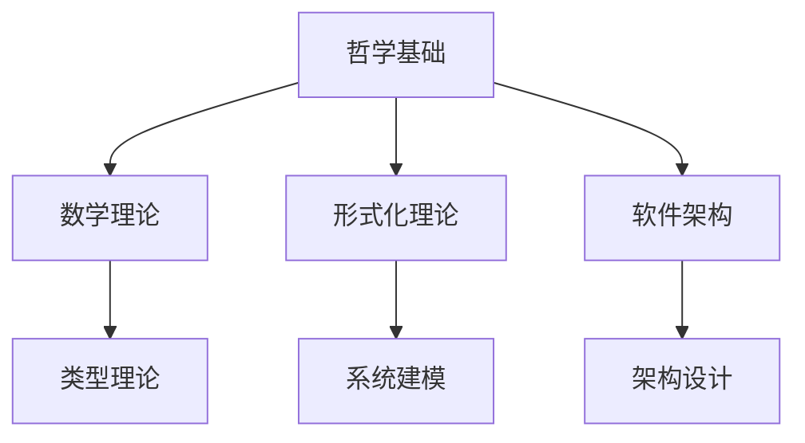

# 01-哲学基础理论

## 目录导航

### 01-本体论

- [01-数学本体论](./01-本体论/01-数学本体论.md)
- [02-现实本体论](./01-本体论/02-现实本体论.md)
- [03-信息本体论](./01-本体论/03-信息本体论.md)
- [04-AI本体论](./01-本体论/04-AI本体论.md)

### 02-认识论

- [01-知识论](./02-认识论/01-知识论.md)
- [02-真理理论](./02-认识论/02-真理理论.md)
- [03-理性主义与经验主义](./02-认识论/03-理性主义与经验主义.md)
- [04-基础主义与反基础主义](./02-认识论/04-基础主义与反基础主义.md)

### 03-伦理学

- [01-规范伦理学](./03-伦理学/01-规范伦理学.md)
- [02-元伦理学](./03-伦理学/02-元伦理学.md)
- [03-应用伦理学](./03-伦理学/03-应用伦理学.md)
- [04-形式化伦理学](./03-伦理学/04-形式化伦理学.md)

### 04-逻辑学

- [01-形式逻辑](./04-逻辑学/01-形式逻辑.md)
- [02-哲学逻辑](./04-逻辑学/02-哲学逻辑.md)
- [03-非经典逻辑](./04-逻辑学/03-非经典逻辑.md)
- [04-逻辑哲学](./04-逻辑学/04-逻辑哲学.md)

## 理论框架

### 哲学基础在形式化架构中的作用

```latex
\text{哲学基础} = \begin{cases}
\text{本体论} & \text{提供存在性和实体性的理论基础} \\
\text{认识论} & \text{提供知识获取和真理判断的方法论} \\
\text{伦理学} & \text{提供价值判断和道德规范的基础} \\
\text{逻辑学} & \text{提供推理和论证的形式化工具}
\end{cases}
```

### 与形式化理论的关联



## 核心概念

### 1. 本体论概念

- **存在性**: 数学对象、软件实体、信息对象的存在性
- **实体性**: 系统组件、数据结构、抽象概念的实体性
- **关系性**: 对象间的关系、依赖关系、交互关系

### 2. 认识论概念

- **知识表示**: 形式化知识、符号化表示、语义理解
- **真理判断**: 逻辑真值、语义真值、实用真值
- **确证方法**: 证明、验证、测试、推理

### 3. 伦理学概念

- **价值对齐**: 系统价值、用户价值、社会价值
- **责任分配**: 开发者责任、系统责任、用户责任
- **公平性**: 算法公平、系统公平、结果公平

### 4. 逻辑学概念

- **推理规则**: 演绎推理、归纳推理、溯因推理
- **论证结构**: 前提、结论、推理链
- **逻辑系统**: 经典逻辑、直觉逻辑、模态逻辑

## 应用领域

### 1. 软件工程

- **需求分析**: 基于本体论的需求理解
- **系统设计**: 基于认识论的设计方法
- **质量保证**: 基于伦理学的质量标准
- **形式验证**: 基于逻辑学的验证方法

### 2. 人工智能

- **知识表示**: 本体论的知识建模
- **推理系统**: 逻辑学的推理机制
- **伦理AI**: 伦理学的价值对齐
- **认知建模**: 认识论的认知过程

### 3. 系统科学

- **系统建模**: 本体论的系统结构
- **系统分析**: 认识论的分析方法
- **系统评价**: 伦理学的评价标准
- **系统验证**: 逻辑学的验证方法

## 理论发展

### 1. 传统哲学

- **古希腊哲学**: 柏拉图、亚里士多德的本体论
- **近代哲学**: 笛卡尔、康德的认识论
- **现代哲学**: 分析哲学、现象学的发展

### 2. 现代发展

- **计算哲学**: 计算思维对哲学的影响
- **信息哲学**: 信息时代的新哲学问题
- **技术哲学**: 技术发展带来的哲学挑战

### 3. 未来趋势

- **AI哲学**: 人工智能的哲学问题
- **量子哲学**: 量子计算的哲学意义
- **网络哲学**: 网络社会的哲学思考

## 研究方法

### 1. 分析方法

- **概念分析**: 澄清概念含义和用法
- **逻辑分析**: 分析论证结构和有效性
- **语义分析**: 分析语言和符号的语义

### 2. 综合方法

- **理论综合**: 整合不同理论观点
- **跨学科综合**: 结合多学科知识
- **实践综合**: 理论与实践相结合

### 3. 批判方法

- **逻辑批判**: 批判论证的逻辑性
- **概念批判**: 批判概念的使用
- **价值批判**: 批判价值判断

## 学习路径

### 1. 基础阶段

1. **哲学史**: 了解哲学发展的历史脉络
2. **基本概念**: 掌握哲学的基本概念和方法
3. **经典著作**: 阅读哲学经典著作

### 2. 专业阶段

1. **专业领域**: 深入特定哲学领域
2. **现代发展**: 了解哲学的最新发展
3. **应用研究**: 研究哲学在实际中的应用

### 3. 创新阶段

1. **理论创新**: 提出新的理论观点
2. **方法创新**: 发展新的研究方法
3. **应用创新**: 开拓新的应用领域

## 参考文献

1. Plato. (380 BCE). The Republic.
2. Aristotle. (350 BCE). Metaphysics.
3. Descartes, R. (1641). Meditations on First Philosophy.
4. Kant, I. (1781). Critique of Pure Reason.
5. Russell, B. (1912). The Problems of Philosophy.
6. Wittgenstein, L. (1921). Tractatus Logico-Philosophicus.
7. Quine, W. V. O. (1951). Two Dogmas of Empiricism.
8. Putnam, H. (1975). The Meaning of 'Meaning'.
9. Searle, J. R. (1980). Minds, Brains, and Programs.
10. Dennett, D. C. (1991). Consciousness Explained.
