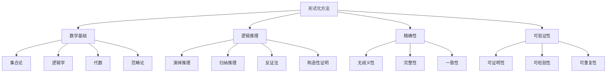

# 形式化方法基础

## 1. 概述

形式化方法是计算机科学中用于系统设计和验证的数学技术，通过严格的数学语言和逻辑推理来确保系统的正确性、安全性和可靠性。

### 1.1 定义与特征

**形式化方法**是一套基于数学逻辑的系统化方法，用于：

- **系统规范**：精确描述系统行为和属性
- **系统验证**：证明系统满足其规范
- **系统分析**：分析系统的结构和性质
- **系统实现**：从规范推导出实现

### 1.2 核心特征



## 2. 数学基础

### 2.1 集合论基础

集合论为形式化方法提供了基础的语言和工具。

#### 2.1.1 基本概念

**定义 2.1.1** (集合)
集合是不同对象的无序聚集，记作 $A = \{a_1, a_2, \ldots, a_n\}$。

**定义 2.1.2** (集合运算)
- **并集**：$A \cup B = \{x \mid x \in A \text{ 或 } x \in B\}$
- **交集**：$A \cap B = \{x \mid x \in A \text{ 且 } x \in B\}$
- **差集**：$A \setminus B = \{x \mid x \in A \text{ 且 } x \notin B\}$
- **补集**：$A^c = \{x \mid x \notin A\}$

#### 2.1.2 关系与函数

**定义 2.1.3** (二元关系)
集合 $A$ 和 $B$ 之间的二元关系是 $A \times B$ 的子集。

**定义 2.1.4** (函数)
函数 $f: A \to B$ 是一个满足以下条件的二元关系：
- **单值性**：$\forall x \in A, \exists! y \in B, (x,y) \in f$
- **定义域**：$\text{dom}(f) = A$
- **值域**：$\text{ran}(f) \subseteq B$

### 2.2 逻辑基础

#### 2.2.1 命题逻辑

**定义 2.2.1** (命题)
命题是一个具有确定真值的陈述句。

**定义 2.2.2** (逻辑连接词)
- **否定**：$\neg p$ (非 $p$)
- **合取**：$p \land q$ ($p$ 且 $q$)
- **析取**：$p \lor q$ ($p$ 或 $q$)
- **蕴含**：$p \to q$ (如果 $p$ 则 $q$)
- **等价**：$p \leftrightarrow q$ ($p$ 当且仅当 $q$)

#### 2.2.2 谓词逻辑

**定义 2.2.3** (谓词)
谓词是描述对象性质的函数 $P(x_1, x_2, \ldots, x_n)$。

**定义 2.2.4** (量词)
- **全称量词**：$\forall x P(x)$ (对所有 $x$，$P(x)$ 成立)
- **存在量词**：$\exists x P(x)$ (存在 $x$，使得 $P(x)$ 成立)

### 2.3 代数结构

#### 2.3.1 群论基础

**定义 2.3.1** (群)
群是一个集合 $G$ 和二元运算 $\cdot$ 的代数结构 $(G, \cdot)$，满足：
- **封闭性**：$\forall a, b \in G, a \cdot b \in G$
- **结合律**：$\forall a, b, c \in G, (a \cdot b) \cdot c = a \cdot (b \cdot c)$
- **单位元**：$\exists e \in G, \forall a \in G, e \cdot a = a \cdot e = a$
- **逆元**：$\forall a \in G, \exists a^{-1} \in G, a \cdot a^{-1} = a^{-1} \cdot a = e$

#### 2.3.2 格论基础

**定义 2.3.2** (格)
格是一个偏序集 $(L, \leq)$，其中任意两个元素都有最小上界和最大下界。

## 3. 形式化规范

### 3.1 规范语言

#### 3.1.1 Z语言

Z语言是一种基于集合论和谓词逻辑的形式化规范语言。

**示例 3.1.1** (简单系统规范)
```z
[State]
x: ℕ

Init
x = 0

Op
Δ(x)
x' = x + 1
```

#### 3.1.2 VDM语言

VDM (Vienna Development Method) 是一种形式化开发方法。

**示例 3.1.2** (VDM规范)
```vdm
types
  Stack = seq of nat;

functions
  isEmpty: Stack -> bool
  isEmpty(s) == len s = 0;

operations
  Push: Stack * nat -> Stack
  Push(s, n) == [n] ^ s;
```

### 3.2 状态机模型

#### 3.2.1 有限状态机

**定义 3.2.1** (有限状态机)
有限状态机是一个五元组 $M = (Q, \Sigma, \delta, q_0, F)$，其中：
- $Q$ 是有限状态集
- $\Sigma$ 是有限输入字母表
- $\delta: Q \times \Sigma \to Q$ 是转移函数
- $q_0 \in Q$ 是初始状态
- $F \subseteq Q$ 是接受状态集

#### 3.2.2 标记转移系统

**定义 3.2.2** (标记转移系统)
标记转移系统是一个四元组 $LTS = (S, Act, \to, s_0)$，其中：
- $S$ 是状态集
- $Act$ 是动作集
- $\to \subseteq S \times Act \times S$ 是转移关系
- $s_0 \in S$ 是初始状态

## 4. 形式化验证

### 4.1 模型检测

模型检测是一种自动化的验证技术，用于检查系统是否满足给定的性质。

#### 4.1.1 线性时态逻辑 (LTL)

**定义 4.1.1** (LTL语法)
LTL公式的语法定义为：
$$\phi ::= p \mid \neg \phi \mid \phi \land \psi \mid \phi \lor \psi \mid \phi \to \psi \mid X\phi \mid F\phi \mid G\phi \mid \phi U\psi$$

其中：
- $X\phi$：下一个时刻 $\phi$ 成立
- $F\phi$：将来某个时刻 $\phi$ 成立
- $G\phi$：所有时刻 $\phi$ 都成立
- $\phi U\psi$：$\phi$ 成立直到 $\psi$ 成立

#### 4.1.2 计算树逻辑 (CTL)

**定义 4.1.2** (CTL语法)
CTL公式的语法定义为：
$$\phi ::= p \mid \neg \phi \mid \phi \land \psi \mid \phi \lor \psi \mid \phi \to \psi \mid AX\phi \mid EX\phi \mid AF\phi \mid EF\phi \mid AG\phi \mid EG\phi \mid A[\phi U\psi] \mid E[\phi U\psi]$$

### 4.2 定理证明

#### 4.2.1 自然演绎

自然演绎是一种形式化的证明系统。

**规则 4.2.1** (蕴含引入)
$$\frac{\Gamma, A \vdash B}{\Gamma \vdash A \to B}$$

**规则 4.2.2** (蕴含消除)
$$\frac{\Gamma \vdash A \to B \quad \Gamma \vdash A}{\Gamma \vdash B}$$

#### 4.2.2 序列演算

序列演算是一种证明系统，使用序列 $\Gamma \vdash \Delta$ 表示。

**公理 4.2.1** (初始序列)
$$A, \Gamma \vdash \Delta, A$$

**规则 4.2.3** (左蕴含)
$$\frac{\Gamma \vdash \Delta, A \quad B, \Gamma \vdash \Delta}{A \to B, \Gamma \vdash \Delta}$$

## 5. 形式化开发方法

### 5.1 精化方法

精化是一种从抽象规范逐步推导出具体实现的方法。

#### 5.1.1 数据精化

**定义 5.1.1** (数据精化)
给定抽象数据类型 $A$ 和具体数据类型 $C$，数据精化关系 $R: A \leftrightarrow C$ 满足：
$$\forall a \in A, \exists c \in C, R(a, c)$$

#### 5.1.2 操作精化

**定义 5.1.2** (操作精化)
操作 $Op_A$ 被操作 $Op_C$ 精化，如果：
$$\forall a, a' \in A, c, c' \in C, R(a, c) \land Op_C(c, c') \to \exists a', R(a', c') \land Op_A(a, a')$$

### 5.2 形式化开发工具

#### 5.2.1 证明助手

- **Coq**：基于构造性类型论的证明助手
- **Isabelle/HOL**：高阶逻辑证明助手
- **PVS**：原型验证系统

#### 5.2.2 模型检测器

- **SPIN**：用于并发系统验证
- **NuSMV**：符号模型检测器
- **UPPAAL**：实时系统验证工具

## 6. 应用领域

### 6.1 软件工程

#### 6.1.1 软件规范

形式化方法用于：
- **需求分析**：精确描述软件需求
- **系统设计**：形式化系统架构
- **接口规范**：定义组件接口

#### 6.1.2 软件验证

- **正确性验证**：证明程序满足规范
- **安全性验证**：确保系统安全属性
- **性能验证**：验证性能要求

### 6.2 硬件设计

#### 6.2.1 数字电路验证

- **功能验证**：验证电路功能正确性
- **时序验证**：验证时序约束
- **功耗验证**：验证功耗要求

#### 6.2.2 协议验证

- **通信协议**：验证协议正确性
- **安全协议**：验证安全属性
- **实时协议**：验证实时约束

### 6.3 人工智能

#### 6.3.1 机器学习系统

- **算法验证**：验证机器学习算法
- **模型验证**：验证模型正确性
- **公平性验证**：验证公平性属性

#### 6.3.2 自主系统

- **行为验证**：验证自主系统行为
- **安全验证**：确保系统安全
- **伦理验证**：验证伦理约束

## 7. 挑战与展望

### 7.1 当前挑战

#### 7.1.1 技术挑战

- **复杂性**：系统规模增大导致验证困难
- **抽象**：合适的抽象层次选择
- **工具**：工具链的完整性和易用性

#### 7.1.2 应用挑战

- **成本**：形式化方法的成本效益
- **技能**：专业人才的缺乏
- **集成**：与现有开发流程的集成

### 7.2 发展趋势

#### 7.2.1 技术发展

- **自动化**：提高验证自动化程度
- **可扩展性**：支持更大规模系统
- **易用性**：降低使用门槛

#### 7.2.2 应用扩展

- **新兴领域**：量子计算、区块链等
- **跨学科**：与其他学科的结合
- **标准化**：行业标准的制定

## 8. 总结

形式化方法为系统设计和验证提供了强有力的数学工具。通过严格的数学语言和逻辑推理，形式化方法能够：

1. **提高系统质量**：通过形式化验证确保系统正确性
2. **降低开发风险**：早期发现和修复问题
3. **支持系统演化**：提供精确的变更影响分析
4. **促进知识积累**：形式化知识便于传播和复用

随着技术的不断发展，形式化方法将在更多领域发挥重要作用，为构建可靠、安全、高效的系统提供坚实的理论基础。

---

*本文档为形式化方法的基础理论提供了系统性的介绍，为后续的形式化分析和应用奠定了理论基础。* 