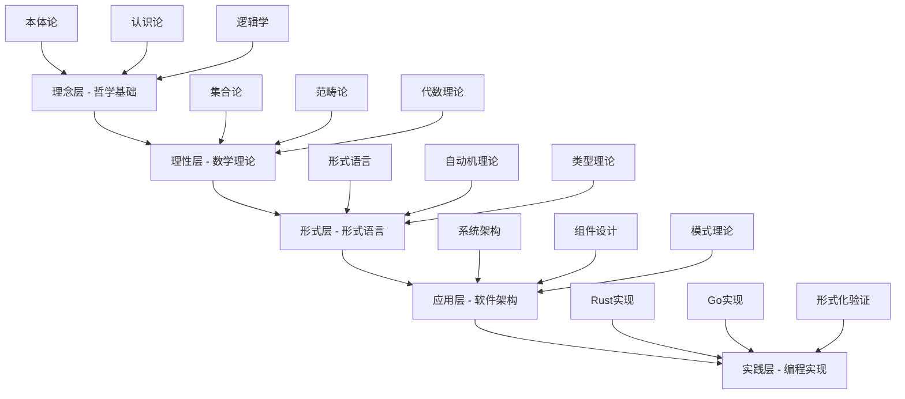
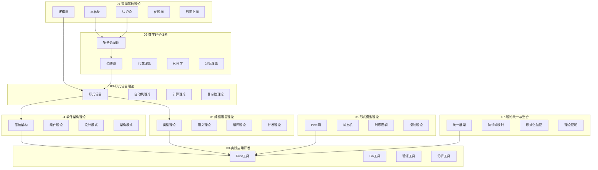
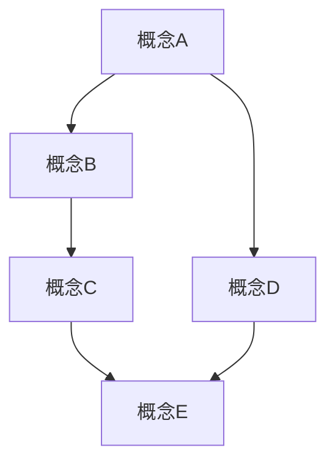
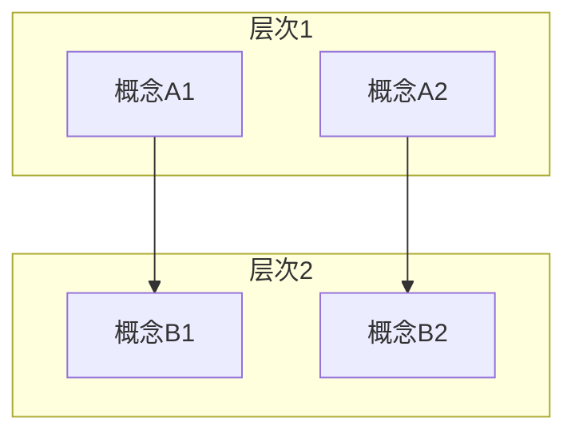

# 形式化架构理论总体分析框架 v35

## 目录

1. [项目概述](#1-项目概述)
2. [理论体系架构](#2-理论体系架构)
3. [核心概念定义](#3-核心概念定义)
4. [形式化规范](#4-形式化规范)
5. [多表征体系](#5-多表征体系)
6. [实践应用框架](#6-实践应用框架)
7. [持续发展机制](#7-持续发展机制)

## 1. 项目概述

### 1.1 项目目标

本项目旨在构建一个完整的**形式化架构理论体系**，将哲学、数学、计算机科学、软件工程等领域的知识进行深度整合，形成统一的理论框架。

### 1.2 核心特征

- **形式化程度高**：使用严格的数学符号和逻辑推理
- **跨学科整合**：哲学、数学、计算机科学的深度融合
- **实践导向**：理论指导实际软件架构设计
- **持续演进**：建立可中断继续的工作机制

### 1.3 理论层次



## 2. 理论体系架构

### 2.1 总体架构



### 2.2 理论依赖关系

| 理论领域 | 依赖基础 | 支撑应用 | 核心贡献 |
|----------|----------|----------|----------|
| **哲学基础** | 无 | 数学理论、形式语言 | 概念定义、方法论 |
| **数学理论** | 哲学基础 | 形式语言、软件架构 | 形式化工具、证明方法 |
| **形式语言** | 数学理论 | 软件架构、编程语言 | 计算模型、语言设计 |
| **软件架构** | 形式语言 | 实践应用 | 系统设计、架构模式 |
| **编程语言** | 形式语言 | 实践应用 | 语言实现、类型系统 |
| **形式模型** | 数学理论 | 软件架构、实践应用 | 建模方法、验证技术 |
| **理论统一** | 所有理论 | 实践应用 | 统一框架、跨领域整合 |
| **实践应用** | 所有理论 | 无 | 工具实现、理论验证 |

## 3. 核心概念定义

### 3.1 形式化定义规范

#### 3.1.1 定义格式

```latex
\begin{definition}[概念名称]
设 $X$ 为集合，$R$ 为 $X$ 上的关系，则：
\begin{enumerate}
\item 性质1：$\forall x \in X, P(x)$
\item 性质2：$\exists y \in X, Q(y)$
\end{enumerate}
\end{definition}
```

#### 3.1.2 定理格式

```latex
\begin{theorem}[定理名称]
对于任意 $x \in X$，如果 $P(x)$ 成立，则 $Q(x)$ 也成立。
\end{theorem}

\begin{proof}
证明过程：
\begin{enumerate}
\item 步骤1：...
\item 步骤2：...
\item 结论：...
\end{enumerate}
\end{proof}
```

### 3.2 核心概念体系

#### 3.2.1 哲学基础概念

- **本体论**：研究存在的基本性质和结构
- **认识论**：研究知识的本质、来源和限度
- **逻辑学**：研究推理的有效性和形式
- **伦理学**：研究道德价值和规范
- **形而上学**：研究实在的终极本质

#### 3.2.2 数学基础概念

- **集合论**：现代数学的基础语言
- **范畴论**：数学结构的统一理论
- **代数理论**：代数结构的性质
- **拓扑学**：几何性质的抽象研究
- **分析理论**：连续性和极限的研究

#### 3.2.3 形式语言概念

- **形式语言**：符号系统的形式化定义
- **自动机**：计算的形式化模型
- **计算理论**：计算能力和复杂性的研究
- **类型理论**：程序正确性的形式化方法

#### 3.2.4 软件架构概念

- **系统架构**：软件系统的整体结构
- **组件理论**：可重用组件的设计原理
- **设计模式**：常见设计问题的解决方案
- **架构模式**：系统级的设计模式

## 4. 形式化规范

### 4.1 数学符号规范

#### 4.1.1 基础符号

```latex
% 集合论符号
\emptyset, \in, \notin, \subset, \subseteq, \supset, \supseteq
\cup, \cap, \setminus, \times, \mathcal{P}

% 逻辑符号
\forall, \exists, \neg, \land, \lor, \rightarrow, \leftrightarrow
\models, \vdash, \equiv

% 函数符号
f: X \rightarrow Y, \text{dom}(f), \text{cod}(f)
f \circ g, f^{-1}, \text{id}_X

% 关系符号
R \subseteq X \times Y, xRy, R^{-1}
\text{reflexive}, \text{symmetric}, \text{transitive}
```

#### 4.1.2 高级符号

```latex
% 范畴论符号
\mathbf{C}, \text{Ob}(\mathbf{C}), \text{Mor}(\mathbf{C})
F: \mathbf{C} \rightarrow \mathbf{D}, \alpha: F \Rightarrow G
\lim, \colim, \prod, \coprod

% 类型论符号
\Gamma \vdash t: A, \lambda x: A. t, \Pi x: A. B
\Sigma x: A. B, \text{Unit}, \text{Void}

% 时序逻辑符号
\Box \phi, \Diamond \phi, \mathcal{U}, \mathcal{R}
\text{next}, \text{until}, \text{release}
```

### 4.2 证明规范

#### 4.2.1 证明结构

```latex
\begin{proof}
\textbf{证明：}
\begin{enumerate}
\item \textbf{假设：} 给定条件
\item \textbf{目标：} 要证明的结论
\item \textbf{策略：} 证明方法的选择
\item \textbf{步骤：} 详细的证明过程
\item \textbf{结论：} 证明完成
\end{enumerate}
\end{proof}
```

#### 4.2.2 证明方法

1. **直接证明**：从前提直接推导结论
2. **反证法**：假设结论不成立，导出矛盾
3. **归纳法**：数学归纳或结构归纳
4. **构造法**：构造满足条件的对象
5. **对偶法**：利用对偶性质

## 5. 多表征体系

### 5.1 图表表征

#### 5.1.1 Mermaid图表



#### 5.1.2 层次结构图



### 5.2 表格表征

#### 5.2.1 概念对比表

| 概念 | 定义 | 性质 | 应用 |
|------|------|------|------|
| 概念A | 定义A | 性质A | 应用A |
| 概念B | 定义B | 性质B | 应用B |

#### 5.2.2 理论关系表

| 理论A | 理论B | 关系类型 | 映射方式 |
|-------|-------|----------|----------|
| 理论A1 | 理论B1 | 包含 | 子集映射 |
| 理论A2 | 理论B2 | 等价 | 同构映射 |

### 5.3 代码表征

#### 5.3.1 Rust代码示例

```rust
// 形式化概念的类型定义
#[derive(Debug, Clone, PartialEq)]
pub struct FormalConcept<T> {
    pub objects: Set<T>,
    pub attributes: Set<String>,
    pub extent: Set<T>,
    pub intent: Set<String>,
}

impl<T> FormalConcept<T> {
    pub fn new(objects: Set<T>, attributes: Set<String>) -> Self {
        Self {
            objects,
            attributes,
            extent: Set::new(),
            intent: Set::new(),
        }
    }
    
    pub fn is_valid(&self) -> bool {
        // 形式化验证逻辑
        self.extent.is_subset(&self.objects) && 
        self.intent.is_subset(&self.attributes)
    }
}
```

#### 5.3.2 Go代码示例

```go
// 形式化系统的接口定义
type FormalSystem interface {
    Axioms() []Axiom
    Rules() []Rule
    Prove(statement Statement) (Proof, error)
    IsConsistent() bool
}

type Axiom struct {
    ID       string
    Content  string
    Metadata map[string]interface{}
}

type Rule struct {
    Name     string
    Premises []Statement
    Conclusion Statement
    Condition func([]Statement) bool
}
```

## 6. 实践应用框架

### 6.1 工具开发计划

#### 6.1.1 Rust工具集

1. **形式化验证工具**
   - 定理证明器
   - 模型检查器
   - 类型检查器

2. **架构分析工具**
   - 依赖分析器
   - 复杂度分析器
   - 性能分析器

3. **代码生成工具**
   - 模板生成器
   - 测试生成器
   - 文档生成器

#### 6.1.2 Go工具集

1. **系统建模工具**
   - 状态机建模
   - 工作流建模
   - 数据流建模

2. **验证工具**
   - 协议验证
   - 并发验证
   - 安全验证

### 6.2 应用场景

#### 6.2.1 软件架构设计

- **系统设计**：基于形式化理论的系统设计
- **组件设计**：可重用组件的形式化设计
- **接口设计**：类型安全的接口设计

#### 6.2.2 代码质量保证

- **静态分析**：基于形式化理论的静态分析
- **动态验证**：运行时行为验证
- **测试生成**：基于理论的测试用例生成

#### 6.2.3 系统验证

- **正确性验证**：系统行为的正确性证明
- **安全性验证**：安全属性的形式化验证
- **性能验证**：性能属性的形式化分析

## 7. 持续发展机制

### 7.1 工作流程

#### 7.1.1 分析阶段

1. **内容分析**：深度分析Matter目录内容
2. **概念提取**：提取核心概念和定义
3. **关系映射**：建立理论间的关系
4. **形式化转换**：转换为形式化表示

#### 7.1.2 重构阶段

1. **结构设计**：设计新的文档结构
2. **内容重构**：按照规范重构内容
3. **验证检查**：检查内容的一致性
4. **优化完善**：优化和完善内容

#### 7.1.3 实现阶段

1. **工具设计**：设计实践工具
2. **代码实现**：实现工具功能
3. **测试验证**：测试工具的正确性
4. **文档完善**：完善使用文档

### 7.2 质量控制

#### 7.2.1 内容质量

- **一致性检查**：确保概念定义的一致性
- **完整性检查**：确保理论体系的完整性
- **正确性检查**：确保证明的正确性

#### 7.2.2 形式质量

- **格式规范**：确保文档格式的规范性
- **结构清晰**：确保目录结构的清晰性
- **链接有效**：确保内部链接的有效性

### 7.3 持续改进

#### 7.3.1 反馈机制

- **用户反馈**：收集用户的使用反馈
- **专家评审**：邀请专家进行评审
- **同行评议**：进行同行评议

#### 7.3.2 更新机制

- **定期更新**：定期更新内容
- **版本控制**：严格的版本控制
- **变更记录**：详细的变更记录

---

**文档版本**：v35  
**创建时间**：2024-12-19  
**最后更新**：2024-12-19  
**状态**：进行中
