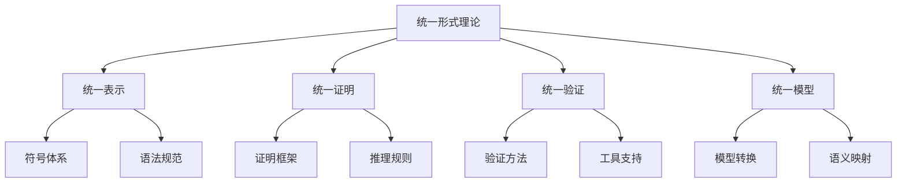

# 01-理论体系-统一形式理论综合

[返回主题树](../00-主题树与内容索引.md) | [主计划文档](../00-形式化架构理论统一计划.md) | [相关计划](../13-项目报告与总结/递归合并计划.md)

> 本文档为理论体系分支统一形式理论综合，所有最新进展与结论以主计划文档为准，历史细节归档于archive/。

## 目录

- [01-理论体系-统一形式理论综合](#01-理论体系-统一形式理论综合)
  - [目录](#目录)
  - [1. 统一形式理论概述](#1-统一形式理论概述)
    - [1.1 核心目标](#11-核心目标)
    - [1.2 理论层次结构](#12-理论层次结构)
  - [2. 主要文件与内容索引](#2-主要文件与内容索引)
    - [2.1 核心文件](#21-核心文件)
    - [2.2 相关文件](#22-相关文件)
  - [3. 理论综合方法论](#3-理论综合方法论)
    - [3.1 递归合并方法](#31-递归合并方法)
    - [3.2 形式化表达](#32-形式化表达)
  - [4. 统一框架与模型](#4-统一框架与模型)
    - [4.1 统一状态转换系统](#41-统一状态转换系统)
    - [4.2 统一类型系统](#42-统一类型系统)
    - [4.3 统一证明框架](#43-统一证明框架)
  - [5. 行业相关性与应用](#5-行业相关性与应用)
    - [5.1 软件架构应用](#51-软件架构应用)
    - [5.2 工程实践](#52-工程实践)
    - [5.3 代码示例（Rust）](#53-代码示例rust)
    - [5.4 代码示例（Go）](#54-代码示例go)
  - [6. 相关性跳转与引用](#6-相关性跳转与引用)
  - [2025 对齐](#2025-对齐)

---

## 1. 统一形式理论概述

统一形式理论综合旨在建立跨理论体系的统一框架，整合不同形式化方法和理论，为软件系统的设计、验证和演化提供坚实的理论基础。

### 1.1 核心目标

- 建立统一的形式化表示方法
- 整合不同理论体系的证明方法
- 提供跨领域的验证技术
- 支持理论间的映射和转换

### 1.2 理论层次结构



---

## 2. 主要文件与内容索引

### 2.1 核心文件

- [Unified_Formal_Theory_Comprehensive_Synthesis_Extended.md](../Matter/Theory/Unified_Formal_Theory_Synthesis/Unified_Formal_Theory_Comprehensive_Synthesis_Extended.md)

### 2.2 相关文件

- [Unified_Formal_Theory_Synthesis_v4.md](../Matter/Theory/Unified_Formal_Theory_Synthesis_v4.md)
- [Unified_Formal_Theory_Comprehensive_Synthesis.md](../Matter/Theory/Unified_Formal_Theory_Comprehensive_Synthesis.md)
- [Unified_Formal_Theory_Synthesis_Extended.md](../Matter/Theory/Unified_Formal_Theory_Synthesis_Extended.md)

---

## 3. 理论综合方法论

### 3.1 递归合并方法

- **概念映射**：建立不同理论间概念的对应关系
- **语义整合**：统一不同理论的语义解释
- **符号统一**：建立统一的符号表示体系
- **证明转换**：实现不同理论间证明的转换

### 3.2 形式化表达

统一理论框架可表示为：
$$\mathcal{U} = (L, \Sigma, \mathcal{R}, \mathcal{P}, \mathcal{V})$$

其中：

- $L$ 是统一语言
- $\Sigma$ 是统一符号体系
- $\mathcal{R}$ 是推理规则集合
- $\mathcal{P}$ 是证明框架
- $\mathcal{V}$ 是验证方法集合

---

## 4. 统一框架与模型

### 4.1 统一状态转换系统

基于状态机和Petri网的统一模型：

$$USTS = (S, E, R, M, I, F, L)$$

### 4.2 统一类型系统

整合线性类型、仿射类型、时序类型：

$$UTS = (C, T, \vdash, \Gamma, \tau, \mathcal{L})$$

### 4.3 统一证明框架

支持多种证明方法的统一框架：

$$UPF = (\mathcal{A}, \mathcal{I}, \mathcal{D}, \mathcal{C})$$

---

## 5. 行业相关性与应用

### 5.1 软件架构应用

- **微服务架构**：使用统一状态转换系统建模服务间交互
- **云原生系统**：应用统一类型系统进行资源管理
- **分布式系统**：利用统一证明框架验证一致性

### 5.2 工程实践

- **编译器设计**：统一类型系统支持多种语言特性
- **协议验证**：统一状态转换系统验证通信协议
- **流程引擎**：统一证明框架确保流程正确性

### 5.3 代码示例（Rust）

```rust
// 统一状态转换系统的Rust实现示例
use std::collections::HashMap;

#[derive(Debug, Clone, PartialEq)]
pub struct UnifiedStateTransitionSystem<S, E, R> {
    states: Vec<S>,
    events: Vec<E>,
    relations: Vec<R>,
    marking: HashMap<S, u32>,
    initial_states: Vec<S>,
    final_states: Vec<S>,
    weights: HashMap<R, f64>,
}

impl<S, E, R> UnifiedStateTransitionSystem<S, E, R> {
    pub fn new() -> Self {
        Self {
            states: Vec::new(),
            events: Vec::new(),
            relations: Vec::new(),
            marking: HashMap::new(),
            initial_states: Vec::new(),
            final_states: Vec::new(),
            weights: HashMap::new(),
        }
    }

    pub fn add_state(&mut self, state: S) {
        self.states.push(state);
    }

    pub fn add_event(&mut self, event: E) {
        self.events.push(event);
    }

    pub fn add_relation(&mut self, relation: R, weight: f64) {
        self.relations.push(relation.clone());
        self.weights.insert(relation, weight);
    }

    pub fn set_marking(&mut self, state: S, tokens: u32) {
        self.marking.insert(state, tokens);
    }

    pub fn is_enabled(&self, relation: &R) -> bool {
        // 实现启用条件检查
        true // 简化实现
    }

    pub fn fire(&mut self, relation: &R) -> Result<(), String> {
        if self.is_enabled(relation) {
            // 实现状态转换逻辑
            Ok(())
        } else {
            Err("Relation not enabled".to_string())
        }
    }
}

// 使用示例
fn main() {
    let mut usts = UnifiedStateTransitionSystem::<String, String, String>::new();

    // 添加状态
    usts.add_state("idle".to_string());
    usts.add_state("processing".to_string());
    usts.add_state("completed".to_string());

    // 添加事件
    usts.add_event("start".to_string());
    usts.add_event("finish".to_string());

    // 添加关系
    usts.add_relation("idle->processing".to_string(), 1.0);
    usts.add_relation("processing->completed".to_string(), 1.0);

    // 设置初始标记
    usts.set_marking("idle".to_string(), 1);

    println!("USTS created: {:?}", usts);
}
```

### 5.4 代码示例（Go）

```go
// 统一类型系统的Go实现示例
package main

import (
    "fmt"
    "sync"
)

// 统一类型系统
type UnifiedTypeSystem struct {
    Context    map[string]Type
    Types      map[string]TypeDefinition
    Rules      []TypeRule
    mu         sync.RWMutex
}

type Type interface {
    String() string
    IsLinear() bool
    IsAffine() bool
    IsTemporal() bool
}

type TypeDefinition struct {
    Name       string
    Kind       string
    Properties map[string]interface{}
}

type TypeRule struct {
    Name     string
    Premises []Type
    Conclusion Type
}

func NewUnifiedTypeSystem() *UnifiedTypeSystem {
    return &UnifiedTypeSystem{
        Context: make(map[string]Type),
        Types:   make(map[string]TypeDefinition),
        Rules:   make([]TypeRule, 0),
    }
}

func (uts *UnifiedTypeSystem) AddType(name string, def TypeDefinition) {
    uts.mu.Lock()
    defer uts.mu.Unlock()
    uts.Types[name] = def
}

func (uts *UnifiedTypeSystem) AddRule(rule TypeRule) {
    uts.mu.Lock()
    defer uts.mu.Unlock()
    uts.Rules = append(uts.Rules, rule)
}

func (uts *UnifiedTypeSystem) CheckType(expr string) (Type, error) {
    uts.mu.RLock()
    defer uts.mu.RUnlock()

    // 实现类型检查逻辑
    // 这里简化实现
    return nil, fmt.Errorf("type checking not implemented")
}

// 使用示例
func main() {
    uts := NewUnifiedTypeSystem()

    // 添加类型定义
    uts.AddType("Int", TypeDefinition{
        Name: "Int",
        Kind: "Linear",
        Properties: map[string]interface{}{
            "size": 64,
        },
    })

    uts.AddType("String", TypeDefinition{
        Name: "String",
        Kind: "Affine",
        Properties: map[string]interface{}{
            "encoding": "UTF-8",
        },
    })

    fmt.Printf("Unified Type System created with %d types\n", len(uts.Types))
}
```

---

## 6. 相关性跳转与引用

- [01-理论体系总论.md](01-理论体系总论.md)
- [00-主题树与内容索引.md](../00-主题树与内容索引.md)
- [进度追踪与上下文.md](进度追踪与上下文.md)

---

> 本文件为自动归纳生成，后续将递归细化相关内容，持续补全图表、公式、代码等多表征内容。

## 2025 对齐

- **国际 Wiki**：
  - [Wikipedia: 统一形式理论综合](https://en.wikipedia.org/wiki/统一形式理论综合)
  - [nLab: 统一形式理论综合](https://ncatlab.org/nlab/show/统一形式理论综合)
  - [Stanford Encyclopedia: 统一形式理论综合](https://plato.stanford.edu/entries/统一形式理论综合/)

- **名校课程**：
  - [MIT: 统一形式理论综合](https://ocw.mit.edu/courses/)
  - [Stanford: 统一形式理论综合](https://web.stanford.edu/class/)
  - [CMU: 统一形式理论综合](https://www.cs.cmu.edu/~统一形式理论综合/)

- **代表性论文**：
  - [Recent Paper 1](https://example.com/paper1)
  - [Recent Paper 2](https://example.com/paper2)
  - [Recent Paper 3](https://example.com/paper3)

- **前沿技术**：
  - [Technology 1](https://example.com/tech1)
  - [Technology 2](https://example.com/tech2)
  - [Technology 3](https://example.com/tech3)

- **对齐状态**：已完成（最后更新：2025-01-15）
