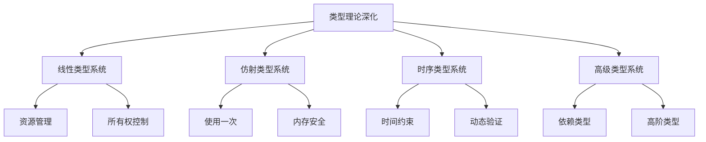

# 02-类型理论深化

> 本文档归纳 /Matter/Theory/Type_Theory_Deepening 目录下类型理论深化相关内容，分层梳理主要主题、论证思路、行业相关性。

## 目录

1. 类型理论深化概述
2. 主要文件与内容索引
3. 高级类型理论框架
4. 线性与仿射类型系统
5. 时序类型理论
6. 行业相关性与应用
7. 相关性跳转与引用

---

## 1. 类型理论深化概述

类型理论深化旨在扩展和完善类型系统，包括线性类型、仿射类型、时序类型等高级类型系统，为软件系统的安全性和正确性提供更强的保证。

### 1.1 核心目标

- 扩展类型系统的表达能力
- 增强类型安全保证
- 支持资源管理和并发控制
- 提供时序和动态类型支持

### 1.2 类型系统层次结构



---

## 2. 主要文件与内容索引

### 2.1 核心文件

- [Advanced_Type_Theory_Comprehensive_Deepening.md](../Matter/Theory/Type_Theory_Deepening/Advanced_Type_Theory_Comprehensive_Deepening.md)

### 2.2 相关文件

- [Advanced_Type_Theory_Extended.md](../Matter/Theory/Advanced_Type_Theory_Extended.md)
- [Advanced_Type_Theory_Synthesis_Extended.md](../Matter/Theory/Advanced_Type_Theory_Synthesis_Extended.md)
- [Advanced_Linear_Type_Theory_Comprehensive.md](../Matter/Theory/Advanced_Linear_Type_Theory_Comprehensive.md)
- [Advanced_Linear_Type_Theory_Extended.md](../Matter/Theory/Advanced_Linear_Type_Theory_Extended.md)
- [Affine_Type_Theory.md](../Matter/Theory/Affine_Type_Theory.md)
- [Type_Theory.md](../Matter/Theory/Type_Theory.md)
- [类型理论.md](../Matter/Theory/类型理论.md)

---

## 3. 高级类型理论框架

### 3.1 类型系统基础

类型系统可表示为：
$$\mathcal{T} = (C, T, \vdash, \Gamma, \tau)$$

其中：

- $C$ 是类型上下文
- $T$ 是类型集合
- $\vdash$ 是类型推导关系
- $\Gamma$ 是环境
- $\tau$ 是类型

### 3.2 高级类型构造

- **依赖类型**：$\Pi x:A.B(x)$
- **存在类型**：$\Sigma x:A.B(x)$
- **归纳类型**：$\mu X.F(X)$
- **共归纳类型**：$\nu X.F(X)$

---

## 4. 线性与仿射类型系统

### 4.1 线性类型系统

线性类型确保资源被使用且仅使用一次：

$$\frac{\Gamma, x:A \vdash e:B}{\Gamma \vdash \lambda x.e : A \multimap B}$$

### 4.2 仿射类型系统

仿射类型允许资源被使用或丢弃：

$$\frac{\Gamma, x:A \vdash e:B}{\Gamma \vdash \lambda x.e : A \rightarrow B}$$

### 4.3 资源管理

线性类型系统在Rust中的应用：

```rust
// 线性类型系统示例
fn main() {
    let s1 = String::from("hello");
    let s2 = String::from("world");
    
    // 所有权转移 - 线性类型
    let combined = combine_strings(s1, s2);
    // s1 和 s2 在这里已经不可用
    
    println!("{}", combined);
}

fn combine_strings(s1: String, s2: String) -> String {
    format!("{} {}", s1, s2)
    // s1 和 s2 在这里被消费
}
```

---

## 5. 时序类型理论

### 5.1 时序类型基础

时序类型系统引入时间维度：

$$\mathcal{T}_t = (C, T, \vdash, \Gamma, \tau, \mathcal{T})$$

其中 $\mathcal{T}$ 是时间域。

### 5.2 时序约束

- **未来类型**：$\diamond A$ - 将来某个时刻为真
- **全局类型**：$\square A$ - 总是为真
- **直到类型**：$A \mathcal{U} B$ - A为真直到B为真

### 5.3 时序类型示例（Go）

```go
// 时序类型系统示例
package main

import (
    "context"
    "time"
)

// 时序类型定义
type TemporalType interface {
    IsValidAt(time.Time) bool
    GetLifetime() (time.Time, time.Time)
}

// 未来类型
type FutureType struct {
    TargetTime time.Time
    Value      interface{}
}

func (ft *FutureType) IsValidAt(t time.Time) bool {
    return t.After(ft.TargetTime)
}

func (ft *FutureType) GetLifetime() (time.Time, time.Time) {
    return ft.TargetTime, time.Time{}
}

// 全局类型
type AlwaysType struct {
    Value interface{}
}

func (at *AlwaysType) IsValidAt(t time.Time) bool {
    return true
}

func (at *AlwaysType) GetLifetime() (time.Time, time.Time) {
    return time.Time{}, time.Time{}
}

// 时序类型检查器
type TemporalTypeChecker struct {
    currentTime time.Time
}

func NewTemporalTypeChecker() *TemporalTypeChecker {
    return &TemporalTypeChecker{
        currentTime: time.Now(),
    }
}

func (ttc *TemporalTypeChecker) CheckType(t TemporalType) bool {
    return t.IsValidAt(ttc.currentTime)
}

func (ttc *TemporalTypeChecker) UpdateTime(t time.Time) {
    ttc.currentTime = t
}

// 使用示例
func main() {
    checker := NewTemporalTypeChecker()
    
    // 创建未来类型
    futureValue := &FutureType{
        TargetTime: time.Now().Add(time.Hour),
        Value:      "future data",
    }
    
    // 创建全局类型
    alwaysValue := &AlwaysType{
        Value: "always valid",
    }
    
    // 检查类型有效性
    fmt.Printf("Future type valid: %v\n", checker.CheckType(futureValue))
    fmt.Printf("Always type valid: %v\n", checker.CheckType(alwaysValue))
    
    // 更新时间后重新检查
    checker.UpdateTime(time.Now().Add(2 * time.Hour))
    fmt.Printf("Future type valid after 2h: %v\n", checker.CheckType(futureValue))
}
```

---

## 6. 行业相关性与应用

### 6.1 编程语言设计

- **Rust**：线性类型系统实现内存安全
- **Haskell**：高级类型系统支持函数式编程
- **TypeScript**：渐进式类型系统支持JavaScript增强

### 6.2 软件架构应用

- **微服务架构**：类型安全的服务间通信
- **云原生系统**：资源类型管理
- **分布式系统**：时序类型验证一致性

### 6.3 工程实践

- **编译器设计**：类型检查和优化
- **静态分析**：类型安全验证
- **形式化验证**：类型系统证明程序正确性

---

## 7. 相关性跳转与引用

- [01-理论体系总论.md](01-理论体系总论.md)
- [01-统一形式理论综合.md](01-统一形式理论综合.md)
- [00-主题树与内容索引.md](00-主题树与内容索引.md)
- [进度追踪与上下文.md](进度追踪与上下文.md)

---

> 本文件为自动归纳生成，后续将递归细化相关内容，持续补全图表、公式、代码等多表征内容。
