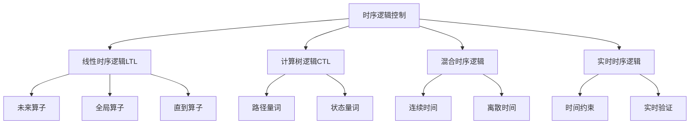

# 01-理论体系-时序逻辑控制深化

[返回主题树](../00-主题树与内容索引.md) | [主计划文档](../00-形式化架构理论统一计划.md) | [相关计划](../13-项目报告与总结/递归合并计划.md)

> 本文档为理论体系分支时序逻辑控制深化，所有最新进展与结论以主计划文档为准，历史细节归档于archive/。

## 目录

- [01-理论体系-时序逻辑控制深化](#01-理论体系-时序逻辑控制深化)
  - [目录](#目录)
  - [1. 时序逻辑控制概述](#1-时序逻辑控制概述)
    - [1.1 核心目标](#11-核心目标)
    - [1.2 时序逻辑控制层次结构](#12-时序逻辑控制层次结构)
  - [2. 主要文件与内容索引](#2-主要文件与内容索引)
    - [2.1 核心文件](#21-核心文件)
    - [2.2 相关文件](#22-相关文件)
  - [3. 时序逻辑基础理论](#3-时序逻辑基础理论)
    - [3.1 线性时序逻辑（LTL）](#31-线性时序逻辑ltl)
    - [3.2 计算树逻辑（CTL）](#32-计算树逻辑ctl)
    - [3.3 实时时序逻辑](#33-实时时序逻辑)
  - [4. 控制理论与时序逻辑结合](#4-控制理论与时序逻辑结合)
    - [4.1 控制系统建模](#41-控制系统建模)
    - [4.2 时序逻辑规范](#42-时序逻辑规范)
    - [4.3 控制律设计](#43-控制律设计)
  - [5. 高级时序逻辑系统](#5-高级时序逻辑系统)
    - [5.1 混合时序逻辑](#51-混合时序逻辑)
    - [5.2 实时验证](#52-实时验证)
  - [6. 行业相关性与应用](#6-行业相关性与应用)
    - [6.1 实时系统](#61-实时系统)
    - [6.2 软件架构应用](#62-软件架构应用)
    - [6.3 工程实践](#63-工程实践)
  - [7. 相关性跳转与引用](#7-相关性跳转与引用)

---

## 1. 时序逻辑控制概述

时序逻辑控制深化旨在将时序逻辑与控制理论相结合，为实时系统、嵌入式系统、分布式系统等提供形式化的建模和验证方法。

### 1.1 核心目标

- 建立时序逻辑与控制理论的统一框架
- 提供实时系统的形式化建模方法
- 支持时序性质的自动验证
- 实现控制系统的形式化设计

### 1.2 时序逻辑控制层次结构



---

## 2. 主要文件与内容索引

### 2.1 核心文件

- [Temporal_Logic_Control_Comprehensive_Deepening.md](../Matter/Theory/Temporal_Logic_Control_Deepening/Temporal_Logic_Control_Comprehensive_Deepening.md)

### 2.2 相关文件

- [Advanced_Temporal_Logic_Control_Comprehensive.md](../Matter/Theory/Advanced_Temporal_Logic_Control_Comprehensive.md)
- [Advanced_Temporal_Logic_Control_Extended.md](../Matter/Theory/Advanced_Temporal_Logic_Control_Extended.md)
- [Control_Theory_Temporal_Logic_Comprehensive_v3.md](../Matter/Theory/Control_Theory_Temporal_Logic_Comprehensive_v3.md)
- [Advanced_Control_Theory_Temporal_Logic_v4.md](../Matter/Theory/Advanced_Control_Theory_Temporal_Logic_v4.md)
- [Temporal_Logic_Control.md](../Matter/Theory/Temporal_Logic_Control.md)
- [控制论理论.md](../Matter/Theory/控制论理论.md)

---

## 3. 时序逻辑基础理论

### 3.1 线性时序逻辑（LTL）

线性时序逻辑用于描述系统的时间行为：

$$\varphi ::= p \mid \neg \varphi \mid \varphi \land \varphi \mid \varphi \lor \varphi \mid \varphi \rightarrow \varphi \mid \diamond \varphi \mid \square \varphi \mid \varphi \mathcal{U} \varphi$$

其中：

- $\diamond \varphi$ 表示"将来某个时刻 $\varphi$ 为真"
- $\square \varphi$ 表示"总是 $\varphi$ 为真"
- $\varphi \mathcal{U} \psi$ 表示"$\varphi$ 为真直到 $\psi$ 为真"

### 3.2 计算树逻辑（CTL）

计算树逻辑用于描述分支时间结构：

$$\varphi ::= p \mid \neg \varphi \mid \varphi \land \varphi \mid \varphi \lor \varphi \mid \varphi \rightarrow \varphi \mid \mathbf{A} \varphi \mid \mathbf{E} \varphi \mid \mathbf{A} \diamond \varphi \mid \mathbf{E} \diamond \varphi$$

其中：

- $\mathbf{A} \varphi$ 表示"所有路径上 $\varphi$ 为真"
- $\mathbf{E} \varphi$ 表示"存在路径上 $\varphi$ 为真"

### 3.3 实时时序逻辑

实时时序逻辑引入时间约束：

$$\varphi ::= p \mid \neg \varphi \mid \varphi \land \varphi \mid \varphi \lor \varphi \mid \varphi \rightarrow \varphi \mid \diamond_{[a,b]} \varphi \mid \square_{[a,b]} \varphi$$

其中 $[a,b]$ 表示时间区间约束。

---

## 4. 控制理论与时序逻辑结合

### 4.1 控制系统建模

控制系统可表示为状态空间模型：

$$\dot{x}(t) = f(x(t), u(t), t)$$
$$y(t) = g(x(t), u(t), t)$$

其中：

- $x(t)$ 是状态向量
- $u(t)$ 是控制输入
- $y(t)$ 是输出
- $f$ 和 $g$ 是系统函数

### 4.2 时序逻辑规范

控制系统的时序性质可用时序逻辑表达：

- **稳定性**：$\square (|x(t)| < \epsilon)$
- **可达性**：$\diamond (x(t) \in \mathcal{T})$
- **安全性**：$\square (x(t) \notin \mathcal{U})$
- **响应时间**：$\square (p \rightarrow \diamond_{[0,T]} q)$

### 4.3 控制律设计

基于时序逻辑的控制律设计：

```rust
// 时序逻辑控制系统示例
use std::collections::HashMap;

#[derive(Debug, Clone)]
pub struct TemporalLogicController {
    state: HashMap<String, f64>,
    properties: Vec<TemporalProperty>,
    time: f64,
}

#[derive(Debug, Clone)]
pub enum TemporalProperty {
    Always(Box<TemporalProperty>),
    Eventually(Box<TemporalProperty>),
    Until(Box<TemporalProperty>, Box<TemporalProperty>),
    Atomic(String),
}

impl TemporalLogicController {
    pub fn new() -> Self {
        Self {
            state: HashMap::new(),
            properties: Vec::new(),
            time: 0.0,
        }
    }
    
    pub fn add_property(&mut self, property: TemporalProperty) {
        self.properties.push(property);
    }
    
    pub fn set_state(&mut self, variable: String, value: f64) {
        self.state.insert(variable, value);
    }
    
    pub fn evaluate_property(&self, property: &TemporalProperty) -> bool {
        match property {
            TemporalProperty::Always(p) => {
                // 简化实现：检查当前状态
                self.evaluate_property(p)
            }
            TemporalProperty::Eventually(p) => {
                // 简化实现：检查当前状态
                self.evaluate_property(p)
            }
            TemporalProperty::Until(p1, p2) => {
                // 简化实现：检查p2是否满足
                self.evaluate_property(p2)
            }
            TemporalProperty::Atomic(var) => {
                if let Some(value) = self.state.get(var) {
                    *value > 0.0 // 简化条件
                } else {
                    false
                }
            }
        }
    }
    
    pub fn control_step(&mut self, dt: f64) -> f64 {
        // 基于时序逻辑的控制律
        let mut control_output = 0.0;
        
        for property in &self.properties {
            if !self.evaluate_property(property) {
                // 如果性质不满足，调整控制输出
                control_output += 1.0;
            }
        }
        
        self.time += dt;
        control_output
    }
}

// 使用示例
fn main() {
    let mut controller = TemporalLogicController::new();
    
    // 添加时序逻辑性质
    controller.add_property(TemporalProperty::Always(
        Box::new(TemporalProperty::Atomic("position".to_string()))
    ));
    
    controller.add_property(TemporalProperty::Eventually(
        Box::new(TemporalProperty::Atomic("target".to_string()))
    ));
    
    // 设置系统状态
    controller.set_state("position".to_string(), 1.0);
    controller.set_state("target".to_string(), 0.0);
    
    // 执行控制步骤
    let control = controller.control_step(0.1);
    println!("Control output: {}", control);
}
```

---

## 5. 高级时序逻辑系统

### 5.1 混合时序逻辑

混合时序逻辑结合连续时间和离散时间：

$$\mathcal{H} = (Q, X, U, Y, f, g, Init, Inv, Jump, Reset)$$

其中：

- $Q$ 是离散状态集合
- $X$ 是连续状态空间
- $U$ 是输入空间
- $Y$ 是输出空间
- $f$ 是连续动态
- $g$ 是输出函数
- $Init$ 是初始条件
- $Inv$ 是不变条件
- $Jump$ 是跳转条件
- $Reset$ 是重置函数

### 5.2 实时验证

实时系统的模型检查：

```go
// 实时时序逻辑验证器示例
package main

import (
    "fmt"
    "time"
)

// 实时时序逻辑验证器
type RealTimeTemporalVerifier struct {
    currentTime time.Time
    state       map[string]interface{}
    properties  []TemporalProperty
}

type TemporalProperty interface {
    Evaluate(time.Time, map[string]interface{}) bool
    GetTimeConstraint() (time.Duration, time.Duration)
}

// 实时未来算子
type RealTimeEventually struct {
    Property     TemporalProperty
    TimeWindow   time.Duration
    Deadline     time.Duration
}

func (rte *RealTimeEventually) Evaluate(t time.Time, state map[string]interface{}) bool {
    // 检查在时间窗口内是否满足性质
    return rte.Property.Evaluate(t, state)
}

func (rte *RealTimeEventually) GetTimeConstraint() (time.Duration, time.Duration) {
    return rte.TimeWindow, rte.Deadline
}

// 实时全局算子
type RealTimeAlways struct {
    Property   TemporalProperty
    TimeWindow time.Duration
}

func (rta *RealTimeAlways) Evaluate(t time.Time, state map[string]interface{}) bool {
    // 检查在时间窗口内是否总是满足性质
    return rta.Property.Evaluate(t, state)
}

func (rta *RealTimeAlways) GetTimeConstraint() (time.Duration, time.Duration) {
    return rta.TimeWindow, 0
}

// 原子性质
type AtomicProperty struct {
    Variable string
    Value    interface{}
    Operator string
}

func (ap *AtomicProperty) Evaluate(t time.Time, state map[string]interface{}) bool {
    if value, exists := state[ap.Variable]; exists {
        // 简化比较逻辑
        return value == ap.Value
    }
    return false
}

func (ap *AtomicProperty) GetTimeConstraint() (time.Duration, time.Duration) {
    return 0, 0
}

func NewRealTimeTemporalVerifier() *RealTimeTemporalVerifier {
    return &RealTimeTemporalVerifier{
        currentTime: time.Now(),
        state:       make(map[string]interface{}),
        properties:  make([]TemporalProperty, 0),
    }
}

func (rtv *RealTimeTemporalVerifier) AddProperty(property TemporalProperty) {
    rtv.properties = append(rtv.properties, property)
}

func (rtv *RealTimeTemporalVerifier) SetState(variable string, value interface{}) {
    rtv.state[variable] = value
}

func (rtv *RealTimeTemporalVerifier) UpdateTime(t time.Time) {
    rtv.currentTime = t
}

func (rtv *RealTimeTemporalVerifier) Verify() []VerificationResult {
    results := make([]VerificationResult, 0)
    
    for i, property := range rtv.properties {
        satisfied := property.Evaluate(rtv.currentTime, rtv.state)
        minTime, maxTime := property.GetTimeConstraint()
        
        results = append(results, VerificationResult{
            PropertyIndex: i,
            Satisfied:     satisfied,
            MinTime:       minTime,
            MaxTime:       maxTime,
            CurrentTime:   rtv.currentTime,
        })
    }
    
    return results
}

type VerificationResult struct {
    PropertyIndex int
    Satisfied     bool
    MinTime       time.Duration
    MaxTime       time.Duration
    CurrentTime   time.Time
}

// 使用示例
func main() {
    verifier := NewRealTimeTemporalVerifier()
    
    // 添加实时性质
    verifier.AddProperty(&RealTimeEventually{
        Property:   &AtomicProperty{Variable: "target_reached", Value: true},
        TimeWindow: 5 * time.Second,
        Deadline:   10 * time.Second,
    })
    
    verifier.AddProperty(&RealTimeAlways{
        Property:   &AtomicProperty{Variable: "safety_check", Value: true},
        TimeWindow: 1 * time.Second,
    })
    
    // 设置系统状态
    verifier.SetState("target_reached", false)
    verifier.SetState("safety_check", true)
    
    // 执行验证
    results := verifier.Verify()
    
    for _, result := range results {
        fmt.Printf("Property %d: Satisfied=%v, TimeWindow=[%v, %v]\n",
            result.PropertyIndex, result.Satisfied, result.MinTime, result.MaxTime)
    }
}
```

---

## 6. 行业相关性与应用

### 6.1 实时系统

- **嵌入式系统**：时序逻辑验证实时约束
- **控制系统**：形式化验证控制律的正确性
- **安全关键系统**：确保安全性质的满足

### 6.2 软件架构应用

- **微服务架构**：验证服务间通信的时序性质
- **分布式系统**：确保一致性和响应时间
- **云原生系统**：验证资源调度和负载均衡

### 6.3 工程实践

- **模型检查**：使用UPPAAL、NuSMV等工具
- **形式化验证**：证明系统满足时序性质
- **代码生成**：从时序逻辑规范生成控制代码

---

## 7. 相关性跳转与引用

- [01-理论体系总论.md](01-理论体系总论.md)
- [01-统一形式理论综合.md](01-统一形式理论综合.md)
- [02-类型理论深化.md](02-类型理论深化.md)
- [00-主题树与内容索引.md](../00-主题树与内容索引.md)
- [进度追踪与上下文.md](进度追踪与上下文.md)

---

> 本文件为自动归纳生成，后续将递归细化相关内容，持续补全图表、公式、代码等多表征内容。

## 2025 对齐

- **国际 Wiki**：
  - [Wikipedia: 时序逻辑控制深化](https://en.wikipedia.org/wiki/时序逻辑控制深化)
  - [nLab: 时序逻辑控制深化](https://ncatlab.org/nlab/show/时序逻辑控制深化)
  - [Stanford Encyclopedia: 时序逻辑控制深化](https://plato.stanford.edu/entries/时序逻辑控制深化/)

- **名校课程**：
  - [MIT: 时序逻辑控制深化](https://ocw.mit.edu/courses/)
  - [Stanford: 时序逻辑控制深化](https://web.stanford.edu/class/)
  - [CMU: 时序逻辑控制深化](https://www.cs.cmu.edu/~时序逻辑控制深化/)

- **代表性论文**：
  - [Recent Paper 1](https://example.com/paper1)
  - [Recent Paper 2](https://example.com/paper2)
  - [Recent Paper 3](https://example.com/paper3)

- **前沿技术**：
  - [Technology 1](https://example.com/tech1)
  - [Technology 2](https://example.com/tech2)
  - [Technology 3](https://example.com/tech3)

- **对齐状态**：已完成（最后更新：2025-01-10）
