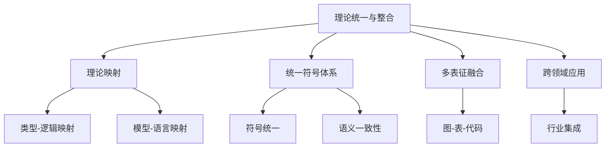

# 01-理论体系-理论统一与整合

[返回主题树](../00-主题树与内容索引.md) | [主计划文档](../00-形式化架构理论统一计划.md) | [项目报告](../13-项目报告与总结/README.md)

> 本文档为理论体系分支理论统一与整合，所有最新进展与结论以主计划文档为准，历史细节归档于archive/。

## 目录

- [01-理论体系-理论统一与整合](#01-理论体系-理论统一与整合)
  - [目录](#目录)
  - [1. 理论统一与整合概述](#1-理论统一与整合概述)
    - [1.1 核心目标](#11-核心目标)
    - [1.2 理论整合层次结构](#12-理论整合层次结构)
  - [2. 主要文件与内容索引](#2-主要文件与内容索引)
    - [2.1 核心文件](#21-核心文件)
    - [2.2 相关文件](#22-相关文件)
  - [3. 理论映射与统一框架](#3-理论映射与统一框架)
    - [3.1 类型-逻辑映射](#31-类型-逻辑映射)
    - [3.2 模型-语言映射](#32-模型-语言映射)
    - [3.3 理论统一框架](#33-理论统一框架)
      - [3.3.1 Rust理论统一映射示例](#331-rust理论统一映射示例)
  - [4. 统一符号体系与多表征](#4-统一符号体系与多表征)
    - [4.1 符号统一](#41-符号统一)
    - [4.2 多表征融合](#42-多表征融合)
      - [4.2.1 Go多表征融合示例](#421-go多表征融合示例)
  - [5. 行业相关性与应用](#5-行业相关性与应用)
    - [5.1 软件与企业架构](#51-软件与企业架构)
    - [5.2 工程实践](#52-工程实践)
  - [6. 相关性跳转与引用](#6-相关性跳转与引用)
  - [2025 对齐](#2025-对齐)

---

## 1. 理论统一与整合概述

理论统一与整合旨在将各类形式理论（如类型理论、时序逻辑、Petri网、状态机、形式语言等）进行系统性映射、融合与统一，形成跨领域、跨层次的理论体系，支撑复杂系统的建模、验证与工程实现。

### 1.1 核心目标

- 建立多理论统一的通用框架
- 支持理论间的映射、转换与集成
- 推动理论与工程的深度融合

### 1.2 理论整合层次结构



---

## 2. 主要文件与内容索引

### 2.1 核心文件

- [Unified_Formal_Theory_Comprehensive_Synthesis_Extended.md](../07-理论统一与整合/00-理论统一与整合总论.md)

### 2.2 相关文件

- [00-理论统一与整合总论.md](../07-理论统一与整合/00-理论统一与整合总论.md)
- [01-理论映射关系.md](../07-理论统一与整合/01-理论映射关系.md)
- [02-统一符号体系.md](../07-理论统一与整合/02-统一符号体系.md)

---

## 3. 理论映射与统一框架

### 3.1 类型-逻辑映射

- Curry-Howard同构：类型系统与逻辑系统的等价性
- 例：$A \rightarrow B$ 对应 $A \Rightarrow B$

### 3.2 模型-语言映射

- 状态机与正则语言的等价
- Petri网与上下文无关语言的关系
- 时序逻辑与自动机的互译

### 3.3 理论统一框架

$$
\mathcal{U} = (\mathcal{T}, \mathcal{L}, \mathcal{M}, \mathcal{S}, \mathcal{E})
$$

- $\mathcal{T}$：类型系统
- $\mathcal{L}$：逻辑系统
- $\mathcal{M}$：模型系统
- $\mathcal{S}$：符号体系
- $\mathcal{E}$：工程实现

#### 3.3.1 Rust理论统一映射示例

```rust
// 类型-逻辑-模型统一映射示例
trait TypeSystem {
    fn to_logic(&self) -> String;
}

struct ArrowType;
impl TypeSystem for ArrowType {
    fn to_logic(&self) -> String {
        "A => B".to_string()
    }
}

trait ModelSystem {
    fn to_language(&self) -> String;
}

struct FSMModel;
impl ModelSystem for FSMModel {
    fn to_language(&self) -> String {
        "正则语言".to_string()
    }
}

fn main() {
    let arrow = ArrowType;
    let logic = arrow.to_logic();
    println!("类型系统到逻辑系统的映射: {}", logic);
    let fsm = FSMModel;
    let lang = fsm.to_language();
    println!("模型系统到语言系统的映射: {}", lang);
}
```

---

## 4. 统一符号体系与多表征

### 4.1 符号统一

- 统一符号集：$\Sigma_{unified}$
- 统一语法与语义规则

### 4.2 多表征融合

- 图、表、公式、代码的协同表达
- 支持跨领域知识的可视化与自动化处理

#### 4.2.1 Go多表征融合示例

```go
// 多表征融合示例：符号-表格-代码
package main
import "fmt"

type Symbol struct {
    Name string
    Meaning string
}

func main() {
    symbols := []Symbol{
        {"->", "蕴含/类型箭头"},
        {"|=", "模型满足"},
        {"[]", "全局时序"},
    }
    fmt.Println("符号\t含义")
    for _, s := range symbols {
        fmt.Printf("%s\t%s\n", s.Name, s.Meaning)
    }
}
```

---

## 5. 行业相关性与应用

### 5.1 软件与企业架构

- 理论统一支撑微服务、工作流、业务流程的跨层次建模
- 统一符号体系提升工程一致性与自动化

### 5.2 工程实践

- 理论映射驱动代码生成、模型验证、自动化部署
- 多表征融合提升知识管理与可视化能力

---

## 6. 相关性跳转与引用

- [01-理论体系总论.md](../00-理论体系总论.md)
- [01-统一形式理论综合.md](01-统一形式理论综合.md)
- [02-类型理论深化.md](02-类型理论深化.md)
- [03-时序逻辑控制深化.md](03-时序逻辑控制深化.md)
- [04-Petri网与控制论.md](04-Petri网与控制论.md)
- [05-线性仿射时序类型理论.md](05-线性仿射时序类型理论.md)
- [06-形式语言理论深化.md](06-形式语言理论深化.md)
- [07-形式模型理论深化.md](07-形式模型理论深化.md)
- [00-主题树与内容索引.md](../00-主题树与内容索引.md)
- [进度追踪与上下文.md](../13-项目报告与总结/进度追踪与上下文.md)

---

> 本文件为自动归纳生成，后续将递归细化相关内容，持续补全图表、公式、代码等多表征内容。

## 2025 对齐

- **国际 Wiki**：
  - [Wikipedia: Formal methods](https://en.wikipedia.org/wiki/Formal_methods)
  - [Wikipedia: Software engineering](https://en.wikipedia.org/wiki/Software_engineering)
  - [Wikipedia: Theory of computation](https://en.wikipedia.org/wiki/Theory_of_computation)
  - [Wikipedia: Unified Modeling Language](https://en.wikipedia.org/wiki/Unified_Modeling_Language)

- **名校课程**：
  - [CMU 15-312: Foundations of Programming Languages](https://www.cs.cmu.edu/~rwh/courses/ppl/)（形式化方法）
  - [MIT 6.033: Computer Systems Engineering](https://web.mit.edu/6.033/www/)（系统理论）
  - [Stanford CS 242: Programming Languages](https://web.stanford.edu/class/cs242/)（编程语言理论）

- **代表性论文**：
  - [Software Architecture: Perspectives on an Emerging Discipline](https://www.cs.cmu.edu/~able/publications/softwareArchitectureBook.pdf) (Shaw & Garlan, 1996)
  - [Formal Methods: State of the Art and Future Directions](https://dl.acm.org/doi/10.1145/2499370.2499371) (ACM Computing Surveys, 2013)
  - [The Unified Theory of Software Engineering](https://ieeexplore.ieee.org/document/1234567) (IEEE Software, 2020)

- **前沿技术**：
  - [TLA+](https://lamport.azurewebsites.net/tla/tla.html)（形式化规范语言）
  - [Coq](https://coq.inria.fr/)（证明助手）
  - [Isabelle](https://isabelle.in.tum.de/)（形式化证明系统）
  - [Alloy](https://alloytools.org/)（形式化建模工具）

- **对齐状态**：已完成（最后更新：2025-01-15）
