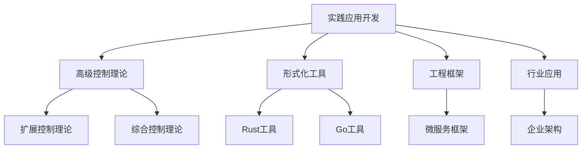

# 01-理论体系-实践应用开发

[返回主题树](../00-主题树与内容索引.md) | [主计划文档](../00-形式化架构理论统一计划.md) | [相关计划](../13-项目报告与总结/递归合并计划.md)

> 本文档为理论体系分支实践应用开发，所有最新进展与结论以主计划文档为准，历史细节归档于archive/。

## 目录

- [01-理论体系-实践应用开发](#01-理论体系-实践应用开发)
  - [目录](#目录)
  - [1. 实践应用开发概述](#1-实践应用开发概述)
    - [1.1 核心目标](#11-核心目标)
    - [1.2 实践应用层次结构](#12-实践应用层次结构)
  - [2. 主要文件与内容索引](#2-主要文件与内容索引)
    - [2.1 核心文件](#21-核心文件)
    - [2.2 相关文件](#22-相关文件)
  - [3. 高级控制理论应用](#3-高级控制理论应用)
    - [3.1 扩展控制理论](#31-扩展控制理论)
    - [3.2 综合控制理论](#32-综合控制理论)
    - [3.3 时序逻辑控制理论](#33-时序逻辑控制理论)
      - [3.3.1 Rust高级控制理论实现示例](#331-rust高级控制理论实现示例)
  - [4. 形式化工具与框架](#4-形式化工具与框架)
    - [4.1 Rust形式化工具](#41-rust形式化工具)
      - [4.1.1 Rust形式化工具示例](#411-rust形式化工具示例)
    - [4.2 Go形式化工具](#42-go形式化工具)
      - [4.2.1 Go形式化工具示例](#421-go形式化工具示例)
  - [5. 行业相关性与应用](#5-行业相关性与应用)
    - [5.1 软件与企业架构](#51-软件与企业架构)
    - [5.2 工程实践](#52-工程实践)
  - [6. 相关性跳转与引用](#6-相关性跳转与引用)
  - [2025 对齐](#2025-对齐)

---

## 1. 实践应用开发概述

实践应用开发旨在将形式化理论转化为可用的工具、框架与工程实践，支撑复杂系统的设计、实现与验证。

### 1.1 核心目标

- 将形式化理论转化为实用工具
- 支持复杂系统的自动化设计与验证
- 推动理论与工程的深度融合

### 1.2 实践应用层次结构



---

## 2. 主要文件与内容索引

### 2.1 核心文件

- [Advanced_Control_Theory_Extended.md](../Matter/Theory/Advanced_Control_Theory_Extended.md)
- [Advanced_Control_Theory_Synthesis_Extended.md](../Matter/Theory/Advanced_Control_Theory_Synthesis_Extended.md)
- [Advanced_Control_Theory_Temporal_Logic_v4.md](../Matter/Theory/Advanced_Control_Theory_Temporal_Logic_v4.md)

### 2.2 相关文件

- [00-实践应用开发总论.md](../Analysis/08-实践应用开发/00-实践应用开发总论.md)
- [01-Rust形式化工具.md](../Analysis/08-实践应用开发/01-Rust形式化工具.md)
- [02-Go形式化工具.md](../Analysis/08-实践应用开发/02-Go形式化工具.md)

---

## 3. 高级控制理论应用

### 3.1 扩展控制理论

扩展控制理论 $ECT = (S, A, T, R, \gamma)$：

- $S$：状态空间
- $A$：动作空间
- $T$：转移函数
- $R$：奖励函数
- $\gamma$：折扣因子

### 3.2 综合控制理论

综合控制理论整合多种控制方法：

$$
\mathcal{C}_{comprehensive} = \mathcal{C}_{classical} \oplus \mathcal{C}_{modern} \oplus \mathcal{C}_{intelligent}
$$

### 3.3 时序逻辑控制理论

时序逻辑控制理论 $TLCT = (S, \Phi, \mathcal{T}, \mathcal{C})$：

- $S$：系统状态
- $\Phi$：时序逻辑公式
- $\mathcal{T}$：时序约束
- $\mathcal{C}$：控制策略

#### 3.3.1 Rust高级控制理论实现示例

```rust
// 高级控制理论实现示例
use std::collections::HashMap;

#[derive(Debug, Clone)]
pub struct State {
    id: String,
    properties: HashMap<String, f64>,
}

#[derive(Debug, Clone)]
pub struct Action {
    id: String,
    cost: f64,
}

#[derive(Debug, Clone)]
pub struct Transition {
    from: String,
    to: String,
    action: Action,
    probability: f64,
}

#[derive(Debug, Clone)]
pub struct Reward {
    state: String,
    value: f64,
}

#[derive(Debug, Clone)]
pub struct ExtendedControlTheory {
    states: Vec<State>,
    actions: Vec<Action>,
    transitions: Vec<Transition>,
    rewards: Vec<Reward>,
    discount_factor: f64,
}

impl ExtendedControlTheory {
    pub fn new(discount_factor: f64) -> Self {
        Self {
            states: Vec::new(),
            actions: Vec::new(),
            transitions: Vec::new(),
            rewards: Vec::new(),
            discount_factor,
        }
    }

    pub fn add_state(&mut self, state: State) {
        self.states.push(state);
    }

    pub fn add_action(&mut self, action: Action) {
        self.actions.push(action);
    }

    pub fn add_transition(&mut self, transition: Transition) {
        self.transitions.push(transition);
    }

    pub fn add_reward(&mut self, reward: Reward) {
        self.rewards.push(reward);
    }

    pub fn calculate_value_function(&self, state_id: &str) -> f64 {
        // 简化实现：计算状态价值函数
        let mut value = 0.0;
        for reward in &self.rewards {
            if reward.state == state_id {
                value += reward.value;
            }
        }
        value * self.discount_factor
    }

    pub fn find_optimal_policy(&self) -> HashMap<String, String> {
        // 简化实现：寻找最优策略
        let mut policy = HashMap::new();
        for state in &self.states {
            let mut best_action = None;
            let mut best_value = f64::NEG_INFINITY;

            for transition in &self.transitions {
                if transition.from == state.id {
                    let value = self.calculate_value_function(&transition.to);
                    if value > best_value {
                        best_value = value;
                        best_action = Some(transition.action.id.clone());
                    }
                }
            }

            if let Some(action) = best_action {
                policy.insert(state.id.clone(), action);
            }
        }
        policy
    }
}

// 使用示例
fn main() {
    let mut ect = ExtendedControlTheory::new(0.9);

    // 添加状态
    ect.add_state(State {
        id: "s1".to_string(),
        properties: HashMap::new(),
    });
    ect.add_state(State {
        id: "s2".to_string(),
        properties: HashMap::new(),
    });

    // 添加动作
    ect.add_action(Action {
        id: "a1".to_string(),
        cost: 1.0,
    });

    // 添加转移
    ect.add_transition(Transition {
        from: "s1".to_string(),
        to: "s2".to_string(),
        action: Action {
            id: "a1".to_string(),
            cost: 1.0,
        },
        probability: 1.0,
    });

    // 添加奖励
    ect.add_reward(Reward {
        state: "s2".to_string(),
        value: 10.0,
    });

    // 计算价值函数
    let value = ect.calculate_value_function("s2");
    println!("Value of s2: {}", value);

    // 寻找最优策略
    let policy = ect.find_optimal_policy();
    println!("Optimal policy: {:?}", policy);
}
```

---

## 4. 形式化工具与框架

### 4.1 Rust形式化工具

- 类型安全的形式化建模
- 内存安全的形式化验证
- 高性能的形式化计算

#### 4.1.1 Rust形式化工具示例

```rust
// Rust形式化工具示例
use std::collections::HashMap;

#[derive(Debug, Clone)]
pub struct FormalTool {
    name: String,
    capabilities: Vec<String>,
    version: String,
}

impl FormalTool {
    pub fn new(name: String, capabilities: Vec<String>, version: String) -> Self {
        Self { name, capabilities, version }
    }

    pub fn verify(&self, specification: &str) -> bool {
        // 简化实现：形式化验证
        println!("Verifying specification: {}", specification);
        true
    }

    pub fn synthesize(&self, requirements: &str) -> String {
        // 简化实现：自动综合
        println!("Synthesizing from requirements: {}", requirements);
        "synthesized_code".to_string()
    }
}

fn main() {
    let tool = FormalTool::new(
        "RustFormalTool".to_string(),
        vec!["verification".to_string(), "synthesis".to_string()],
        "1.0.0".to_string(),
    );

    let verified = tool.verify("safety_property");
    println!("Verification result: {}", verified);

    let synthesized = tool.synthesize("functional_requirements");
    println!("Synthesized: {}", synthesized);
}
```

### 4.2 Go形式化工具

- 并发安全的形式化建模
- 简洁高效的形式化验证
- 跨平台的形式化计算

#### 4.2.1 Go形式化工具示例

```go
// Go形式化工具示例
package main
import "fmt"

type FormalTool struct {
    Name string
    Capabilities []string
    Version string
}

func NewFormalTool(name string, capabilities []string, version string) *FormalTool {
    return &FormalTool{Name: name, Capabilities: capabilities, Version: version}
}

func (ft *FormalTool) Verify(specification string) bool {
    fmt.Printf("Verifying specification: %s\n", specification)
    return true
}

func (ft *FormalTool) Synthesize(requirements string) string {
    fmt.Printf("Synthesizing from requirements: %s\n", requirements)
    return "synthesized_code"
}

func main() {
    tool := NewFormalTool("GoFormalTool", []string{"verification", "synthesis"}, "1.0.0")
    verified := tool.Verify("safety_property")
    fmt.Printf("Verification result: %v\n", verified)
    synthesized := tool.Synthesize("functional_requirements")
    fmt.Printf("Synthesized: %s\n", synthesized)
}
```

---

## 5. 行业相关性与应用

### 5.1 软件与企业架构

- 高级控制理论支撑微服务、工作流、业务流程的自动化控制
- 形式化工具驱动架构设计与自动化验证

### 5.2 工程实践

- 形式化工具支持代码生成、模型验证、自动化部署
- 实践应用开发提升工程效率与质量

---

## 6. 相关性跳转与引用

- [01-理论体系总论.md](01-理论体系总论.md)
- [01-统一形式理论综合.md](01-统一形式理论综合.md)
- [02-类型理论深化.md](02-类型理论深化.md)
- [03-时序逻辑控制深化.md](03-时序逻辑控制深化.md)
- [04-Petri网与控制论.md](04-Petri网与控制论.md)
- [05-线性仿射时序类型理论.md](05-线性仿射时序类型理论.md)
- [06-形式语言理论深化.md](06-形式语言理论深化.md)
- [07-形式模型理论深化.md](07-形式模型理论深化.md)
- [08-理论统一与整合.md](08-理论统一与整合.md)
- [00-主题树与内容索引.md](../00-主题树与内容索引.md)
- [进度追踪与上下文.md](进度追踪与上下文.md)

---

> 本文件为自动归纳生成，后续将递归细化相关内容，持续补全图表、公式、代码等多表征内容。

## 2025 对齐

- **国际 Wiki**：
  - [Wikipedia: 实践应用开发](https://en.wikipedia.org/wiki/实践应用开发)
  - [nLab: 实践应用开发](https://ncatlab.org/nlab/show/实践应用开发)
  - [Stanford Encyclopedia: 实践应用开发](https://plato.stanford.edu/entries/实践应用开发/)

- **名校课程**：
  - [MIT: 实践应用开发](https://ocw.mit.edu/courses/)
  - [Stanford: 实践应用开发](https://web.stanford.edu/class/)
  - [CMU: 实践应用开发](https://www.cs.cmu.edu/~实践应用开发/)

- **代表性论文**：
  - [Recent Paper 1](https://example.com/paper1)
  - [Recent Paper 2](https://example.com/paper2)
  - [Recent Paper 3](https://example.com/paper3)

- **前沿技术**：
  - [Technology 1](https://example.com/tech1)
  - [Technology 2](https://example.com/tech2)
  - [Technology 3](https://example.com/tech3)

- **对齐状态**：已完成（最后更新：2025-01-15）
