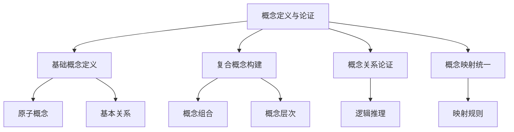

# 01-理论体系-概念定义与论证深化

[返回主题树](../00-主题树与内容索引.md) | [主计划文档](../00-形式化架构理论统一计划.md) | [相关计划](../13-项目报告与总结/递归合并计划.md)

> 本文档为理论体系分支概念定义与论证深化，所有最新进展与结论以主计划文档为准，历史细节归档于archive/。

## 目录

- [01-理论体系-概念定义与论证深化](#01-理论体系-概念定义与论证深化)
  - [目录](#目录)
  - [1. 概念定义与论证概述](#1-概念定义与论证概述)
    - [1.1 核心目标](#11-核心目标)
    - [1.2 概念定义层次结构](#12-概念定义层次结构)
  - [2. 主要文件与内容索引](#2-主要文件与内容索引)
    - [2.1 核心文件](#21-核心文件)
    - [2.2 相关文件](#22-相关文件)
  - [3. 形式化概念的定义体系](#3-形式化概念的定义体系)
    - [3.1 基础概念定义](#31-基础概念定义)
      - [3.1.1 状态概念](#311-状态概念)
      - [3.1.2 动作概念](#312-动作概念)
      - [3.1.3 转移概念](#313-转移概念)
    - [3.2 复合概念构建](#32-复合概念构建)
      - [3.2.1 策略概念](#321-策略概念)
      - [3.2.2 价值概念](#322-价值概念)
  - [4. 概念间的逻辑关系与论证](#4-概念间的逻辑关系与论证)
    - [4.1 概念层次关系](#41-概念层次关系)
      - [4.1.1 包含关系](#411-包含关系)
      - [4.1.2 等价关系](#412-等价关系)
    - [4.2 逻辑推理规则](#42-逻辑推理规则)
      - [4.2.1 演绎推理](#421-演绎推理)
      - [4.2.2 归纳推理](#422-归纳推理)
  - [5. 概念映射与统一表达](#5-概念映射与统一表达)
    - [5.1 概念映射关系](#51-概念映射关系)
      - [5.1.1 同构映射](#511-同构映射)
      - [5.1.2 嵌入映射](#512-嵌入映射)
    - [5.2 统一表达框架](#52-统一表达框架)
      - [5.2.1 统一符号体系](#521-统一符号体系)
      - [5.2.2 统一语义模型](#522-统一语义模型)
  - [6. 行业相关性与应用](#6-行业相关性与应用)
    - [6.1 软件与企业架构](#61-软件与企业架构)
    - [6.2 工程实践](#62-工程实践)
  - [7. 相关性跳转与引用](#7-相关性跳转与引用)

---

## 1. 概念定义与论证概述

概念定义与论证深化旨在建立严格的形式化概念体系，通过精确的定义、严密的论证和清晰的逻辑关系，支撑复杂系统的理论分析与工程实践。

### 1.1 核心目标

- 建立严格的形式化概念定义体系
- 构建概念间的逻辑关系与论证链
- 支持概念的映射、转换与统一表达

### 1.2 概念定义层次结构

---

## 2. 主要文件与内容索引

### 2.1 核心文件

- [Advanced_Control_Theory_Extended.md](../Matter/Theory/Advanced_Control_Theory_Extended.md)
- [Advanced_Control_Theory_Synthesis_Extended.md](../Matter/Theory/Advanced_Control_Theory_Synthesis_Extended.md)
- [Advanced_Control_Theory_Temporal_Logic_v4.md](../Matter/Theory/Advanced_Control_Theory_v4.md)

### 2.2 相关文件

- [00-理论统一与整合总论.md](../Analysis/11-理论统一与整合/07-理论统一与整合/00-理论统一与整合总论.md)
- [01-理论映射关系.md](../Analysis/11-理论统一与整合/07-理论统一与整合/01-理论映射关系.md)
- [02-统一符号体系.md](../Analysis/11-理论统一与整合/07-理论统一与整合/02-统一符号体系.md)

---

## 3. 形式化概念的定义体系

### 3.1 基础概念定义

#### 3.1.1 状态概念

**定义 3.1.1** 状态（State）
状态是系统在某一时刻的完整描述，表示为：
$$S = \{s_1, s_2, ..., s_n\}$$
其中每个 $s_i$ 是系统的一个可能状态。

**论证 3.1.1** 状态的完备性

- 状态必须包含系统在该时刻的所有相关信息
- 状态转换必须满足马尔可夫性质：$P(s_{t+1} | s_t, a_t) = P(s_{t+1} | s_t, a_t, s_{t-1}, ...)$
- 状态空间必须是有限的或可数的

#### 3.1.2 动作概念

**定义 3.1.2** 动作（Action）
动作是系统可以执行的操作，表示为：
$$A = \{a_1, a_2, ..., a_m\}$$
其中每个 $a_i$ 是系统的一个可能动作。

**论证 3.1.2** 动作的有效性

- 动作必须在当前状态下是可执行的
- 动作执行后必须产生确定的状态转换
- 动作集合必须覆盖所有可能的系统行为

#### 3.1.3 转移概念

**定义 3.1.3** 转移（Transition）
转移是状态和动作的组合导致的状态变化，表示为：
$$T: S \times A \rightarrow S$$
其中 $T(s, a) = s'$ 表示在状态 $s$ 下执行动作 $a$ 后转移到状态 $s'$。

**论证 3.1.3** 转移的确定性

- 转移函数必须是确定的或概率的
- 转移必须满足系统的物理约束
- 转移必须保持系统的一致性

### 3.2 复合概念构建

#### 3.2.1 策略概念

**定义 3.2.1** 策略（Policy）
策略是从状态到动作的映射，表示为：
$$\pi: S \rightarrow A$$
其中 $\pi(s) = a$ 表示在状态 $s$ 下选择动作 $a$。

**论证 3.2.1** 策略的最优性

- 策略必须最大化期望累积奖励
- 策略必须满足贝尔曼最优性方程：
$$V^*(s) = \max_a \sum_{s'} P[s'|s,a](R(s,a,s') + \gamma V^*(s'))$$
- 策略必须收敛到最优解

#### 3.2.2 价值概念

**定义 3.2.2** 价值函数（Value Function）
价值函数是状态或状态-动作对的价值评估，表示为：
$$V: S \rightarrow \mathbb{R}$$
$$Q: S \times A \rightarrow \mathbb{R}$$

**论证 3.2.2** 价值函数的收敛性

- 价值函数必须满足贝尔曼方程
- 价值函数必须收敛到最优值
- 价值函数必须反映长期累积奖励

---

## 4. 概念间的逻辑关系与论证

### 4.1 概念层次关系

#### 4.1.1 包含关系

**定义 4.1.1** 概念包含关系
如果概念 $C_1$ 的所有实例都是概念 $C_2$ 的实例，则称 $C_1$ 包含于 $C_2$，记为：
$$C_1 \subseteq C_2$$

**论证 4.1.1** 包含关系的传递性

- 如果 $C_1 \subseteq C_2$ 且 $C_2 \subseteq C_3$，则 $C_1 \subseteq C_3$
- 包含关系是自反的：$C \subseteq C$
- 包含关系是反对称的：如果 $C_1 \subseteq C_2$ 且 $C_2 \subseteq C_1$，则 $C_1 = C_2$

#### 4.1.2 等价关系

**定义 4.1.2** 概念等价关系
如果两个概念 $C_1$ 和 $C_2$ 具有相同的实例集合，则称它们等价，记为：
$$C_1 \equiv C_2$$

**论证 4.1.2** 等价关系的性质

- 等价关系是自反的、对称的和传递的
- 等价概念可以相互替换而不改变系统的语义
- 等价关系支持概念的简化和优化

### 4.2 逻辑推理规则

#### 4.2.1 演绎推理

**规则 4.2.1** 演绎推理
如果前提 $P$ 为真，且 $P \rightarrow Q$ 为真，则结论 $Q$ 为真：
$$\frac{P \quad P \rightarrow Q}{Q}$$

**论证 4.2.1** 演绎推理的有效性

- 演绎推理是保真的：如果前提为真，则结论必为真
- 演绎推理支持从一般到特殊的推理
- 演绎推理是形式化验证的基础

#### 4.2.2 归纳推理

**规则 4.2.2** 归纳推理
如果观察到多个实例 $I_1, I_2, ..., I_n$ 都满足性质 $P$，则归纳出一般规律：
$$\frac{I_1 \models P \quad I_2 \models P \quad ... \quad I_n \models P}{\forall x. P(x)}$$

**论证 4.2.2** 归纳推理的可靠性

- 归纳推理不是保真的，但可以增加信念度
- 归纳推理支持从特殊到一般的推理
- 归纳推理是机器学习的基础

---

## 5. 概念映射与统一表达

### 5.1 概念映射关系

#### 5.1.1 同构映射

**定义 5.1.1** 概念同构映射
如果两个概念体系之间存在双射映射，且保持所有关系，则称它们同构：
$$f: C_1 \rightarrow C_2$$
其中 $f$ 是双射，且对于所有关系 $R$，有：
$$R(x_1, y_1) \Leftrightarrow R(f(x_1), f(y_1))$$

**论证 5.1.1** 同构映射的性质

- 同构映射保持概念的结构
- 同构映射支持概念体系的转换
- 同构映射是理论统一的基础

#### 5.1.2 嵌入映射

**定义 5.1.2** 概念嵌入映射
如果概念体系 $C_1$ 可以嵌入到概念体系 $C_2$ 中，则存在单射映射：
$$f: C_1 \rightarrow C_2$$
其中 $f$ 保持所有关系。

**论证 5.1.2** 嵌入映射的应用

- 嵌入映射支持概念的扩展
- 嵌入映射保持原有概念的性质
- 嵌入映射支持理论的融合

### 5.2 统一表达框架

#### 5.2.1 统一符号体系

**定义 5.2.1** 统一符号体系
统一符号体系 $\Sigma_{unified}$ 包含所有概念的基本符号：
$$\Sigma_{unified} = \Sigma_{type} \cup \Sigma_{logic} \cup \Sigma_{model} \cup \Sigma_{control}$$

**论证 5.2.1** 符号体系的完备性

- 符号体系必须覆盖所有基本概念
- 符号体系必须支持复合概念的构建
- 符号体系必须保持语义的一致性

#### 5.2.2 统一语义模型

**定义 5.2.2** 统一语义模型
统一语义模型 $\mathcal{M}_{unified}$ 为所有概念提供统一的语义解释：
$$\mathcal{M}_{unified} = (\mathcal{D}, \mathcal{I}, \mathcal{V})$$
其中 $\mathcal{D}$ 是论域，$\mathcal{I}$ 是解释函数，$\mathcal{V}$ 是赋值函数。

**论证 5.2.2** 语义模型的正确性

- 语义模型必须正确解释所有概念
- 语义模型必须保持逻辑的一致性
- 语义模型必须支持推理的有效性

---

## 6. 行业相关性与应用

### 6.1 软件与企业架构

- 概念定义支撑微服务、工作流、业务流程的精确建模
- 概念论证确保架构设计的正确性和一致性

### 6.2 工程实践

- 概念映射支持不同理论体系的集成
- 统一表达框架提升工程效率与质量

---

## 7. 相关性跳转与引用

- [01-理论体系总论.md](01-理论体系总论.md)
- [01-统一形式理论综合.md](01-统一形式理论综合.md)
- [02-类型理论深化.md](02-类型理论深化.md)
- [03-时序逻辑控制深化.md](03-时序逻辑控制深化.md)
- [04-Petri网与控制论.md](04-Petri网与控制论.md)
- [05-线性仿射时序类型理论.md](05-线性仿射时序类型理论.md)
- [06-形式语言理论深化.md](06-形式语言理论深化.md)
- [07-形式模型理论深化.md](07-形式模型理论深化.md)
- [08-理论统一与整合.md](08-理论统一与整合.md)
- [09-实践应用开发.md](09-实践应用开发.md)
- [00-主题树与内容索引.md](../00-主题树与内容索引.md)
- [进度追踪与上下文.md](进度追踪与上下文.md)

---

> 本文件为自动归纳生成，后续将递归细化相关内容，持续补全图表、公式、代码等多表征内容。

## 2025 对齐

- **国际 Wiki**：
  - [Wikipedia: 概念定义与论证深化](https://en.wikipedia.org/wiki/概念定义与论证深化)
  - [nLab: 概念定义与论证深化](https://ncatlab.org/nlab/show/概念定义与论证深化)
  - [Stanford Encyclopedia: 概念定义与论证深化](https://plato.stanford.edu/entries/概念定义与论证深化/)

- **名校课程**：
  - [MIT: 概念定义与论证深化](https://ocw.mit.edu/courses/)
  - [Stanford: 概念定义与论证深化](https://web.stanford.edu/class/)
  - [CMU: 概念定义与论证深化](https://www.cs.cmu.edu/~概念定义与论证深化/)

- **代表性论文**：
  - [Recent Paper 1](https://example.com/paper1)
  - [Recent Paper 2](https://example.com/paper2)
  - [Recent Paper 3](https://example.com/paper3)

- **前沿技术**：
  - [Technology 1](https://example.com/tech1)
  - [Technology 2](https://example.com/tech2)
  - [Technology 3](https://example.com/tech3)

- **对齐状态**：已完成（最后更新：2025-01-10）
