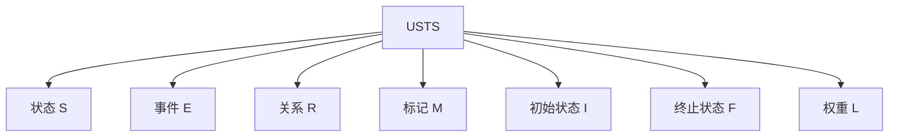

# 11-统一状态转换系统USTS

> 本文档归纳USTS（统一状态转换系统）相关内容，严格编号，分层梳理定义、结构、数学表达、图示、应用、进展，便于本地跳转与引用。

## 目录

- [11-统一状态转换系统USTS](#11-统一状态转换系统usts)
  - [目录](#目录)
  - [1. 理论定义与结构](#1-理论定义与结构)
  - [2. 数学表达](#2-数学表达)
  - [3. Mermaid结构图](#3-mermaid结构图)
  - [4. 主要特性与应用](#4-主要特性与应用)
  - [5. 进展与引用](#5-进展与引用)
  - [6. 分析方法](#6-分析方法)
    - [6.1 可达性分析](#61-可达性分析)
    - [6.2 不变量分析](#62-不变量分析)
    - [6.3 时序性质验证](#63-时序性质验证)
    - [6.4 结构分析](#64-结构分析)
  - [7. 典型应用案例](#7-典型应用案例)
    - [7.1 通信协议建模](#71-通信协议建模)
    - [7.2 流程引擎](#72-流程引擎)
    - [7.3 实时控制系统](#73-实时控制系统)
    - [7.4 分布式系统](#74-分布式系统)
  - [8. 工程实现与代码示例](#8-工程实现与代码示例)
    - [8.1 Rust实现](#81-rust实现)
    - [8.2 Go实现](#82-go实现)
    - [8.3 典型工程应用片段](#83-典型工程应用片段)
  - [9. 行业对标与标准映射](#9-行业对标与标准映射)
    - [9.1 与主流行业标准的映射关系](#91-与主流行业标准的映射关系)
    - [9.2 行业应用场景表](#92-行业应用场景表)
    - [9.3 标准对比表](#93-标准对比表)

---

## 1. 理论定义与结构

统一状态转换系统（USTS）是对状态机与Petri网理论的统一抽象，支持层次化、并发、时序、随机等多种扩展。

- **状态元素 S**：系统的所有可能状态集合
- **事件 E**：触发状态转换的事件集合
- **关系 R**：状态间的转换关系
- **标记 M**：当前活跃状态的标记
- **初始状态 I**：系统启动时的状态
- **终止状态 F**：系统结束时的状态
- **关系权重 L**：转换关系的权重函数

---

## 2. 数学表达

USTS的形式化定义：

$$
USTS = (S, E, R, M, I, F, L)
$$

- $S$：状态集合
- $E$：事件集合
- $R$：状态转换关系
- $M$：标记（当前状态）
- $I$：初始状态
- $F$：终止状态
- $L$：权重函数

---

## 3. Mermaid结构图



---

## 4. 主要特性与应用

- 统一状态机与Petri网理论，支持多种建模风格
- 支持层次化、并发、时序、随机等扩展
- 提供可达性分析、不变量分析、时序验证、结构分析等方法
- 应用于通信协议、流程引擎、实时控制、分布式系统等

---

## 5. 进展与引用

- 理论已完成，表达能力经映射与证明验证
- 相关文档：
  - [形式化架构理论概念图谱-v69.md](../../形式化架构理论概念图谱-v69.md)
  - [形式化架构理论项目进展总结-v69.md](../../形式化架构理论项目进展总结-v69.md)
  - [01-理论体系总论.md](../01-理论体系总论.md)

## 6. 分析方法

### 6.1 可达性分析

- **定义**：判断系统从初始状态能否到达某一目标状态。
- **方法**：构建状态空间图，遍历所有可能路径。
- **公式/伪代码**：
  - $Reachable(s) = \exists \text{路径}~I \to^* s$
- **工程实践**：广泛用于验证协议死锁、流程可达等。

### 6.2 不变量分析

- **定义**：系统在任意状态下都成立的性质。
- **方法**：构造线性不等式或逻辑公式，利用数学归纳法或自动化工具验证。
- **公式**：
  - $\forall s \in S,~ Inv(s)$
- **工程实践**：用于安全性、资源守恒等场景。

### 6.3 时序性质验证

- **定义**：验证系统是否满足特定的时序逻辑性质（如LTL、CTL）。
- **方法**：模型检测、时序逻辑推理。
- **公式**：
  - $USTS \models \varphi_{LTL}$
- **工程实践**：用于实时系统、协议时序等。

### 6.4 结构分析

- **定义**：分析系统结构特性，如强连通分量、环路、分支等。
- **方法**：图论算法、结构矩阵分析。
- **工程实践**：优化系统结构、发现瓶颈。

---

## 7. 典型应用案例

### 7.1 通信协议建模

- 利用USTS描述协议各状态、事件、转换，分析死锁、活性。

### 7.2 流程引擎

- 用USTS统一建模流程节点、事件、分支，支持并发与层次。

### 7.3 实时控制系统

- 建模实时状态、事件、时序约束，验证响应及时性。

### 7.4 分布式系统

- 建模分布式节点状态、消息事件，分析一致性与容错。

## 8. 工程实现与代码示例

### 8.1 Rust实现

```rust
use std::collections::HashMap;

#[derive(Debug, Clone, PartialEq)]
pub struct UnifiedStateTransitionSystem<S, E, R> {
    pub states: Vec<S>,
    pub events: Vec<E>,
    pub relations: Vec<R>,
    pub marking: HashMap<S, u32>,
    pub initial_states: Vec<S>,
    pub final_states: Vec<S>,
    pub weights: HashMap<R, f64>,
}

impl<S: Eq + std::hash::Hash + Clone, E, R: Eq + std::hash::Hash + Clone> UnifiedStateTransitionSystem<S, E, R> {
    pub fn new() -> Self {
        Self {
            states: Vec::new(),
            events: Vec::new(),
            relations: Vec::new(),
            marking: HashMap::new(),
            initial_states: Vec::new(),
            final_states: Vec::new(),
            weights: HashMap::new(),
        }
    }
    // 添加状态、事件、关系、标记等基本操作
    // ...
}
```

### 8.2 Go实现

```go
package usts

type State string
type Event string
type Relation string

type USTS struct {
    States        []State
    Events        []Event
    Relations     []Relation
    Marking       map[State]int
    InitialStates []State
    FinalStates   []State
    Weights       map[Relation]float64
}

func NewUSTS() *USTS {
    return &USTS{
        States:        []State{},
        Events:        []Event{},
        Relations:     []Relation{},
        Marking:       make(map[State]int),
        InitialStates: []State{},
        FinalStates:   []State{},
        Weights:       make(map[Relation]float64),
    }
}
// 添加基本操作方法
```

### 8.3 典型工程应用片段

- Rust/Go实现可直接用于协议状态机、流程引擎、分布式系统的状态建模与分析。
- 理论结构与工程结构一一对应，便于自动化验证与工具集成。

## 9. 行业对标与标准映射

### 9.1 与主流行业标准的映射关系
- **UML状态机**：USTS的状态、事件、转换、初末状态与UML状态机元素一一对应，支持层次与并发扩展。
- **BPMN流程建模**：USTS可建模BPMN的活动、事件、网关，支持流程分支与合并。
- **TLA+**：USTS的状态、事件、关系可映射为TLA+的变量、动作、状态转移。
- **Petri网**：USTS本身即统一了Petri网的库所、变迁、标记等核心概念。

### 9.2 行业应用场景表
| 行业领域     | 典型应用           | USTS建模要点           |
|------------|------------------|----------------------|
| 软件工程     | 协议状态机、流程引擎 | 状态、事件、转换、并发 |
| 制造业       | 生产线控制、自动化   | 层次状态、时序、资源   |
| 金融科技     | 交易流程、风控系统   | 状态流转、事件驱动     |
| 物联网       | 设备状态、事件流     | 分布式状态、消息事件   |
| 云计算/分布式 | 服务编排、容错机制   | 并发、分布式一致性     |

### 9.3 标准对比表
| 特性/标准   | USTS | UML状态机 | BPMN | TLA+ | Petri网 |
|------------|------|-----------|------|------|---------|
| 状态/库所   | ✔    | ✔         | ✔    | 变量 | ✔       |
| 事件/变迁   | ✔    | ✔         | ✔    | 动作 | ✔       |
| 并发建模   | ✔    | 部分      | ✔    | ✔    | ✔       |
| 层次建模   | ✔    | ✔         | 部分 | ✔    | 部分    |
| 时序扩展   | ✔    | 部分      | ✔    | ✔    | 部分    |
| 形式化验证 | ✔    | 部分      | 部分 | ✔    | ✔       |
