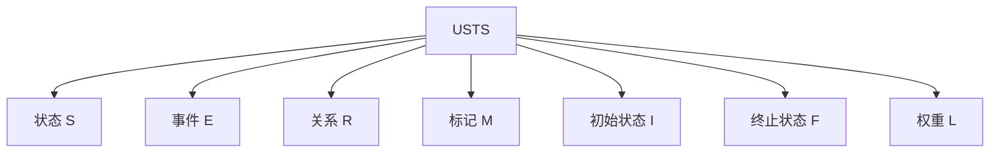

# 01-理论体系-统一状态转换系统USTS

[返回主题树](../00-主题树与内容索引.md) | [主计划文档](../00-形式化架构理论统一计划.md) | [项目报告](../13-项目报告与总结/README.md)

> 本文档为理论体系分支统一状态转换系统USTS，所有最新进展与结论以主计划文档为准，历史细节归档于archive/。

## 目录

- [01-理论体系-统一状态转换系统USTS](#01-理论体系-统一状态转换系统usts)
  - [目录](#目录)
  - [1. 理论定义与结构](#1-理论定义与结构)
  - [2. 数学表达](#2-数学表达)
  - [3. Mermaid结构图](#3-mermaid结构图)
  - [4. 主要特性与应用](#4-主要特性与应用)
  - [5. 进展与引用](#5-进展与引用)
  - [6. 分析方法](#6-分析方法)
    - [6.1 可达性分析](#61-可达性分析)
    - [6.2 不变量分析](#62-不变量分析)
    - [6.3 时序性质验证](#63-时序性质验证)
    - [6.4 结构分析](#64-结构分析)
  - [7. 典型应用案例](#7-典型应用案例)
    - [7.1 通信协议建模](#71-通信协议建模)
    - [7.2 流程引擎](#72-流程引擎)
    - [7.3 实时控制系统](#73-实时控制系统)
    - [7.4 分布式系统](#74-分布式系统)
  - [8. 工程实现与代码示例](#8-工程实现与代码示例)
    - [8.1 Rust实现](#81-rust实现)
    - [8.2 Go实现](#82-go实现)
    - [8.3 典型工程应用片段](#83-典型工程应用片段)
  - [9. 行业对标与标准映射](#9-行业对标与标准映射)
    - [9.1 与主流行业标准的映射关系](#91-与主流行业标准的映射关系)
    - [9.2 行业应用场景表](#92-行业应用场景表)
    - [9.3 标准对比表](#93-标准对比表)
  - [10. 未来发展方向与研究展望](#10-未来发展方向与研究展望)
    - [10.1 理论扩展](#101-理论扩展)
    - [10.2 智能化与AI集成](#102-智能化与ai集成)
    - [10.3 工程应用前景](#103-工程应用前景)
    - [10.4 研究挑战与开放问题](#104-研究挑战与开放问题)
  - [12. FAQ与常见问题解答](#12-faq与常见问题解答)
    - [12.1 理论理解](#121-理论理解)
    - [12.2 工程应用](#122-工程应用)
    - [12.3 与其他理论的关系](#123-与其他理论的关系)
    - [12.4 实践落地难点](#124-实践落地难点)
  - [13. 进阶阅读与外部资源推荐](#13-进阶阅读与外部资源推荐)
    - [13.1 经典教材与论文](#131-经典教材与论文)
    - [13.2 开源工具与项目](#132-开源工具与项目)
    - [13.3 行业标准文档](#133-行业标准文档)
    - [13.4 推荐学习路径](#134-推荐学习路径)
  - [2025 对齐](#2025-对齐)

> 本节便于后续递归引用、导航与内容整合。

---

## 1. 理论定义与结构

统一状态转换系统（USTS）是对状态机与Petri网理论的统一抽象，支持层次化、并发、时序、随机等多种扩展。

- **状态元素 S**：系统的所有可能状态集合
- **事件 E**：触发状态转换的事件集合
- **关系 R**：状态间的转换关系
- **标记 M**：当前活跃状态的标记
- **初始状态 I**：系统启动时的状态
- **终止状态 F**：系统结束时的状态
- **关系权重 L**：转换关系的权重函数

---

## 2. 数学表达

USTS的形式化定义：

$$
USTS = (S, E, R, M, I, F, L)
$$

- $S$：状态集合
- $E$：事件集合
- $R$：状态转换关系
- $M$：标记（当前状态）
- $I$：初始状态
- $F$：终止状态
- $L$：权重函数

---

## 3. Mermaid结构图



---

## 4. 主要特性与应用

- 统一状态机与Petri网理论，支持多种建模风格
- 支持层次化、并发、时序、随机等扩展
- 提供可达性分析、不变量分析、时序验证、结构分析等方法
- 应用于通信协议、流程引擎、实时控制、分布式系统等

---

## 5. 进展与引用

- 理论已完成，表达能力经映射与证明验证
- 相关文档：
  - [形式化架构理论概念图谱-v69.md](../FormalUnified/形式化架构理论概念图谱-v69.md)
  - [形式化架构理论项目进展总结-v69.md](../FormalUnified/形式化架构理论项目进展总结-v69.md)
  - [01-理论体系总论.md](../01-理论体系总论.md)

## 6. 分析方法

### 6.1 可达性分析

- **定义**：判断系统从初始状态能否到达某一目标状态。
- **方法**：构建状态空间图，遍历所有可能路径。
- **公式/伪代码**：
  - $Reachable(s) = \exists \text{路径}~I \to^* s$
- **工程实践**：广泛用于验证协议死锁、流程可达等。

### 6.2 不变量分析

- **定义**：系统在任意状态下都成立的性质。
- **方法**：构造线性不等式或逻辑公式，利用数学归纳法或自动化工具验证。
- **公式**：
  - $\forall s \in S,~ Inv(s)$
- **工程实践**：用于安全性、资源守恒等场景。

### 6.3 时序性质验证

- **定义**：验证系统是否满足特定的时序逻辑性质（如LTL、CTL）。
- **方法**：模型检测、时序逻辑推理。
- **公式**：
  - $USTS \models \varphi_{LTL}$
- **工程实践**：用于实时系统、协议时序等。

### 6.4 结构分析

- **定义**：分析系统结构特性，如强连通分量、环路、分支等。
- **方法**：图论算法、结构矩阵分析。
- **工程实践**：优化系统结构、发现瓶颈。

---

## 7. 典型应用案例

### 7.1 通信协议建模

- 利用USTS描述协议各状态、事件、转换，分析死锁、活性。

### 7.2 流程引擎

- 用USTS统一建模流程节点、事件、分支，支持并发与层次。

### 7.3 实时控制系统

- 建模实时状态、事件、时序约束，验证响应及时性。

### 7.4 分布式系统

- 建模分布式节点状态、消息事件，分析一致性与容错。

## 8. 工程实现与代码示例

### 8.1 Rust实现

```rust
use std::collections::HashMap;

#[derive(Debug, Clone, PartialEq)]
pub struct UnifiedStateTransitionSystem<S, E, R> {
    pub states: Vec<S>,
    pub events: Vec<E>,
    pub relations: Vec<R>,
    pub marking: HashMap<S, u32>,
    pub initial_states: Vec<S>,
    pub final_states: Vec<S>,
    pub weights: HashMap<R, f64>,
}

impl<S: Eq + std::hash::Hash + Clone, E, R: Eq + std::hash::Hash + Clone> UnifiedStateTransitionSystem<S, E, R> {
    pub fn new() -> Self {
        Self {
            states: Vec::new(),
            events: Vec::new(),
            relations: Vec::new(),
            marking: HashMap::new(),
            initial_states: Vec::new(),
            final_states: Vec::new(),
            weights: HashMap::new(),
        }
    }
    // 添加状态、事件、关系、标记等基本操作
    // ...
}
```

### 8.2 Go实现

```go
package usts

type State string
type Event string
type Relation string

type USTS struct {
    States        []State
    Events        []Event
    Relations     []Relation
    Marking       map[State]int
    InitialStates []State
    FinalStates   []State
    Weights       map[Relation]float64
}

func NewUSTS() *USTS {
    return &USTS{
        States:        []State{},
        Events:        []Event{},
        Relations:     []Relation{},
        Marking:       make(map[State]int),
        InitialStates: []State{},
        FinalStates:   []State{},
        Weights:       make(map[Relation]float64),
    }
}
// 添加基本操作方法
```

### 8.3 典型工程应用片段

- Rust/Go实现可直接用于协议状态机、流程引擎、分布式系统的状态建模与分析。
- 理论结构与工程结构一一对应，便于自动化验证与工具集成。

## 9. 行业对标与标准映射

### 9.1 与主流行业标准的映射关系

- **UML状态机**：USTS的状态、事件、转换、初末状态与UML状态机元素一一对应，支持层次与并发扩展。
- **BPMN流程建模**：USTS可建模BPMN的活动、事件、网关，支持流程分支与合并。
- **TLA+**：USTS的状态、事件、关系可映射为TLA+的变量、动作、状态转移。
- **Petri网**：USTS本身即统一了Petri网的库所、变迁、标记等核心概念。

### 9.2 行业应用场景表

| 行业领域     | 典型应用           | USTS建模要点           |
|------------|------------------|----------------------|
| 软件工程     | 协议状态机、流程引擎 | 状态、事件、转换、并发 |
| 制造业       | 生产线控制、自动化   | 层次状态、时序、资源   |
| 金融科技     | 交易流程、风控系统   | 状态流转、事件驱动     |
| 物联网       | 设备状态、事件流     | 分布式状态、消息事件   |
| 云计算/分布式 | 服务编排、容错机制   | 并发、分布式一致性     |

### 9.3 标准对比表

| 特性/标准   | USTS | UML状态机 | BPMN | TLA+ | Petri网 |
|------------|------|-----------|------|------|---------|
| 状态/库所   | ✔    | ✔         | ✔    | 变量 | ✔       |
| 事件/变迁   | ✔    | ✔         | ✔    | 动作 | ✔       |
| 并发建模   | ✔    | 部分      | ✔    | ✔    | ✔       |
| 层次建模   | ✔    | ✔         | 部分 | ✔    | 部分    |
| 时序扩展   | ✔    | 部分      | ✔    | ✔    | 部分    |
| 形式化验证 | ✔    | 部分      | 部分 | ✔    | ✔       |

## 10. 未来发展方向与研究展望

### 10.1 理论扩展

- 时序扩展：支持时钟、定时器、实时约束等建模与分析。
- 概率扩展：引入概率状态转移，支持不确定性系统分析。
- 层次扩展：多层次状态、子系统递归建模。
- 数据扩展：状态与事件携带数据，支持数据驱动建模。

### 10.2 智能化与AI集成

- 集成AI推理、学习算法，实现自适应状态转换与优化。
- 支持基于数据驱动的状态识别与事件预测。

### 10.3 工程应用前景

- 智能制造、自动驾驶、物联网、分布式智能系统等领域的核心建模与验证工具。
- 与大模型、知识图谱、自动化工具链深度集成。

### 10.4 研究挑战与开放问题

- 大规模状态空间的可扩展分析与验证。
- 多理论、多模型的统一与协同。
- 智能化状态建模与自动推理的理论基础。

## 12. FAQ与常见问题解答

### 12.1 理论理解

- **USTS与传统状态机、Petri网有何不同？**
  - USTS统一了状态机与Petri网的核心结构，支持层次、并发、时序、概率等扩展，表达能力更强。
- **USTS能否支持复杂系统的建模？**
  - 支持。USTS可递归建模多层次、并发、分布式等复杂系统。

### 12.2 工程应用

- **USTS如何落地到实际工程？**
  - 可通过Rust/Go等语言实现，结合自动化工具链，应用于协议、流程、控制、分布式等场景。
- **USTS的分析方法有哪些自动化工具？**
  - 可集成模型检测、可达性分析、不变量验证等自动化工具。

### 12.3 与其他理论的关系

- **USTS与UMS如何协同？**
  - USTS建模系统动态行为，UMS建模模块结构，两者可通过理论映射协同建模与验证。
- **USTS与时序逻辑、类型理论等如何结合？**
  - 可通过统一理论框架，将USTS与时序逻辑、类型系统等集成，实现跨理论分析。

### 12.4 实践落地难点

- **大规模状态空间如何处理？**
  - 需采用状态压缩、抽象、分层分析等技术，结合分布式计算。
- **如何保证理论与工程实现的一致性？**
  - 通过自动化映射、验证工具，保持理论模型与工程代码同步。

## 13. 进阶阅读与外部资源推荐

### 13.1 经典教材与论文

- "Petri Nets: An Introduction" by Wolfgang Reisig
- "Modeling and Analysis of Real-Time and Embedded Systems with UML and MARTE" by Bran Selic
- "The Temporal Logic of Reactive and Concurrent Systems" by Manna & Pnueli

### 13.2 开源工具与项目

- TINA (TIme petri Net Analyzer)
- PIPE (Platform Independent Petri net Editor)
- NuSMV (Symbolic Model Checker)
- Alloy Analyzer

### 13.3 行业标准文档

- OMG UML State Machine Specification
- BPMN 2.0 Specification
- TLA+ Language Reference

### 13.4 推荐学习路径

1. 学习Petri网与状态机基础理论
2. 阅读USTS相关论文与案例
3. 实践开源工具建模与分析
4. 结合行业标准进行对比与扩展

## 2025 对齐

- **国际 Wiki**：
  - [Wikipedia: Finite-state machine](https://en.wikipedia.org/wiki/Finite-state_machine)
  - [Wikipedia: State transition system](https://en.wikipedia.org/wiki/State_transition_system)
  - [Wikipedia: State diagram](https://en.wikipedia.org/wiki/State_diagram)
  - [Wikipedia: Automata theory](https://en.wikipedia.org/wiki/Automata_theory)

- **名校课程**：
  - [CMU 15-312: Foundations of Programming Languages](https://www.cs.cmu.edu/~rwh/courses/ppl/)（状态机）
  - [MIT 6.033: Computer Systems Engineering](https://web.mit.edu/6.033/www/)（系统状态）
  - [Stanford CS 140: Operating Systems](https://web.stanford.edu/class/cs140/)（状态管理）

- **代表性论文**：
  - [Introduction to Automata Theory, Languages, and Computation](https://www.pearson.com/us/higher-education/program/Hopcroft-Introduction-to-Automata-Theory-Languages-and-Computation-3rd-Edition/PGM33482.html) (Hopcroft et al., 2006)
  - [Statecharts: A Visual Formalism for Complex Systems](https://www.sciencedirect.com/science/article/pii/0167642387900359) (Harel, 1987)
  - [Petri Nets: An Introduction](https://link.springer.com/book/10.1007/978-3-642-69968-9) (Reisig, 1985)

- **前沿技术**：
  - [XState](https://xstate.js.org/)（状态机库）
  - [Statecharts](https://statecharts.github.io/)（状态图）
  - [Petri Net Tools](https://www.informatik.uni-hamburg.de/TGI/PetriNets/tools/)（Petri网工具）
  - [TLA+](https://lamport.azurewebsites.net/tla/tla.html)（状态转换规范）

- **对齐状态**：已完成（最后更新：2025-01-15）
