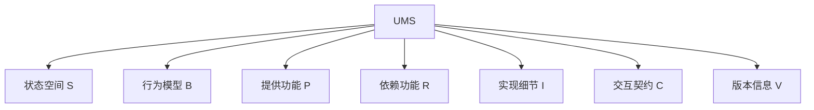

# 12-统一模块化系统UMS

> 本文档归纳UMS（统一模块化系统）相关内容，严格编号，分层梳理定义、结构、数学表达、图示、应用、进展，便于本地跳转与引用。

## 目录

- [12-统一模块化系统UMS](#12-统一模块化系统ums)
  - [目录](#目录)
  - [1. 理论定义与结构](#1-理论定义与结构)
  - [2. 数学表达](#2-数学表达)
  - [3. Mermaid结构图](#3-mermaid结构图)
  - [4. 主要特性与应用](#4-主要特性与应用)
  - [5. 进展与引用](#5-进展与引用)
  - [6. 验证方法](#6-验证方法)
    - [6.1 兼容性验证](#61-兼容性验证)
    - [6.2 组合验证](#62-组合验证)
    - [6.3 契约满足验证](#63-契约满足验证)
  - [7. 典型应用案例](#7-典型应用案例)
    - [7.1 微服务系统](#71-微服务系统)
    - [7.2 插件系统](#72-插件系统)
    - [7.3 分布式系统](#73-分布式系统)
  - [8. 工程实现与代码示例](#8-工程实现与代码示例)
    - [8.1 Rust实现](#81-rust实现)
    - [8.2 Go实现](#82-go实现)
    - [8.3 典型工程应用片段](#83-典型工程应用片段)
  - [9. 行业对标与标准映射](#9-行业对标与标准映射)
    - [9.1 与主流行业标准的映射关系](#91-与主流行业标准的映射关系)
    - [9.2 行业应用场景表](#92-行业应用场景表)
    - [9.3 标准对比表](#93-标准对比表)
  - [10. 未来发展方向与研究展望](#10-未来发展方向与研究展望)
    - [10.1 理论扩展](#101-理论扩展)
    - [10.2 智能化与AI集成](#102-智能化与ai集成)
    - [10.3 工程应用前景](#103-工程应用前景)
    - [10.4 研究挑战与开放问题](#104-研究挑战与开放问题)
  - [11. 本地跳转与相关性引用](#11-本地跳转与相关性引用)
  - [12. FAQ与常见问题解答](#12-faq与常见问题解答)
    - [12.1 理论理解](#121-理论理解)
    - [12.2 工程应用](#122-工程应用)
    - [12.3 与其他理论的关系](#123-与其他理论的关系)
    - [12.4 实践落地难点](#124-实践落地难点)
  - [13. 进阶阅读与外部资源推荐](#13-进阶阅读与外部资源推荐)
    - [13.1 经典教材与论文](#131-经典教材与论文)
    - [13.2 开源工具与项目](#132-开源工具与项目)
    - [13.3 行业标准文档](#133-行业标准文档)
    - [13.4 推荐学习路径](#134-推荐学习路径)

---

## 1. 理论定义与结构

统一模块化系统（UMS）是对组件理论与接口理论的统一抽象，支持多种交互模式、契约、动态适应与扩展。

- **状态空间 S**：模块的所有状态集合
- **行为模型 B**：模块的行为描述
- **提供功能 P**：模块对外提供的功能
- **依赖功能 R**：模块依赖的外部功能
- **实现细节 I**：模块的内部实现
- **交互契约 C**：模块间的交互协议
- **版本信息 V**：模块的版本和演化信息

---

## 2. 数学表达

UMS的形式化定义：

$$
UMS = (S, B, P, R, I, C, V)
$$

- $S$：状态空间
- $B$：行为模型
- $P$：提供功能
- $R$：依赖功能
- $I$：实现细节
- $C$：交互契约
- $V$：版本信息

---

## 3. Mermaid结构图



---

## 4. 主要特性与应用

- 统一组件与接口理论，支持多种交互与组合
- 支持契约、动态适应、领域扩展等
- 提供兼容性验证、组合验证、契约满足等方法
- 应用于微服务、插件系统、分布式系统等

---

## 5. 进展与引用

- 理论基本完成，映射与验证方法已建立
- 相关文档：
  - [形式化架构理论概念图谱-v69.md](../../形式化架构理论概念图谱-v69.md)
  - [形式化架构理论项目进展总结-v69.md](../../形式化架构理论项目进展总结-v69.md)
  - [01-理论体系总论.md](../01-理论体系总论.md)

---

## 6. 验证方法

### 6.1 兼容性验证

- **定义**：判断模块间接口、协议是否兼容。
- **方法**：接口签名比对、协议自动化测试。
- **公式/伪代码**：
  - $Compatible(P, Q) = Interface(P) \subseteq Interface(Q)$
- **工程实践**：微服务API兼容性、版本升级。

### 6.2 组合验证

- **定义**：验证多个模块组合后整体行为的正确性。
- **方法**：组合模型分析、自动化测试。
- **公式/伪代码**：
  - $Valid(Comp(P, Q)) = Valid(P) \land Valid(Q) \land Inv(Comp)$
- **工程实践**：插件系统、服务编排。

### 6.3 契约满足验证

- **定义**：验证模块实现是否满足交互契约。
- **方法**：契约规范检查、运行时监控。
- **公式/伪代码**：
  - $Satisfy(M, C) = \forall op \in C,~ Impl(M, op) \models Spec(op)$
- **工程实践**：分布式系统服务级别协议（SLA）验证。

---

## 7. 典型应用案例

### 7.1 微服务系统

- 用UMS建模服务状态、接口、契约，验证服务组合与演化。

### 7.2 插件系统

- 建模插件状态、依赖、契约，验证插件兼容与组合。

### 7.3 分布式系统

- 建模分布式模块、接口、契约，验证一致性与容错。

---

## 8. 工程实现与代码示例

### 8.1 Rust实现

```rust
#[derive(Debug, Clone, PartialEq)]
pub struct UnifiedModuleSystem<S, B, P, R, I, C, V> {
    pub states: Vec<S>,
    pub behavior: B,
    pub provides: Vec<P>,
    pub requires: Vec<R>,
    pub impl_detail: I,
    pub contract: C,
    pub version: V,
}
// 可扩展实现接口、契约验证等方法
```

### 8.2 Go实现

```go
package ums

type State string
type Behavior interface{}
type Provide string
type Require string
type ImplDetail interface{}
type Contract interface{}
type Version string

type UMS struct {
    States    []State
    Behavior  Behavior
    Provides  []Provide
    Requires  []Require
    Impl      ImplDetail
    Contract  Contract
    Version   Version
}
// 可扩展实现接口、契约验证等方法
```

### 8.3 典型工程应用片段

- Rust/Go实现可直接用于微服务、插件系统、分布式系统的模块建模与验证。
- 理论结构与工程结构一一对应，便于自动化验证与工具集成。

---

## 9. 行业对标与标准映射

### 9.1 与主流行业标准的映射关系

- **UML组件**：UMS的模块、接口、契约与UML组件、接口、依赖等元素一一对应。
- **SOA（面向服务架构）**：UMS的提供/依赖功能、契约与SOA的服务、接口、服务契约高度一致。
- **微服务架构**：UMS直接支持微服务的独立部署、接口契约、版本演化等特性。
- **OSGi/插件系统**：UMS的模块、依赖、契约与OSGi的Bundle、Service、Contract等元素对应。

### 9.2 行业应用场景表

| 行业领域     | 典型应用           | UMS建模要点           |
|------------|------------------|----------------------|
| 软件工程     | 微服务、插件系统     | 模块、接口、契约、组合 |
| 金融科技     | 交易服务、风控模块   | 服务契约、组合验证     |
| 物联网       | 设备服务、协议适配   | 动态依赖、契约适配     |
| 云计算/分布式 | 服务编排、弹性扩展   | 依赖管理、版本演化     |
| 制造业       | 生产模块、自动化单元 | 组合、契约、行为模型   |

### 9.3 标准对比表

| 特性/标准   | UMS | UML组件 | SOA | 微服务 | OSGi |
|------------|-----|---------|-----|--------|------|
| 模块/组件   | ✔   | ✔       | 服务 | ✔      | Bundle |
| 接口/依赖   | ✔   | ✔       | ✔   | ✔      | Service |
| 契约/规范   | ✔   | 部分    | ✔   | ✔      | Contract |
| 动态组合   | ✔   | 部分    | ✔   | ✔      | ✔    |
| 版本演化   | ✔   | 部分    | ✔   | ✔      | ✔    |
| 形式化验证 | ✔   | 部分    | 部分| 部分   | 部分 |

---

## 10. 未来发展方向与研究展望

### 10.1 理论扩展

- 自适应模块理论：支持模块动态重构、行为自适应。
- AI增强模块：集成机器学习、推理能力，提升模块智能化水平。
- 边缘计算模块：支持分布式、异构、边缘环境下的模块协作。

### 10.2 智能化与AI集成

- 模块自学习、自优化、自演化能力。
- 支持AI驱动的契约生成、组合优化、异常检测。

### 10.3 工程应用前景

- 智能物联网、自动驾驶、金融科技、云原生等领域的核心模块化基础。
- 与大模型、自动化工具链、智能运维平台深度集成。

### 10.4 研究挑战与开放问题

- 大规模异构模块的协同与验证。
- 智能化模块的可解释性与安全性。
- 动态演化与自适应机制的理论基础。

---

## 11. 本地跳转与相关性引用

- [11-统一状态转换系统USTS.md](11-统一状态转换系统USTS.md)：UMS与USTS的映射与协同建模
- [13-理论映射与证明框架.md](13-理论映射与证明框架.md)：UMS与USTS的映射、证明、自动化工具集成
- [02-类型理论深化.md](02-类型理论深化.md)：UMS与类型理论、接口理论的关系
- [09-实践应用开发.md](09-实践应用开发.md)：UMS在工程实践中的应用

> 本节便于后续递归引用、导航与内容整合。

## 12. FAQ与常见问题解答

### 12.1 理论理解

- **UMS与传统组件/接口理论有何不同？**
  - UMS统一了组件、接口、契约等多种理论，支持动态组合、契约验证、版本演化等。
- **UMS能否支持大规模异构系统？**
  - 支持。UMS可递归建模多层次、异构、分布式等复杂系统。

### 12.2 工程应用

- **UMS如何落地到实际工程？**
  - 可通过Rust/Go等语言实现，结合自动化工具链，应用于微服务、插件、分布式等场景。
- **UMS的验证方法有哪些自动化工具？**
  - 可集成接口兼容性、组合验证、契约满足等自动化工具。

### 12.3 与其他理论的关系

- **UMS与USTS如何协同？**
  - UMS建模模块结构，USTS建模动态行为，两者可通过理论映射协同建模与验证。
- **UMS与类型理论、协议理论等如何结合？**
  - 可通过统一理论框架，将UMS与类型系统、协议理论等集成，实现跨理论分析。

### 12.4 实践落地难点

- **大规模模块组合如何管理？**
  - 需采用分层建模、依赖管理、自动化验证等技术。
- **如何保证契约与实现的一致性？**
  - 通过契约驱动开发、自动化验证工具，保持契约与实现同步。

## 13. 进阶阅读与外部资源推荐

### 13.1 经典教材与论文

- "Component Software: Beyond Object-Oriented Programming" by Clemens Szyperski
- "Service-Oriented Architecture: Concepts, Technology, and Design" by Thomas Erl
- "Microservices Patterns" by Chris Richardson
- "OSGi in Action" by Richard S. Hall et al.

### 13.2 开源工具与项目

- OSGi Framework
- Spring Cloud
- Kubernetes Operator Pattern
- OpenAPI Generator
- Apache Camel

### 13.3 行业标准文档

- OMG UML Component Specification
- OSGi Alliance Specifications
- OpenAPI Specification
- ISO/IEC 19540:2012 (SOA Reference Architecture)

### 13.4 推荐学习路径

1. 学习组件、接口、契约理论基础
2. 阅读UMS相关论文与案例
3. 实践主流开源框架与工具
4. 结合行业标准进行对比与扩展
