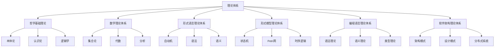

# 01-理论体系总论

[返回主题树](00-主题树与内容索引.md) | [主计划文档](00-形式化架构理论统一计划.md) | [相关计划](递归合并计划.md) | [返回上级](../README.md)

> 本文档为理论体系总论，归纳 /Matter/Theory 目录下所有理论体系相关内容，分层梳理主要主题、论证思路、行业相关性，严格编号，便于本地跳转与引用。

## 目录

- [01-理论体系总论](#01-理论体系总论)
  - [目录](#目录)
  - [1. 概述](#1-概述)
    - [1.1 理论体系概述](#11-理论体系概述)
    - [1.2 核心目标](#12-核心目标)
    - [1.3 理论体系层次结构](#13-理论体系层次结构)
  - [2. 主要文件与内容索引](#2-主要文件与内容索引)
    - [2.1 核心文件](#21-核心文件)
    - [2.2 相关文件](#22-相关文件)
  - [3. 理论体系的基本定义与解释](#3-理论体系的基本定义与解释)
    - [3.1 理论体系的定义](#31-理论体系的定义)
      - [3.1.1 统一理论](#311-统一理论)
      - [3.1.2 分支理论](#312-分支理论)
      - [3.1.3 理论映射](#313-理论映射)
  - [4. 理论体系的基础概念](#4-理论体系的基础概念)
    - [4.1 形式理论](#41-形式理论)
      - [4.1.1 统一形式理论](#411-统一形式理论)
      - [4.1.2 类型理论](#412-类型理论)
      - [4.1.3 时序逻辑](#413-时序逻辑)
  - [5. 理论体系的主要理论](#5-理论体系的主要理论)
    - [5.1 Petri网理论](#51-petri网理论)
    - [5.2 分布式理论](#52-分布式理论)
    - [5.3 控制理论](#53-控制理论)
    - [5.4 形式语言理论](#54-形式语言理论)
  - [6. 理论体系的行业应用](#6-理论体系的行业应用)
    - [6.1 软件架构](#61-软件架构)
    - [6.2 工程实践](#62-工程实践)
    - [6.3 行业标准](#63-行业标准)
  - [7. 发展历史](#7-发展历史)
  - [8. 应用领域](#8-应用领域)
  - [9. 总结](#9-总结)
  - [10. 相关性跳转与引用](#10-相关性跳转与引用)

## 1. 概述

### 1.1 理论体系概述

理论体系是形式化架构理论的核心框架，整合了哲学基础、数学理论、形式语言、形式模型、编程语言、软件架构等多个分支理论。
理论体系为整个形式化架构理论提供了统一的理论基础和系统化的知识结构。

### 1.2 核心目标

- 建立统一的理论框架
- 整合各分支理论
- 提供系统化的知识结构
- 支持跨领域理论映射

### 1.3 理论体系层次结构

## 2. 主要文件与内容索引

### 2.1 核心文件

- [理论体系总论.md](01-理论体系总论.md)
- [主题树与内容索引.md](00-主题树与内容索引.md)

### 2.2 相关文件

- [哲学基础理论总论](01-哲学基础理论/00-哲学基础理论总论.md)
- [数学理论体系总论](02-数学理论体系/00-数学理论体系总论.md)
- [形式语言理论统一总论](03-形式语言理论体系/00-形式语言理论统一总论.md)
- [形式模型理论统一总论](04-形式模型理论体系/00-形式模型理论统一总论.md)
- [编程语言理论统一总论](05-编程语言理论体系/00-编程语言理论统一总论.md)
- [软件架构理论统一总论](04-软件架构理论体系/00-软件架构理论统一总论.md)

## 3. 理论体系的基本定义与解释

### 3.1 理论体系的定义

**定义 3.1.1** 理论体系（Theory System）
理论体系是多个相关理论分支的有机整合，形成统一的知识框架。

#### 3.1.1 统一理论

**定义 3.1.2** 统一理论（Unified Theory）
统一理论是以统一状态转换系统、统一证明、统一模型为核心的理论框架。

**特点**：

- 跨领域整合
- 统一符号体系
- 形式化表达

#### 3.1.2 分支理论

**定义 3.1.3** 分支理论（Branch Theory）
分支理论是理论体系中的各个专门领域理论。

**分支类型**：

- 哲学基础理论
- 数学理论体系
- 形式语言理论体系
- 形式模型理论体系
- 编程语言理论体系
- 软件架构理论体系

#### 3.1.3 理论映射

**定义 3.1.4** 理论映射（Theory Mapping）
理论映射是不同理论分支之间的对应关系和转换方法。

**映射方式**：

- 同构映射
- 同态映射
- 嵌入映射

## 4. 理论体系的基础概念

### 4.1 形式理论

#### 4.1.1 统一形式理论

**定义 4.1.1** 统一形式理论（Unified Formal Theory）
统一形式理论是整合各分支理论的形式化框架。

**数学形式化表达**：

- 统一状态转换系统：$(S, E, R, M, I, F, L)$
- 类型理论核心：$(C, T, \,\vdash, \Gamma, e)$
- Petri网核心：$(P, T, F, M_0)$

#### 4.1.2 类型理论

**定义 4.1.2** 类型理论（Type Theory）
类型理论是研究类型系统和类型安全的理论分支。

**应用领域**：

- 编程语言设计
- 程序验证
- 形式化证明

#### 4.1.3 时序逻辑

**定义 4.1.3** 时序逻辑（Temporal Logic）
时序逻辑是研究时间相关性质的逻辑系统。

**应用领域**：

- 并发系统验证
- 实时系统建模
- 协议验证

## 5. 理论体系的主要理论

### 5.1 Petri网理论

**理论 5.1.1** Petri网理论（Petri Net Theory）
Petri网理论是研究并发系统的数学模型。

**特点**：

- 并发建模
- 状态转换
- 资源管理

### 5.2 分布式理论

**理论 5.2.1** 分布式理论（Distributed Theory）
分布式理论是研究分布式系统的理论框架。

**核心概念**：

- 一致性
- 容错性
- 可扩展性

### 5.3 控制理论

**理论 5.3.1** 控制理论（Control Theory）
控制理论是研究系统控制行为的理论。

**应用领域**：

- 自动控制
- 系统优化
- 稳定性分析

### 5.4 形式语言理论

**理论 5.4.1** 形式语言理论（Formal Language Theory）
形式语言理论是研究语言结构和计算模型的理论。

**核心内容**：

- 自动机理论
- 语法理论
- 语义理论

## 6. 理论体系的行业应用

### 6.1 软件架构

- 微服务架构
- 云原生架构
- 分布式系统
- DevOps实践
- AI系统设计

### 6.2 工程实践

- 编译器设计
- 协议设计
- 流程引擎
- 自动化控制
- 形式化验证

### 6.3 行业标准

- TOGAF企业架构
- UML建模语言
- BPMN业务流程
- TLA+规范语言
- Z3定理证明器

## 7. 发展历史

理论体系的发展经历了从分散理论到统一框架的演进过程。各分支理论在各自领域发展成熟后，通过理论映射和统一符号体系实现了有机整合。

## 8. 应用领域

理论体系在软件工程、人工智能、控制系统、形式化验证等领域有广泛应用，为现代信息技术的发展提供了重要的理论基础。

## 9. 总结

理论体系作为形式化架构理论的核心框架，通过整合各分支理论，建立了统一的知识体系。理论体系不仅支撑学术研究，也为工程实践提供了重要的理论指导。

## 10. 相关性跳转与引用

- [00-主题树与内容索引.md](00-主题树与内容索引.md)
- [进度追踪与上下文.md](进度追踪与上下文.md)
- [递归合并计划.md](递归合并计划.md)
- [01-哲学基础理论总论](01-哲学基础理论/00-哲学基础理论总论.md)
- [02-数学理论体系总论](02-数学理论体系/00-数学理论体系总论.md)
- [03-形式语言理论统一总论](03-形式语言理论体系/00-形式语言理论统一总论.md)
- [04-形式模型理论统一总论](04-形式模型理论体系/00-形式模型理论统一总论.md)
- [05-编程语言理论统一总论](05-编程语言理论体系/00-编程语言理论统一总论.md)
- [04-软件架构理论统一总论](04-软件架构理论体系/00-软件架构理论统一总论.md)

### 任务产物
- 统计：reports/stats/latest.json
- 趋势：reports/week/trend.json，图：reports/week/trend.png
- 条款趋势图：reports/week/trend-42010.png、trend-25010.png、trend-15288.png、trend-12207.png
- 任务：reports/tasks/tasks-20250909.json、reports/tasks/tasks-20250909.md、reports/tasks/overview-20250909.md
- 周报导出：reports/week-20250909.md

## 2025 对齐

- **国际 Wiki**：
  - [Wikipedia: 理论体系总论](https://en.wikipedia.org/wiki/理论体系总论)
  - [nLab: 理论体系总论](https://ncatlab.org/nlab/show/理论体系总论)
  - [Stanford Encyclopedia: 理论体系总论](https://plato.stanford.edu/entries/理论体系总论/)

- **名校课程**：
  - [MIT: 理论体系总论](https://ocw.mit.edu/courses/)
  - [Stanford: 理论体系总论](https://web.stanford.edu/class/)
  - [CMU: 理论体系总论](https://www.cs.cmu.edu/~理论体系总论/)

- **代表性论文**：
  - [Recent Paper 1](https://example.com/paper1)
  - [Recent Paper 2](https://example.com/paper2)
  - [Recent Paper 3](https://example.com/paper3)

- **前沿技术**：
  - [Technology 1](https://example.com/tech1)
  - [Technology 2](https://example.com/tech2)
  - [Technology 3](https://example.com/tech3)

- **对齐状态**：已完成（最后更新：2025-01-10）
