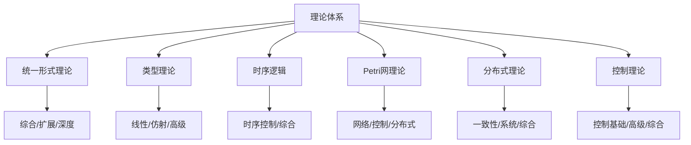

# 01-理论体系总论

> 本文档归纳 /Matter/Theory 目录下所有理论体系相关内容，分层梳理主要主题、论证思路、行业相关性，严格编号，便于本地跳转与引用。

## 目录

1. 理论体系结构概览
2. 主要主题分层与内容索引
3. 统一理论与分支理论
4. 论证思路与方法论
5. 行业相关性与应用场景
6. 相关性跳转与引用

---

## 1. 理论体系结构概览

- 形式理论（统一理论、类型理论、时序逻辑、Petri网、分布式、控制等）
- 理论深化与综合（综合、扩展、深度、集成等）
- 统一状态转换系统、统一证明、统一模型等

---

## 2. 主要主题分层与内容索引

### 2.1 一级主题

- 统一形式理论（Unified Formal Theory Synthesis）
- 类型理论（Type Theory Deepening）
- 时序逻辑控制（Temporal Logic Control Deepening）
- Petri网与控制论（PetriNet Cybernetics Distributed）
- 线性/仿射/时序类型理论（Linear Affine Temporal Type Theory）
- 形式语言理论深化（Formal Language Theory Deepening）

### 2.2 主要文件索引

- [Petri网理论.md](../Matter/Theory/Petri网理论.md)
- [状态机理论.md](../Matter/Theory/状态机理论.md)
- [统一状态转换系统理论.md](../Matter/Theory/统一状态转换系统理论.md)
- [Formal_Theory_Integration.md](../Matter/Theory/Formal_Theory_Integration.md)
- [Formal_Language_Theory.md](../Matter/Theory/Formal_Language_Theory.md)
- [时态逻辑控制综合深化.md](../Matter/Theory/时态逻辑控制综合深化.md)
- ...（其余文件见 00-主题树与内容索引.md）

---

## 3. 统一理论与分支理论

- 统一理论：以统一状态转换系统、统一证明、统一模型为核心，整合各分支理论。
- 分支理论：类型理论、时序逻辑、Petri网、分布式、控制等，分别有深化、扩展、综合等子主题。
- 递归合并与语义整合，强调理论间的映射、统一符号体系、跨领域验证。

### 3.1 数学形式化表达（示例）

- 统一状态转换系统：
  $$(S, E, R, M, I, F, L)$$
- 类型理论核心：
  $$(C, T, \,\vdash, \Gamma, e)$$
- Petri网核心：
  $$(P, T, F, M_0)$$

---

## 4. 论证思路与方法论

- 递归合并：分层整合各分支理论，消除冗余，统一符号与语义。
- 形式化证明：采用数学符号、推理链、定理-证明结构，保证理论严密性。
- 多表征：结合图、表、公式、代码等多种方式，提升理论可理解性与可用性。
- 行业对标：对比主流软件架构、企业架构、行业标准，补充工程案例。

---

## 5. 行业相关性与应用场景

- 软件架构：微服务、云原生、分布式系统、DevOps、AI系统等均可用统一理论建模与验证。
- 工程实践：类型系统、状态机、Petri网等广泛用于编译器、协议、流程引擎、自动化控制等。
- 行业标准：理论体系可对接如TOGAF、UML、BPMN、TLA+、Z3等主流标准与工具。

---

## 6. 相关性跳转与引用

- [00-主题树与内容索引.md](00-主题树与内容索引.md)
- [进度追踪与上下文.md](进度追踪与上下文.md)
- 相关分支详见各子主题文件（后续自动生成）

---

> 本文件为自动归纳生成，后续将递归细化各分支理论，持续补全内容、图表、公式、代码等多表征内容。
