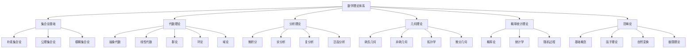

# 00-数学理论体系总论

## 目录

- [00-数学理论体系总论](#00-数学理论体系总论)
  - [目录](#目录)
  - [1. 理论概述](#1-理论概述)
    - [1.1 数学理论体系定位](#11-数学理论体系定位)
    - [1.2 理论特色](#12-理论特色)
    - [1.3 理论目标](#13-理论目标)
  - [2. 数学体系架构](#2-数学体系架构)
    - [2.1 整体架构](#21-整体架构)
    - [2.2 理论层次](#22-理论层次)
  - [3. 核心概念体系](#3-核心概念体系)
    - [3.1 集合论基础](#31-集合论基础)
      - [3.1.1 集合概念](#311-集合概念)
      - [3.1.2 基数理论](#312-基数理论)
    - [3.2 代数理论](#32-代数理论)
      - [3.2.1 群论](#321-群论)
      - [3.2.2 环论](#322-环论)
    - [3.3 分析理论](#33-分析理论)
      - [3.3.1 极限理论](#331-极限理论)
      - [3.3.2 微分理论](#332-微分理论)
    - [3.4 几何理论](#34-几何理论)
      - [3.4.1 拓扑空间](#341-拓扑空间)
      - [3.4.2 流形理论](#342-流形理论)
    - [3.5 概率统计理论](#35-概率统计理论)
      - [3.5.1 概率论](#351-概率论)
      - [3.5.2 统计学](#352-统计学)
    - [3.6 范畴论](#36-范畴论)
      - [3.6.1 基础概念](#361-基础概念)
      - [3.6.2 函子理论](#362-函子理论)
  - [4. 形式化表示](#4-形式化表示)
    - [4.1 数学符号系统](#41-数学符号系统)
      - [4.1.1 集合论符号](#411-集合论符号)
      - [4.1.2 代数符号](#412-代数符号)
      - [4.1.3 分析符号](#413-分析符号)
      - [4.1.4 逻辑符号](#414-逻辑符号)
    - [4.2 形式化公理](#42-形式化公理)
      - [4.2.1 集合论公理](#421-集合论公理)
      - [4.2.2 群论公理](#422-群论公理)
      - [4.2.3 拓扑公理](#423-拓扑公理)
  - [5. 跨学科整合](#5-跨学科整合)
    - [5.1 与计算机科学的整合](#51-与计算机科学的整合)
      - [5.1.1 算法理论](#511-算法理论)
      - [5.1.2 形式化方法](#512-形式化方法)
    - [5.2 与物理学的整合](#52-与物理学的整合)
      - [5.2.1 数学物理](#521-数学物理)
      - [5.2.2 量子力学](#522-量子力学)
    - [5.3 与认知科学的整合](#53-与认知科学的整合)
      - [5.3.1 认知建模](#531-认知建模)
      - [5.3.2 认知架构](#532-认知架构)
  - [6. 理论应用](#6-理论应用)
    - [6.1 软件工程应用](#61-软件工程应用)
      - [6.1.1 软件架构](#611-软件架构)
      - [6.1.2 程序验证](#612-程序验证)
    - [6.2 人工智能应用](#62-人工智能应用)
      - [6.2.1 机器学习](#621-机器学习)
      - [6.2.2 深度学习](#622-深度学习)
    - [6.3 系统科学应用](#63-系统科学应用)
      - [6.3.1 复杂系统](#631-复杂系统)
      - [6.3.2 控制理论](#632-控制理论)
  - [7. 参考文献](#7-参考文献)
    - [7.1 经典文献](#71-经典文献)
    - [7.2 现代文献](#72-现代文献)
    - [7.3 应用文献](#73-应用文献)

## 1. 理论概述

### 1.1 数学理论体系定位

数学理论体系是形式化架构理论的核心支柱，为整个理论体系提供：

- **形式化语言**：精确的符号系统和表达方式
- **逻辑基础**：严格的推理规则和证明方法
- **结构理论**：抽象的结构关系和模式
- **计算模型**：可计算的数学对象和算法
- **应用框架**：实际问题的数学建模方法

### 1.2 理论特色

本数学理论体系具有以下特色：

1. **高度抽象**：使用范畴论作为统一的理论框架
2. **形式化程度高**：严格的公理化方法和符号系统
3. **跨学科整合**：与计算机科学、物理学、认知科学深度融合
4. **应用导向**：强调数学在实际系统中的应用
5. **认知视角**：从认知科学角度理解数学思维

### 1.3 理论目标

- 建立统一的数学概念体系
- 提供形式化的数学分析方法
- 支持跨学科的数学应用
- 为软件架构和系统设计提供数学基础

## 2. 数学体系架构

### 2.1 整体架构



### 2.2 理论层次

| 层次 | 内容 | 抽象程度 | 应用领域 |
|------|------|----------|----------|
| **基础层** | 集合论、逻辑 | 低 | 所有数学分支 |
| **结构层** | 代数、几何 | 中 | 结构分析 |
| **分析层** | 分析、拓扑 | 中高 | 连续现象 |
| **概率层** | 概率、统计 | 中 | 随机现象 |
| **抽象层** | 范畴论 | 极高 | 统一理论 |

## 3. 核心概念体系

### 3.1 集合论基础

#### 3.1.1 集合概念

```rust
// 集合的基本定义
trait Set {
    fn contains(&self, element: &Element) -> bool;
    fn cardinality(&self) -> Cardinality;
    fn is_empty(&self) -> bool;
    fn is_finite(&self) -> bool;
}

// 集合运算
struct SetOperations {
    union: fn(&Set, &Set) -> Set,
    intersection: fn(&Set, &Set) -> Set,
    difference: fn(&Set, &Set) -> Set,
    complement: fn(&Set, &Set) -> Set
}

// 关系
struct Relation {
    domain: Set,
    codomain: Set,
    pairs: Vec<(Element, Element)>
}

// 函数
struct Function {
    domain: Set,
    codomain: Set,
    mapping: Vec<(Element, Element)>,
    injective: bool,
    surjective: bool,
    bijective: bool
}
```

#### 3.1.2 基数理论

```rust
// 基数
enum Cardinality {
    Finite(usize),
    Countable,
    Uncountable
}

// 基数运算
struct CardinalityOperations {
    addition: fn(Cardinality, Cardinality) -> Cardinality,
    multiplication: fn(Cardinality, Cardinality) -> Cardinality,
    exponentiation: fn(Cardinality, Cardinality) -> Cardinality
}
```

### 3.2 代数理论

#### 3.2.1 群论

```rust
// 群
struct Group {
    set: Set,
    operation: BinaryOperation,
    identity: Element,
    inverses: Vec<(Element, Element)>
}

impl Group {
    fn is_group(&self) -> bool {
        // 检查群公理
        self.closure() && 
        self.associativity() && 
        self.identity_exists() && 
        self.inverses_exist()
    }
    
    fn closure(&self) -> bool {
        // 检查封闭性
    }
    
    fn associativity(&self) -> bool {
        // 检查结合律
    }
    
    fn identity_exists(&self) -> bool {
        // 检查单位元存在性
    }
    
    fn inverses_exist(&self) -> bool {
        // 检查逆元存在性
    }
}

// 子群
struct Subgroup {
    parent: Group,
    subset: Set,
    inherited_operation: BinaryOperation
}

// 同态
struct Homomorphism {
    source: Group,
    target: Group,
    mapping: Function,
    preserves_operation: bool
}
```

#### 3.2.2 环论

```rust
// 环
struct Ring {
    set: Set,
    addition: BinaryOperation,
    multiplication: BinaryOperation,
    additive_identity: Element,
    multiplicative_identity: Option<Element>
}

impl Ring {
    fn is_ring(&self) -> bool {
        // 检查环公理
        self.additive_group() && 
        self.multiplicative_semigroup() && 
        self.distributivity()
    }
}

// 域
struct Field {
    ring: Ring,
    multiplicative_inverses: Vec<(Element, Element)>
}

impl Field {
    fn is_field(&self) -> bool {
        self.ring.is_ring() && 
        self.multiplicative_group()
    }
}
```

### 3.3 分析理论

#### 3.3.1 极限理论

```rust
// 极限
struct Limit {
    sequence: Sequence,
    limit_value: Real,
    convergence: ConvergenceType
}

// 序列
struct Sequence {
    domain: NaturalNumbers,
    codomain: RealNumbers,
    terms: Vec<Real>
}

// 收敛类型
enum ConvergenceType {
    Pointwise,
    Uniform,
    AlmostEverywhere,
    InMeasure
}

// 连续性
struct Continuity {
    function: Function,
    domain: Set,
    continuity_type: ContinuityType
}

enum ContinuityType {
    Pointwise,
    Uniform,
    Lipschitz,
    Holder
}
```

#### 3.3.2 微分理论

```rust
// 导数
struct Derivative {
    function: Function,
    point: Real,
    derivative_value: Real,
    differentiability: bool
}

// 偏导数
struct PartialDerivative {
    function: MultivariateFunction,
    variable: Variable,
    point: Vector,
    partial_derivative: Real
}

// 梯度
struct Gradient {
    function: MultivariateFunction,
    point: Vector,
    gradient_vector: Vector
}
```

### 3.4 几何理论

#### 3.4.1 拓扑空间

```rust
// 拓扑空间
struct TopologicalSpace {
    set: Set,
    topology: Topology,
    open_sets: Vec<Set>
}

// 拓扑
struct Topology {
    open_sets: Vec<Set>,
    axioms: Vec<TopologyAxiom>
}

// 拓扑公理
enum TopologyAxiom {
    EmptySetOpen,
    WholeSetOpen,
    UnionOpen,
    IntersectionOpen
}

// 连续映射
struct ContinuousMapping {
    source: TopologicalSpace,
    target: TopologicalSpace,
    function: Function,
    continuity: bool
}
```

#### 3.4.2 流形理论

```rust
// 流形
struct Manifold {
    topological_space: TopologicalSpace,
    dimension: usize,
    charts: Vec<Chart>,
    atlas: Atlas
}

// 坐标卡
struct Chart {
    domain: OpenSet,
    codomain: EuclideanSpace,
    homeomorphism: Homeomorphism
}

// 切空间
struct TangentSpace {
    manifold: Manifold,
    point: Point,
    tangent_vectors: Vec<TangentVector>
}
```

### 3.5 概率统计理论

#### 3.5.1 概率论

```rust
// 概率空间
struct ProbabilitySpace {
    sample_space: Set,
    sigma_algebra: SigmaAlgebra,
    probability_measure: ProbabilityMeasure
}

// σ-代数
struct SigmaAlgebra {
    set: Set,
    subsets: Vec<Set>,
    closed_under_complement: bool,
    closed_under_countable_union: bool
}

// 概率测度
struct ProbabilityMeasure {
    domain: SigmaAlgebra,
    codomain: Interval,
    properties: Vec<MeasureProperty>
}

// 随机变量
struct RandomVariable {
    probability_space: ProbabilitySpace,
    codomain: Set,
    function: Function,
    distribution: Distribution
}
```

#### 3.5.2 统计学

```rust
// 统计推断
struct StatisticalInference {
    data: Dataset,
    model: StatisticalModel,
    inference_method: InferenceMethod
}

// 统计模型
struct StatisticalModel {
    family: DistributionFamily,
    parameters: Vec<Parameter>,
    likelihood: LikelihoodFunction
}

// 假设检验
struct HypothesisTest {
    null_hypothesis: Hypothesis,
    alternative_hypothesis: Hypothesis,
    test_statistic: TestStatistic,
    significance_level: Real
}
```

### 3.6 范畴论

#### 3.6.1 基础概念

```rust
// 范畴
struct Category {
    objects: Vec<Object>,
    morphisms: Vec<Morphism>,
    composition: Composition,
    identity: Identity
}

// 对象
struct Object {
    id: ObjectId,
    properties: Vec<Property>
}

// 态射
struct Morphism {
    source: Object,
    target: Object,
    properties: Vec<MorphismProperty>
}

// 复合
struct Composition {
    morphisms: Vec<Morphism>,
    result: Morphism,
    associativity: bool
}
```

#### 3.6.2 函子理论

```rust
// 函子
struct Functor {
    source: Category,
    target: Category,
    object_mapping: ObjectMapping,
    morphism_mapping: MorphismMapping
}

// 对象映射
struct ObjectMapping {
    source_objects: Vec<Object>,
    target_objects: Vec<Object>,
    mapping: Function
}

// 态射映射
struct MorphismMapping {
    source_morphisms: Vec<Morphism>,
    target_morphisms: Vec<Morphism>,
    mapping: Function
}
```

## 4. 形式化表示

### 4.1 数学符号系统

#### 4.1.1 集合论符号

- $\in$ : 属于关系
- $\notin$ : 不属于关系
- $\subset$ : 真包含
- $\subseteq$ : 包含
- $\cup$ : 并集
- $\cap$ : 交集
- $\setminus$ : 差集
- $\emptyset$ : 空集

#### 4.1.2 代数符号

- $+$ : 加法运算
- $\cdot$ : 乘法运算
- $0$ : 加法单位元
- $1$ : 乘法单位元
- $-a$ : 加法逆元
- $a^{-1}$ : 乘法逆元
- $\langle G, \cdot \rangle$ : 群

#### 4.1.3 分析符号

- $\lim$ : 极限
- $\frac{d}{dx}$ : 导数
- $\int$ : 积分
- $\sum$ : 求和
- $\prod$ : 求积
- $\infty$ : 无穷大

#### 4.1.4 逻辑符号

- $\forall$ : 全称量词
- $\exists$ : 存在量词
- $\land$ : 合取
- $\lor$ : 析取
- $\neg$ : 否定
- $\rightarrow$ : 蕴含
- $\leftrightarrow$ : 等价

### 4.2 形式化公理

#### 4.2.1 集合论公理

**外延公理**：
$$\forall x \forall y (\forall z (z \in x \leftrightarrow z \in y) \rightarrow x = y)$$

**空集公理**：
$$\exists x \forall y (y \notin x)$$

**配对公理**：
$$\forall x \forall y \exists z \forall w (w \in z \leftrightarrow w = x \lor w = y)$$

**并集公理**：
$$\forall x \exists y \forall z (z \in y \leftrightarrow \exists w (w \in x \land z \in w))$$

#### 4.2.2 群论公理

**封闭性**：
$$\forall a \forall b (a \in G \land b \in G \rightarrow a \cdot b \in G)$$

**结合律**：
$$\forall a \forall b \forall c ((a \cdot b) \cdot c = a \cdot (b \cdot c))$$

**单位元**：
$$\exists e \forall a (e \cdot a = a \cdot e = a)$$

**逆元**：
$$\forall a \exists a^{-1} (a \cdot a^{-1} = a^{-1} \cdot a = e)$$

#### 4.2.3 拓扑公理

**空集和全集**：
$$\emptyset \in \mathcal{T} \land X \in \mathcal{T}$$

**有限交**：
$$\forall A \forall B (A \in \mathcal{T} \land B \in \mathcal{T} \rightarrow A \cap B \in \mathcal{T})$$

**任意并**：
$$\forall \mathcal{A} (\mathcal{A} \subseteq \mathcal{T} \rightarrow \bigcup \mathcal{A} \in \mathcal{T})$$

## 5. 跨学科整合

### 5.1 与计算机科学的整合

#### 5.1.1 算法理论

数学理论体系与算法理论的整合：

1. **复杂度理论**：使用数学方法分析算法复杂度
2. **数据结构**：使用数学结构设计数据结构
3. **图论**：使用图论解决算法问题
4. **优化理论**：使用数学优化方法

#### 5.1.2 形式化方法

与形式化方法的整合：

1. **模型检查**：使用数学逻辑进行模型验证
2. **定理证明**：使用数学证明方法验证程序
3. **类型理论**：使用数学类型系统
4. **程序语义**：使用数学语义学

### 5.2 与物理学的整合

#### 5.2.1 数学物理

与数学物理的整合：

1. **微分方程**：使用分析理论解决物理问题
2. **群论**：使用群论研究对称性
3. **拓扑学**：使用拓扑学研究空间结构
4. **概率论**：使用概率论研究随机现象

#### 5.2.2 量子力学

与量子力学的整合：

1. **希尔伯特空间**：使用泛函分析
2. **算子理论**：使用线性代数
3. **群表示论**：使用群论
4. **路径积分**：使用分析理论

### 5.3 与认知科学的整合

#### 5.3.1 认知建模

与认知科学的整合：

1. **神经网络**：使用线性代数和分析
2. **概率推理**：使用概率论和统计学
3. **逻辑推理**：使用逻辑学
4. **学习理论**：使用优化理论

#### 5.3.2 认知架构

与认知架构的整合：

1. **符号系统**：使用代数理论
2. **空间认知**：使用几何理论
3. **时间认知**：使用分析理论
4. **不确定性**：使用概率论

## 6. 理论应用

### 6.1 软件工程应用

#### 6.1.1 软件架构

数学理论在软件架构中的应用：

1. **模块化设计**：使用群论和代数结构
2. **接口设计**：使用类型理论和范畴论
3. **并发控制**：使用图论和代数
4. **性能优化**：使用优化理论

#### 6.1.2 程序验证

数学理论在程序验证中的应用：

1. **形式化验证**：使用逻辑学和证明理论
2. **模型检查**：使用图论和自动机理论
3. **类型检查**：使用类型理论和范畴论
4. **静态分析**：使用抽象解释

### 6.2 人工智能应用

#### 6.2.1 机器学习

数学理论在机器学习中的应用：

1. **线性代数**：用于数据处理和特征提取
2. **概率论**：用于贝叶斯推理和不确定性建模
3. **优化理论**：用于参数优化和训练算法
4. **信息论**：用于特征选择和模型评估

#### 6.2.2 深度学习

数学理论在深度学习中的应用：

1. **张量代数**：用于多维数据处理
2. **微分几何**：用于流形学习和几何深度学习
3. **拓扑学**：用于拓扑数据分析
4. **群论**：用于对称性学习和不变性

### 6.3 系统科学应用

#### 6.3.1 复杂系统

数学理论在复杂系统中的应用：

1. **图论**：用于网络分析和系统结构
2. **动力系统**：用于系统演化分析
3. **统计力学**：用于系统统计性质
4. **信息论**：用于系统信息处理

#### 6.3.2 控制理论

数学理论在控制理论中的应用：

1. **线性代数**：用于状态空间分析
2. **微分方程**：用于系统动力学
3. **优化理论**：用于最优控制
4. **概率论**：用于随机控制

## 7. 参考文献

### 7.1 经典文献

1. Bourbaki, N. *Elements of Mathematics*.
2. Lang, S. *Algebra*.
3. Rudin, W. *Principles of Mathematical Analysis*.
4. Munkres, J. *Topology*.

### 7.2 现代文献

1. Mac Lane, S. *Categories for the Working Mathematician*.
2. Hungerford, T. *Algebra*.
3. Royden, H. *Real Analysis*.
4. Hatcher, A. *Algebraic Topology*.

### 7.3 应用文献

1. Strang, G. *Linear Algebra and Its Applications*.
2. Billingsley, P. *Probability and Measure*.
3. Boyd, S. *Convex Optimization*.
4. Cover, T. *Elements of Information Theory*.

---

**文件**: `00-数学理论体系总论.md`  
**版本**: v60  
**创建时间**: 2024年  
**最后更新**: 2024年当前时间  
**相关文件**:

- [01-集合论基础](01-集合论基础.md)
- [02-代数理论](02-代数理论.md)
- [03-分析理论](03-分析理论.md)
- [04-几何理论](04-几何理论.md)
- [05-概率统计理论](05-概率统计理论.md)
