# 00-数学理论体系总论：形式化数学理论体系

## 目录

1. [1.0 数学理论体系概述](#10-数学理论体系概述)
2. [2.0 数学基础公理系统](#20-数学基础公理系统)
3. [3.0 集合论基础理论](#30-集合论基础理论)
4. [4.0 代数理论体系](#40-代数理论体系)
5. [5.0 几何理论体系](#50-几何理论体系)
6. [6.0 分析理论体系](#60-分析理论体系)
7. [7.0 数论基础理论](#70-数论基础理论)
8. [8.0 概率统计理论](#80-概率统计理论)
9. [9.0 范畴论统一框架](#90-范畴论统一框架)
10. [10.0 数学应用与实践](#100-数学应用与实践)

## 1.0 数学理论体系概述

### 1.1 数学理论体系定义

**定义 1.1.1 (数学理论体系)**
数学理论体系是一个八元组 $\mathcal{MT} = (\mathcal{S}, \mathcal{A}, \mathcal{G}, \mathcal{N}, \mathcal{P}, \mathcal{C}, \mathcal{F}, \mathcal{U})$，其中：

- $\mathcal{S}$ 是集合论理论集合 (Set Theory)
- $\mathcal{A}$ 是代数理论集合 (Algebra Theory)
- $\mathcal{G}$ 是几何理论集合 (Geometry Theory)
- $\mathcal{N}$ 是数论理论集合 (Number Theory)
- $\mathcal{P}$ 是概率统计理论集合 (Probability Theory)
- $\mathcal{C}$ 是范畴论理论集合 (Category Theory)
- $\mathcal{F}$ 是形式化理论集合 (Formal Theory)
- $\mathcal{U}$ 是理论统一框架集合 (Unification Framework)

**公理 1.1.1 (数学理论一致性)**
数学理论体系 $\mathcal{MT}$ 满足：
$$\forall t_1, t_2 \in \mathcal{S} \cup \mathcal{A} \cup \mathcal{G} \cup \mathcal{N} \cup \mathcal{P} \cup \mathcal{C} \cup \mathcal{F} \cup \mathcal{U}, \quad \text{Consistent}(t_1, t_2)$$

**公理 1.1.2 (数学理论完备性)**
对于任意数学问题 $p$，存在理论 $t \in \mathcal{MT}$ 能够形式化描述和解决 $p$。

### 1.2 数学理论体系架构

```mermaid
graph TB
    A[数学理论体系] --> B[集合论基础]
    A --> C[代数理论]
    A --> D[几何理论]
    A --> E[分析理论]
    A --> F[数论基础]
    A --> G[概率统计]
    A --> H[范畴论统一]
    A --> I[形式化理论]
    
    B --> B1[朴素集合论]
    B --> B2[公理集合论]
    B --> B3[描述集合论]
    B --> B4[模糊集合论]
    
    C --> C1[群论]
    C --> C2[环论]
    C --> C3[域论]
    C --> C4[线性代数]
    C --> C5[抽象代数]
    
    D --> D1[欧氏几何]
    D --> D2[非欧几何]
    D --> D3[拓扑学]
    D --> D4[微分几何]
    D --> D5[代数几何]
    
    E --> E1[微积分]
    E --> E2[实分析]
    E --> E3[复分析]
    E --> E4[泛函分析]
    E --> E5[微分方程]
    
    F --> F1[初等数论]
    F --> F2[代数数论]
    F --> F3[解析数论]
    F --> F4[组合数论]
    
    G --> G1[概率论]
    G --> G2[统计学]
    G --> G3[随机过程]
    G --> G4[信息论]
    
    H --> H1[基础范畴论]
    H --> H2[函子理论]
    H --> H3[自然变换]
    H --> H4[极限理论]
    H --> H5[同调代数]
    
    I --> I1[形式语言]
    I --> I2[自动机理论]
    I --> I3[计算理论]
    I --> I4[证明理论]
```

### 1.3 数学理论层次结构

**定义 1.3.1 (数学理论层次)**
数学理论层次是一个五层结构 $\mathcal{H}_M = (L_1, L_2, L_3, L_4, L_5)$，其中：

- $L_1$ 是基础数学层 (Basic Mathematical Layer)
- $L_2$ 是结构数学层 (Structural Mathematical Layer)
- $L_3$ 是抽象数学层 (Abstract Mathematical Layer)
- $L_4$ 是应用数学层 (Applied Mathematical Layer)
- $L_5$ 是统一数学层 (Unified Mathematical Layer)

**定理 1.3.1 (数学层次依赖关系)**
对于任意数学理论 $m_i \in L_i, m_j \in L_j$，如果 $i < j$，则 $m_i$ 为 $m_j$ 提供基础，记为 $m_i \prec m_j$。

## 2.0 数学基础公理系统

### 2.1 集合论公理

**公理 2.1.1 (外延公理)**
两个集合相等当且仅当它们包含相同的元素：
$$\forall x \forall y (\forall z(z \in x \leftrightarrow z \in y) \rightarrow x = y)$$

**公理 2.1.2 (空集公理)**
存在一个不包含任何元素的集合：
$$\exists x \forall y(y \notin x)$$

**公理 2.1.3 (配对公理)**
对于任意两个集合，存在包含它们的集合：
$$\forall x \forall y \exists z \forall w(w \in z \leftrightarrow w = x \lor w = y)$$

**公理 2.1.4 (并集公理)**
对于任意集合族，存在包含所有成员元素的集合：
$$\forall F \exists A \forall x(x \in A \leftrightarrow \exists B(B \in F \land x \in B))$$

**公理 2.1.5 (幂集公理)**
对于任意集合，存在包含其所有子集的集合：
$$\forall x \exists y \forall z(z \in y \leftrightarrow z \subseteq x)$$

### 2.2 逻辑公理

**公理 2.2.1 (命题逻辑公理)**:

- 同一律：$A \rightarrow A$
- 排中律：$A \lor \neg A$
- 矛盾律：$\neg(A \land \neg A)$

**公理 2.2.2 (谓词逻辑公理)**:

- 全称实例化：$\forall x A(x) \rightarrow A(t)$
- 存在概括：$A(t) \rightarrow \exists x A(x)$

**公理 2.2.3 (推理规则)**:

- 分离规则：$A \rightarrow B, A \vdash B$
- 概括规则：$A \vdash \forall x A$

### 2.3 数系公理

**公理 2.3.1 (皮亚诺公理)**
自然数系统满足：

1. $0$ 是自然数
2. 每个自然数都有唯一的后继
3. $0$ 不是任何自然数的后继
4. 不同的自然数有不同的后继
5. 数学归纳原理

**公理 2.3.2 (实数公理)**
实数系统是完备的有序域：

1. 域公理
2. 序公理
3. 完备性公理

## 3.0 集合论基础理论

### 3.1 集合基本概念

**定义 3.1.1 (集合)**
集合是满足外延公理的对象，即两个集合相等当且仅当它们包含相同的元素。

**定义 3.1.2 (集合运算)**:

- 并集：$A \cup B = \{x \mid x \in A \lor x \in B\}$
- 交集：$A \cap B = \{x \mid x \in A \land x \in B\}$
- 差集：$A \setminus B = \{x \mid x \in A \land x \notin B\}$
- 补集：$A^c = \{x \mid x \notin A\}$

**定义 3.1.3 (集合关系)**:

- 包含：$A \subseteq B \Leftrightarrow \forall x(x \in A \rightarrow x \in B)$
- 真包含：$A \subset B \Leftrightarrow A \subseteq B \land A \neq B$
- 相等：$A = B \Leftrightarrow A \subseteq B \land B \subseteq A$

### 3.2 基数理论

**定义 3.2.1 (基数)**
集合 $A$ 的基数是与 $A$ 等势的序数中的最小者，记为 $|A|$。

**定义 3.2.2 (可数集)**
集合 $A$ 是可数的，如果 $|A| \leq \aleph_0$。

**定义 3.2.3 (连续统假设)**
连续统假设断言：$2^{\aleph_0} = \aleph_1$。

**定理 3.2.1 (康托尔定理)**
对于任意集合 $A$，$|A| < |\mathcal{P}(A)|$。

**证明** 通过康托尔对角线法：

1. 假设存在双射 $f: A \to \mathcal{P}(A)$
2. 构造集合 $B = \{x \in A \mid x \notin f(x)\}$
3. 如果 $B = f(y)$，则 $y \in B \Leftrightarrow y \notin f(y)$
4. 矛盾，因此不存在这样的双射

### 3.3 序数理论

**定义 3.3.1 (序数)**
序数是传递的良序集合。

**定义 3.3.2 (序数运算)**:

- 序数和：$\alpha + \beta = \text{ord}(\alpha \sqcup \beta)$
- 序数积：$\alpha \cdot \beta = \text{ord}(\alpha \times \beta)$
- 序数幂：$\alpha^\beta = \text{ord}(\alpha^\beta)$

**定理 3.3.1 (序数良序定理)**
任意序数集合都有最小元素。

## 4.0 代数理论体系

### 4.1 群论

**定义 4.1.1 (群)**
群是一个四元组 $(G, \cdot, e, ^{-1})$，其中：

- $G$ 是集合
- $\cdot: G \times G \to G$ 是二元运算
- $e \in G$ 是单位元
- $^{-1}: G \to G$ 是逆元函数

满足以下公理：

1. 结合律：$(a \cdot b) \cdot c = a \cdot (b \cdot c)$
2. 单位元：$e \cdot a = a \cdot e = a$
3. 逆元：$a \cdot a^{-1} = a^{-1} \cdot a = e$

**定义 4.1.2 (子群)**
群 $G$ 的子群是 $G$ 的子集 $H$，使得 $(H, \cdot, e, ^{-1})$ 也是群。

**定理 4.1.1 (拉格朗日定理)**
有限群 $G$ 的子群 $H$ 的阶整除 $G$ 的阶：$|H| \mid |G|$。

### 4.2 环论

**定义 4.2.1 (环)**
环是一个五元组 $(R, +, \cdot, 0, -)$，其中：

- $R$ 是集合
- $+: R \times R \to R$ 是加法运算
- $\cdot: R \times R \to R$ 是乘法运算
- $0 \in R$ 是加法单位元
- $-: R \to R$ 是加法逆元函数

满足以下公理：

1. $(R, +, 0, -)$ 是阿贝尔群
2. 乘法结合律：$(a \cdot b) \cdot c = a \cdot (b \cdot c)$
3. 分配律：$a \cdot (b + c) = a \cdot b + a \cdot c$

**定义 4.2.2 (域)**
域是交换环，其中非零元素都有乘法逆元。

### 4.3 线性代数

**定义 4.3.1 (向量空间)**
向量空间是一个五元组 $(V, F, +, \cdot, 0)$，其中：

- $V$ 是向量集合
- $F$ 是标量域
- $+: V \times V \to V$ 是向量加法
- $\cdot: F \times V \to V$ 是标量乘法
- $0 \in V$ 是零向量

**定义 4.3.2 (线性变换)**
线性变换是保持向量加法和标量乘法的函数：
$$T(a\mathbf{v} + b\mathbf{w}) = aT(\mathbf{v}) + bT(\mathbf{w})$$

**定理 4.3.1 (秩-零化度定理)**
对于线性变换 $T: V \to W$：
$$\dim(\ker(T)) + \dim(\text{im}(T)) = \dim(V)$$

## 5.0 几何理论体系

### 5.1 欧氏几何

**定义 5.1.1 (欧氏空间)**
欧氏空间是装备了欧氏度量的向量空间。

**定义 5.1.2 (欧氏度量)**
欧氏度量是满足以下条件的函数 $d: \mathbb{R}^n \times \mathbb{R}^n \to \mathbb{R}$：

1. 正定性：$d(x, y) \geq 0$，且 $d(x, y) = 0 \Leftrightarrow x = y$
2. 对称性：$d(x, y) = d(y, x)$
3. 三角不等式：$d(x, z) \leq d(x, y) + d(y, z)$

**定理 5.1.1 (毕达哥拉斯定理)**
在直角三角形中：$a^2 + b^2 = c^2$

### 5.2 拓扑学

**定义 5.2.1 (拓扑空间)**
拓扑空间是一个二元组 $(X, \tau)$，其中：

- $X$ 是集合
- $\tau \subseteq \mathcal{P}(X)$ 是开集族

满足以下公理：

1. $\emptyset, X \in \tau$
2. 有限交封闭：$U, V \in \tau \Rightarrow U \cap V \in \tau$
3. 任意并封闭：$\{U_i\}_{i \in I} \subseteq \tau \Rightarrow \bigcup_{i \in I} U_i \in \tau$

**定义 5.2.2 (连续映射)**
映射 $f: X \to Y$ 连续，如果对于任意开集 $V \subseteq Y$，$f^{-1}(V)$ 是开集。

**定义 5.2.3 (同胚)**
同胚是双射的连续映射，其逆映射也连续。

### 5.3 微分几何

**定义 5.3.1 (流形)**
$n$ 维流形是局部同胚于 $\mathbb{R}^n$ 的拓扑空间。

**定义 5.3.2 (切空间)**
点 $p$ 处的切空间是所有在该点的切向量的集合。

**定义 5.3.3 (黎曼度量)**
黎曼度量是切空间上的正定对称双线性形式。

## 6.0 分析理论体系

### 6.1 微积分

**定义 6.1.1 (极限)**
函数 $f$ 在 $a$ 处的极限是 $L$，记为 $\lim_{x \to a} f(x) = L$，如果：
$$\forall \epsilon > 0 \exists \delta > 0 \forall x(0 < |x - a| < \delta \Rightarrow |f(x) - L| < \epsilon)$$

**定义 6.1.2 (导数)**
函数 $f$ 在 $a$ 处的导数是：
$$f'(a) = \lim_{h \to 0} \frac{f(a + h) - f(a)}{h}$$

**定义 6.1.3 (积分)**
函数 $f$ 在区间 $[a, b]$ 上的定积分是：
$$\int_a^b f(x) dx = \lim_{n \to \infty} \sum_{i=1}^n f(x_i) \Delta x$$

**定理 6.1.1 (微积分基本定理)**
如果 $F$ 是 $f$ 的原函数，则：
$$\int_a^b f(x) dx = F(b) - F(a)$$

### 6.2 实分析

**定义 6.2.1 (收敛序列)**
序列 $\{a_n\}$ 收敛到 $L$，如果：
$$\forall \epsilon > 0 \exists N \forall n > N(|a_n - L| < \epsilon)$$

**定义 6.2.2 (柯西序列)**
序列 $\{a_n\}$ 是柯西序列，如果：
$$\forall \epsilon > 0 \exists N \forall m, n > N(|a_m - a_n| < \epsilon)$$

**定理 6.2.1 (完备性定理)**
实数序列收敛当且仅当它是柯西序列。

### 6.3 复分析

**定义 6.3.1 (复函数)**
复函数是从复数集到复数集的映射。

**定义 6.3.2 (解析函数)**
复函数 $f$ 在点 $z_0$ 解析，如果它在 $z_0$ 的某个邻域内可展开为幂级数。

**定理 6.3.1 (柯西积分定理)**
如果 $f$ 在简单闭曲线 $C$ 内部解析，则：
$$\oint_C f(z) dz = 0$$

## 7.0 数论基础理论

### 7.1 初等数论

**定义 7.1.1 (整除)**
整数 $a$ 整除整数 $b$，记为 $a \mid b$，如果存在整数 $c$ 使得 $b = ac$。

**定义 7.1.2 (素数)**
素数 $p$ 是大于1的整数，其正因子只有1和自身。

**定理 7.1.1 (算术基本定理)**
每个大于1的整数都可以唯一地表示为素数的乘积。

**定理 7.1.2 (费马小定理)**
如果 $p$ 是素数，$a$ 不是 $p$ 的倍数，则：
$$a^{p-1} \equiv 1 \pmod{p}$$

### 7.2 代数数论

**定义 7.2.1 (代数数)**
代数数是某个有理系数多项式的根。

**定义 7.2.2 (代数整数)**
代数整数是首一整数系数多项式的根。

**定理 7.2.1 (代数数域)**
代数数构成一个域。

### 7.3 解析数论

**定义 7.3.1 (黎曼ζ函数)**
黎曼ζ函数定义为：
$$\zeta(s) = \sum_{n=1}^{\infty} \frac{1}{n^s}$$

**定理 7.3.1 (素数定理)**
设 $\pi(x)$ 表示不超过 $x$ 的素数个数，则：
$$\lim_{x \to \infty} \frac{\pi(x)}{x/\ln x} = 1$$

## 8.0 概率统计理论

### 8.1 概率论

**定义 8.1.1 (概率空间)**
概率空间是一个三元组 $(\Omega, \mathcal{F}, P)$，其中：

- $\Omega$ 是样本空间
- $\mathcal{F}$ 是事件σ代数
- $P: \mathcal{F} \to [0, 1]$ 是概率测度

**定义 8.1.2 (随机变量)**
随机变量是从样本空间到实数的可测函数。

**定义 8.1.3 (期望)**
随机变量 $X$ 的期望是：
$$E[X] = \int_{\Omega} X(\omega) dP(\omega)$$

**定理 8.1.1 (大数定律)**
设 $\{X_n\}$ 是独立同分布的随机变量序列，则：
$$\frac{1}{n} \sum_{i=1}^n X_i \to E[X_1] \text{ a.s.}$$

### 8.2 统计学

**定义 8.2.1 (统计量)**
统计量是样本的函数，不依赖于未知参数。

**定义 8.2.2 (估计量)**
估计量是用于估计未知参数的统计量。

**定义 8.2.3 (假设检验)**
假设检验是判断统计假设是否成立的程序。

**定理 8.2.1 (中心极限定理)**
设 $\{X_n\}$ 是独立同分布的随机变量序列，则：
$$\frac{\sum_{i=1}^n X_i - n\mu}{\sqrt{n}\sigma} \to N(0, 1)$$

### 8.3 信息论

**定义 8.3.1 (熵)**
随机变量 $X$ 的熵是：
$$H(X) = -\sum_{x} p(x) \log p(x)$$

**定义 8.3.2 (互信息)**
随机变量 $X$ 和 $Y$ 的互信息是：
$$I(X; Y) = H(X) - H(X|Y)$$

**定理 8.3.1 (香农编码定理)**
对于任意 $\epsilon > 0$，存在编码方案使得平均码长不超过 $H(X) + \epsilon$。

## 9.0 范畴论统一框架

### 9.1 基础范畴论

**定义 9.1.1 (范畴)**
范畴是一个四元组 $\mathcal{C} = (\text{Ob}(\mathcal{C}), \text{Hom}(\mathcal{C}), \circ, 1)$，其中：

- $\text{Ob}(\mathcal{C})$ 是对象集合
- $\text{Hom}(\mathcal{C})$ 是态射集合
- $\circ$ 是态射复合
- $1$ 是恒等态射

满足以下公理：

1. 结合律：$(f \circ g) \circ h = f \circ (g \circ h)$
2. 单位律：$1_A \circ f = f \circ 1_B = f$

**定义 9.1.2 (函子)**
函子是从范畴 $\mathcal{C}$ 到范畴 $\mathcal{D}$ 的映射，保持对象和态射的结构。

**定义 9.1.3 (自然变换)**
自然变换是从函子 $F$ 到函子 $G$ 的态射族，满足自然性条件。

### 9.2 极限理论

**定义 9.2.1 (极限)**
图 $D$ 的极限是满足泛性质的锥。

**定义 9.2.2 (余极限)**
图 $D$ 的余极限是满足泛性质的余锥。

**定理 9.2.1 (极限存在性)**
如果范畴 $\mathcal{C}$ 有所有小极限，则 $\mathcal{C}$ 是完备的。

### 9.3 同调代数

**定义 9.3.1 (链复形)**
链复形是态射序列 $\cdots \to C_{n+1} \to C_n \to C_{n-1} \to \cdots$，满足 $d^2 = 0$。

**定义 9.3.2 (同调群)**
链复形 $C$ 的第 $n$ 个同调群是：
$$H_n(C) = \ker(d_n) / \text{im}(d_{n+1})$$

**定理 9.3.1 (蛇引理)**
短正合序列诱导长正合序列。

## 10.0 数学应用与实践

### 10.1 计算机科学应用

**定义 10.1.1 (算法理论)**
算法理论是研究算法复杂度和正确性的数学理论：
$$\text{Algorithm Theory} = \{(A, C, V) \mid A \in \text{Algorithm}, C \in \text{Complexity}, V \in \text{Verification}\}$$

**定义 10.1.2 (计算理论)**
计算理论是研究计算模型和可计算性的数学理论：
$$\text{Computability Theory} = \{(M, F, L) \mid M \in \text{Model}, F \in \text{Function}, L \in \text{Limit}\}$$

### 10.2 物理学应用

**定义 10.2.1 (数学物理)**
数学物理是数学在物理学中的应用：
$$\text{Mathematical Physics} = \{(P, M, S) \mid P \in \text{Physics}, M \in \text{Mathematics}, S \in \text{System}\}$$

**定义 10.2.2 (量子数学)**
量子数学是数学在量子力学中的应用：
$$\text{Quantum Mathematics} = \{(Q, H, O) \mid Q \in \text{Quantum}, H \in \text{Hilbert}, O \in \text{Operator}\}$$

### 10.3 认知科学应用

**定义 10.3.1 (数学认知)**
数学认知是研究数学思维过程的认知科学：
$$\text{Mathematical Cognition} = \{(C, M, P) \mid C \in \text{Cognition}, M \in \text{Mathematics}, P \in \text{Process}\}$$

**定义 10.3.2 (认知建模)**
认知建模是用数学方法建模认知过程：
$$\text{Cognitive Modeling} = \{(M, C, V) \mid M \in \text{Model}, C \in \text{Cognition}, V \in \text{Validation}\}$$

### 10.4 形式化验证

**定义 10.4.1 (数学形式化)**
数学形式化是将数学概念转化为形式化表达：
$$\text{Mathematical Formalization} = \{(C, F, V) \mid C \in \text{Concept}, F \in \text{Formal}, V \in \text{Verification}\}$$

**定义 10.4.2 (证明验证)**
证明验证是基于数学逻辑的证明检查：
$$\text{Proof Verification} = \{(P, L, C) \mid P \in \text{Proof}, L \in \text{Logic}, C \in \text{Check}\}$$

---

**参考文献**:

1. 数学内容全面分析报告-2024.md
2. 数学内容索引.md
3. 数学内容思维导图.md
4. 数学内容综合分析.md
5. 形式语言的多维批判性分析.md

**相关链接**:

- [01-集合论基础理论](01-集合论基础理论.md)
- [02-代数理论体系](02-代数理论体系.md)
- [03-几何理论体系](03-几何理论体系.md)
- [04-分析理论体系](04-分析理论体系.md)
- [05-数论基础理论](05-数论基础理论.md)
- [06-概率统计理论](06-概率统计理论.md)
- [07-范畴论统一框架](07-范畴论统一框架.md)
