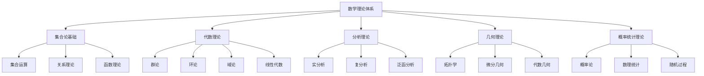

# 数学理论体系总论

## 概述

数学理论体系是形式化架构理论的核心基础，为软件架构、编程语言和形式化方法提供严格的数学工具和理论基础。本文档系统性地阐述数学理论体系的核心概念、形式化表示和在软件架构中的应用。

## 1. 理论框架

### 1.1 数学理论体系



### 1.2 核心概念

#### 集合论概念

- **集合**: 元素的聚集和集合运算
- **关系**: 集合间的二元关系
- **函数**: 集合间的映射关系
- **基数**: 集合的大小和可数性

#### 代数概念

- **群**: 具有结合律和逆元的代数结构
- **环**: 具有加法和乘法运算的代数结构
- **域**: 具有除法运算的代数结构
- **向量空间**: 线性代数的基本结构

#### 分析概念

- **极限**: 函数和序列的极限
- **连续性**: 函数的连续性
- **可微性**: 函数的可微性
- **积分**: 函数的积分运算

## 2. 形式化表示

### 2.1 集合论形式化

```rust
// 集合论基础结构
#[derive(Debug, Clone)]
pub struct Set<T> {
    elements: HashSet<T>,
}

impl<T: Clone + Eq + std::hash::Hash> Set<T> {
    pub fn new() -> Self {
        Self {
            elements: HashSet::new(),
        }
    }
    
    pub fn from_elements(elements: Vec<T>) -> Self {
        Self {
            elements: elements.into_iter().collect(),
        }
    }
    
    pub fn add(&mut self, element: T) {
        self.elements.insert(element);
    }
    
    pub fn remove(&mut self, element: &T) -> bool {
        self.elements.remove(element)
    }
    
    pub fn contains(&self, element: &T) -> bool {
        self.elements.contains(element)
    }
    
    pub fn union(&self, other: &Set<T>) -> Set<T> {
        let mut result = self.clone();
        for element in &other.elements {
            result.add(element.clone());
        }
        result
    }
    
    pub fn intersection(&self, other: &Set<T>) -> Set<T> {
        let mut result = Set::new();
        for element in &self.elements {
            if other.contains(element) {
                result.add(element.clone());
            }
        }
        result
    }
    
    pub fn difference(&self, other: &Set<T>) -> Set<T> {
        let mut result = Set::new();
        for element in &self.elements {
            if !other.contains(element) {
                result.add(element.clone());
            }
        }
        result
    }
    
    pub fn is_subset(&self, other: &Set<T>) -> bool {
        self.elements.iter().all(|e| other.contains(e))
    }
    
    pub fn is_superset(&self, other: &Set<T>) -> bool {
        other.is_subset(self)
    }
    
    pub fn cardinality(&self) -> usize {
        self.elements.len()
    }
    
    pub fn is_empty(&self) -> bool {
        self.elements.is_empty()
    }
}

// 关系理论
#[derive(Debug, Clone)]
pub struct Relation<T> {
    pairs: HashSet<(T, T)>,
}

impl<T: Clone + Eq + std::hash::Hash> Relation<T> {
    pub fn new() -> Self {
        Self {
            pairs: HashSet::new(),
        }
    }
    
    pub fn add_pair(&mut self, a: T, b: T) {
        self.pairs.insert((a, b));
    }
    
    pub fn contains_pair(&self, a: &T, b: &T) -> bool {
        self.pairs.contains(&(a.clone(), b.clone()))
    }
    
    pub fn is_reflexive(&self, domain: &Set<T>) -> bool {
        domain.elements.iter().all(|x| self.contains_pair(x, x))
    }
    
    pub fn is_symmetric(&self) -> bool {
        self.pairs.iter().all(|(a, b)| self.contains_pair(b, a))
    }
    
    pub fn is_transitive(&self) -> bool {
        for (a, b) in &self.pairs {
            for (c, d) in &self.pairs {
                if b == c && !self.contains_pair(a, d) {
                    return false;
                }
            }
        }
        true
    }
    
    pub fn is_equivalence(&self, domain: &Set<T>) -> bool {
        self.is_reflexive(domain) && self.is_symmetric() && self.is_transitive()
    }
    
    pub fn is_partial_order(&self, domain: &Set<T>) -> bool {
        self.is_reflexive(domain) && self.is_antisymmetric() && self.is_transitive()
    }
    
    pub fn is_antisymmetric(&self) -> bool {
        for (a, b) in &self.pairs {
            if a != b && self.contains_pair(b, a) {
                return false;
            }
        }
        true
    }
}

// 函数理论
#[derive(Debug, Clone)]
pub struct Function<D, R> {
    domain: Set<D>,
    codomain: Set<R>,
    mapping: HashMap<D, R>,
}

impl<D: Clone + Eq + std::hash::Hash, R: Clone + Eq + std::hash::Hash> Function<D, R> {
    pub fn new(domain: Set<D>, codomain: Set<R>) -> Self {
        Self {
            domain,
            codomain,
            mapping: HashMap::new(),
        }
    }
    
    pub fn add_mapping(&mut self, input: D, output: R) -> Result<(), String> {
        if !self.domain.contains(&input) {
            return Err("Input not in domain".to_string());
        }
        if !self.codomain.contains(&output) {
            return Err("Output not in codomain".to_string());
        }
        self.mapping.insert(input, output);
        Ok(())
    }
    
    pub fn apply(&self, input: &D) -> Option<&R> {
        self.mapping.get(input)
    }
    
    pub fn is_total(&self) -> bool {
        self.domain.elements.iter().all(|x| self.mapping.contains_key(x))
    }
    
    pub fn is_injective(&self) -> bool {
        let mut seen = HashSet::new();
        for output in self.mapping.values() {
            if !seen.insert(output) {
                return false;
            }
        }
        true
    }
    
    pub fn is_surjective(&self) -> bool {
        self.codomain.elements.iter().all(|y| {
            self.mapping.values().any(|output| output == y)
        })
    }
    
    pub fn is_bijective(&self) -> bool {
        self.is_injective() && self.is_surjective()
    }
}
```

### 2.2 代数理论形式化

```rust
// 群论
#[derive(Debug, Clone)]
pub struct Group<T> {
    elements: Set<T>,
    operation: Box<dyn Fn(&T, &T) -> T>,
    identity: T,
}

impl<T: Clone + Eq + std::hash::Hash> Group<T> {
    pub fn new(elements: Set<T>, operation: Box<dyn Fn(&T, &T) -> T>, identity: T) -> Self {
        Self {
            elements,
            operation,
            identity,
        }
    }
    
    pub fn apply(&self, a: &T, b: &T) -> T {
        (self.operation)(a, b)
    }
    
    pub fn is_associative(&self) -> bool {
        for a in &self.elements.elements {
            for b in &self.elements.elements {
                for c in &self.elements.elements {
                    let left = self.apply(&self.apply(a, b), c);
                    let right = self.apply(a, &self.apply(b, c));
                    if left != right {
                        return false;
                    }
                }
            }
        }
        true
    }
    
    pub fn has_identity(&self) -> bool {
        self.elements.elements.iter().all(|x| {
            self.apply(x, &self.identity) == *x && self.apply(&self.identity, x) == *x
        })
    }
    
    pub fn has_inverses(&self) -> bool {
        self.elements.elements.iter().all(|x| {
            self.elements.elements.iter().any(|y| {
                self.apply(x, y) == self.identity && self.apply(y, x) == self.identity
            })
        })
    }
    
    pub fn is_group(&self) -> bool {
        self.is_associative() && self.has_identity() && self.has_inverses()
    }
}

// 环论
#[derive(Debug, Clone)]
pub struct Ring<T> {
    elements: Set<T>,
    addition: Box<dyn Fn(&T, &T) -> T>,
    multiplication: Box<dyn Fn(&T, &T) -> T>,
    additive_identity: T,
    multiplicative_identity: T,
}

impl<T: Clone + Eq + std::hash::Hash> Ring<T> {
    pub fn new(
        elements: Set<T>,
        addition: Box<dyn Fn(&T, &T) -> T>,
        multiplication: Box<dyn Fn(&T, &T) -> T>,
        additive_identity: T,
        multiplicative_identity: T,
    ) -> Self {
        Self {
            elements,
            addition,
            multiplication,
            additive_identity,
            multiplicative_identity,
        }
    }
    
    pub fn add(&self, a: &T, b: &T) -> T {
        (self.addition)(a, b)
    }
    
    pub fn multiply(&self, a: &T, b: &T) -> T {
        (self.multiplication)(a, b)
    }
    
    pub fn is_ring(&self) -> bool {
        // 加法群性质
        let additive_group = Group::new(
            self.elements.clone(),
            self.addition.clone(),
            self.additive_identity.clone(),
        );
        
        if !additive_group.is_group() {
            return false;
        }
        
        // 乘法结合律
        for a in &self.elements.elements {
            for b in &self.elements.elements {
                for c in &self.elements.elements {
                    let left = self.multiply(&self.multiply(a, b), c);
                    let right = self.multiply(a, &self.multiply(b, c));
                    if left != right {
                        return false;
                    }
                }
            }
        }
        
        // 分配律
        for a in &self.elements.elements {
            for b in &self.elements.elements {
                for c in &self.elements.elements {
                    let left = self.multiply(a, &self.add(b, c));
                    let right = self.add(&self.multiply(a, b), &self.multiply(a, c));
                    if left != right {
                        return false;
                    }
                }
            }
        }
        
        true
    }
}

// 向量空间
#[derive(Debug, Clone)]
pub struct VectorSpace<V, F> {
    vectors: Set<V>,
    scalars: Field<F>,
    vector_addition: Box<dyn Fn(&V, &V) -> V>,
    scalar_multiplication: Box<dyn Fn(&F, &V) -> V>,
    zero_vector: V,
}

impl<V: Clone + Eq + std::hash::Hash, F: Clone + Eq + std::hash::Hash> VectorSpace<V, F> {
    pub fn new(
        vectors: Set<V>,
        scalars: Field<F>,
        vector_addition: Box<dyn Fn(&V, &V) -> V>,
        scalar_multiplication: Box<dyn Fn(&F, &V) -> V>,
        zero_vector: V,
    ) -> Self {
        Self {
            vectors,
            scalars,
            vector_addition,
            scalar_multiplication,
            zero_vector,
        }
    }
    
    pub fn add_vectors(&self, v1: &V, v2: &V) -> V {
        (self.vector_addition)(v1, v2)
    }
    
    pub fn multiply_by_scalar(&self, scalar: &F, vector: &V) -> V {
        (self.scalar_multiplication)(scalar, vector)
    }
    
    pub fn is_vector_space(&self) -> bool {
        // 向量加法群性质
        let vector_group = Group::new(
            self.vectors.clone(),
            self.vector_addition.clone(),
            self.zero_vector.clone(),
        );
        
        if !vector_group.is_group() {
            return false;
        }
        
        // 标量乘法性质
        let one = self.scalars.multiplicative_identity.clone();
        for vector in &self.vectors.elements {
            if self.multiply_by_scalar(&one, vector) != *vector {
                return false;
            }
        }
        
        // 分配律
        for scalar in &self.scalars.elements.elements {
            for v1 in &self.vectors.elements {
                for v2 in &self.vectors.elements {
                    let left = self.multiply_by_scalar(scalar, &self.add_vectors(v1, v2));
                    let right = self.add_vectors(
                        &self.multiply_by_scalar(scalar, v1),
                        &self.multiply_by_scalar(scalar, v2),
                    );
                    if left != right {
                        return false;
                    }
                }
            }
        }
        
        true
    }
}

// 域论
#[derive(Debug, Clone)]
pub struct Field<T> {
    elements: Set<T>,
    addition: Box<dyn Fn(&T, &T) -> T>,
    multiplication: Box<dyn Fn(&T, &T) -> T>,
    additive_identity: T,
    multiplicative_identity: T,
}

impl<T: Clone + Eq + std::hash::Hash> Field<T> {
    pub fn new(
        elements: Set<T>,
        addition: Box<dyn Fn(&T, &T) -> T>,
        multiplication: Box<dyn Fn(&T, &T) -> T>,
        additive_identity: T,
        multiplicative_identity: T,
    ) -> Self {
        Self {
            elements,
            addition,
            multiplication,
            additive_identity,
            multiplicative_identity,
        }
    }
    
    pub fn is_field(&self) -> bool {
        let ring = Ring::new(
            self.elements.clone(),
            self.addition.clone(),
            self.multiplication.clone(),
            self.additive_identity.clone(),
            self.multiplicative_identity.clone(),
        );
        
        if !ring.is_ring() {
            return false;
        }
        
        // 乘法逆元存在性（除零元素外）
        for element in &self.elements.elements {
            if element != &self.additive_identity {
                let has_inverse = self.elements.elements.iter().any(|y| {
                    self.multiply(element, y) == self.multiplicative_identity
                });
                if !has_inverse {
                    return false;
                }
            }
        }
        
        true
    }
    
    pub fn add(&self, a: &T, b: &T) -> T {
        (self.addition)(a, b)
    }
    
    pub fn multiply(&self, a: &T, b: &T) -> T {
        (self.multiplication)(a, b)
    }
}
```

### 2.3 分析理论形式化

```rust
// 实分析基础
#[derive(Debug, Clone)]
pub struct RealAnalysis {
    sequences: HashMap<String, Sequence>,
    functions: HashMap<String, Function>,
    limits: HashMap<String, Limit>,
}

#[derive(Debug, Clone)]
pub struct Sequence {
    id: String,
    terms: Vec<f64>,
    limit: Option<f64>,
}

impl Sequence {
    pub fn new(id: String, terms: Vec<f64>) -> Self {
        Self {
            id,
            terms,
            limit: None,
        }
    }
    
    pub fn converges(&self) -> Option<f64> {
        if self.terms.len() < 2 {
            return None;
        }
        
        let epsilon = 1e-10;
        let mut limit_candidate = self.terms.last().unwrap();
        
        for i in (0..self.terms.len() - 1).rev() {
            if (self.terms[i] - limit_candidate).abs() > epsilon {
                return None;
            }
            limit_candidate = self.terms[i];
        }
        
        Some(*limit_candidate)
    }
    
    pub fn is_cauchy(&self) -> bool {
        let epsilon = 1e-10;
        for i in 0..self.terms.len() {
            for j in i + 1..self.terms.len() {
                if (self.terms[i] - self.terms[j]).abs() > epsilon {
                    return false;
                }
            }
        }
        true
    }
}

#[derive(Debug, Clone)]
pub struct Function {
    id: String,
    domain: Interval,
    expression: String,
    continuity: ContinuityType,
    differentiability: DifferentiabilityType,
}

#[derive(Debug, Clone)]
pub struct Interval {
    start: f64,
    end: f64,
    start_inclusive: bool,
    end_inclusive: bool,
}

impl Interval {
    pub fn new(start: f64, end: f64, start_inclusive: bool, end_inclusive: bool) -> Self {
        Self {
            start,
            end,
            start_inclusive,
            end_inclusive,
        }
    }
    
    pub fn contains(&self, x: f64) -> bool {
        let start_condition = if self.start_inclusive {
            x >= self.start
        } else {
            x > self.start
        };
        
        let end_condition = if self.end_inclusive {
            x <= self.end
        } else {
            x < self.end
        };
        
        start_condition && end_condition
    }
}

#[derive(Debug, Clone)]
pub enum ContinuityType {
    Continuous,
    Discontinuous,
    UniformlyContinuous,
}

#[derive(Debug, Clone)]
pub enum DifferentiabilityType {
    Differentiable,
    NotDifferentiable,
    ContinuouslyDifferentiable,
}

#[derive(Debug, Clone)]
pub struct Limit {
    function_id: String,
    point: f64,
    value: Option<f64>,
    limit_type: LimitType,
}

#[derive(Debug, Clone)]
pub enum LimitType {
    Left,
    Right,
    TwoSided,
    Infinity,
    NegativeInfinity,
}

// 复分析
#[derive(Debug, Clone)]
pub struct ComplexAnalysis {
    complex_functions: HashMap<String, ComplexFunction>,
    residues: HashMap<String, Residue>,
}

#[derive(Debug, Clone)]
pub struct ComplexFunction {
    id: String,
    real_part: String,
    imaginary_part: String,
    domain: ComplexDomain,
    analytic: bool,
}

#[derive(Debug, Clone)]
pub struct ComplexDomain {
    center: Complex,
    radius: f64,
}

#[derive(Debug, Clone)]
pub struct Complex {
    real: f64,
    imaginary: f64,
}

impl Complex {
    pub fn new(real: f64, imaginary: f64) -> Self {
        Self { real, imaginary }
    }
    
    pub fn magnitude(&self) -> f64 {
        (self.real * self.real + self.imaginary * self.imaginary).sqrt()
    }
    
    pub fn conjugate(&self) -> Complex {
        Complex::new(self.real, -self.imaginary)
    }
    
    pub fn add(&self, other: &Complex) -> Complex {
        Complex::new(self.real + other.real, self.imaginary + other.imaginary)
    }
    
    pub fn multiply(&self, other: &Complex) -> Complex {
        Complex::new(
            self.real * other.real - self.imaginary * other.imaginary,
            self.real * other.imaginary + self.imaginary * other.real,
        )
    }
}

#[derive(Debug, Clone)]
pub struct Residue {
    function_id: String,
    pole: Complex,
    value: Complex,
}
```

## 3. 软件架构应用

### 3.1 集合论在架构中的应用

```rust
// 组件关系分析
pub struct ComponentRelationAnalysis {
    components: Set<Component>,
    relations: Relation<Component>,
    dependency_graph: DependencyGraph,
}

#[derive(Debug, Clone, Eq, Hash)]
pub struct Component {
    id: String,
    name: String,
    component_type: ComponentType,
    interfaces: Set<Interface>,
}

#[derive(Debug, Clone, Eq, Hash)]
pub enum ComponentType {
    Service,
    Module,
    Library,
    Database,
    ExternalSystem,
}

#[derive(Debug, Clone, Eq, Hash)]
pub struct Interface {
    id: String,
    name: String,
    interface_type: InterfaceType,
}

#[derive(Debug, Clone, Eq, Hash)]
pub enum InterfaceType {
    Provided,
    Required,
    Bidirectional,
}

impl ComponentRelationAnalysis {
    pub fn analyze_dependencies(&self) -> DependencyAnalysis {
        let mut analysis = DependencyAnalysis::new();
        
        // 分析直接依赖
        for component in &self.components.elements {
            let dependencies = self.find_dependencies(component);
            analysis.add_dependencies(component, dependencies);
        }
        
        // 分析传递依赖
        analysis.compute_transitive_dependencies();
        
        // 检测循环依赖
        analysis.detect_circular_dependencies();
        
        analysis
    }
    
    pub fn find_dependencies(&self, component: &Component) -> Set<Component> {
        let mut dependencies = Set::new();
        
        for (source, target) in &self.relations.pairs {
            if source == component {
                dependencies.add(target.clone());
            }
        }
        
        dependencies
    }
    
    pub fn is_acyclic(&self) -> bool {
        // 使用拓扑排序检测是否有环
        let mut in_degree = HashMap::new();
        let mut queue = VecDeque::new();
        
        // 初始化入度
        for component in &self.components.elements {
            in_degree.insert(component.id.clone(), 0);
        }
        
        // 计算入度
        for (_, target) in &self.relations.pairs {
            *in_degree.get_mut(&target.id).unwrap() += 1;
        }
        
        // 将入度为0的节点加入队列
        for (id, degree) in &in_degree {
            if *degree == 0 {
                queue.push_back(id.clone());
            }
        }
        
        let mut visited = 0;
        while let Some(id) = queue.pop_front() {
            visited += 1;
            
            // 减少依赖节点的入度
            for (source, target) in &self.relations.pairs {
                if source.id == id {
                    let target_degree = in_degree.get_mut(&target.id).unwrap();
                    *target_degree -= 1;
                    if *target_degree == 0 {
                        queue.push_back(target.id.clone());
                    }
                }
            }
        }
        
        visited == self.components.cardinality()
    }
}

#[derive(Debug, Clone)]
pub struct DependencyAnalysis {
    direct_dependencies: HashMap<String, Set<Component>>,
    transitive_dependencies: HashMap<String, Set<Component>>,
    circular_dependencies: Vec<Vec<Component>>,
}

impl DependencyAnalysis {
    pub fn new() -> Self {
        Self {
            direct_dependencies: HashMap::new(),
            transitive_dependencies: HashMap::new(),
            circular_dependencies: Vec::new(),
        }
    }
    
    pub fn add_dependencies(&mut self, component: &Component, dependencies: Set<Component>) {
        self.direct_dependencies.insert(component.id.clone(), dependencies);
    }
    
    pub fn compute_transitive_dependencies(&mut self) {
        for component_id in self.direct_dependencies.keys() {
            let mut transitive = Set::new();
            self.compute_transitive_for_component(component_id, &mut transitive);
            self.transitive_dependencies.insert(component_id.clone(), transitive);
        }
    }
    
    fn compute_transitive_for_component(&self, component_id: &str, transitive: &mut Set<Component>) {
        if let Some(direct) = self.direct_dependencies.get(component_id) {
            for dependency in &direct.elements {
                transitive.add(dependency.clone());
                self.compute_transitive_for_component(&dependency.id, transitive);
            }
        }
    }
    
    pub fn detect_circular_dependencies(&mut self) {
        // 使用深度优先搜索检测环
        let mut visited = HashSet::new();
        let mut rec_stack = HashSet::new();
        
        for component_id in self.direct_dependencies.keys() {
            if !visited.contains(component_id) {
                let mut path = Vec::new();
                self.dfs_detect_cycle(component_id, &mut visited, &mut rec_stack, &mut path);
            }
        }
    }
    
    fn dfs_detect_cycle(
        &self,
        component_id: &str,
        visited: &mut HashSet<String>,
        rec_stack: &mut HashSet<String>,
        path: &mut Vec<String>,
    ) {
        visited.insert(component_id.to_string());
        rec_stack.insert(component_id.to_string());
        path.push(component_id.to_string());
        
        if let Some(dependencies) = self.direct_dependencies.get(component_id) {
            for dependency in &dependencies.elements {
                if !visited.contains(&dependency.id) {
                    self.dfs_detect_cycle(&dependency.id, visited, rec_stack, path);
                } else if rec_stack.contains(&dependency.id) {
                    // 找到环
                    let cycle_start = path.iter().position(|x| x == &dependency.id).unwrap();
                    let cycle = path[cycle_start..].to_vec();
                    // 这里可以记录环
                }
            }
        }
        
        rec_stack.remove(component_id);
        path.pop();
    }
}
```

### 3.2 代数理论在架构中的应用

```rust
// 架构模式代数
pub struct ArchitecturePatternAlgebra {
    patterns: Set<ArchitecturePattern>,
    composition_operation: Box<dyn Fn(&ArchitecturePattern, &ArchitecturePattern) -> ArchitecturePattern>,
    identity_pattern: ArchitecturePattern,
}

#[derive(Debug, Clone, Eq, Hash)]
pub struct ArchitecturePattern {
    id: String,
    name: String,
    pattern_type: PatternType,
    components: Set<Component>,
    relationships: Set<Relationship>,
}

#[derive(Debug, Clone, Eq, Hash)]
pub enum PatternType {
    Structural,
    Behavioral,
    Creational,
    Architectural,
}

#[derive(Debug, Clone, Eq, Hash)]
pub struct Relationship {
    id: String,
    source: String,
    target: String,
    relationship_type: RelationshipType,
}

#[derive(Debug, Clone, Eq, Hash)]
pub enum RelationshipType {
    Inheritance,
    Composition,
    Aggregation,
    Association,
    Dependency,
}

impl ArchitecturePatternAlgebra {
    pub fn compose_patterns(&self, pattern1: &ArchitecturePattern, pattern2: &ArchitecturePattern) -> ArchitecturePattern {
        let composed_components = pattern1.components.union(&pattern2.components);
        let composed_relationships = pattern1.relationships.union(&pattern2.relationships);
        
        ArchitecturePattern {
            id: format!("{}_{}_composed", pattern1.id, pattern2.id),
            name: format!("{} + {}", pattern1.name, pattern2.name),
            pattern_type: PatternType::Architectural,
            components: composed_components,
            relationships: composed_relationships,
        }
    }
    
    pub fn is_monoid(&self) -> bool {
        // 检查结合律
        for p1 in &self.patterns.elements {
            for p2 in &self.patterns.elements {
                for p3 in &self.patterns.elements {
                    let left = self.compose_patterns(&self.compose_patterns(p1, p2), p3);
                    let right = self.compose_patterns(p1, &self.compose_patterns(p2, p3));
                    if left.id != right.id {
                        return false;
                    }
                }
            }
        }
        
        // 检查单位元
        for pattern in &self.patterns.elements {
            let left = self.compose_patterns(&self.identity_pattern, pattern);
            let right = self.compose_patterns(pattern, &self.identity_pattern);
            if left.id != pattern.id || right.id != pattern.id {
                return false;
            }
        }
        
        true
    }
}

// 组件代数
pub struct ComponentAlgebra {
    components: Set<Component>,
    composition_operation: Box<dyn Fn(&Component, &Component) -> Component>,
    interface_matching: Box<dyn Fn(&Interface, &Interface) -> bool>,
}

impl ComponentAlgebra {
    pub fn compose_components(&self, comp1: &Component, comp2: &Component) -> Option<Component> {
        // 检查接口兼容性
        let compatible_interfaces = self.find_compatible_interfaces(comp1, comp2);
        
        if compatible_interfaces.is_empty() {
            return None;
        }
        
        // 创建组合组件
        let mut combined_interfaces = comp1.interfaces.union(&comp2.interfaces);
        
        // 移除匹配的接口
        for (provided, required) in compatible_interfaces {
            combined_interfaces.remove(&provided);
            combined_interfaces.remove(&required);
        }
        
        Some(Component {
            id: format!("{}_{}_composed", comp1.id, comp2.id),
            name: format!("{} + {}", comp1.name, comp2.name),
            component_type: ComponentType::Module,
            interfaces: combined_interfaces,
        })
    }
    
    pub fn find_compatible_interfaces(&self, comp1: &Component, comp2: &Component) -> Vec<(Interface, Interface)> {
        let mut compatible = Vec::new();
        
        for interface1 in &comp1.interfaces.elements {
            for interface2 in &comp2.interfaces.elements {
                if self.are_interfaces_compatible(interface1, interface2) {
                    compatible.push((interface1.clone(), interface2.clone()));
                }
            }
        }
        
        compatible
    }
    
    pub fn are_interfaces_compatible(&self, interface1: &Interface, interface2: &Interface) -> bool {
        // 检查接口类型是否匹配
        match (&interface1.interface_type, &interface2.interface_type) {
            (InterfaceType::Provided, InterfaceType::Required) => true,
            (InterfaceType::Required, InterfaceType::Provided) => true,
            _ => false,
        }
    }
}
```

## 4. 交叉引用

- [[01-哲学基础理论/00-哲学基础理论总论|哲学基础理论]]
- [[03-形式语言理论/00-形式语言理论总论|形式语言理论]]
- [[04-软件架构理论/00-软件架构理论总论|软件架构理论]]
- [[05-编程语言理论/00-编程语言理论总论|编程语言理论]]
- [[06-形式模型理论/00-形式模型理论总论|形式模型理论]]
- [[07-理论统一与整合/00-理论统一与整合总论|理论统一与整合]]

## 导航

- [返回总目录](../README.md)
- [01-集合论基础](01-集合论基础.md)
- [02-代数理论](02-代数理论.md)
- [03-分析理论](03-分析理论.md)
- [04-几何理论](04-几何理论.md)
- [05-概率统计理论](05-概率统计理论.md)
