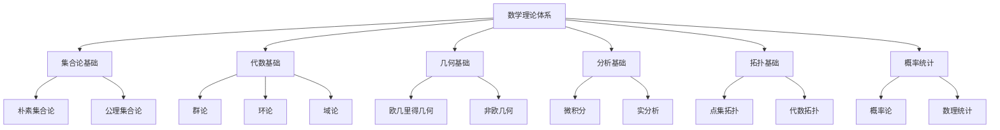

# 00-数学理论体系总论

> 本文档归纳 /Matter/Mathematics 目录下数学理论体系相关内容，分层梳理主要主题、论证思路、行业相关性。

## 目录

1. 数学理论体系概述
2. 主要文件与内容索引
3. 数学理论的基础结构
4. 数学理论的统一框架
5. 数学理论的行业应用
6. 相关性跳转与引用

---

## 1. 数学理论体系概述

数学理论体系旨在建立统一的数学基础框架，涵盖集合论、代数、几何、分析等核心分支，为形式化架构提供坚实的数学基础。

### 1.1 核心目标

- 建立统一的数学理论框架
- 支持复杂系统的数学建模
- 推动数学理论与工程实践的融合

### 1.2 数学理论层次结构



---

## 2. 主要文件与内容索引

### 2.1 核心文件

- [数学内容全面分析报告-2024.md](../Matter/Mathematics/数学内容全面分析报告-2024.md)
- [数学内容全面分析报告.md](../Matter/Mathematics/数学内容全面分析报告.md)
- [数学内容与Wiki权威对比分析-2024.md](../Matter/Mathematics/content/数学内容与Wiki权威对比分析-2024.md)

### 2.2 相关文件

- [01-集合论基础.md](01-集合论基础.md)
- [02-代数基础.md](02-代数基础.md)
- [03-几何基础.md](03-几何基础.md)
- [04-分析基础.md](04-分析基础.md)
- [05-拓扑基础.md](05-拓扑基础.md)
- [06-概率统计基础.md](06-概率统计基础.md)

---

## 3. 数学理论的基础结构

### 3.1 集合论基础

集合论是数学的基础，提供数学对象的基本概念：

#### 3.1.1 集合的基本概念

**定义 3.1.1** 集合
集合是某些对象的无序聚集，表示为：
$$A = \{x \mid P(x)\}$$
其中 $P(x)$ 是描述集合元素性质的谓词。

**公理 3.1.1** 外延公理
两个集合相等当且仅当它们包含相同的元素：
$$A = B \Leftrightarrow \forall x (x \in A \Leftrightarrow x \in B)$$

#### 3.1.2 集合运算

- 并集：$A \cup B = \{x \mid x \in A \lor x \in B\}$
- 交集：$A \cap B = \{x \mid x \in A \land x \in B\}$
- 差集：$A \setminus B = \{x \mid x \in A \land x \notin B\}$
- 补集：$A^c = \{x \mid x \notin A\}$

### 3.2 代数基础

代数研究运算和结构：

#### 3.2.1 群论

**定义 3.2.1** 群
群是一个集合 $G$ 和一个二元运算 $\cdot$，满足：

1. 封闭性：$\forall a, b \in G, a \cdot b \in G$
2. 结合律：$(a \cdot b) \cdot c = a \cdot (b \cdot c)$
3. 单位元：$\exists e \in G, \forall a \in G, e \cdot a = a \cdot e = a$
4. 逆元：$\forall a \in G, \exists a^{-1} \in G, a \cdot a^{-1} = a^{-1} \cdot a = e$

#### 3.2.2 环论

**定义 3.2.2** 环
环是一个集合 $R$ 和两个二元运算 $+$ 和 $\cdot$，满足：

1. $(R, +)$ 是阿贝尔群
2. $(R, \cdot)$ 是半群
3. 分配律：$a \cdot (b + c) = a \cdot b + a \cdot c$

### 3.3 几何基础

几何研究空间和形状：

#### 3.3.1 欧几里得几何

**公理 3.3.1** 平行公理
通过直线外一点，有且仅有一条直线与给定直线平行。

#### 3.3.2 非欧几何

**定义 3.3.1** 黎曼几何
在黎曼几何中，不存在平行线，所有直线都相交。

### 3.4 分析基础

分析研究连续性和极限：

#### 3.4.1 微积分

**定义 3.4.1** 导数
函数 $f$ 在点 $x$ 的导数定义为：
$$f'(x) = \lim_{h \to 0} \frac{f(x + h) - f(x)}{h}$$

**定义 3.4.2** 积分
函数 $f$ 在区间 $[a, b]$ 上的定积分为：
$$\int_a^b f(x) dx = \lim_{n \to \infty} \sum_{i=1}^n f(x_i) \Delta x$$

---

## 4. 数学理论的统一框架

### 4.1 范畴论

范畴论提供数学结构的统一语言：

#### 4.1.1 范畴的基本概念

**定义 4.1.1** 范畴
范畴 $\mathcal{C}$ 包含：

1. 对象集合 $\text{Ob}(\mathcal{C})$
2. 态射集合 $\text{Mor}(\mathcal{C})$
3. 复合运算 $\circ$
4. 单位态射 $1_A$

#### 4.1.2 函子

**定义 4.1.2** 函子
函子 $F: \mathcal{C} \to \mathcal{D}$ 是范畴间的映射，保持：

1. 对象映射：$F: \text{Ob}(\mathcal{C}) \to \text{Ob}(\mathcal{D})$
2. 态射映射：$F: \text{Mor}(\mathcal{C}) \to \text{Mor}(\mathcal{D})$
3. 复合保持：$F(f \circ g) = F(f) \circ F(g)$

### 4.2 数学理论的统一表达

```rust
// 数学理论统一框架示例
use std::collections::HashMap;

#[derive(Debug, Clone)]
pub struct MathematicalTheory {
    name: String,
    axioms: Vec<String>,
    theorems: Vec<Theorem>,
    applications: Vec<String>,
}

#[derive(Debug, Clone)]
pub struct Theorem {
    name: String,
    statement: String,
    proof: String,
    dependencies: Vec<String>,
}

impl MathematicalTheory {
    pub fn new(name: String) -> Self {
        Self {
            name,
            axioms: Vec::new(),
            theorems: Vec::new(),
            applications: Vec::new(),
        }
    }
    
    pub fn add_axiom(&mut self, axiom: String) {
        self.axioms.push(axiom);
    }
    
    pub fn add_theorem(&mut self, theorem: Theorem) {
        self.theorems.push(theorem);
    }
    
    pub fn add_application(&mut self, application: String) {
        self.applications.push(application);
    }
    
    pub fn verify_consistency(&self) -> bool {
        // 简化实现：检查理论的一致性
        !self.axioms.is_empty() && !self.theorems.is_empty()
    }
}

// 使用示例
fn main() {
    let mut set_theory = MathematicalTheory::new("Set Theory".to_string());
    
    set_theory.add_axiom("Extensionality: Two sets are equal if they have the same elements".to_string());
    set_theory.add_axiom("Empty Set: There exists a set with no elements".to_string());
    
    let theorem = Theorem {
        name: "Empty Set Uniqueness".to_string(),
        statement: "The empty set is unique".to_string(),
        proof: "By extensionality axiom".to_string(),
        dependencies: vec!["Extensionality".to_string()],
    };
    
    set_theory.add_theorem(theorem);
    set_theory.add_application("Foundation of Mathematics".to_string());
    
    println!("Theory: {}", set_theory.name);
    println!("Consistent: {}", set_theory.verify_consistency());
}
```

---

## 5. 数学理论的行业应用

### 5.1 计算机科学

- 集合论：数据库理论、算法设计
- 代数：密码学、编码理论
- 几何：计算机图形学、机器学习
- 分析：数值计算、优化算法

### 5.2 工程应用

- 微积分：控制系统、信号处理
- 线性代数：图像处理、机器学习
- 概率统计：数据分析、风险评估
- 拓扑学：网络分析、数据挖掘

### 5.3 软件架构

- 范畴论：函数式编程、类型系统
- 集合论：数据建模、关系数据库
- 代数：抽象数据类型、设计模式
- 分析：性能分析、复杂度理论

---

## 6. 相关性跳转与引用

- [01-理论体系总论.md](../01-理论体系/01-理论体系总论.md)
- [01-统一形式理论综合.md](../01-理论体系/01-统一形式理论综合.md)
- [01-集合论基础.md](01-集合论基础.md)
- [02-代数基础.md](02-代数基础.md)
- [03-几何基础.md](03-几何基础.md)
- [04-分析基础.md](04-分析基础.md)
- [05-拓扑基础.md](05-拓扑基础.md)
- [06-概率统计基础.md](06-概率统计基础.md)
- [00-主题树与内容索引.md](../00-主题树与内容索引.md)
- [进度追踪与上下文.md](../进度追踪与上下文.md)

---

> 本文件为自动归纳生成，后续将递归细化相关内容，持续补全图表、公式、代码等多表征内容。
