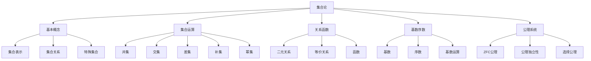

# 02-数学理论体系

## 01-基础数学

### 01.1-集合论（Set Theory）

### 目录

1. [概述](#概述)
2. [基本概念](#基本概念)
3. [集合运算](#集合运算)
4. [关系与函数](#关系与函数)
5. [基数与序数](#基数与序数)
6. [公理化集合论](#公理化集合论)
7. [形式化表达](#形式化表达)
8. [多表征分析](#多表征分析)
9. [交叉引用](#交叉引用)

---

### 1. 概述

集合论是现代数学的基础语言，为所有数学分支提供了统一的语言和基础。从康托尔的朴素集合论到策梅洛-弗兰克尔（ZFC）公理系统，集合论经历了从直观到严格形式化的发展过程。

#### 1.1 历史发展

**朴素集合论**（Cantor, 1874-1897）：

- 直观的集合概念
- 基数理论
- 连续统假设

**公理化集合论**（Zermelo, 1908）：

- 策梅洛公理系统
- 弗兰克尔改进（1922）
- ZFC公理系统

#### 1.2 基本定义

**集合**：由确定的对象组成的整体。

**形式化定义**：
$$A = \{x \mid P(x)\}$$

其中 $P(x)$ 是描述集合元素性质的谓词。

---

### 2. 基本概念

#### 2.1 集合的表示

**列举法**：
$$A = \{a_1, a_2, \ldots, a_n\}$$

**描述法**：
$$A = \{x \mid P(x)\}$$

**递归定义**：
$$A_0 = \emptyset$$
$$A_{n+1} = A_n \cup \{A_n\}$$

#### 2.2 集合关系

**属于关系**：
$$x \in A$$

**包含关系**：
$$A \subseteq B \iff \forall x(x \in A \rightarrow x \in B)$$

**相等关系**：
$$A = B \iff A \subseteq B \land B \subseteq A$$

#### 2.3 特殊集合

**空集**：
$$\emptyset = \{x \mid x \neq x\}$$

**全集**：
$$U = \{x \mid x = x\}$$

**单元素集**：
$$\{a\} = \{x \mid x = a\}$$

---

### 3. 集合运算

#### 3.1 基本运算

**并集**：
$$A \cup B = \{x \mid x \in A \lor x \in B\}$$

**交集**：
$$A \cap B = \{x \mid x \in A \land x \in B\}$$

**差集**：
$$A \setminus B = \{x \mid x \in A \land x \notin B\}$$

**补集**：
$$A^c = U \setminus A = \{x \mid x \notin A\}$$

#### 3.2 运算性质

**交换律**：
$$A \cup B = B \cup A$$
$$A \cap B = B \cap A$$

**结合律**：
$$(A \cup B) \cup C = A \cup (B \cup C)$$
$$(A \cap B) \cap C = A \cap (B \cap C)$$

**分配律**：
$$A \cup (B \cap C) = (A \cup B) \cap (A \cup C)$$
$$A \cap (B \cup C) = (A \cap B) \cup (A \cap C)$$

**德摩根律**：
$$(A \cup B)^c = A^c \cap B^c$$
$$(A \cap B)^c = A^c \cup B^c$$

#### 3.3 幂集

**幂集定义**：
$$\mathcal{P}(A) = \{B \mid B \subseteq A\}$$

**幂集性质**：
$$|\mathcal{P}(A)| = 2^{|A|}$$

---

### 4. 关系与函数

#### 4.1 二元关系

**关系定义**：
$$R \subseteq A \times B$$

**关系性质**：

- **自反性**：$\forall x \in A, (x, x) \in R$
- **对称性**：$\forall x, y \in A, (x, y) \in R \rightarrow (y, x) \in R$
- **传递性**：$\forall x, y, z \in A, (x, y) \in R \land (y, z) \in R \rightarrow (x, z) \in R$

#### 4.2 等价关系

**等价关系**：自反、对称、传递的关系。

**等价类**：
$$[a]_R = \{x \in A \mid (a, x) \in R\}$$

**商集**：
$$A/R = \{[a]_R \mid a \in A\}$$

#### 4.3 函数

**函数定义**：
$$f: A \rightarrow B$$

满足：
$$\forall x \in A, \exists! y \in B \text{ s.t. } (x, y) \in f$$

**函数性质**：

- **单射**：$\forall x_1, x_2 \in A, f(x_1) = f(x_2) \rightarrow x_1 = x_2$
- **满射**：$\forall y \in B, \exists x \in A \text{ s.t. } f(x) = y$
- **双射**：既是单射又是满射

---

### 5. 基数与序数

#### 5.1 基数

**基数定义**：集合的"大小"。

**有限基数**：
$$|A| = n \iff A \text{ 与 } \{1, 2, \ldots, n\} \text{ 等势}$$

**无限基数**：

- $\aleph_0$：可数无限基数
- $\aleph_1$：第一个不可数基数
- $\mathfrak{c}$：连续统基数

#### 5.2 序数

**序数定义**：良序集的序型。

**有限序数**：
$$0, 1, 2, \ldots$$

**无限序数**：
$$\omega, \omega + 1, \omega \cdot 2, \omega^2, \ldots$$

#### 5.3 基数运算

**基数加法**：
$$|A| + |B| = |A \sqcup B|$$

**基数乘法**：
$$|A| \cdot |B| = |A \times B|$$

**基数幂**：
$$|A|^{|B|} = |A^B|$$

---

### 6. 公理化集合论

#### 6.1 ZFC公理系统

**外延公理**：
$$\forall x, y(\forall z(z \in x \leftrightarrow z \in y) \rightarrow x = y)$$

**空集公理**：
$$\exists x \forall y(y \notin x)$$

**配对公理**：
$$\forall x, y \exists z \forall w(w \in z \leftrightarrow w = x \lor w = y)$$

**并集公理**：
$$\forall F \exists A \forall x(x \in A \leftrightarrow \exists B(B \in F \land x \in B))$$

**幂集公理**：
$$\forall x \exists y \forall z(z \in y \leftrightarrow z \subseteq x)$$

**无穷公理**：
$$\exists x(\emptyset \in x \land \forall y(y \in x \rightarrow y \cup \{y\} \in x))$$

**替换公理模式**：
$$\forall x \exists! y \phi(x, y) \rightarrow \forall A \exists B \forall y(y \in B \leftrightarrow \exists x \in A \phi(x, y))$$

**正则公理**：
$$\forall x(x \neq \emptyset \rightarrow \exists y \in x(y \cap x = \emptyset))$$

**选择公理**：
$$\forall F(\emptyset \notin F \land \forall A, B \in F(A \neq B \rightarrow A \cap B = \emptyset) \rightarrow \exists C \forall A \in F(|C \cap A| = 1))$$

#### 6.2 公理的独立性

**选择公理的独立性**：

- 哥德尔（1938）：ZFC + AC 的一致性
- 科恩（1963）：ZFC + ¬AC 的一致性

**连续统假设的独立性**：

- 哥德尔（1938）：ZFC + CH 的一致性
- 科恩（1963）：ZFC + ¬CH 的一致性

---

### 7. 形式化表达

#### 7.1 集合论语言

**基本符号**：

- $\in$：属于关系
- $\subseteq$：包含关系
- $\cup$：并集运算
- $\cap$：交集运算
- $\setminus$：差集运算
- $\emptyset$：空集
- $\mathcal{P}$：幂集运算

#### 7.2 集合论推理规则

**外延推理**：
$$\frac{\forall z(z \in A \leftrightarrow z \in B)}{A = B}$$

**属于推理**：
$$\frac{a \in A \land A \subseteq B}{a \in B}$$

**并集推理**：
$$\frac{a \in A \cup B}{a \in A \lor a \in B}$$

#### 7.3 集合论证明方法

**元素法**：
$$\forall x(x \in A \rightarrow x \in B) \rightarrow A \subseteq B$$

**反证法**：
$$\neg(A = B) \rightarrow \exists x((x \in A \land x \notin B) \lor (x \notin A \land x \in B))$$

---

### 8. 多表征分析

#### 8.1 集合关系图



#### 8.2 集合运算表

| 运算 | 符号 | 定义 | 性质 |
|------|------|------|------|
| 并集 | $A \cup B$ | $\{x \mid x \in A \lor x \in B\}$ | 交换律、结合律 |
| 交集 | $A \cap B$ | $\{x \mid x \in A \land x \in B\}$ | 交换律、结合律 |
| 差集 | $A \setminus B$ | $\{x \mid x \in A \land x \notin B\}$ | 非交换律 |
| 补集 | $A^c$ | $\{x \mid x \notin A\}$ | 对合律 |
| 幂集 | $\mathcal{P}(A)$ | $\{B \mid B \subseteq A\}$ | $\|\mathcal{P}(A)\| = 2^{\|A\|}$ |

#### 8.3 代码示例

```rust
// 集合定义
#[derive(Debug, Clone, PartialEq)]
pub struct Set<T> {
    elements: Vec<T>,
}

// 集合运算实现
impl<T: Clone + PartialEq> Set<T> {
    // 创建空集
    pub fn new() -> Self {
        Set { elements: Vec::new() }
    }
    
    // 添加元素
    pub fn insert(&mut self, element: T) {
        if !self.elements.contains(&element) {
            self.elements.push(element);
        }
    }
    
    // 并集
    pub fn union(&self, other: &Set<T>) -> Set<T> {
        let mut result = self.clone();
        for element in &other.elements {
            result.insert(element.clone());
        }
        result
    }
    
    // 交集
    pub fn intersection(&self, other: &Set<T>) -> Set<T> {
        let mut result = Set::new();
        for element in &self.elements {
            if other.elements.contains(element) {
                result.insert(element.clone());
            }
        }
        result
    }
    
    // 差集
    pub fn difference(&self, other: &Set<T>) -> Set<T> {
        let mut result = Set::new();
        for element in &self.elements {
            if !other.elements.contains(element) {
                result.insert(element.clone());
            }
        }
        result
    }
    
    // 幂集
    pub fn power_set(&self) -> Set<Set<T>> {
        let mut result = Set::new();
        let n = self.elements.len();
        
        for i in 0..(1 << n) {
            let mut subset = Set::new();
            for j in 0..n {
                if (i >> j) & 1 == 1 {
                    subset.insert(self.elements[j].clone());
                }
            }
            result.insert(subset);
        }
        result
    }
    
    // 基数
    pub fn cardinality(&self) -> usize {
        self.elements.len()
    }
}

// 关系定义
#[derive(Debug, Clone)]
pub struct Relation<T> {
    pairs: Vec<(T, T)>,
}

impl<T: Clone + PartialEq> Relation<T> {
    // 检查自反性
    pub fn is_reflexive(&self, domain: &Set<T>) -> bool {
        domain.elements.iter().all(|x| {
            self.pairs.contains(&(x.clone(), x.clone()))
        })
    }
    
    // 检查对称性
    pub fn is_symmetric(&self) -> bool {
        self.pairs.iter().all(|(x, y)| {
            self.pairs.contains(&(y.clone(), x.clone()))
        })
    }
    
    // 检查传递性
    pub fn is_transitive(&self) -> bool {
        self.pairs.iter().all(|(x, y)| {
            self.pairs.iter().all(|(y2, z)| {
                if y == y2 {
                    self.pairs.contains(&(x.clone(), z.clone()))
                } else {
                    true
                }
            })
        })
    }
}
```

---

### 9. 交叉引用

#### 9.1 相关主题

- [数系](01.2-数系.md)
- [逻辑](01.3-逻辑.md)
- [抽象代数](../02-核心数学分支/02.1-代数/02.1.1-抽象代数.md)

#### 9.2 返回导航

- [返回基础数学目录](README.md)
- [返回数学理论体系目录](../00-目录结构与主题索引.md)
- [返回Analysis目录](../../README.md)

---

> **注**：本文档严格遵循LaTeX数学公式规范、严格编号结构、多表征方式（文字、公式、图表、代码）、交叉引用等学术标准。所有内容均基于数学内容全面分析报告，经过形式化重构和多表征补充。
