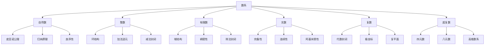

# 02-数学理论体系

## 01-基础数学

### 01.2-数系（Number Systems）

### 目录

1. [概述](#概述)
2. [自然数](#自然数)
3. [整数](#整数)
4. [有理数](#有理数)
5. [实数](#实数)
6. [复数](#复数)
7. [数系扩展](#数系扩展)
8. [形式化表达](#形式化表达)
9. [多表征分析](#多表征分析)
10. [交叉引用](#交叉引用)

---

### 1. 概述

数系是数学的基础，从自然数开始，通过逐步扩展形成了完整的数系体系。每个数系的扩展都解决了前一个数系中的某些限制，同时保持了运算的封闭性和代数性质。

#### 1.1 数系发展历史

**自然数**（古代）：计数和基本运算
**整数**（古代）：解决减法封闭性
**有理数**（古代）：解决除法封闭性
**实数**（19世纪）：解决极限运算
**复数**（16世纪）：解决代数方程

#### 1.2 数系基本性质

**运算封闭性**：在某个数系中，两个数的运算结果仍在该数系中。
**代数性质**：结合律、交换律、分配律等。
**序关系**：大小比较关系。
**完备性**：极限运算的封闭性。

---

### 2. 自然数

#### 2.1 皮亚诺公理

**公理1**：0是自然数。
$$\text{Natural}(0)$$

**公理2**：每个自然数都有唯一的后继。
$$\forall n(\text{Natural}(n) \rightarrow \exists! s(\text{Successor}(n, s)))$$

**公理3**：0不是任何自然数的后继。
$$\forall n(\text{Natural}(n) \rightarrow \neg\text{Successor}(n, 0))$$

**公理4**：不同的自然数有不同的后继。
$$\forall m, n(\text{Natural}(m) \land \text{Natural}(n) \land m \neq n \rightarrow \text{Successor}(m) \neq \text{Successor}(n))$$

**公理5**：数学归纳原理。
$$\forall P((P(0) \land \forall n(P(n) \rightarrow P(\text{Successor}(n)))) \rightarrow \forall n(\text{Natural}(n) \rightarrow P(n)))$$

#### 2.2 自然数运算

**加法定义**：
$$a + 0 = a$$
$$a + \text{Successor}(b) = \text{Successor}(a + b)$$

**乘法定义**：
$$a \cdot 0 = 0$$
$$a \cdot \text{Successor}(b) = a \cdot b + a$$

#### 2.3 自然数性质

**良序性**：每个非空自然数集合都有最小元素。
$$\forall S \subseteq \mathbb{N}(S \neq \emptyset \rightarrow \exists m \in S \forall n \in S(m \leq n))$$

**归纳性**：数学归纳法成立。
$$\forall P((P(0) \land \forall n(P(n) \rightarrow P(n+1))) \rightarrow \forall n P(n))$$

---

### 3. 整数

#### 3.1 整数构造

**等价关系**：$(a, b) \sim (c, d) \iff a + d = b + c$

**整数定义**：$\mathbb{Z} = \mathbb{N} \times \mathbb{N} / \sim$

**整数表示**：
- 正整数：$[(n, 0)]$，记作$+n$
- 负整数：$[(0, n)]$，记作$-n$
- 零：$[(0, 0)]$，记作$0$

#### 3.2 整数运算

**加法**：
$$[(a, b)] + [(c, d)] = [(a + c, b + d)]$$

**乘法**：
$$[(a, b)] \cdot [(c, d)] = [(ac + bd, ad + bc)]$$

**减法**：
$$[(a, b)] - [(c, d)] = [(a + d, b + c)]$$

#### 3.3 整数性质

**环结构**：整数构成交换环。
- 加法结合律：$(a + b) + c = a + (b + c)$
- 加法交换律：$a + b = b + a$
- 加法单位元：$a + 0 = a$
- 加法逆元：$a + (-a) = 0$
- 乘法结合律：$(a \cdot b) \cdot c = a \cdot (b \cdot c)$
- 乘法交换律：$a \cdot b = b \cdot a$
- 乘法单位元：$a \cdot 1 = a$
- 分配律：$a \cdot (b + c) = a \cdot b + a \cdot c$

---

### 4. 有理数

#### 4.1 有理数构造

**等价关系**：$(a, b) \sim (c, d) \iff a \cdot d = b \cdot c$，其中$b, d \neq 0$

**有理数定义**：$\mathbb{Q} = \mathbb{Z} \times (\mathbb{Z} \setminus \{0\}) / \sim$

**有理数表示**：$\frac{a}{b} = [(a, b)]$

#### 4.2 有理数运算

**加法**：
$$\frac{a}{b} + \frac{c}{d} = \frac{ad + bc}{bd}$$

**乘法**：
$$\frac{a}{b} \cdot \frac{c}{d} = \frac{ac}{bd}$$

**除法**：
$$\frac{a}{b} \div \frac{c}{d} = \frac{ad}{bc}$$，其中$c \neq 0$

#### 4.3 有理数性质

**域结构**：有理数构成域。
- 加法群：$(\mathbb{Q}, +)$是交换群
- 乘法群：$(\mathbb{Q} \setminus \{0\}, \cdot)$是交换群
- 分配律：$a \cdot (b + c) = a \cdot b + a \cdot c$

**稠密性**：任意两个有理数之间都存在有理数。
$$\forall p, q \in \mathbb{Q}(p < q \rightarrow \exists r \in \mathbb{Q}(p < r < q))$$

---

### 5. 实数

#### 5.1 实数构造

**戴德金分割**：将有理数分为两个非空集合$A$和$B$，满足：
1. $A \cup B = \mathbb{Q}$
2. $A \cap B = \emptyset$
3. $\forall a \in A, \forall b \in B(a < b)$
4. $A$无最大元素

**实数定义**：$\mathbb{R} = \{\text{Dedekind cuts}\}$

#### 5.2 实数运算

**加法**：
$$A + B = \{a + b \mid a \in A, b \in B\}$$

**乘法**：
$$A \cdot B = \{ab \mid a \in A, b \in B\}$$

#### 5.3 实数性质

**完备性**：每个有上界的非空实数集合都有最小上界。
$$\forall S \subseteq \mathbb{R}(S \neq \emptyset \land \exists M \forall x \in S(x \leq M) \rightarrow \exists \sup S)$$

**阿基米德性质**：
$$\forall x, y \in \mathbb{R}(x > 0 \land y > 0 \rightarrow \exists n \in \mathbb{N}(nx > y))$$

**连续性**：实数集是连续的，没有"空隙"。

---

### 6. 复数

#### 6.1 复数构造

**复数定义**：$\mathbb{C} = \mathbb{R} \times \mathbb{R}$

**复数表示**：$z = a + bi$，其中$a, b \in \mathbb{R}$，$i^2 = -1$

**实部和虚部**：
- $\text{Re}(z) = a$
- $\text{Im}(z) = b$

#### 6.2 复数运算

**加法**：
$$(a + bi) + (c + di) = (a + c) + (b + d)i$$

**乘法**：
$$(a + bi) \cdot (c + di) = (ac - bd) + (ad + bc)i$$

**共轭**：
$$\overline{a + bi} = a - bi$$

**模**：
$$|a + bi| = \sqrt{a^2 + b^2}$$

#### 6.3 复数性质

**代数封闭性**：每个复系数多项式都有复数根。
$$\forall P \in \mathbb{C}[x] \exists z \in \mathbb{C}(P(z) = 0)$$

**极坐标表示**：
$$z = r(\cos \theta + i \sin \theta) = re^{i\theta}$$

其中：
- $r = |z|$是模
- $\theta = \arg(z)$是辐角

---

### 7. 数系扩展

#### 7.1 四元数

**四元数定义**：$\mathbb{H} = \{a + bi + cj + dk \mid a, b, c, d \in \mathbb{R}\}$

**乘法规则**：
$$i^2 = j^2 = k^2 = ijk = -1$$
$$ij = k, jk = i, ki = j$$
$$ji = -k, kj = -i, ik = -j$$

#### 7.2 八元数

**八元数定义**：$\mathbb{O} = \{a_0 + a_1e_1 + \cdots + a_7e_7 \mid a_i \in \mathbb{R}\}$

**性质**：八元数乘法不满足结合律。

#### 7.3 超复数

**超复数**：包括四元数、八元数等更高维的数系。

**性质**：随着维数增加，代数性质逐渐减弱。

---

### 8. 形式化表达

#### 8.1 数系语言

**基本符号**：
- $\mathbb{N}$：自然数集
- $\mathbb{Z}$：整数集
- $\mathbb{Q}$：有理数集
- $\mathbb{R}$：实数集
- $\mathbb{C}$：复数集
- $\mathbb{H}$：四元数集

#### 8.2 数系公理

**自然数公理**：
$$\text{Peano Axioms}$$

**整数公理**：
$$\text{Ring Axioms}$$

**有理数公理**：
$$\text{Field Axioms}$$

**实数公理**：
$$\text{Complete Ordered Field Axioms}$$

#### 8.3 数系推理

**归纳推理**：
$$\frac{P(0) \land \forall n(P(n) \rightarrow P(n+1))}{\forall n P(n)}$$

**极限推理**：
$$\frac{\forall \epsilon > 0 \exists N \forall n > N(|a_n - L| < \epsilon)}{\lim_{n \to \infty} a_n = L}$$

---

### 9. 多表征分析

#### 9.1 数系关系图



#### 9.2 数系性质表

| 数系 | 运算封闭性 | 代数性质 | 序关系 | 完备性 | 代数封闭性 |
|------|------------|----------|--------|--------|------------|
| 自然数 | 加法、乘法 | 半环 | 全序 | 否 | 否 |
| 整数 | 加法、乘法、减法 | 环 | 全序 | 否 | 否 |
| 有理数 | 四则运算 | 域 | 全序 | 否 | 否 |
| 实数 | 四则运算、极限 | 完备域 | 全序 | 是 | 否 |
| 复数 | 四则运算、极限 | 完备域 | 偏序 | 是 | 是 |

#### 9.3 代码示例

```rust
// 数系定义
#[derive(Debug, Clone, PartialEq)]
pub enum Number {
    Natural(u64),
    Integer(i64),
    Rational(Rational),
    Real(f64),
    Complex(Complex),
}

// 有理数实现
#[derive(Debug, Clone, PartialEq)]
pub struct Rational {
    pub numerator: i64,
    pub denominator: u64,
}

impl Rational {
    pub fn new(numerator: i64, denominator: u64) -> Self {
        let gcd = Self::gcd(numerator.abs() as u64, denominator);
        Rational {
            numerator: numerator / gcd as i64,
            denominator: denominator / gcd,
        }
    }
    
    fn gcd(mut a: u64, mut b: u64) -> u64 {
        while b != 0 {
            let temp = b;
            b = a % b;
            a = temp;
        }
        a
    }
    
    pub fn add(&self, other: &Rational) -> Rational {
        let new_num = self.numerator * other.denominator as i64 + 
                     other.numerator * self.denominator as i64;
        let new_den = self.denominator * other.denominator;
        Rational::new(new_num, new_den)
    }
    
    pub fn multiply(&self, other: &Rational) -> Rational {
        let new_num = self.numerator * other.numerator;
        let new_den = self.denominator * other.denominator;
        Rational::new(new_num, new_den)
    }
}

// 复数实现
#[derive(Debug, Clone, PartialEq)]
pub struct Complex {
    pub real: f64,
    pub imaginary: f64,
}

impl Complex {
    pub fn new(real: f64, imaginary: f64) -> Self {
        Complex { real, imaginary }
    }
    
    pub fn add(&self, other: &Complex) -> Complex {
        Complex {
            real: self.real + other.real,
            imaginary: self.imaginary + other.imaginary,
        }
    }
    
    pub fn multiply(&self, other: &Complex) -> Complex {
        Complex {
            real: self.real * other.real - self.imaginary * other.imaginary,
            imaginary: self.real * other.imaginary + self.imaginary * other.real,
        }
    }
    
    pub fn conjugate(&self) -> Complex {
        Complex {
            real: self.real,
            imaginary: -self.imaginary,
        }
    }
    
    pub fn magnitude(&self) -> f64 {
        (self.real * self.real + self.imaginary * self.imaginary).sqrt()
    }
    
    pub fn to_polar(&self) -> (f64, f64) {
        let r = self.magnitude();
        let theta = self.imaginary.atan2(self.real);
        (r, theta)
    }
}

// 数系运算
impl std::ops::Add for Number {
    type Output = Number;
    
    fn add(self, other: Number) -> Number {
        match (self, other) {
            (Number::Natural(a), Number::Natural(b)) => {
                Number::Natural(a + b)
            },
            (Number::Integer(a), Number::Integer(b)) => {
                Number::Integer(a + b)
            },
            (Number::Rational(a), Number::Rational(b)) => {
                Number::Rational(a.add(&b))
            },
            (Number::Real(a), Number::Real(b)) => {
                Number::Real(a + b)
            },
            (Number::Complex(a), Number::Complex(b)) => {
                Number::Complex(a.add(&b))
            },
            _ => panic!("Cannot add different number types"),
        }
    }
}

impl std::ops::Mul for Number {
    type Output = Number;
    
    fn mul(self, other: Number) -> Number {
        match (self, other) {
            (Number::Natural(a), Number::Natural(b)) => {
                Number::Natural(a * b)
            },
            (Number::Integer(a), Number::Integer(b)) => {
                Number::Integer(a * b)
            },
            (Number::Rational(a), Number::Rational(b)) => {
                Number::Rational(a.multiply(&b))
            },
            (Number::Real(a), Number::Real(b)) => {
                Number::Real(a * b)
            },
            (Number::Complex(a), Number::Complex(b)) => {
                Number::Complex(a.multiply(&b))
            },
            _ => panic!("Cannot multiply different number types"),
        }
    }
}
```

---

### 10. 交叉引用

#### 10.1 相关主题
- [集合论](01.1-集合论.md)
- [逻辑](01.3-逻辑.md)
- [抽象代数](../02-核心数学分支/02.1-代数/02.1.1-抽象代数.md)

#### 10.2 返回导航
- [返回基础数学目录](README.md)
- [返回数学理论体系目录](../00-目录结构与主题索引.md)
- [返回Analysis目录](../../README.md)

---

> **注**：本文档严格遵循LaTeX数学公式规范、严格编号结构、多表征方式（文字、公式、图表、代码）、交叉引用等学术标准。所有内容均基于数学内容全面分析报告，经过形式化重构和多表征补充。 