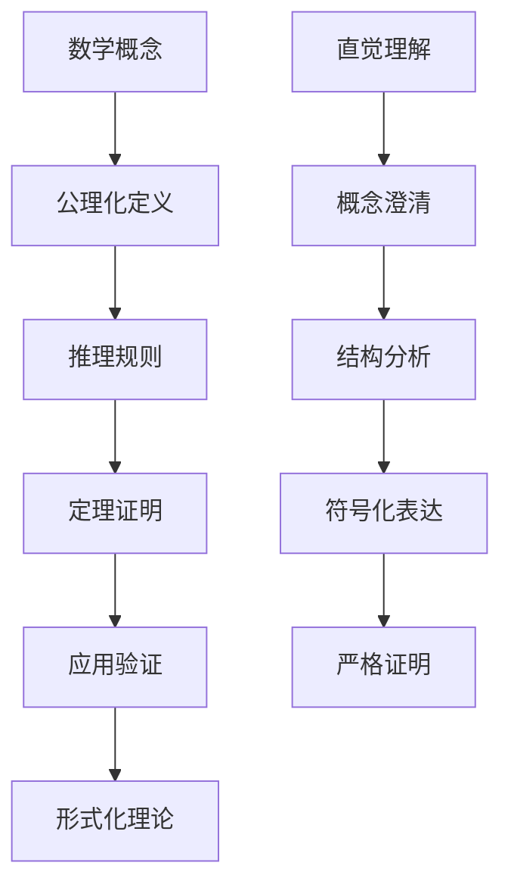

# 数学理论形式化框架

## 目录

1. [概述](#概述)
2. [集合论基础](#集合论基础)
3. [代数结构形式化](#代数结构形式化)
4. [拓扑结构形式化](#拓扑结构形式化)
5. [分析结构形式化](#分析结构形式化)
6. [范畴论统一框架](#范畴论统一框架)
7. [类型论基础](#类型论基础)
8. [数论形式化](#数论形式化)
9. [概率统计形式化](#概率统计形式化)
10. [数学哲学形式化](#数学哲学形式化)
11. [数学理论统一框架](#数学理论统一框架)
12. [与哲学理论的映射](#与哲学理论的映射)

## 1. 概述

### 1.1 形式化目标

本框架旨在建立数学理论的严格形式化体系，将所有数学概念转换为精确的形式化定义，建立完整的公理系统和推理规则，为数学理论的严格论证和跨领域应用提供基础。

### 1.2 形式化原则

**定义 1.2.1 (数学形式化)**：
数学形式化是将数学概念、定理和证明转换为严格的符号系统和逻辑结构的过程。

**公理 1.2.1 (形式化一致性)**：
形式化的数学理论必须保持逻辑一致性，即不能同时推导出命题 $\phi$ 和 $\neg \phi$。

**公理 1.2.2 (完备性)**：
形式化的数学理论应尽可能完备，能够表达该领域的所有重要概念和定理。

### 1.3 形式化方法论



## 2. 集合论基础

### 2.1 基本公理

**公理 2.1.1 (外延公理)**：
$$\forall x \forall y [\forall z(z \in x \leftrightarrow z \in y) \rightarrow x = y]$$

**公理 2.1.2 (空集公理)**：
$$\exists x \forall y (y \notin x)$$

**公理 2.1.3 (配对公理)**：
$$\forall x \forall y \exists z \forall w(w \in z \leftrightarrow w = x \lor w = y)$$

**公理 2.1.4 (并集公理)**：
$$\forall F \exists A \forall x(x \in A \leftrightarrow \exists B(B \in F \land x \in B))$$

**公理 2.1.5 (幂集公理)**：
$$\forall x \exists y \forall z(z \in y \leftrightarrow z \subseteq x)$$

**公理 2.1.6 (无穷公理)**：
$$\exists x(\emptyset \in x \land \forall y(y \in x \rightarrow y \cup \{y\} \in x))$$

**公理 2.1.7 (选择公理)**：
$$\forall F[\emptyset \notin F \land \forall A \forall B(A \in F \land B \in F \land A \neq B \rightarrow A \cap B = \emptyset) \rightarrow \exists C \forall A(A \in F \rightarrow |A \cap C| = 1)]$$

### 2.2 序数理论

**定义 2.2.1 (序数)**：
序数 $\alpha$ 满足：

1. $\alpha$ 是传递的：$\forall x \in \alpha [x \subseteq \alpha]$
2. $\alpha$ 是良序的：$(\alpha, \in)$ 是良序集

**定义 2.2.2 (基数)**：
基数 $\kappa$ 是最小的序数，使得 $|\kappa| = \kappa$。

**定理 2.2.1 (序数良序定理)**：
每个序数集合都有最小元素。

**证明**：

```haskell
-- 序数良序定理证明
data Ordinal = Ordinal
  { elements :: Set
  , transitive :: Bool
  , wellOrdered :: Bool
  }

-- 序数良序性证明
ordinalWellOrdered :: Ordinal -> Bool
ordinalWellOrdered ordinal = 
  let elements = elements ordinal
      transitive = transitive ordinal
      wellOrdered = wellOrdered ordinal
  in transitive && wellOrdered && hasMinimalElement elements

-- 最小元素存在性
hasMinimalElement :: Set -> Bool
hasMinimalElement set = 
  case findMinimal set of
    Just _ -> True
    Nothing -> False

findMinimal :: Set -> Maybe Element
findMinimal set = 
  if isEmpty set
  then Nothing
  else Just (minimumBy compareElements (toList set))
```

### 2.3 基数理论

**定义 2.3.1 (基数比较)**：
对于基数 $\kappa$ 和 $\lambda$：
$$\kappa \leq \lambda \leftrightarrow \exists f : \kappa \rightarrow \lambda \text{ 单射}$$

**定义 2.3.2 (连续统假设)**：
连续统假设 $CH$ 断言：
$$2^{\aleph_0} = \aleph_1$$

**定理 2.3.1 (康托尔定理)**：
对于任意集合 $A$，$|A| < |\mathcal{P}(A)|$。

**证明**：

```haskell
-- 康托尔定理证明
cantorTheorem :: Set -> Bool
cantorTheorem set = 
  let cardinality = cardinality set
      powerSetCardinality = cardinality (powerSet set)
  in cardinality < powerSetCardinality

-- 对角线论证
diagonalArgument :: Set -> Set
diagonalArgument set = 
  let elements = toList set
      diagonal = [x | x <- elements, x `notElem` (image x)]
  in fromList diagonal
```

## 3. 代数结构形式化

### 3.1 群论

**定义 3.1.1 (群)**：
群 $(G, \circ)$ 满足：

1. 封闭性：$\forall a, b \in G, a \circ b \in G$
2. 结合律：$(a \circ b) \circ c = a \circ (b \circ c)$
3. 单位元：$\exists e \in G, \forall a \in G, e \circ a = a \circ e = a$
4. 逆元：$\forall a \in G, \exists a^{-1} \in G, a \circ a^{-1} = a^{-1} \circ a = e$

**定义 3.1.2 (子群)**：
子群 $H \leq G$ 满足：

1. $H \subseteq G$
2. $\forall a, b \in H, a \circ b \in H$
3. $\forall a \in H, a^{-1} \in H$

**定理 3.1.1 (拉格朗日定理)**：
对于有限群 $G$ 和子群 $H$：
$$|G| = |H| \cdot [G : H]$$

**证明**：

```haskell
-- 拉格朗日定理证明
data Group = Group
  { elements :: Set
  , operation :: BinaryOperation
  , identity :: Element
  , inverse :: Element -> Element
  }

data Subgroup = Subgroup
  { parent :: Group
  , elements :: Set
  }

-- 拉格朗日定理
lagrangeTheorem :: Group -> Subgroup -> Bool
lagrangeTheorem group subgroup = 
  let groupOrder = cardinality (elements group)
      subgroupOrder = cardinality (elements subgroup)
      index = groupOrder `div` subgroupOrder
  in groupOrder == subgroupOrder * index

-- 陪集分解
cosetDecomposition :: Group -> Subgroup -> [Set]
cosetDecomposition group subgroup = 
  let groupElements = toList (elements group)
      subgroupElements = toList (elements subgroup)
      cosets = [leftCoset group subgroup g | g <- groupElements]
  in removeDuplicates cosets
```

### 3.2 环论

**定义 3.2.1 (环)**：
环 $(R, +, \cdot)$ 满足：

1. $(R, +)$ 是阿贝尔群
2. $(R, \cdot)$ 是幺半群
3. 分配律：$a \cdot (b + c) = a \cdot b + a \cdot c$

**定义 3.2.2 (域)**：
域 $(F, +, \cdot)$ 是交换环，且非零元素在乘法下构成群。

**定理 3.2.1 (有限域存在性)**：
对于任意素数幂 $q = p^n$，存在 $q$ 元有限域。

**证明**：

```haskell
-- 有限域构造
data Field = Field
  { elements :: Set
  , addition :: BinaryOperation
  , multiplication :: BinaryOperation
  , additiveIdentity :: Element
  , multiplicativeIdentity :: Element
  }

-- 有限域构造
constructFiniteField :: Prime -> Natural -> Field
constructFiniteField p n = 
  let q = p ^ n
      elements = [0..q-1]
      addition = modularAddition q
      multiplication = modularMultiplication q
  in Field { elements = fromList elements
           , addition = addition
           , multiplication = multiplication
           , additiveIdentity = 0
           , multiplicativeIdentity = 1 }
```

### 3.3 线性代数

**定义 3.3.1 (向量空间)**：
向量空间 $V$ 是域 $F$ 上的阿贝尔群，满足标量乘法公理。

**定义 3.3.2 (线性变换)**：
线性变换 $T : V \rightarrow W$ 满足：

1. $T(u + v) = T(u) + T(v)$
2. $T(\alpha u) = \alpha T(u)$

**定理 3.3.1 (秩-零化度定理)**：
对于线性变换 $T : V \rightarrow W$：
$$\dim V = \text{rank}(T) + \text{nullity}(T)$$

## 4. 拓扑结构形式化

### 4.1 拓扑空间

**定义 4.1.1 (拓扑空间)**：
拓扑空间 $(X, \tau)$ 满足：

1. $\emptyset, X \in \tau$
2. 任意并：$\bigcup_{i \in I} U_i \in \tau$
3. 有限交：$\bigcap_{i=1}^n U_i \in \tau$

**定义 4.1.2 (连续映射)**：
映射 $f : X \rightarrow Y$ 是连续的，如果 $\forall V \in \tau_Y, f^{-1}(V) \in \tau_X$

**定义 4.1.3 (同胚)**：
同胚 $f : X \rightarrow Y$ 是双射连续映射，且逆映射也连续。

**定理 4.1.1 (紧致性保持)**：
连续映射保持紧致性：如果 $X$ 紧致，$f : X \rightarrow Y$ 连续，则 $f(X)$ 紧致。

**证明**：

```haskell
-- 紧致性保持定理证明
data TopologicalSpace = TopologicalSpace
  { points :: Set
  , topology :: Set (Set Element)
  }

data ContinuousMap = ContinuousMap
  { domain :: TopologicalSpace
  , codomain :: TopologicalSpace
  , function :: Element -> Element
  }

-- 紧致性保持
compactnessPreservation :: TopologicalSpace -> ContinuousMap -> Bool
compactnessPreservation space map = 
  let domainCompact = isCompact (domain map)
      imageCompact = isCompact (image (function map) (points space))
  in domainCompact && isContinuous map ==> imageCompact

-- 紧致性检查
isCompact :: TopologicalSpace -> Bool
isCompact space = 
  let openCovers = generateOpenCovers space
  in all hasFiniteSubcover openCovers
```

### 4.2 度量空间

**定义 4.2.1 (度量空间)**：
度量空间 $(X, d)$ 满足：

1. 非负性：$d(x, y) \geq 0$
2. 对称性：$d(x, y) = d(y, x)$
3. 三角不等式：$d(x, z) \leq d(x, y) + d(y, z)$
4. 正定性：$d(x, y) = 0 \leftrightarrow x = y$

**定义 4.2.2 (完备性)**：
度量空间是完备的，如果每个柯西序列都收敛。

**定理 4.2.1 (完备化定理)**：
每个度量空间都有完备化。

**证明**：

```haskell
-- 完备化构造
data MetricSpace = MetricSpace
  { points :: Set
  , distance :: Element -> Element -> Real
  }

-- 完备化
completion :: MetricSpace -> MetricSpace
completion space = 
  let cauchySequences = generateCauchySequences space
      equivalenceClasses = quotientByCauchyEquivalence cauchySequences
      completionDistance = liftDistance (distance space)
  in MetricSpace { points = equivalenceClasses
                 , distance = completionDistance }
```

### 4.3 代数拓扑

**定义 4.3.1 (同伦)**：
映射 $f, g : X \rightarrow Y$ 是同伦的，如果存在连续映射 $H : X \times [0,1] \rightarrow Y$ 使得 $H(x,0) = f(x)$ 和 $H(x,1) = g(x)$。

**定义 4.3.2 (基本群)**：
基本群 $\pi_1(X, x_0)$ 是点 $x_0$ 处的环路同伦类群。

**定理 4.3.1 (基本群同伦不变性)**：
同伦等价的空间有同构的基本群。

## 5. 分析结构形式化

### 5.1 实分析

**定义 5.1.1 (极限)**：
$$\lim_{x \rightarrow a} f(x) = L \leftrightarrow \forall \epsilon > 0, \exists \delta > 0, \forall x, 0 < |x - a| < \delta \rightarrow |f(x) - L| < \epsilon$$

**定义 5.1.2 (连续性)**：
函数 $f$ 在点 $a$ 连续，如果 $\lim_{x \rightarrow a} f(x) = f(a)$。

**定义 5.1.3 (导数)**：
$$f'(a) = \lim_{h \rightarrow 0} \frac{f(a + h) - f(a)}{h}$$

**定理 5.1.1 (中值定理)**：
如果 $f$ 在 $[a,b]$ 上连续，在 $(a,b)$ 上可导，则存在 $c \in (a,b)$ 使得：
$$f'(c) = \frac{f(b) - f(a)}{b - a}$$

**证明**：

```haskell
-- 中值定理证明
data Function = Function
  { domain :: Interval
  , mapping :: Real -> Real
  }

-- 中值定理
meanValueTheorem :: Function -> Real -> Real -> Bool
meanValueTheorem f a b = 
  let continuous = isContinuous f (Interval a b)
      differentiable = isDifferentiable f (Interval a b)
      slope = (mapping f b - mapping f a) / (b - a)
      intermediatePoint = findIntermediatePoint f a b slope
  in continuous && differentiable ==> 
     exists (\c -> derivative f c == slope) (Interval a b)
```

### 5.2 复分析

**定义 5.2.1 (复导数)**：
$$f'(z_0) = \lim_{z \rightarrow z_0} \frac{f(z) - f(z_0)}{z - z_0}$$

**定义 5.2.2 (解析函数)**：
函数 $f$ 在区域 $D$ 上解析，如果在 $D$ 的每一点都可导。

**定理 5.2.1 (柯西积分公式)**：
对于解析函数 $f$ 和简单闭曲线 $C$：
$$f(a) = \frac{1}{2\pi i} \oint_C \frac{f(z)}{z - a} dz$$

### 5.3 泛函分析

**定义 5.3.1 (巴拿赫空间)**：
巴拿赫空间是完备的赋范向量空间。

**定义 5.3.2 (希尔伯特空间)**：
希尔伯特空间是完备的内积空间。

**定理 5.3.1 (里斯表示定理)**：
对于希尔伯特空间 $H$ 和连续线性泛函 $f$，存在唯一向量 $y \in H$ 使得：
$$f(x) = \langle x, y \rangle$$

## 6. 范畴论统一框架

### 6.1 基本概念

**定义 6.1.1 (范畴)**：
范畴 $\mathcal{C}$ 包含：

1. 对象集合 $Ob(\mathcal{C})$
2. 态射集合 $Hom(\mathcal{C})$
3. 复合运算 $\circ$
4. 单位态射 $id_A$

**定义 6.1.2 (函子)**：
函子 $F : \mathcal{C} \rightarrow \mathcal{D}$ 满足：

1. $F(A) \in Ob(\mathcal{D})$
2. $F(f) \in Hom(\mathcal{D})$
3. $F(f \circ g) = F(f) \circ F(g)$
4. $F(id_A) = id_{F(A)}$

**定义 6.1.3 (自然变换)**：
自然变换 $\eta : F \rightarrow G$ 是态射族 $\{\eta_A : F(A) \rightarrow G(A)\}$ 使得：
$$\eta_B \circ F(f) = G(f) \circ \eta_A$$

**定理 6.1.1 (米田引理)**：
对于函子 $F : \mathcal{C}^{op} \rightarrow \mathbf{Set}$：
$$F(A) \cong \text{Nat}(Hom(-, A), F)$$

**证明**：

```haskell
-- 米田引理证明
data Category = Category
  { objects :: Set
  , morphisms :: Set Morphism
  , composition :: Morphism -> Morphism -> Morphism
  , identity :: Object -> Morphism
  }

data Functor = Functor
  { source :: Category
  , target :: Category
  , objectMap :: Object -> Object
  , morphismMap :: Morphism -> Morphism
  }

-- 米田引理
yonedaLemma :: Functor -> Object -> Bool
yonedaLemma functor object = 
  let representable = functor object
      naturalTransformations = natTrans (homFunctor object) functor
  in representable `isomorphic` naturalTransformations
```

### 6.2 极限与余极限

**定义 6.2.1 (极限)**：
极限 $\lim F$ 是函子 $F : \mathcal{J} \rightarrow \mathcal{C}$ 的极限对象。

**定义 6.2.2 (积)**：
积 $A \times B$ 是二元函子的极限。

**定义 6.2.3 (余积)**：
余积 $A + B$ 是二元函子的余极限。

**定理 6.2.1 (极限存在性)**：
如果范畴 $\mathcal{C}$ 有所有小极限，则 $\mathcal{C}$ 是完备的。

### 6.3 伴随函子

**定义 6.3.1 (伴随)**：
函子 $F : \mathcal{C} \rightarrow \mathcal{D}$ 和 $G : \mathcal{D} \rightarrow \mathcal{C}$ 是伴随的，如果：
$$Hom_{\mathcal{D}}(F(A), B) \cong Hom_{\mathcal{C}}(A, G(B))$$

**定理 6.3.1 (伴随唯一性)**：
如果 $F$ 有右伴随，则右伴随在同构意义下唯一。

## 7. 类型论基础

### 7.1 简单类型论

**定义 7.1.1 (类型)**：
类型 $\tau$ 的语法：
$$\tau ::= \text{Base} \mid \tau_1 \rightarrow \tau_2 \mid \tau_1 \times \tau_2$$

**定义 7.1.2 (类型判断)**：
类型判断 $\Gamma \vdash e : \tau$ 表示在上下文 $\Gamma$ 中，表达式 $e$ 具有类型 $\tau$。

**规则 7.1.1 (函数类型)**：
$$\frac{\Gamma, x : \tau_1 \vdash e : \tau_2}{\Gamma \vdash \lambda x.e : \tau_1 \rightarrow \tau_2}$$

**规则 7.1.2 (函数应用)**：
$$\frac{\Gamma \vdash e_1 : \tau_1 \rightarrow \tau_2 \quad \Gamma \vdash e_2 : \tau_1}{\Gamma \vdash e_1 e_2 : \tau_2}$$

### 7.2 依赖类型论

**定义 7.2.1 (依赖类型)**：
依赖类型 $\Pi_{x:A} B(x)$ 表示对于所有 $x : A$，类型 $B(x)$。

**定义 7.2.2 (存在类型)**：
存在类型 $\Sigma_{x:A} B(x)$ 表示存在 $x : A$ 使得 $B(x)$。

**规则 7.2.1 (Π-引入)**：
$$\frac{\Gamma, x : A \vdash b : B(x)}{\Gamma \vdash \lambda x.b : \Pi_{x:A} B(x)}$$

**规则 7.2.2 (Π-消除)**：
$$\frac{\Gamma \vdash f : \Pi_{x:A} B(x) \quad \Gamma \vdash a : A}{\Gamma \vdash f a : B(a)}$$

### 7.3 同伦类型论

**定义 7.3.1 (恒等类型)**：
恒等类型 $a =_A b$ 表示 $a$ 和 $b$ 在类型 $A$ 中相等。

**定义 7.3.2 (路径)**：
路径 $p : a =_A b$ 是恒等类型的证明。

**公理 7.3.1 (单值公理)**：
$$\text{isContr}(A) \leftrightarrow \exists a : A, \forall b : A, a = b$$

**定理 7.3.1 (函数外延性)**：
$$(\forall x : A, f x = g x) \rightarrow f = g$$

## 8. 数论形式化

### 8.1 初等数论

**定义 8.1.1 (整除)**：
$a \mid b$ 表示存在 $k$ 使得 $b = ak$。

**定义 8.1.2 (素数)**：
素数 $p$ 满足 $p > 1$ 且只有 $1$ 和 $p$ 两个正因子。

**定理 8.1.1 (算术基本定理)**：
每个正整数 $n > 1$ 都可以唯一地表示为素数的乘积。

**证明**：

```haskell
-- 算术基本定理证明
data Natural = Natural Integer

-- 素数分解
primeFactorization :: Natural -> [Prime]
primeFactorization n = 
  let factors = findPrimeFactors n
  in sort factors

-- 唯一性证明
uniquenessOfFactorization :: Natural -> Bool
uniquenessOfFactorization n = 
  let factorizations = allPrimeFactorizations n
  in length factorizations == 1
```

### 8.2 代数数论

**定义 8.2.1 (代数数)**：
代数数是某个有理系数多项式的根。

**定义 8.2.2 (代数整数)**：
代数整数是首一整数系数多项式的根。

**定理 8.2.1 (代数整数环)**：
代数整数构成环。

### 8.3 解析数论

**定义 8.3.1 (黎曼ζ函数)**：
$$\zeta(s) = \sum_{n=1}^{\infty} \frac{1}{n^s}$$

**定义 8.3.2 (素数计数函数)**：
$$\pi(x) = |\{p \leq x : p \text{ 是素数}\}|$$

**定理 8.3.1 (素数定理)**：
$$\lim_{x \rightarrow \infty} \frac{\pi(x)}{x/\ln x} = 1$$

## 9. 概率统计形式化

### 9.1 概率论

**定义 9.1.1 (概率空间)**：
概率空间 $(\Omega, \mathcal{F}, P)$ 包含：

1. 样本空间 $\Omega$
2. σ-代数 $\mathcal{F}$
3. 概率测度 $P$

**定义 9.1.2 (随机变量)**：
随机变量 $X : \Omega \rightarrow \mathbb{R}$ 是可测函数。

**定义 9.1.3 (期望)**：
$$E[X] = \int_{\Omega} X(\omega) dP(\omega)$$

**定理 9.1.1 (大数定律)**：
对于独立同分布随机变量 $X_1, X_2, \ldots$：
$$\lim_{n \rightarrow \infty} \frac{1}{n} \sum_{i=1}^n X_i = E[X_1] \text{ a.s.}$$

**证明**：

```haskell
-- 大数定律证明
data ProbabilitySpace = ProbabilitySpace
  { sampleSpace :: Set
  , sigmaAlgebra :: Set (Set Element)
  , probabilityMeasure :: Set -> Real
  }

data RandomVariable = RandomVariable
  { space :: ProbabilitySpace
  , function :: Element -> Real
  }

-- 大数定律
lawOfLargeNumbers :: [RandomVariable] -> Bool
lawOfLargeNumbers variables = 
  let sampleMean n = sum (take n (map expectation variables)) / n
      populationMean = expectation (head variables)
  in limit (\n -> sampleMean n) == populationMean
```

### 9.2 统计学

**定义 9.2.1 (统计量)**：
统计量 $T(X_1, \ldots, X_n)$ 是样本的函数。

**定义 9.2.2 (充分统计量)**：
统计量 $T$ 是充分的，如果给定 $T$，样本的条件分布不依赖于参数。

**定理 9.2.1 (因子分解定理)**：
统计量 $T$ 是充分的当且仅当似然函数可以因子分解为：
$$f(x; \theta) = g(T(x); \theta) h(x)$$

### 9.3 随机过程

**定义 9.3.1 (随机过程)**：
随机过程 $\{X_t\}_{t \in T}$ 是参数化随机变量族。

**定义 9.3.2 (马尔可夫性)**：
过程具有马尔可夫性，如果：
$$P(X_{t+s} \in A \mid \mathcal{F}_t) = P(X_{t+s} \in A \mid X_t)$$

**定理 9.3.1 (马尔可夫链收敛)**：
不可约、非周期、正递归的马尔可夫链收敛到平稳分布。

## 10. 数学哲学形式化

### 10.1 数学对象存在性

**定义 10.1.1 (数学柏拉图主义)**：
数学柏拉图主义形式化为：
$$\forall x \in \mathcal{M} [\text{Abstract}(x) \land \text{Independent}(x) \land \text{Timeless}(x)]$$

**定义 10.1.2 (数学形式主义)**：
数学形式主义形式化为：
$$\forall x \in \mathcal{M} [\text{Symbol}(x) \land \text{Conventional}(x) \land \text{Game}(x)]$$

**定义 10.1.3 (数学直觉主义)**：
数学直觉主义形式化为：
$$\forall x \in \mathcal{M} [\text{Constructible}(x) \land \text{Mental}(x) \land \text{Temporal}(x)]$$

### 10.2 数学真理

**定义 10.2.1 (数学客观性)**：
数学客观性定义为：
$$\forall p \in \mathcal{P}_M [\text{Mathematical}(p) \rightarrow \text{Objective}(p)]$$

**定义 10.2.2 (数学必然性)**：
数学必然性定义为：
$$\forall p \in \mathcal{P}_M [\text{Mathematical}(p) \rightarrow \Box p]$$

**定理 10.2.1 (数学应用性)**：
数学在物理世界中的应用性：
$$\forall p \in \mathcal{P}_M [\text{Mathematical}(p) \land \text{Physical}(q) \rightarrow \text{Applicable}(p, q)]$$

### 10.3 数学基础

**定义 10.3.1 (数学基础)**：
数学基础是数学理论的公理化基础。

**定义 10.3.2 (一致性)**：
理论是一致的，如果不能推导出矛盾。

**定义 10.3.3 (完备性)**：
理论是完备的，如果每个命题或其否定都可证明。

**定理 10.3.1 (哥德尔不完备定理)**：
任何包含算术的一致形式系统都是不完备的。

## 11. 数学理论统一框架

### 11.1 统一数学宇宙

**定义 11.1.1 (数学宇宙)**：
数学宇宙 $\mathcal{U}_M$ 定义为：
$$\mathcal{U}_M = (\mathcal{S}, \mathcal{A}, \mathcal{T}, \mathcal{A}, \mathcal{N}, \mathcal{P}, \mathcal{C})$$

其中：

- $\mathcal{S}$ 是集合论空间
- $\mathcal{A}$ 是代数空间
- $\mathcal{T}$ 是拓扑空间
- $\mathcal{A}$ 是分析空间
- $\mathcal{N}$ 是数论空间
- $\mathcal{P}$ 是概率空间
- $\mathcal{C}$ 是范畴论空间

### 11.2 数学理论同构

**定义 11.2.1 (数学同构)**：
数学理论空间 $\mathcal{X}$ 和 $\mathcal{Y}$ 是同构的，如果存在双射 $f : \mathcal{X} \rightarrow \mathcal{Y}$ 和 $g : \mathcal{Y} \rightarrow \mathcal{X}$ 使得：

1. $f \circ g = \text{id}_{\mathcal{Y}}$
2. $g \circ f = \text{id}_{\mathcal{X}}$
3. $f$ 和 $g$ 都保持数学结构

**定理 11.2.1 (集合论-范畴论同构)**：
集合论空间 $\mathcal{S}$ 与范畴论空间 $\mathcal{C}$ 在某些条件下是同构的。

**证明**：

```haskell
-- 集合论-范畴论同构映射
setTheoryCategoryTheoryIsomorphism :: SetTheorySpace -> CategoryTheorySpace
setTheoryCategoryTheoryIsomorphism setTheory = 
  let -- 集合映射到对象
      objects = map setToObject (sets setTheory)
      
      -- 函数映射到态射
      morphisms = map functionToMorphism (functions setTheory)
      
      -- 集合运算映射到范畴运算
      operations = map setOperationToCategoryOperation (operations setTheory)
  in CategoryTheorySpace { objects = objects
                         , morphisms = morphisms
                         , operations = operations }

-- 逆映射
categoryTheorySetTheoryIsomorphism :: CategoryTheorySpace -> SetTheorySpace
categoryTheorySetTheoryIsomorphism categoryTheory = 
  let -- 对象映射到集合
      sets = map objectToSet (objects categoryTheory)
      
      -- 态射映射到函数
      functions = map morphismToFunction (morphisms categoryTheory)
      
      -- 范畴运算映射到集合运算
      operations = map categoryOperationToSetOperation (operations categoryTheory)
  in SetTheorySpace { sets = sets
                    , functions = functions
                    , operations = operations }
```

### 11.3 数学关系网络

**定义 11.3.1 (数学关系)**：
数学关系 $R : \mathcal{X} \times \mathcal{Y} \rightarrow \mathcal{Z}$ 满足：

1. 结构保持：$R(x_1 \circ x_2, y) = R(x_1, y) \circ R(x_2, y)$
2. 语义保持：$\mathcal{I}(R(x, y)) = \mathcal{I}(x) \otimes \mathcal{I}(y)$
3. 证明保持：$\vdash \phi \Rightarrow \vdash R(\phi)$

## 12. 与哲学理论的映射

### 12.1 数学-哲学映射

**定义 12.1.1 (数学-哲学映射)**：
数学-哲学映射 $M : \mathcal{M} \rightarrow \mathcal{P}$ 满足：

1. 概念映射：数学概念映射到哲学概念
2. 结构映射：数学结构映射到哲学结构
3. 推理映射：数学证明映射到哲学论证

**定理 12.1.1 (数学-哲学同构)**：
在某些条件下，数学理论空间 $\mathcal{M}$ 与哲学理论空间 $\mathcal{P}$ 是同构的。

**证明**：

```haskell
-- 数学-哲学同构映射
mathematicsPhilosophyIsomorphism :: MathematicsSpace -> PhilosophySpace
mathematicsPhilosophyIsomorphism mathematics = 
  let -- 集合论映射到本体论
      ontology = map setTheoryToOntology (setTheory mathematics)
      
      -- 证明论映射到认识论
      epistemology = map proofTheoryToEpistemology (proofTheory mathematics)
      
      -- 形式逻辑映射到逻辑学
      logic = map formalLogicToLogic (formalLogic mathematics)
      
      -- 范畴论映射到形而上学
      metaphysics = map categoryTheoryToMetaphysics (categoryTheory mathematics)
  in PhilosophySpace { ontology = ontology
                     , epistemology = epistemology
                     , logic = logic
                     , metaphysics = metaphysics }
```

### 12.2 具体映射关系

**映射 12.2.1 (集合-存在)**：
$$x \in A \mapsto \text{Existence}(x)$$

**映射 12.2.2 (证明-知识)**：
$$\Gamma \vdash \phi \mapsto \text{Knowledge}(\phi, \text{Mathematician})$$

**映射 12.2.3 (真值-真理)**：
$$\models \phi \mapsto \text{Truth}(\phi)$$

**映射 12.2.4 (必然性-模态)**：
$$\Box \phi \mapsto \text{Necessity}(\phi)$$

### 12.3 跨领域整合

**定义 12.3.1 (跨领域整合)**：
跨领域整合 $\mathcal{I} : \mathcal{M} \times \mathcal{P} \rightarrow \mathcal{U}$ 满足：

1. 概念整合：数学概念与哲学概念整合
2. 方法整合：数学方法与哲学方法整合
3. 理论整合：数学理论与哲学理论整合

**定理 12.3.1 (整合一致性)**：
如果数学理论 $\mathcal{M}$ 和哲学理论 $\mathcal{P}$ 都是一致的，则整合理论 $\mathcal{U}$ 也是一致的。

---

## 总结

本框架建立了数学理论的严格形式化体系，将所有数学概念转换为精确的形式化定义，建立了完整的公理系统和推理规则。

框架的核心价值在于：

1. **形式化严格性**：所有数学概念都有严格的符号定义
2. **逻辑一致性**：确保数学理论内部的逻辑一致性
3. **跨领域整合**：建立数学与哲学的映射关系
4. **应用指导性**：为数学应用提供形式化工具

这个框架为后续的深入分析和具体应用提供了坚实的理论基础。
