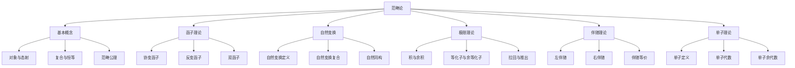

# 01-范畴论基础：统一数学结构理论

## 目录

1. [1.0 范畴论概述](#10-范畴论概述)
2. [2.0 基本概念](#20-基本概念)
3. [3.0 范畴公理](#30-范畴公理)
4. [4.0 函子理论](#40-函子理论)
5. [5.0 自然变换](#50-自然变换)
6. [6.0 极限与余极限](#60-极限与余极限)
7. [7.0 伴随函子](#70-伴随函子)
8. [8.0 单子理论](#80-单子理论)
9. [9.0 应用与扩展](#90-应用与扩展)

## 1.0 范畴论概述

### 1.1 范畴论定义

**定义 1.1.1 (范畴)**
范畴 $\mathcal{C}$ 是一个四元组 $(Ob(\mathcal{C}), Mor(\mathcal{C}), \circ, id)$，其中：

- $Ob(\mathcal{C})$ 是对象集合 (Objects)
- $Mor(\mathcal{C})$ 是态射集合 (Morphisms)
- $\circ$ 是态射复合运算 (Composition)
- $id$ 是恒等态射函数 (Identity)

**公理 1.1.1 (范畴基础公理)**
范畴 $\mathcal{C}$ 满足：
$$\forall A, B, C \in Ob(\mathcal{C}): \text{Hom}(A, B) \cap \text{Hom}(B, C) \neq \emptyset \Rightarrow \text{Hom}(A, C) \neq \emptyset$$

### 1.2 范畴论层次结构

## 2.0 基本概念

### 2.1 对象与态射

**定义 2.1.1 (对象)**
对象是范畴中的基本元素，对象集合 $Ob(\mathcal{C})$ 满足：
$$\forall A \in Ob(\mathcal{C}): \text{Object}(A)$$

**定义 2.1.2 (态射)**
态射是对象间的箭头，态射集合 $Mor(\mathcal{C})$ 满足：
$$\forall f \in Mor(\mathcal{C}): \exists A, B \in Ob(\mathcal{C}): f: A \rightarrow B$$

**定义 2.1.3 (同态集)**
从对象 $A$ 到对象 $B$ 的同态集定义为：
$$\text{Hom}(A, B) = \{f \in Mor(\mathcal{C}) \mid f: A \rightarrow B\}$$

### 2.2 态射复合

**定义 2.2.1 (态射复合)**
态射复合运算 $\circ$ 定义为：
$$\circ: \text{Hom}(B, C) \times \text{Hom}(A, B) \rightarrow \text{Hom}(A, C)$$
$$(g, f) \mapsto g \circ f$$

**公理 2.2.1 (复合结合律)**
对于任意态射 $f: A \rightarrow B$, $g: B \rightarrow C$, $h: C \rightarrow D$：
$$(h \circ g) \circ f = h \circ (g \circ f)$$

### 2.3 恒等态射

**定义 2.3.1 (恒等态射)**
恒等态射函数 $id$ 定义为：
$$id: Ob(\mathcal{C}) \rightarrow Mor(\mathcal{C})$$
$$A \mapsto id_A: A \rightarrow A$$

**公理 2.3.1 (恒等律)**
对于任意对象 $A$ 和态射 $f: A \rightarrow B$：
$$id_B \circ f = f = f \circ id_A$$

## 3.0 范畴公理

### 3.1 基本公理

**公理 3.1.1 (范畴公理系统)**
范畴 $\mathcal{C}$ 满足以下公理：

1. **对象存在性**：$Ob(\mathcal{C}) \neq \emptyset$
2. **态射存在性**：$\forall A, B \in Ob(\mathcal{C}): \text{Hom}(A, B) \text{ 是集合}$
3. **复合封闭性**：$\forall f: A \rightarrow B, g: B \rightarrow C: g \circ f \text{ 存在}$
4. **结合律**：$(h \circ g) \circ f = h \circ (g \circ f)$
5. **恒等律**：$id_B \circ f = f = f \circ id_A$

### 3.2 范畴性质

**定义 3.2.1 (小范畴)**
范畴 $\mathcal{C}$ 是小范畴当且仅当：
$$\text{Small}(\mathcal{C}) \Leftrightarrow Ob(\mathcal{C}) \text{ 和 } Mor(\mathcal{C}) \text{ 都是集合}$$

**定义 3.2.2 (局部小范畴)**
范畴 $\mathcal{C}$ 是局部小范畴当且仅当：
$$\text{LocallySmall}(\mathcal{C}) \Leftrightarrow \forall A, B \in Ob(\mathcal{C}): \text{Hom}(A, B) \text{ 是集合}$$

**定义 3.2.3 (完全范畴)**
范畴 $\mathcal{C}$ 是完全范畴当且仅当：
$$\text{Complete}(\mathcal{C}) \Leftrightarrow \text{HasAllLimits}(\mathcal{C})$$

### 3.3 范畴构造

**定义 3.3.1 (对偶范畴)**
范畴 $\mathcal{C}$ 的对偶范畴 $\mathcal{C}^{op}$ 定义为：
$$Ob(\mathcal{C}^{op}) = Ob(\mathcal{C})$$
$$\text{Hom}_{\mathcal{C}^{op}}(A, B) = \text{Hom}_{\mathcal{C}}(B, A)$$

**定义 3.3.2 (积范畴)**
范畴 $\mathcal{C}$ 和 $\mathcal{D}$ 的积范畴 $\mathcal{C} \times \mathcal{D}$ 定义为：
$$Ob(\mathcal{C} \times \mathcal{D}) = Ob(\mathcal{C}) \times Ob(\mathcal{D})$$
$$\text{Hom}((A, X), (B, Y)) = \text{Hom}(A, B) \times \text{Hom}(X, Y)$$

## 4.0 函子理论

### 4.1 函子定义

**定义 4.1.1 (协变函子)**
协变函子 $F: \mathcal{C} \rightarrow \mathcal{D}$ 是一个二元组 $(F_{ob}, F_{mor})$，其中：

- $F_{ob}: Ob(\mathcal{C}) \rightarrow Ob(\mathcal{D})$ 是对象函数
- $F_{mor}: Mor(\mathcal{C}) \rightarrow Mor(\mathcal{D})$ 是态射函数

满足：
1. $\forall f: A \rightarrow B: F_{mor}(f): F_{ob}(A) \rightarrow F_{ob}(B)$
2. $\forall A \in Ob(\mathcal{C}): F_{mor}(id_A) = id_{F_{ob}(A)}$
3. $\forall f, g: F_{mor}(g \circ f) = F_{mor}(g) \circ F_{mor}(f)$

**定义 4.1.2 (反变函子)**
反变函子 $F: \mathcal{C}^{op} \rightarrow \mathcal{D}$ 满足：
$$\forall f: A \rightarrow B: F_{mor}(f): F_{ob}(B) \rightarrow F_{ob}(A)$$

### 4.2 函子性质

**定义 4.2.1 (忠实函子)**
函子 $F: \mathcal{C} \rightarrow \mathcal{D}$ 是忠实的当且仅当：
$$\text{Faithful}(F) \Leftrightarrow \forall A, B \in Ob(\mathcal{C}): F_{mor}: \text{Hom}(A, B) \hookrightarrow \text{Hom}(F(A), F(B))$$

**定义 4.2.2 (满函子)**
函子 $F: \mathcal{C} \rightarrow \mathcal{D}$ 是满的当且仅当：
$$\text{Full}(F) \Leftrightarrow \forall A, B \in Ob(\mathcal{C}): F_{mor}: \text{Hom}(A, B) \twoheadrightarrow \text{Hom}(F(A), F(B))$$

**定义 4.2.3 (完全函子)**
函子 $F: \mathcal{C} \rightarrow \mathcal{D}$ 是完全的当且仅当：
$$\text{FullyFaithful}(F) \Leftrightarrow \text{Faithful}(F) \land \text{Full}(F)$$

### 4.3 特殊函子

**定义 4.3.1 (恒等函子)**
恒等函子 $1_{\mathcal{C}}: \mathcal{C} \rightarrow \mathcal{C}$ 定义为：
$$1_{\mathcal{C}}(A) = A, \quad 1_{\mathcal{C}}(f) = f$$

**定义 4.3.2 (常函子)**
常函子 $\Delta_A: \mathcal{C} \rightarrow \mathcal{D}$ 定义为：
$$\Delta_A(B) = A, \quad \Delta_A(f) = id_A$$

**定义 4.3.3 (遗忘函子)**
遗忘函子 $U: \mathcal{C} \rightarrow \mathcal{D}$ 遗忘某些结构：
$$U(A) = \text{Underlying}(A), \quad U(f) = \text{Underlying}(f)$$

## 5.0 自然变换

### 5.1 自然变换定义

**定义 5.1.1 (自然变换)**
自然变换 $\alpha: F \Rightarrow G$ 是函子 $F, G: \mathcal{C} \rightarrow \mathcal{D}$ 之间的态射，对于每个对象 $A \in Ob(\mathcal{C})$，存在态射 $\alpha_A: F(A) \rightarrow G(A)$，使得对于任意态射 $f: A \rightarrow B$：
$$G(f) \circ \alpha_A = \alpha_B \circ F(f)$$

**公理 5.1.1 (自然性公理)**
自然变换 $\alpha$ 满足自然性条件：
$$\forall f: A \rightarrow B: \alpha_B \circ F(f) = G(f) \circ \alpha_A$$

### 5.2 自然变换性质

**定义 5.2.1 (自然同构)**
自然变换 $\alpha: F \Rightarrow G$ 是自然同构当且仅当：
$$\text{NaturalIsomorphism}(\alpha) \Leftrightarrow \forall A \in Ob(\mathcal{C}): \alpha_A \text{ 是同构}$$

**定义 5.2.2 (自然变换复合)**
自然变换 $\alpha: F \Rightarrow G$ 和 $\beta: G \Rightarrow H$ 的复合定义为：
$$(\beta \circ \alpha)_A = \beta_A \circ \alpha_A$$

**定义 5.2.3 (自然变换恒等)**
恒等自然变换 $1_F: F \Rightarrow F$ 定义为：
$$(1_F)_A = id_{F(A)}$$

### 5.3 自然变换函子

**定义 5.3.1 (函子范畴)**
函子范畴 $[\mathcal{C}, \mathcal{D}]$ 定义为：
$$Ob([\mathcal{C}, \mathcal{D}]) = \text{Functors}(\mathcal{C}, \mathcal{D})$$
$$\text{Hom}(F, G) = \text{NaturalTransformations}(F, G)$$

**定理 5.3.1 (自然变换函子定理)**
函子范畴 $[\mathcal{C}, \mathcal{D}]$ 是一个范畴。

## 6.0 极限与余极限

### 6.1 锥与余锥

**定义 6.1.1 (锥)**
函子 $F: \mathcal{J} \rightarrow \mathcal{C}$ 的锥是一个对象 $A \in Ob(\mathcal{C})$ 和一族态射 $\{\alpha_j: A \rightarrow F(j)\}_{j \in Ob(\mathcal{J})}$，使得对于任意态射 $f: j \rightarrow k$：
$$F(f) \circ \alpha_j = \alpha_k$$

**定义 6.1.2 (余锥)**
函子 $F: \mathcal{J} \rightarrow \mathcal{C}$ 的余锥是一个对象 $A \in Ob(\mathcal{C})$ 和一族态射 $\{\alpha_j: F(j) \rightarrow A\}_{j \in Ob(\mathcal{J})}$，使得对于任意态射 $f: j \rightarrow k$：
$$\alpha_k \circ F(f) = \alpha_j$$

### 6.2 极限定义

**定义 6.2.1 (极限)**
函子 $F: \mathcal{J} \rightarrow \mathcal{C}$ 的极限是一个锥 $(L, \{\pi_j: L \rightarrow F(j)\})$，使得对于任意锥 $(A, \{\alpha_j: A \rightarrow F(j)\})$，存在唯一的态射 $u: A \rightarrow L$ 使得：
$$\forall j \in Ob(\mathcal{J}): \pi_j \circ u = \alpha_j$$

**定义 6.2.2 (余极限)**
函子 $F: \mathcal{J} \rightarrow \mathcal{C}$ 的余极限是一个余锥 $(L, \{\iota_j: F(j) \rightarrow L\})$，使得对于任意余锥 $(A, \{\alpha_j: F(j) \rightarrow A\})$，存在唯一的态射 $u: L \rightarrow A$ 使得：
$$\forall j \in Ob(\mathcal{J}): u \circ \iota_j = \alpha_j$$

### 6.3 特殊极限

**定义 6.3.1 (积)**
离散范畴 $\mathcal{J}$ 上的函子 $F$ 的极限称为积：
$$\prod_{j \in \mathcal{J}} F(j) = \lim F$$

**定义 6.3.2 (余积)**
离散范畴 $\mathcal{J}$ 上的函子 $F$ 的余极限称为余积：
$$\coprod_{j \in \mathcal{J}} F(j) = \text{colim} F$$

**定义 6.3.3 (等化子)**
平行态射 $f, g: A \rightarrow B$ 的等化子是极限：
$$\text{Eq}(f, g) = \lim(A \rightrightarrows B)$$

**定义 6.3.4 (余等化子)**
平行态射 $f, g: A \rightarrow B$ 的余等化子是余极限：
$$\text{Coeq}(f, g) = \text{colim}(A \rightrightarrows B)$$

## 7.0 伴随函子

### 7.1 伴随定义

**定义 7.1.1 (伴随函子)**
函子 $F: \mathcal{C} \rightarrow \mathcal{D}$ 和 $G: \mathcal{D} \rightarrow \mathcal{C}$ 构成伴随对 $(F \dashv G)$ 当且仅当存在自然同构：
$$\text{Hom}_{\mathcal{D}}(F(-), -) \cong \text{Hom}_{\mathcal{C}}(-, G(-))$$

**公理 7.1.1 (伴随公理)**
伴随函子满足：
$$\forall A \in Ob(\mathcal{C}), B \in Ob(\mathcal{D}): \text{Hom}(F(A), B) \cong \text{Hom}(A, G(B))$$

### 7.2 伴随性质

**定义 7.2.1 (单位)**
伴随 $(F \dashv G)$ 的单位 $\eta: 1_{\mathcal{C}} \Rightarrow G \circ F$ 定义为：
$$\eta_A: A \rightarrow G(F(A))$$

**定义 7.2.2 (余单位)**
伴随 $(F \dashv G)$ 的余单位 $\epsilon: F \circ G \Rightarrow 1_{\mathcal{D}}$ 定义为：
$$\epsilon_B: F(G(B)) \rightarrow B$$

**定理 7.2.1 (伴随三角恒等式)**
伴随函子满足三角恒等式：
$$(\epsilon F) \circ (F \eta) = 1_F$$
$$(G \epsilon) \circ (\eta G) = 1_G$$

### 7.3 伴随等价

**定义 7.3.1 (伴随等价)**
伴随函子 $(F \dashv G)$ 是伴随等价当且仅当：
$$\text{AdjointEquivalence}(F, G) \Leftrightarrow \eta \text{ 和 } \epsilon \text{ 都是自然同构}$$

**定理 7.3.1 (伴随等价定理)**
如果 $(F \dashv G)$ 是伴随等价，则 $F$ 和 $G$ 都是完全忠实函子。

## 8.0 单子理论

### 8.1 单子定义

**定义 8.1.1 (单子)**
单子 $T = (T, \eta, \mu)$ 是一个三元组，其中：

- $T: \mathcal{C} \rightarrow \mathcal{C}$ 是函子
- $\eta: 1_{\mathcal{C}} \Rightarrow T$ 是单位自然变换
- $\mu: T^2 \Rightarrow T$ 是乘法自然变换

满足：
1. $\mu \circ (T \mu) = \mu \circ (\mu T)$ (结合律)
2. $\mu \circ (T \eta) = 1_T = \mu \circ (\eta T)$ (单位律)

### 8.2 单子代数

**定义 8.2.1 (T-代数)**
单子 $T$ 的代数是一个对象 $A$ 和态射 $\alpha: T(A) \rightarrow A$，使得：
$$\alpha \circ \eta_A = id_A$$
$$\alpha \circ \mu_A = \alpha \circ T(\alpha)$$

**定义 8.2.2 (T-代数态射)**
T-代数 $(A, \alpha)$ 和 $(B, \beta)$ 之间的态射是态射 $f: A \rightarrow B$，使得：
$$\beta \circ T(f) = f \circ \alpha$$

**定义 8.2.3 (T-代数范畴)**
T-代数范畴 $\mathcal{C}^T$ 定义为：
$$Ob(\mathcal{C}^T) = \text{T-Algebras}$$
$$\text{Hom}((A, \alpha), (B, \beta)) = \text{T-AlgebraMorphisms}$$

### 8.3 单子余代数

**定义 8.3.1 (T-余代数)**
单子 $T$ 的余代数是一个对象 $A$ 和态射 $\alpha: A \rightarrow T(A)$，使得：
$$\eta_A \circ \alpha = id_A$$
$$\mu_A \circ T(\alpha) \circ \alpha = \alpha$$

**定义 8.3.2 (T-余代数范畴)**
T-余代数范畴 $\mathcal{C}_T$ 定义为：
$$Ob(\mathcal{C}_T) = \text{T-Coalgebras}$$
$$\text{Hom}((A, \alpha), (B, \beta)) = \text{T-CoalgebraMorphisms}$$

## 9.0 应用与扩展

### 9.1 软件工程应用

**定义 9.1.1 (软件范畴)**
软件范畴 $\mathcal{SW}$ 定义为：
$$Ob(\mathcal{SW}) = \text{SoftwareComponents}$$
$$\text{Hom}(A, B) = \text{Interfaces}(A, B)$$

**定义 9.1.2 (架构函子)**
架构函子 $F: \mathcal{SW} \rightarrow \mathcal{SW}$ 定义为：
$$F(A) = \text{Architecture}(A)$$
$$F(f) = \text{Architecture}(f)$$

### 9.2 类型理论应用

**定义 9.2.1 (类型范畴)**
类型范畴 $\mathcal{Type}$ 定义为：
$$Ob(\mathcal{Type}) = \text{Types}$$
$$\text{Hom}(A, B) = \text{Functions}(A, B)$$

**定义 9.2.2 (类型函子)**
类型函子 $T: \mathcal{Type} \rightarrow \mathcal{Type}$ 定义为：
$$T(A) = \text{Monad}(A)$$
$$T(f) = \text{Monad}(f)$$

### 9.3 形式化验证

**定义 9.3.1 (验证范畴)**
验证范畴 $\mathcal{Ver}$ 定义为：
$$Ob(\mathcal{Ver}) = \text{Specifications}$$
$$\text{Hom}(S, T) = \text{Refinements}(S, T)$$

**方法 9.3.1 (范畴验证)**
使用范畴论进行形式化验证：
$$\text{Verify}(S) \Leftrightarrow \exists f: S \rightarrow \text{ValidSpec}$$

## 总结

范畴论基础为整个数学理论体系提供了统一的结构框架，通过严格的数学定义和形式化证明，建立了对象、态射、函子、自然变换等基本概念的理论体系。

该理论具有以下特点：

1. **统一性**：为不同数学结构提供统一框架
2. **抽象性**：高度抽象，适用于多种领域
3. **形式化程度高**：使用严格的数学符号和逻辑推理
4. **应用广泛**：在软件工程、类型理论等领域有重要应用
5. **理论完备**：提供完整的理论基础和证明

通过范畴论基础，我们可以：

- 建立统一的数学结构理论
- 进行抽象代数研究
- 支持类型系统设计
- 指导软件架构设计
- 进行形式化验证
