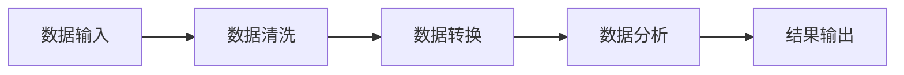

# 范畴论统一框架

## 1. 范畴论概述

### 1.1 基本定义

**定义 1.1 (范畴)**
范畴 $\mathcal{C}$ 由以下数据组成：
1. **对象类** $\text{Ob}(\mathcal{C})$：范畴中的对象集合
2. **态射类** $\text{Mor}(\mathcal{C})$：对象间的态射集合
3. **复合运算** $\circ$：态射的复合
4. **单位态射** $\text{id}_A$：每个对象的单位态射

满足以下公理：
- **结合律**：$(f \circ g) \circ h = f \circ (g \circ h)$
- **单位律**：$f \circ \text{id}_A = f = \text{id}_B \circ f$

**形式化表述**：
$$\mathcal{C} = \langle \text{Ob}(\mathcal{C}), \text{Mor}(\mathcal{C}), \circ, \text{id} \rangle$$

### 1.2 基本概念

**定义 1.2 (态射)**
从对象 $A$ 到对象 $B$ 的态射记作 $f: A \rightarrow B$，其中：
- $A$ 是态射的域 (domain)
- $B$ 是态射的余域 (codomain)

**定义 1.3 (复合)**
如果 $f: A \rightarrow B$ 和 $g: B \rightarrow C$，则复合 $g \circ f: A \rightarrow C$ 定义为：
$$(g \circ f)(x) = g(f(x))$$

## 2. 范畴论的核心概念

### 2.1 函子

**定义 2.1 (函子)**
函子 $F: \mathcal{C} \rightarrow \mathcal{D}$ 是范畴间的映射，包含：
1. **对象映射**：$F: \text{Ob}(\mathcal{C}) \rightarrow \text{Ob}(\mathcal{D})$
2. **态射映射**：$F: \text{Mor}(\mathcal{C}) \rightarrow \text{Mor}(\mathcal{D})$

满足：
- $F(f: A \rightarrow B) = F(f): F(A) \rightarrow F(B)$
- $F(g \circ f) = F(g) \circ F(f)$
- $F(\text{id}_A) = \text{id}_{F(A)}$

**定理 2.1 (函子保持结构)**
函子保持范畴的所有代数结构。

### 2.2 自然变换

**定义 2.2 (自然变换)**
自然变换 $\eta: F \Rightarrow G$ 是函子 $F, G: \mathcal{C} \rightarrow \mathcal{D}$ 间的映射，对每个对象 $A \in \mathcal{C}$，有态射 $\eta_A: F(A) \rightarrow G(A)$，使得对任意态射 $f: A \rightarrow B$，有：

```mermaid
graph LR
    A[F(A)] --> B[F(B)]
    C[G(A)] --> D[G(B)]
    A --> C
    B --> D
```

**交换图条件**：
$$G(f) \circ \eta_A = \eta_B \circ F(f)$$

### 2.3 极限与余极限

**定义 2.3 (锥)**
给定函子 $F: \mathcal{J} \rightarrow \mathcal{C}$，锥 $(C, \psi)$ 包含：
- 对象 $C \in \mathcal{C}$
- 自然变换 $\psi: \Delta_C \Rightarrow F$

其中 $\Delta_C$ 是常函子，将 $\mathcal{J}$ 的所有对象映射到 $C$。

**定义 2.4 (极限)**
极限 $\lim F$ 是 $F$ 的锥的终对象。

**定理 2.2 (极限存在性)**
如果范畴 $\mathcal{C}$ 有所有小极限，则 $\mathcal{C}$ 是完备的。

## 3. 范畴论在计算机科学中的应用

### 3.1 类型理论

**定义 3.1 (类型范畴)**
类型范畴 $\text{Type}$ 的对象是类型，态射是函数。

**示例**：
```rust
// Rust中的类型系统
pub trait Functor<A, B> {
    type Output;
    fn map<F>(self, f: F) -> Self::Output
    where F: Fn(A) -> B;
}

// 函子实例
impl<A> Functor<A, A> for Option<A> {
    type Output = Option<A>;
    
    fn map<F>(self, f: F) -> Self::Output
    where F: Fn(A) -> A,
    {
        match self {
            Some(x) => Some(f(x)),
            None => None,
        }
    }
}
```

### 3.2 程序语义

**定义 3.2 (程序范畴)**
程序范畴 $\text{Prog}$ 的对象是程序状态，态射是程序转换。

**形式化模型**：
$$\text{Program} = \langle \text{State}, \text{Transition}, \circ, \text{id} \rangle$$

### 3.3 数据库理论

**定义 3.3 (数据库模式)**
数据库模式是范畴，对象是表，态射是关系。

**示例**：
```sql
-- 表作为对象
CREATE TABLE Users (
    id INT PRIMARY KEY,
    name VARCHAR(100)
);

CREATE TABLE Orders (
    id INT PRIMARY KEY,
    user_id INT,
    FOREIGN KEY (user_id) REFERENCES Users(id)
);

-- 关系作为态射
SELECT u.name, o.id 
FROM Users u 
JOIN Orders o ON u.id = o.user_id;
```

## 4. 范畴论在软件架构中的应用

### 4.1 组件系统

**定义 4.1 (组件范畴)**
组件范畴 $\text{Comp}$ 的对象是组件，态射是接口。

**Rust实现**：
```rust
pub trait Component {
    type Input;
    type Output;
    type Error;
    
    fn process(&mut self, input: Self::Input) -> Result<Self::Output, Self::Error>;
}

pub struct ComponentSystem<C: Component> {
    components: Vec<C>,
}

impl<C: Component> ComponentSystem<C> {
    pub fn compose<F>(self, f: F) -> ComponentSystem<impl Component>
    where F: Fn(C::Output) -> impl Component,
    {
        // 实现组件复合
        unimplemented!()
    }
}
```

### 4.2 微服务架构

**定义 4.2 (服务范畴)**
服务范畴 $\text{Service}$ 的对象是服务，态射是API调用。

**形式化模型**：
$$\text{Microservice} = \langle \text{Service}, \text{API}, \circ, \text{id} \rangle$$

### 4.3 工作流系统

**定义 4.3 (工作流范畴)**
工作流范畴 $\text{Workflow}$ 的对象是任务，态射是数据流。

**示例**：


## 5. 范畴论的数学基础

### 5.1 集合论基础

**定义 5.1 (集合范畴)**
集合范畴 $\text{Set}$ 的对象是集合，态射是函数。

**定理 5.1 (集合范畴的完备性)**
$\text{Set}$ 是完备且余完备的。

### 5.2 代数结构

**定义 5.2 (群范畴)**
群范畴 $\text{Grp}$ 的对象是群，态射是群同态。

**定义 5.3 (环范畴)**
环范畴 $\text{Ring}$ 的对象是环，态射是环同态。

### 5.3 拓扑结构

**定义 5.4 (拓扑空间范畴)**
拓扑空间范畴 $\text{Top}$ 的对象是拓扑空间，态射是连续映射。

**定理 5.2 (同伦等价)**
同伦等价是 $\text{Top}$ 中的弱等价关系。

## 6. 范畴论的高级概念

### 6.1 伴随函子

**定义 6.1 (伴随)**
函子 $F: \mathcal{C} \rightarrow \mathcal{D}$ 和 $G: \mathcal{D} \rightarrow \mathcal{C}$ 是伴随的，如果存在自然同构：
$$\text{Hom}_{\mathcal{D}}(F(A), B) \cong \text{Hom}_{\mathcal{C}}(A, G(B))$$

**定理 6.1 (伴随的唯一性)**
如果 $F$ 有右伴随，则右伴随在同构意义下唯一。

### 6.2 单子

**定义 6.2 (单子)**
单子是范畴 $\mathcal{C}$ 上的三元组 $(T, \eta, \mu)$，其中：
- $T: \mathcal{C} \rightarrow \mathcal{C}$ 是函子
- $\eta: \text{id} \Rightarrow T$ 是单位
- $\mu: T^2 \Rightarrow T$ 是乘法

满足单子公理：
- $\mu \circ T\mu = \mu \circ \mu T$
- $\mu \circ T\eta = \mu \circ \eta T = \text{id}$

### 6.3 代数

**定义 6.3 (代数)**
给定单子 $T$，$T$-代数是对象 $A$ 和态射 $\alpha: T(A) \rightarrow A$，满足：
- $\alpha \circ \eta_A = \text{id}_A$
- $\alpha \circ \mu_A = \alpha \circ T(\alpha)$

## 7. 范畴论的计算应用

### 7.1 函数式编程

**定义 7.1 (函数式程序)**
函数式程序是纯函数的组合。

**Haskell示例**：
```haskell
-- 函子实例
instance Functor Maybe where
    fmap f Nothing = Nothing
    fmap f (Just x) = Just (f x)

-- 单子实例
instance Monad Maybe where
    return = Just
    Nothing >>= f = Nothing
    Just x >>= f = f x
```

### 7.2 并发系统

**定义 7.2 (并发范畴)**
并发范畴的对象是进程，态射是通信。

**Go示例**：
```go
type Process struct {
    input  chan interface{}
    output chan interface{}
}

func (p *Process) Compose(q *Process) *Process {
    // 实现进程复合
    return &Process{
        input:  p.input,
        output: q.output,
    }
}
```

### 7.3 机器学习

**定义 7.3 (学习范畴)**
学习范畴的对象是模型，态射是训练过程。

**形式化模型**：
$$\text{Learning} = \langle \text{Model}, \text{Training}, \circ, \text{id} \rangle$$

## 8. 范畴论的未来发展

### 8.1 高阶范畴

**定义 8.1 (2-范畴)**
2-范畴是具有2-态射的范畴。

**应用**：
- 程序转换的转换
- 数据库模式的演化
- 软件架构的演进

### 8.2 同伦类型论

**定义 8.2 (同伦类型)**
同伦类型论将类型视为空间。

**核心思想**：
- 类型是空间
- 项是点
- 相等是路径

### 8.3 量子计算

**定义 8.3 (量子范畴)**
量子范畴的对象是量子系统，态射是量子操作。

**应用**：
- 量子算法设计
- 量子错误纠正
- 量子机器学习

## 9. 结论

范畴论为现代数学和计算机科学提供了统一的语言和框架。通过抽象和形式化，范畴论不仅统一了不同数学分支，也为软件架构、编程语言、数据库系统等领域提供了强大的理论工具。

范畴论的核心价值在于：
1. **统一性**：提供统一的数学语言
2. **抽象性**：捕捉问题的本质结构
3. **应用性**：在多个领域有重要应用
4. **发展性**：持续推动理论发展

---

**参考文献**：
1. Mac Lane, S. (1971). Categories for the working mathematician. Springer.
2. Awodey, S. (2010). Category theory. Oxford University Press.
3. Pierce, B. C. (1991). Basic category theory for computer scientists. MIT Press.
4. Barr, M., & Wells, C. (1990). Category theory for computing science. Prentice Hall. 