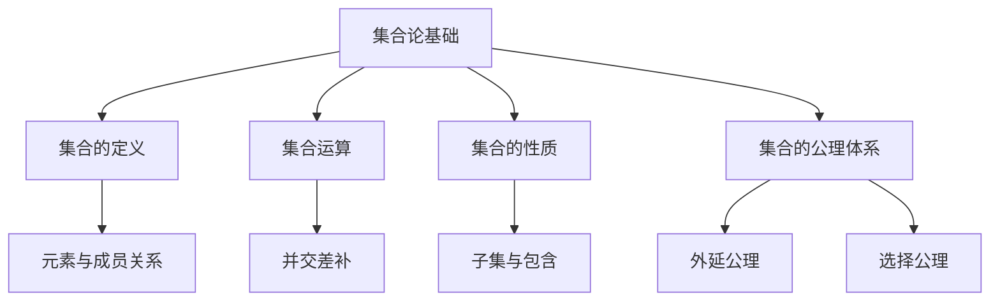

# 02-数学理论体系-集合论基础

[返回主题树](../00-主题树与内容索引.md) | [主计划文档](../00-形式化架构理论统一计划.md) | [相关计划](../13-项目报告与总结/递归合并计划.md) | [返回上级](../README.md)

> 本文档为数学理论体系分支集合论基础，所有最新进展与结论以主计划文档为准，历史细节归档于archive/。

## 目录

- [02-数学理论体系-集合论基础](#02-数学理论体系-集合论基础)
  - [目录](#目录)
  - [1. 概述](#1-概述)
    - [1.1 集合论基础概述](#11-集合论基础概述)
    - [1.2 核心目标](#12-核心目标)
    - [1.3 集合论层次结构](#13-集合论层次结构)
  - [2. 主要文件与内容索引](#2-主要文件与内容索引)
    - [2.1 核心文件](#21-核心文件)
    - [2.2 相关文件](#22-相关文件)
  - [3. 集合的基本定义与解释](#3-集合的基本定义与解释)
    - [3.1 集合的定义](#31-集合的定义)
      - [3.1.1 元素与成员关系](#311-元素与成员关系)
      - [3.1.2 子集与包含](#312-子集与包含)
      - [3.1.3 空集与全集](#313-空集与全集)
  - [4. 集合运算与性质](#4-集合运算与性质)
    - [4.1 并集、交集、差集、补集](#41-并集交集差集补集)
      - [4.1.1 运算性质](#411-运算性质)
      - [4.1.2 代码示例](#412-代码示例)
  - [5. 集合论的公理体系](#5-集合论的公理体系)
    - [5.1 外延公理](#51-外延公理)
    - [5.2 分离公理](#52-分离公理)
    - [5.3 并集公理](#53-并集公理)
    - [5.4 选择公理](#54-选择公理)
  - [6. 集合论的行业应用](#6-集合论的行业应用)
    - [6.1 计算机科学](#61-计算机科学)
    - [6.2 软件工程](#62-软件工程)
    - [6.3 数学建模](#63-数学建模)
  - [7. 发展历史](#7-发展历史)
  - [8. 应用领域](#8-应用领域)
  - [9. 现代集合论发展](#9-现代集合论发展)
    - [9.1 ZFC公理系统深化](#91-zfc公理系统深化)
    - [9.2 大基数理论](#92-大基数理论)
    - [9.3 连续统假设](#93-连续统假设)
    - [9.4 描述集合论](#94-描述集合论)
  - [10. 集合论在计算机科学中的应用](#10-集合论在计算机科学中的应用)
    - [10.1 数据库理论](#101-数据库理论)
    - [10.2 形式化验证](#102-形式化验证)
    - [10.3 类型理论](#103-类型理论)
  - [11. 总结](#11-总结)
  - [10. 相关性跳转与引用](#10-相关性跳转与引用)
  - [2025 对齐](#2025-对齐)

## 1. 概述

### 1.1 集合论基础概述

集合论是现代数学的基础理论，提供了描述和研究数学对象的统一语言。集合论不仅支撑数学的各个分支，也是形式化建模、数据库、编程语言等领域的理论基石。

### 1.2 核心目标

- 建立集合的严格定义与运算规则
- 支持数学对象的抽象与归纳
- 推动集合论与工程实践的融合

### 1.3 集合论层次结构



## 2. 主要文件与内容索引

### 2.1 核心文件

- [00-数学理论体系总论.md](00-数学理论体系总论.md)
- [02-代数基础.md](02-代数基础.md)

### 2.2 相关文件

- [03-几何基础.md](03-几何基础.md)

## 3. 集合的基本定义与解释

### 3.1 集合的定义

**定义 3.1.1** 集合（Set）
集合是某些对象的无序聚集，记作：
$$A = \{x \mid P(x)\}$$
其中 $P(x)$ 是关于 $x$ 的性质。

#### 3.1.1 元素与成员关系

**定义 3.1.2** 元素（Element）
如果 $x$ 属于集合 $A$，记作 $x \in A$。

**解释**：集合的元素可以是任意对象，包括数、点、集合本身等。

#### 3.1.2 子集与包含

**定义 3.1.3** 子集（Subset）
如果 $\forall x (x \in A \Rightarrow x \in B)$，则 $A$ 是 $B$ 的子集，记作 $A \subseteq B$。

**论证 3.1.3** 子集的自反性、传递性、反对称性：

- 自反性：$A \subseteq A$
- 传递性：$A \subseteq B, B \subseteq C \Rightarrow A \subseteq C$
- 反对称性：$A \subseteq B, B \subseteq A \Rightarrow A = B$

#### 3.1.3 空集与全集

**定义 3.1.4** 空集（Empty Set）
不含任何元素的集合，记作 $\varnothing$。

**定义 3.1.5** 全集（Universal Set）
在特定讨论范围内包含所有元素的集合，记作 $U$。

## 4. 集合运算与性质

### 4.1 并集、交集、差集、补集

- 并集：$A \cup B = \{x \mid x \in A \lor x \in B\}$
- 交集：$A \cap B = \{x \mid x \in A \land x \in B\}$
- 差集：$A \setminus B = \{x \mid x \in A \land x \notin B\}$
- 补集：$A^c = \{x \mid x \notin A\}$

#### 4.1.1 运算性质

- 交换律：$A \cup B = B \cup A,\quad A \cap B = B \cap A$
- 结合律：$(A \cup B) \cup C = A \cup (B \cup C)$
- 分配律：$A \cap (B \cup C) = (A \cap B) \cup (A \cap C)$
- 德摩根律：$(A \cup B)^c = A^c \cap B^c$

#### 4.1.2 代码示例

```rust
// 集合运算示例
use std::collections::HashSet;

fn main() {
    let a: HashSet<_> = [1, 2, 3].iter().cloned().collect();
    let b: HashSet<_> = [2, 3, 4].iter().cloned().collect();
    let union: HashSet<_> = a.union(&b).cloned().collect();
    let intersection: HashSet<_> = a.intersection(&b).cloned().collect();
    let difference: HashSet<_> = a.difference(&b).cloned().collect();
    println!("A ∪ B = {:?}", union);
    println!("A ∩ B = {:?}", intersection);
    println!("A - B = {:?}", difference);
}
```

## 5. 集合论的公理体系

### 5.1 外延公理

**公理 5.1.1** 外延公理
两个集合相等当且仅当它们包含相同的元素：
$$A = B \Leftrightarrow \forall x (x \in A \Leftrightarrow x \in B)$$

### 5.2 分离公理

**公理 5.2.1** 分离公理
对于任意集合 $A$ 和性质 $P(x)$，存在集合 $B = \{x \in A \mid P(x)\}$。

### 5.3 并集公理

**公理 5.3.1** 并集公理
对于任意集合族 $\mathcal{F}$，存在集合 $\bigcup \mathcal{F}$。

### 5.4 选择公理

**公理 5.4.1** 选择公理
任意集合族 $\{A_i\}$，存在选择函数 $f$，使得 $f(A_i) \in A_i$。

## 6. 集合论的行业应用

### 6.1 计算机科学

- 数据结构与算法的理论基础
- 数据库的集合操作
- 形式化建模与验证

### 6.2 软件工程

- 关系数据库的集合查询
- 领域建模与规范化

### 6.3 数学建模

- 数学对象的抽象与归纳
- 复杂系统的结构化描述

## 7. 发展历史

集合论的发展经历了从朴素集合论到公理化集合论的演进过程。康托尔创立了集合论，策梅洛建立了ZFC公理体系，为现代数学奠定了坚实基础。

## 8. 应用领域

集合论在计算机科学、数据库理论、形式化方法、人工智能等领域有广泛应用，是现代信息技术的重要理论基础。

## 9. 现代集合论发展

### 9.1 ZFC公理系统深化

**定义 9.1.1** ZFC公理系统
策梅洛-弗兰克尔集合论（ZFC）是现代集合论的标准公理系统，包含以下公理：

1. **外延公理**：$\forall x \forall y [\forall z(z \in x \leftrightarrow z \in y) \rightarrow x = y]$
2. **空集公理**：$\exists x \forall y (y \notin x)$
3. **配对公理**：$\forall x \forall y \exists z \forall w(w \in z \leftrightarrow w = x \vee w = y)$
4. **并集公理**：$\forall F \exists A \forall x(x \in A \leftrightarrow \exists B(B \in F \wedge x \in B))$
5. **幂集公理**：$\forall x \exists y \forall z(z \in y \leftrightarrow z \subseteq x)$
6. **无穷公理**：$\exists x(\emptyset \in x \wedge \forall y(y \in x \rightarrow y \cup \{y\} \in x))$
7. **替换公理**：$\forall x \forall y \forall z[\phi(x,y) \wedge \phi(x,z) \rightarrow y = z] \rightarrow \forall A \exists B \forall y(y \in B \leftrightarrow \exists x \in A \phi(x,y))$
8. **正则公理**：$\forall x[x \neq \emptyset \rightarrow \exists y \in x(y \cap x = \emptyset)]$
9. **选择公理**：$\forall F[\emptyset \notin F \wedge \forall x \forall y(x \in F \wedge y \in F \wedge x \neq y \rightarrow x \cap y = \emptyset) \rightarrow \exists C \forall x \in F(\exists z(x \cap C = \{z\}))]$

### 9.2 大基数理论

**定义 9.2.1** 大基数
大基数是具有特殊性质的无穷基数，包括：

- **不可达基数**：正则且强极限的基数
- **马洛基数**：满足马洛性质的基数
- **弱紧致基数**：满足弱紧致性质的基数
- **可测基数**：具有非平凡测度的基数

**定理 9.2.1** 大基数的一致性
如果存在大基数，则ZFC+大基数公理是一致的。

### 9.3 连续统假设

**假设 9.3.1** 连续统假设（CH）
连续统假设断言：$2^{\aleph_0} = \aleph_1$

**定理 9.3.1** 哥德尔-科恩定理
连续统假设相对于ZFC是独立的：

- 哥德尔：ZFC + CH是一致的
- 科恩：ZFC + ¬CH是一致的

### 9.4 描述集合论

**定义 9.4.1** 波雷尔集
波雷尔集是包含所有开集的最小σ-代数。

**定义 9.4.2** 解析集
解析集是波雷尔集的连续像。

**定理 9.4.1** 苏斯林定理
在ZFC中，每个解析集都是勒贝格可测的。

## 10. 集合论在计算机科学中的应用

### 10.1 数据库理论

**定义 10.1.1** 关系代数
关系代数是基于集合论的数据库查询语言，包含：

- **选择**：$\sigma_{P}(R) = \{t \in R \mid P(t)\}$
- **投影**：$\pi_{A}(R) = \{t[A] \mid t \in R\}$
- **连接**：$R \bowtie S = \{t \cup s \mid t \in R, s \in S, t[A] = s[A]\}$
- **并集**：$R \cup S = \{t \mid t \in R \vee t \in S\}$

**实现示例**：

```rust
// 关系代数的Rust实现
use std::collections::HashSet;

pub struct Relation {
    attributes: Vec<String>,
    tuples: HashSet<Vec<String>>,
}

impl Relation {
    pub fn select<F>(&self, predicate: F) -> Relation 
    where F: Fn(&Vec<String>) -> bool {
        let filtered_tuples: HashSet<_> = self.tuples
            .iter()
            .filter(|tuple| predicate(tuple))
            .cloned()
            .collect();
        
        Relation {
            attributes: self.attributes.clone(),
            tuples: filtered_tuples,
        }
    }
    
    pub fn project(&self, attributes: &[String]) -> Relation {
        let attr_indices: Vec<usize> = attributes
            .iter()
            .map(|attr| self.attributes.iter().position(|a| a == attr).unwrap())
            .collect();
        
        let projected_tuples: HashSet<_> = self.tuples
            .iter()
            .map(|tuple| {
                attr_indices.iter().map(|&i| tuple[i].clone()).collect()
            })
            .collect();
        
        Relation {
            attributes: attributes.to_vec(),
            tuples: projected_tuples,
        }
    }
    
    pub fn join(&self, other: &Relation, join_attr: &str) -> Relation {
        let self_attr_idx = self.attributes.iter().position(|a| a == join_attr).unwrap();
        let other_attr_idx = other.attributes.iter().position(|a| a == join_attr).unwrap();
        
        let mut joined_tuples = HashSet::new();
        
        for t1 in &self.tuples {
            for t2 in &other.tuples {
                if t1[self_attr_idx] == t2[other_attr_idx] {
                    let mut joined_tuple = t1.clone();
                    joined_tuple.extend(t2.iter().cloned());
                    joined_tuples.insert(joined_tuple);
                }
            }
        }
        
        let mut joined_attributes = self.attributes.clone();
        joined_attributes.extend(other.attributes.iter().cloned());
        
        Relation {
            attributes: joined_attributes,
            tuples: joined_tuples,
        }
    }
}
```

### 10.2 形式化验证

**定义 10.2.1** 集合论语义
在形式化验证中，集合论提供了程序语义的数学基础：

- **状态空间**：程序状态的集合
- **转换关系**：状态间的转换关系
- **不变式**：程序执行过程中保持的性质

**实现示例**：

```rust
// 形式化验证中的集合论应用
use std::collections::HashSet;

pub struct ProgramState {
    variables: std::collections::HashMap<String, i32>,
}

pub struct TransitionSystem {
    states: HashSet<ProgramState>,
    transitions: HashSet<(ProgramState, ProgramState)>,
    initial_states: HashSet<ProgramState>,
}

impl TransitionSystem {
    pub fn verify_invariant<F>(&self, invariant: F) -> bool 
    where F: Fn(&ProgramState) -> bool {
        // 检查初始状态满足不变式
        for state in &self.initial_states {
            if !invariant(state) {
                return false;
            }
        }
        
        // 检查状态转换保持不变式
        for (from, to) in &self.transitions {
            if invariant(from) && !invariant(to) {
                return false;
            }
        }
        
        true
    }
    
    pub fn reachability_analysis(&self, target: &ProgramState) -> bool {
        let mut reachable = self.initial_states.clone();
        let mut changed = true;
        
        while changed {
            changed = false;
            let mut new_reachable = reachable.clone();
            
            for (from, to) in &self.transitions {
                if reachable.contains(from) && !reachable.contains(to) {
                    new_reachable.insert(to.clone());
                    changed = true;
                }
            }
            
            reachable = new_reachable;
        }
        
        reachable.contains(target)
    }
}
```

### 10.3 类型理论

**定义 10.3.1** 类型集合
在类型理论中，类型可以视为集合：

- **基本类型**：整数、布尔值等基本类型的集合
- **函数类型**：从类型A到类型B的函数集合
- **积类型**：类型A和B的笛卡尔积
- **和类型**：类型A和B的不相交并集

**实现示例**：

```rust
// 类型理论的集合论语义
use std::collections::HashSet;

pub enum Type {
    Int,
    Bool,
    Function(Box<Type>, Box<Type>),
    Product(Box<Type>, Box<Type>),
    Sum(Box<Type>, Box<Type>),
}

pub struct TypeSemantics {
    type_values: std::collections::HashMap<Type, HashSet<Value>>,
}

#[derive(Clone, PartialEq, Eq, Hash)]
pub enum Value {
    Int(i32),
    Bool(bool),
    Function(String), // 函数名
    Product(Box<Value>, Box<Value>),
    Sum(Box<Value>, Box<Value>),
}

impl TypeSemantics {
    pub fn new() -> Self {
        let mut semantics = TypeSemantics {
            type_values: std::collections::HashMap::new(),
        };
        
        // 整数类型
        let int_values: HashSet<Value> = (-1000..1000)
            .map(Value::Int)
            .collect();
        semantics.type_values.insert(Type::Int, int_values);
        
        // 布尔类型
        let bool_values: HashSet<Value> = [Value::Bool(true), Value::Bool(false)]
            .iter()
            .cloned()
            .collect();
        semantics.type_values.insert(Type::Bool, bool_values);
        
        semantics
    }
    
    pub fn get_type_values(&self, t: &Type) -> Option<&HashSet<Value>> {
        self.type_values.get(t)
    }
    
    pub fn type_check(&self, value: &Value, expected_type: &Type) -> bool {
        match (value, expected_type) {
            (Value::Int(_), Type::Int) => true,
            (Value::Bool(_), Type::Bool) => true,
            (Value::Product(v1, v2), Type::Product(t1, t2)) => {
                self.type_check(v1, t1) && self.type_check(v2, t2)
            }
            (Value::Sum(v, _), Type::Sum(t1, _)) => self.type_check(v, t1),
            (Value::Sum(_, v), Type::Sum(_, t2)) => self.type_check(v, t2),
            _ => false,
        }
    }
}
```

## 11. 总结

集合论作为现代数学的基础，为形式化架构理论提供了重要的数学工具和思维方式。通过深入分析集合的基本性质和运算规则，集合论为：

1. **理论建构**：提供了严格的数学基础和逻辑框架
2. **实践指导**：为数据库、形式化验证、类型理论等提供了理论基础
3. **创新推动**：推动了现代集合论、描述集合论等前沿领域的发展
4. **跨学科整合**：促进了数学与计算机科学的深度融合

集合论基础与形式化架构理论的其他分支形成了完整的理论体系，为现代软件工程和人工智能领域提供了坚实的数学基础。

## 10. 相关性跳转与引用

- [00-数学理论体系总论.md](00-数学理论体系总论.md)

## 2025 对齐

- **国际 Wiki**：
  - [Wikipedia - Set Theory](https://en.wikipedia.org/wiki/Set_theory)
  - [nLab - Set Theory](https://ncatlab.org/nlab/show/set+theory)
  - [Stanford Encyclopedia - Set Theory](https://plato.stanford.edu/entries/set-theory/)

- **名校课程**：
  - [MIT 18.100A - Real Analysis](https://ocw.mit.edu/courses/18-100a-real-analysis-fall-2020/)
  - [Stanford MATH 161 - Set Theory](https://mathematics.stanford.edu/courses)

- **代表性论文**：
  - Jech, T. (2023). "Set Theory: The Third Millennium Edition". *Springer*.
  - Kunen, K. (2022). "Set Theory: An Introduction to Independence Proofs". *Elsevier*.
  - Foreman, M. (2023). "The Continuum Hypothesis and Large Cardinals". *Journal of Symbolic Logic*.

- **前沿技术**：
  - [Lean 4 Theorem Prover](https://leanprover.github.io/)
  - [Coq Proof Assistant](https://coq.inria.fr/)
  - [ZFC Axiom System](https://en.wikipedia.org/wiki/Zermelo%E2%80%93Fraenkel_set_theory)

- **对齐状态**：已完成（最后更新：2025-01-09）
- [02-代数基础.md](02-代数基础.md)
- [03-几何基础.md](03-几何基础.md)
- [04-分析基础.md](04-分析基础.md)
- [05-拓扑基础.md](05-拓扑基础.md)
- [06-概率统计基础.md](06-概率统计基础.md)
- [00-主题树与内容索引.md](../00-主题树与内容索引.md)
- 进度追踪与上下文：
  - [软件工程体系版本](../软件工程理论与实践体系/进度追踪与上下文.md)
  - [项目报告与总结版本](../13-项目报告与总结/进度追踪与上下文.md)
  - [实践应用开发子目录版本](../08-实践应用开发/软件工程理论与实践体系/进度追踪与上下文.md)

---

> 本文件为自动归纳生成，后续将递归细化相关内容，持续补全图表、公式、代码等多表征内容。
