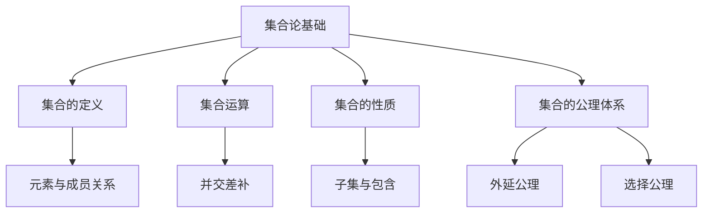

# 02-数学理论体系-集合论基础

[返回主题树](../00-主题树与内容索引.md) | [主计划文档](../00-形式化架构理论统一计划.md) | [相关计划](../递归合并计划.md) | [返回上级](../README.md)

> 本文档为数学理论体系分支集合论基础，所有最新进展与结论以主计划文档为准，历史细节归档于archive/。

## 目录

- [02-数学理论体系-集合论基础](#02-数学理论体系-集合论基础)
  - [1. 概述](#1-概述)
    - [1.1 集合论基础概述](#11-集合论基础概述)
    - [1.2 核心目标](#12-核心目标)
    - [1.3 集合论层次结构](#13-集合论层次结构)
  - [2. 主要文件与内容索引](#2-主要文件与内容索引)
    - [2.1 核心文件](#21-核心文件)
    - [2.2 相关文件](#22-相关文件)
  - [3. 集合的基本定义与解释](#3-集合的基本定义与解释)
    - [3.1 集合的定义](#31-集合的定义)
      - [3.1.1 元素与成员关系](#311-元素与成员关系)
      - [3.1.2 子集与包含](#312-子集与包含)
      - [3.1.3 空集与全集](#313-空集与全集)
  - [4. 集合运算与性质](#4-集合运算与性质)
    - [4.1 并集、交集、差集、补集](#41-并集交集差集补集)
      - [4.1.1 运算性质](#411-运算性质)
      - [4.1.2 代码示例](#412-代码示例)
  - [5. 集合论的公理体系](#5-集合论的公理体系)
    - [5.1 外延公理](#51-外延公理)
    - [5.2 分离公理](#52-分离公理)
    - [5.3 并集公理](#53-并集公理)
    - [5.4 选择公理](#54-选择公理)
  - [6. 集合论的行业应用](#6-集合论的行业应用)
    - [6.1 计算机科学](#61-计算机科学)
    - [6.2 软件工程](#62-软件工程)
    - [6.3 数学建模](#63-数学建模)
  - [7. 发展历史](#7-发展历史)
  - [8. 应用领域](#8-应用领域)
  - [9. 总结](#9-总结)
  - [10. 相关性跳转与引用](#10-相关性跳转与引用)

## 1. 概述

### 1.1 集合论基础概述

集合论是现代数学的基础理论，提供了描述和研究数学对象的统一语言。集合论不仅支撑数学的各个分支，也是形式化建模、数据库、编程语言等领域的理论基石。

### 1.2 核心目标

- 建立集合的严格定义与运算规则
- 支持数学对象的抽象与归纳
- 推动集合论与工程实践的融合

### 1.3 集合论层次结构



## 2. 主要文件与内容索引

### 2.1 核心文件

- [数学内容全面分析报告-2024.md](../Matter/Mathematics/数学内容全面分析报告-2024.md)
- [01-集合论基础.md](../Matter/Mathematics/01-集合论基础.md)

### 2.2 相关文件

- [数学内容与Wiki权威对比分析-2024.md](../Matter/Mathematics/content/数学内容与Wiki权威对比分析-2024.md)

## 3. 集合的基本定义与解释

### 3.1 集合的定义

**定义 3.1.1** 集合（Set）
集合是某些对象的无序聚集，记作：
$$A = \{x \mid P(x)\}$$
其中 $P(x)$ 是关于 $x$ 的性质。

#### 3.1.1 元素与成员关系

**定义 3.1.2** 元素（Element）
如果 $x$ 属于集合 $A$，记作 $x \in A$。

**解释**：集合的元素可以是任意对象，包括数、点、集合本身等。

#### 3.1.2 子集与包含

**定义 3.1.3** 子集（Subset）
如果 $\forall x (x \in A \Rightarrow x \in B)$，则 $A$ 是 $B$ 的子集，记作 $A \subseteq B$。

**论证 3.1.3** 子集的自反性、传递性、反对称性：

- 自反性：$A \subseteq A$
- 传递性：$A \subseteq B, B \subseteq C \Rightarrow A \subseteq C$
- 反对称性：$A \subseteq B, B \subseteq A \Rightarrow A = B$

#### 3.1.3 空集与全集

**定义 3.1.4** 空集（Empty Set）
不含任何元素的集合，记作 $\varnothing$。

**定义 3.1.5** 全集（Universal Set）
在特定讨论范围内包含所有元素的集合，记作 $U$。

## 4. 集合运算与性质

### 4.1 并集、交集、差集、补集

- 并集：$A \cup B = \{x \mid x \in A \lor x \in B\}$
- 交集：$A \cap B = \{x \mid x \in A \land x \in B\}$
- 差集：$A \setminus B = \{x \mid x \in A \land x \notin B\}$
- 补集：$A^c = \{x \mid x \notin A\}$

#### 4.1.1 运算性质

- 交换律：$A \cup B = B \cup A,\quad A \cap B = B \cap A$
- 结合律：$(A \cup B) \cup C = A \cup (B \cup C)$
- 分配律：$A \cap (B \cup C) = (A \cap B) \cup (A \cap C)$
- 德摩根律：$(A \cup B)^c = A^c \cap B^c$

#### 4.1.2 代码示例

```rust
// 集合运算示例
use std::collections::HashSet;

fn main() {
    let a: HashSet<_> = [1, 2, 3].iter().cloned().collect();
    let b: HashSet<_> = [2, 3, 4].iter().cloned().collect();
    let union: HashSet<_> = a.union(&b).cloned().collect();
    let intersection: HashSet<_> = a.intersection(&b).cloned().collect();
    let difference: HashSet<_> = a.difference(&b).cloned().collect();
    println!("A ∪ B = {:?}", union);
    println!("A ∩ B = {:?}", intersection);
    println!("A - B = {:?}", difference);
}
```

## 5. 集合论的公理体系

### 5.1 外延公理

**公理 5.1.1** 外延公理
两个集合相等当且仅当它们包含相同的元素：
$$A = B \Leftrightarrow \forall x (x \in A \Leftrightarrow x \in B)$$

### 5.2 分离公理

**公理 5.2.1** 分离公理
对于任意集合 $A$ 和性质 $P(x)$，存在集合 $B = \{x \in A \mid P(x)\}$。

### 5.3 并集公理

**公理 5.3.1** 并集公理
对于任意集合族 $\mathcal{F}$，存在集合 $\bigcup \mathcal{F}$。

### 5.4 选择公理

**公理 5.4.1** 选择公理
任意集合族 $\{A_i\}$，存在选择函数 $f$，使得 $f(A_i) \in A_i$。

## 6. 集合论的行业应用

### 6.1 计算机科学

- 数据结构与算法的理论基础
- 数据库的集合操作
- 形式化建模与验证

### 6.2 软件工程

- 关系数据库的集合查询
- 领域建模与规范化

### 6.3 数学建模

- 数学对象的抽象与归纳
- 复杂系统的结构化描述

## 7. 发展历史

集合论的发展经历了从朴素集合论到公理化集合论的演进过程。康托尔创立了集合论，策梅洛建立了ZFC公理体系，为现代数学奠定了坚实基础。

## 8. 应用领域

集合论在计算机科学、数据库理论、形式化方法、人工智能等领域有广泛应用，是现代信息技术的重要理论基础。

## 9. 总结

集合论作为现代数学的基础，为形式化架构理论提供了重要的数学工具和思维方式，是构建严谨理论体系不可或缺的组成部分。

## 10. 相关性跳转与引用

- [00-数学理论体系总论.md](00-数学理论体系总论.md)
- [02-代数基础.md](02-代数基础.md)
- [03-几何基础.md](03-几何基础.md)
- [04-分析基础.md](04-分析基础.md)
- [05-拓扑基础.md](05-拓扑基础.md)
- [06-概率统计基础.md](06-概率统计基础.md)
- [00-主题树与内容索引.md](../00-主题树与内容索引.md)
- [进度追踪与上下文.md](../进度追踪与上下文.md)

---

> 本文件为自动归纳生成，后续将递归细化相关内容，持续补全图表、公式、代码等多表征内容。
