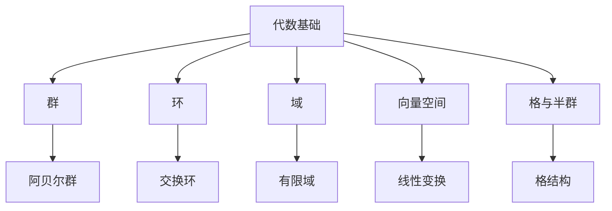

[返回主题树](../00-主题树与内容索引.md) | [主计划文档](../00-形式化架构理论统一计划.md) | [相关计划](../递归合并计划.md)

# 02-数学理论体系-代数基础

> 本文档为数学理论体系分支代数基础，所有最新进展与结论以主计划文档为准，历史细节归档于archive/。

## 目录

1. 代数基础概述
2. 主要文件与内容索引
3. 代数结构的基本定义与解释
4. 代数结构的性质与分类
5. 代数理论的行业应用
6. 相关性跳转与引用

---

## 1. 代数基础概述

代数基础研究运算结构及其性质，是现代数学、计算机科学、工程等领域的核心理论基础。代数理论为抽象数据类型、密码学、自动机等提供了坚实的理论支撑。

### 1.1 核心目标

- 建立代数结构的严格定义与分类
- 支持代数结构的性质分析与证明
- 推动代数理论与工程实践的融合

### 1.2 代数基础层次结构



---

## 2. 主要文件与内容索引

### 2.1 核心文件

- [数学内容全面分析报告-2024.md](../Matter/Mathematics/数学内容全面分析报告-2024.md)
- [02-代数基础.md](../Matter/Mathematics/02-代数基础.md)

### 2.2 相关文件

- [数学内容与Wiki权威对比分析-2024.md](../Matter/Mathematics/content/数学内容与Wiki权威对比分析-2024.md)

---

## 3. 代数结构的基本定义与解释

### 3.1 群的定义与性质

**定义 3.1.1** 群（Group）
群是一个集合 $G$ 和一个二元运算 $\cdot$，满足：

1. 封闭性：$\forall a, b \in G, a \cdot b \in G$
2. 结合律：$(a \cdot b) \cdot c = a \cdot (b \cdot c)$
3. 单位元：$\exists e \in G, \forall a \in G, e \cdot a = a \cdot e = a$
4. 逆元：$\forall a \in G, \exists a^{-1} \in G, a \cdot a^{-1} = a^{-1} \cdot a = e$

**定义 3.1.2** 阿贝尔群（Abelian Group）
若群 $G$ 的运算满足交换律：$a \cdot b = b \cdot a$，则 $G$ 为阿贝尔群。

**论证 3.1.3** 群的唯一性定理

- 单位元唯一
- 逆元唯一
- 证明：若 $e, e'$ 均为单位元，则 $e = e \cdot e' = e'$。

### 3.2 环与域的定义

**定义 3.2.1** 环（Ring）
环是一个集合 $R$，配有加法 $+$ 和乘法 $\cdot$，满足：

1. $(R, +)$ 是阿贝尔群
2. $(R, \cdot)$ 是半群
3. 分配律：$a \cdot (b + c) = a \cdot b + a \cdot c$

**定义 3.2.2** 交换环（Commutative Ring）
若 $a \cdot b = b \cdot a$，则 $R$ 为交换环。

**定义 3.2.3** 域（Field）
域是一个集合 $F$，加法和乘法均为阿贝尔群（乘法零元除外），且乘法对加法分配。

**论证 3.2.4** 域的性质

- 零元唯一，单位元唯一
- 每个非零元素都有乘法逆元

### 3.3 向量空间与线性变换

**定义 3.3.1** 向量空间（Vector Space）
向量空间 $V$ 是域 $F$ 上的集合，配有加法和数量乘法，满足：

- 结合律、交换律、单位元、逆元、分配律等

**定义 3.3.2** 线性变换（Linear Transformation）
$T: V \to W$，满足 $T(av + bw) = aT(v) + bT(w)$。

**论证 3.3.3** 线性变换的结构保持性

- 线性变换保持加法和数量乘法结构
- 线性变换的核和像是子空间

### 3.4 格与半群

**定义 3.4.1** 半群（Semigroup）
半群是带有结合律的二元运算的集合。

**定义 3.4.2** 格（Lattice）
格是集合 $L$，对任意 $a, b \in L$，存在 $a \vee b, a \wedge b$，满足结合、交换、吸收律。

**论证 3.4.3** 格的结构性质

- 格的有界性、分配性、补性

---

## 4. 代数结构的性质与分类

### 4.1 代数结构的层次关系

- 群 $\subset$ 环 $\subset$ 域
- 半群 $\subset$ 群
- 交换环 $\subset$ 环
- 向量空间 $\supset$ 域

### 4.2 代数结构的同构与同态

**定义 4.2.1** 同态（Homomorphism）
保持结构的映射 $f: A \to B$，满足 $f(a \cdot b) = f(a) \cdot f(b)$。

**定义 4.2.2** 同构（Isomorphism）
双射且保持结构的同态。

**论证 4.2.3** 同构的等价性

- 同构关系是等价关系
- 同构结构在代数性质上完全一致

### 4.3 代码示例

```rust
// 群结构与同态示例
use std::collections::HashMap;

#[derive(Debug, Clone, PartialEq, Eq, Hash)]
pub struct Group {
    elements: Vec<i32>,
    op: fn(i32, i32) -> i32,
    identity: i32,
}

impl Group {
    pub fn is_associative(&self) -> bool {
        for &a in &self.elements {
            for &b in &self.elements {
                for &c in &self.elements {
                    if (self.op)((self.op)(a, b), c) != (self.op)(a, (self.op)(b, c)) {
                        return false;
                    }
                }
            }
        }
        true
    }
}

fn main() {
    let group = Group {
        elements: vec![0, 1, 2],
        op: |a, b| (a + b) % 3,
        identity: 0,
    };
    println!("Is associative: {}", group.is_associative());
}
```

---

## 5. 代数理论的行业应用

### 5.1 计算机科学

- 群与环：密码学、编码理论
- 向量空间：机器学习、图像处理
- 格：数据结构、信息检索

### 5.2 软件工程

- 抽象数据类型与代数规范
- 设计模式中的代数思想

### 5.3 数学建模

- 代数结构建模复杂系统
- 代数方法优化算法设计

---

## 6. 相关性跳转与引用

- [00-数学理论体系总论.md](00-数学理论体系总论.md)
- [01-集合论基础.md](01-集合论基础.md)
- [03-几何基础.md](03-几何基础.md)
- [04-分析基础.md](04-分析基础.md)
- [05-拓扑基础.md](05-拓扑基础.md)
- [06-概率统计基础.md](06-概率统计基础.md)
- [00-主题树与内容索引.md](../00-主题树与内容索引.md)
- [进度追踪与上下文.md](../进度追踪与上下文.md)

---

> 本文件为自动归纳生成，后续将递归细化相关内容，持续补全图表、公式、代码等多表征内容。
