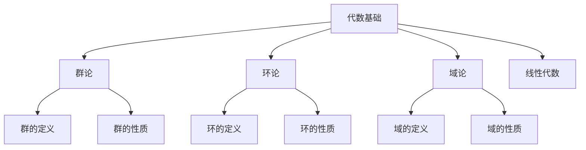

# 02-数学理论体系-代数基础

[返回主题树](../00-主题树与内容索引.md) | [主计划文档](../00-形式化架构理论统一计划.md) | [相关计划](../递归合并计划.md) | [返回上级](../README.md)

> 本文档为数学理论体系分支代数基础，所有最新进展与结论以主计划文档为准，历史细节归档于archive/。

## 目录

- [02-数学理论体系-代数基础](#02-数学理论体系-代数基础)
  - [目录](#目录)
  - [1. 概述](#1-概述)
    - [1.1 代数基础概述](#11-代数基础概述)
    - [1.2 核心目标](#12-核心目标)
    - [1.3 代数层次结构](#13-代数层次结构)
  - [2. 主要文件与内容索引](#2-主要文件与内容索引)
    - [2.1 核心文件](#21-核心文件)
    - [2.2 相关文件](#22-相关文件)
  - [3. 代数的基本定义与解释](#3-代数的基本定义与解释)
    - [3.1 代数的定义](#31-代数的定义)
      - [3.1.1 代数结构](#311-代数结构)
      - [3.1.2 运算与关系](#312-运算与关系)
      - [3.1.3 同态与同构](#313-同态与同构)
  - [4. 代数的基础概念](#4-代数的基础概念)
    - [4.1 群论基础](#41-群论基础)
      - [4.1.1 群的定义](#411-群的定义)
      - [4.1.2 群的性质](#412-群的性质)
      - [4.1.3 子群与陪集](#413-子群与陪集)
  - [5. 代数的主要理论](#5-代数的主要理论)
    - [5.1 环论](#51-环论)
    - [5.2 域论](#52-域论)
    - [5.3 模论](#53-模论)
    - [5.4 线性代数](#54-线性代数)
  - [6. 代数的行业应用](#6-代数的行业应用)
    - [6.1 计算机科学](#61-计算机科学)
    - [6.2 密码学](#62-密码学)
    - [6.3 量子计算](#63-量子计算)
  - [7. 发展历史](#7-发展历史)
  - [8. 应用领域](#8-应用领域)
  - [9. 总结](#9-总结)
  - [10. 相关性跳转与引用](#10-相关性跳转与引用)

## 1. 概述

### 1.1 代数基础概述

代数是数学的重要分支，研究代数结构及其性质。代数基础为形式化架构理论提供了重要的数学工具，是理解抽象结构的基础理论。

### 1.2 核心目标

- 建立代数结构的基本理论
- 提供抽象数学工具
- 支持形式化建模

### 1.3 代数层次结构

## 2. 主要文件与内容索引

### 2.1 核心文件

- [代数基础.md](../Matter/Mathematics/代数基础.md)
- [数学内容全面分析报告-2024.md](../Matter/Mathematics/数学内容全面分析报告-2024.md)

### 2.2 相关文件

- [01-集合论基础.md](01-集合论基础.md)
- [03-几何基础.md](03-几何基础.md)
- [04-分析基础.md](04-分析基础.md)

## 3. 代数的基本定义与解释

### 3.1 代数的定义

**定义 3.1.1** 代数结构（Algebraic Structure）
代数结构是集合与运算的组合，满足特定的公理。

#### 3.1.1 代数结构

**定义 3.1.2** 代数结构
代数结构由集合S和运算集合Ω组成，记作(S, Ω)。

**例子**：

- 群：(G, ·)
- 环：(R, +, ·)
- 域：(F, +, ·)

#### 3.1.2 运算与关系

**定义 3.1.3** 二元运算
二元运算是从S×S到S的函数。

**定义 3.1.4** 关系
关系是集合上的二元关系，如等价关系、序关系。

#### 3.1.3 同态与同构

**定义 3.1.5** 同态（Homomorphism）
同态是保持运算结构的映射。

**定义 3.1.6** 同构（Isomorphism）
同构是双射的同态。

## 4. 代数的基础概念

### 4.1 群论基础

#### 4.1.1 群的定义

**定义 4.1.1** 群（Group）
群是满足以下公理的代数结构(G, ·)：

1. 封闭性：∀a,b∈G, a·b∈G
2. 结合律：(a·b)·c = a·(b·c)
3. 单位元：∃e∈G, ∀a∈G, e·a = a·e = a
4. 逆元：∀a∈G, ∃a⁻¹∈G, a·a⁻¹ = a⁻¹·a = e

#### 4.1.2 群的性质

**性质 4.1.1** 群的基本性质

- 单位元唯一
- 逆元唯一
- 消去律成立

#### 4.1.3 子群与陪集

**定义 4.1.2** 子群（Subgroup）
子群是群的子集，在群运算下封闭。

**定义 4.1.3** 陪集（Coset）
陪集是子群与群元素的乘积集合。

## 5. 代数的主要理论

### 5.1 环论

**理论 5.1.1** 环（Ring）
环是满足以下公理的代数结构(R, +, ·)：

1. (R, +)是阿贝尔群
2. (R, ·)是半群
3. 分配律：a·(b+c) = a·b + a·c

### 5.2 域论

**理论 5.2.1** 域（Field）
域是满足以下条件的环：

1. 乘法交换律
2. 非零元素有乘法逆元

### 5.3 模论

**理论 5.3.1** 模（Module）
模是环上的向量空间，是线性代数的推广。

### 5.4 线性代数

**理论 5.4.1** 线性代数
线性代数研究向量空间和线性变换。

## 6. 代数的行业应用

### 6.1 计算机科学

- 密码学算法
- 编码理论
- 算法设计

### 6.2 密码学

- 公钥密码
- 椭圆曲线密码
- 格密码

### 6.3 量子计算

- 量子算法
- 量子纠错
- 量子密码

## 7. 发展历史

代数的发展经历了从古典代数到现代抽象代数的演进过程。伽罗瓦、阿贝尔、诺特等数学家为代数理论的发展做出了重要贡献。

## 8. 应用领域

代数在计算机科学、密码学、量子计算、物理学等领域有广泛应用，是现代信息技术的重要数学基础。

## 9. 总结

代数基础作为数学的重要分支，为形式化架构理论提供了重要的抽象数学工具，是理解复杂系统结构的基础理论。

## 10. 相关性跳转与引用

- [00-数学理论体系总论.md](00-数学理论体系总论.md)
- [01-集合论基础.md](01-集合论基础.md)
- [03-几何基础.md](03-几何基础.md)
- [04-分析基础.md](04-分析基础.md)
- [05-拓扑基础.md](05-拓扑基础.md)
- [06-概率统计基础.md](06-概率统计基础.md)
- [00-主题树与内容索引.md](../00-主题树与内容索引.md)
- [进度追踪与上下文.md](../进度追踪与上下文.md)

---

> 本文件为自动归纳生成，后续将递归细化相关内容，持续补全图表、公式、代码等多表征内容。
