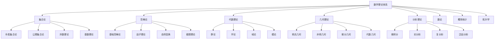

# 02-数学理论体系：形式化数学基础

## 目录

1. [1.0 数学理论概述](#10-数学理论概述)
2. [2.0 集合论基础](#20-集合论基础)
3. [3.0 范畴论基础](#30-范畴论基础)
4. [4.0 代数理论](#40-代数理论)
5. [5.0 几何理论](#50-几何理论)
6. [6.0 分析理论](#60-分析理论)
7. [7.0 数论基础](#70-数论基础)
8. [8.0 概率统计理论](#80-概率统计理论)
9. [9.0 拓扑学基础](#90-拓扑学基础)
10. [10.0 数学与形式化](#100-数学与形式化)

## 1.0 数学理论概述

### 1.1 数学在形式化理论体系中的地位

**定义 1.1.1 (数学基础层)**
数学基础层是形式化理论体系的第二层，为形式化理论提供严格的数学工具和推理方法。

**公理 1.1.1 (数学基础性)**
数学基础层 $\mathcal{M}$ 是形式化理论体系 $\mathcal{FTS}$ 的核心，满足：
$$\forall t \in \mathcal{FTS}, \quad \text{Mathematical}(t) \Rightarrow \text{DependsOn}(t, \mathcal{M})$$

### 1.2 数学内容分布



## 2.0 集合论基础

### 2.1 朴素集合论

**定义 2.1.1 (集合)**
集合是数学对象的基本容器，满足外延公理：
$$\forall A, B, \quad A = B \Leftrightarrow \forall x (x \in A \Leftrightarrow x \in B)$$

**公理 2.1.1 (外延公理)**
两个集合相等当且仅当它们包含相同的元素。

**公理 2.1.2 (空集公理)**
存在一个不包含任何元素的集合，记作 $\emptyset$：
$$\exists \emptyset, \quad \forall x, \quad x \notin \emptyset$$

**公理 2.1.3 (配对公理)**
对于任意两个集合 $a, b$，存在包含它们的集合：
$$\forall a, b, \quad \exists \{a, b\}, \quad \forall x (x \in \{a, b\} \Leftrightarrow x = a \lor x = b)$$

### 2.2 集合运算

**定义 2.2.1 (并集)**
集合 $A$ 和 $B$ 的并集定义为：
$$A \cup B = \{x \mid x \in A \lor x \in B\}$$

**定义 2.2.2 (交集)**
集合 $A$ 和 $B$ 的交集定义为：
$$A \cap B = \{x \mid x \in A \land x \in B\}$$

**定义 2.2.3 (差集)**
集合 $A$ 和 $B$ 的差集定义为：
$$A \setminus B = \{x \mid x \in A \land x \notin B\}$$

**定义 2.2.4 (幂集)**
集合 $A$ 的幂集定义为：
$$\mathcal{P}(A) = \{X \mid X \subseteq A\}$$

### 2.3 关系与函数

**定义 2.3.1 (二元关系)**
从集合 $A$ 到集合 $B$ 的二元关系是 $A \times B$ 的子集：
$$R \subseteq A \times B$$

**定义 2.3.2 (函数)**
函数是从集合 $A$ 到集合 $B$ 的关系 $f$，满足：
$$\forall a \in A, \quad \exists! b \in B, \quad (a, b) \in f$$

**定义 2.3.3 (函数性质)**
函数 $f: A \to B$ 的性质包括：

1. **单射**：$\forall a_1, a_2 \in A, \quad f(a_1) = f(a_2) \Rightarrow a_1 = a_2$
2. **满射**：$\forall b \in B, \quad \exists a \in A, \quad f(a) = b$
3. **双射**：$f$ 既是单射又是满射

## 3.0 范畴论基础

### 3.1 范畴定义

**定义 3.1.1 (范畴)**
范畴 $\mathcal{C}$ 是一个四元组 $(Ob(\mathcal{C}), Mor(\mathcal{C}), \circ, id)$，其中：

- $Ob(\mathcal{C})$ 是对象集合
- $Mor(\mathcal{C})$ 是态射集合
- $\circ$ 是态射复合运算
- $id$ 是恒等态射

**公理 3.1.1 (结合律)**
对于任意态射 $f: A \to B$, $g: B \to C$, $h: C \to D$：
$$(h \circ g) \circ f = h \circ (g \circ f)$$

**公理 3.1.2 (单位律)**
对于任意态射 $f: A \to B$：
$$f \circ id_A = f = id_B \circ f$$

### 3.2 函子

**定义 3.2.1 (函子)**
从范畴 $\mathcal{C}$ 到范畴 $\mathcal{D}$ 的函子 $F$ 是一个映射，满足：

1. 对象映射：$F: Ob(\mathcal{C}) \to Ob(\mathcal{D})$
2. 态射映射：$F: Mor(\mathcal{C}) \to Mor(\mathcal{D})$
3. 保持复合：$F(g \circ f) = F(g) \circ F(f)$
4. 保持恒等：$F(id_A) = id_{F(A)}$

**定义 3.2.2 (函子类型)**
函子类型包括：

1. **协变函子**：保持方向
2. **逆变函子**：反转方向
3. **双函子**：两个变量的函子

### 3.3 自然变换

**定义 3.3.1 (自然变换)**
从函子 $F$ 到函子 $G$ 的自然变换 $\eta$ 是一族态射 $\{\eta_A: F(A) \to G(A)\}_{A \in Ob(\mathcal{C})}$，满足：
$$\forall f: A \to B, \quad \eta_B \circ F(f) = G(f) \circ \eta_A$$

**公理 3.3.1 (自然性公理)**
自然变换满足交换图：
```mermaid
graph LR
    A[F(A)] --> B[G(A)]
    C[F(B)] --> D[G(B)]
    A --> C
    B --> D
```

## 4.0 代数理论

### 4.1 群论

**定义 4.1.1 (群)**
群是一个四元组 $(G, \cdot, e, ^{-1})$，其中：

- $G$ 是集合
- $\cdot$ 是二元运算
- $e$ 是单位元
- $^{-1}$ 是逆元运算

**公理 4.1.1 (群公理)**
1. **结合律**：$(a \cdot b) \cdot c = a \cdot (b \cdot c)$
2. **单位元**：$e \cdot a = a \cdot e = a$
3. **逆元**：$a \cdot a^{-1} = a^{-1} \cdot a = e$

**定义 4.1.2 (子群)**
群 $G$ 的子群 $H$ 是 $G$ 的子集，满足：
$$\forall a, b \in H, \quad a \cdot b \in H \land a^{-1} \in H$$

### 4.2 环论

**定义 4.2.1 (环)**
环是一个五元组 $(R, +, \cdot, 0, 1)$，其中：

- $R$ 是集合
- $+$ 是加法运算
- $\cdot$ 是乘法运算
- $0$ 是加法单位元
- $1$ 是乘法单位元

**公理 4.2.1 (环公理)**
1. $(R, +, 0)$ 是阿贝尔群
2. $(R, \cdot, 1)$ 是幺半群
3. **分配律**：$a \cdot (b + c) = a \cdot b + a \cdot c$

### 4.3 域论

**定义 4.3.1 (域)**
域是一个环 $(F, +, \cdot, 0, 1)$，其中非零元素在乘法下形成群。

**公理 4.3.1 (域公理)**
1. 环的所有公理
2. **乘法逆元**：$\forall a \neq 0, \quad \exists a^{-1}, \quad a \cdot a^{-1} = 1$

## 5.0 几何理论

### 5.1 欧氏几何

**定义 5.1.1 (欧氏空间)**
$n$ 维欧氏空间 $\mathbb{R}^n$ 是实数域上的向量空间，配备内积：
$$\langle x, y \rangle = \sum_{i=1}^n x_i y_i$$

**定义 5.1.2 (距离)**
欧氏距离定义为：
$$d(x, y) = \sqrt{\langle x - y, x - y \rangle}$$

**公理 5.1.1 (欧氏几何公理)**
1. **点线公理**：两点确定一条直线
2. **平行公理**：过直线外一点有且仅有一条平行线
3. **全等公理**：全等三角形的对应边和对应角相等

### 5.2 拓扑学

**定义 5.2.1 (拓扑空间)**
拓扑空间是一个二元组 $(X, \mathcal{T})$，其中：

- $X$ 是集合
- $\mathcal{T}$ 是拓扑（开集族）

**公理 5.2.1 (拓扑公理)**
1. $\emptyset, X \in \mathcal{T}$
2. 任意开集的并集是开集
3. 有限开集的交集是开集

**定义 5.2.2 (连续映射)**
映射 $f: X \to Y$ 是连续的，当且仅当：
$$\forall U \in \mathcal{T}_Y, \quad f^{-1}(U) \in \mathcal{T}_X$$

### 5.3 微分几何

**定义 5.3.1 (流形)**
$n$ 维流形是一个拓扑空间 $M$，每个点都有与 $\mathbb{R}^n$ 同胚的邻域。

**定义 5.3.2 (切空间)**
点 $p \in M$ 的切空间 $T_p M$ 是所有通过 $p$ 的曲线的切向量的集合。

## 6.0 分析理论

### 6.1 微积分

**定义 6.1.1 (极限)**
函数 $f$ 在点 $a$ 的极限为 $L$，记作：
$$\lim_{x \to a} f(x) = L$$
当且仅当：
$$\forall \epsilon > 0, \quad \exists \delta > 0, \quad |x - a| < \delta \Rightarrow |f(x) - L| < \epsilon$$

**定义 6.1.2 (导数)**
函数 $f$ 在点 $a$ 的导数定义为：
$$f'(a) = \lim_{h \to 0} \frac{f(a + h) - f(a)}{h}$$

**定义 6.1.3 (积分)**
函数 $f$ 在区间 $[a, b]$ 上的定积分定义为：
$$\int_a^b f(x) dx = \lim_{n \to \infty} \sum_{i=1}^n f(x_i) \Delta x$$

### 6.2 实分析

**定义 6.2.1 (收敛序列)**
序列 $\{a_n\}$ 收敛到 $L$，当且仅当：
$$\forall \epsilon > 0, \quad \exists N, \quad n > N \Rightarrow |a_n - L| < \epsilon$$

**定义 6.2.2 (柯西序列)**
序列 $\{a_n\}$ 是柯西序列，当且仅当：
$$\forall \epsilon > 0, \quad \exists N, \quad m, n > N \Rightarrow |a_m - a_n| < \epsilon$$

**定理 6.2.1 (完备性定理)**
实数域是完备的，即每个柯西序列都收敛。

### 6.3 复分析

**定义 6.3.1 (复函数)**
复函数是从复数域到复数域的映射：
$$f: \mathbb{C} \to \mathbb{C}$$

**定义 6.3.2 (解析函数)**
复函数 $f$ 在点 $z_0$ 解析，当且仅当在该点存在导数。

**定理 6.3.1 (柯西积分定理)**
如果 $f$ 在简单闭曲线 $C$ 内解析，那么：
$$\oint_C f(z) dz = 0$$

## 7.0 数论基础

### 7.1 整除理论

**定义 7.1.1 (整除)**
整数 $a$ 整除整数 $b$，记作 $a \mid b$，当且仅当存在整数 $k$ 使得 $b = ak$。

**定义 7.1.2 (最大公约数)**
整数 $a$ 和 $b$ 的最大公约数 $\gcd(a, b)$ 是最大的整除 $a$ 和 $b$ 的正整数。

**定理 7.1.1 (欧几里得算法)**
$$\gcd(a, b) = \gcd(b, a \bmod b)$$

### 7.2 素数理论

**定义 7.2.1 (素数)**
素数 $p$ 是大于1的整数，其正因子只有1和自身。

**定理 7.2.1 (算术基本定理)**
每个大于1的整数都可以唯一地表示为素数的乘积。

**定理 7.2.2 (素数定理)**
小于等于 $x$ 的素数个数 $\pi(x)$ 满足：
$$\lim_{x \to \infty} \frac{\pi(x)}{x / \ln x} = 1$$

## 8.0 概率统计理论

### 8.1 概率论

**定义 8.1.1 (概率空间)**
概率空间是一个三元组 $(\Omega, \mathcal{F}, P)$，其中：

- $\Omega$ 是样本空间
- $\mathcal{F}$ 是事件代数
- $P$ 是概率测度

**公理 8.1.1 (概率公理)**
1. $P(\Omega) = 1$
2. $\forall A \in \mathcal{F}, \quad P(A) \geq 0$
3. 对于互斥事件 $A_1, A_2, \ldots$：
   $$P(\bigcup_{i=1}^{\infty} A_i) = \sum_{i=1}^{\infty} P(A_i)$$

**定义 8.1.2 (随机变量)**
随机变量是从样本空间到实数的可测函数：
$$X: \Omega \to \mathbb{R}$$

### 8.2 统计学

**定义 8.2.1 (统计量)**
统计量是样本的函数，不依赖于未知参数。

**定义 8.2.2 (估计量)**
估计量是用于估计未知参数的统计量。

**定义 8.2.3 (假设检验)**
假设检验是判断统计假设是否成立的程序。

## 9.0 拓扑学基础

### 9.1 基本概念

**定义 9.1.1 (邻域)**
点 $x$ 的邻域是包含 $x$ 的开集。

**定义 9.1.2 (闭包)**
集合 $A$ 的闭包 $\overline{A}$ 是包含 $A$ 的最小闭集。

**定义 9.1.3 (内部)**
集合 $A$ 的内部 $A^\circ$ 是包含在 $A$ 中的最大开集。

### 9.2 连通性

**定义 9.2.1 (连通空间)**
拓扑空间 $X$ 是连通的，当且仅当它不能表示为两个非空开集的不交并。

**定义 9.2.2 (道路连通)**
拓扑空间 $X$ 是道路连通的，当且仅当任意两点间存在连续道路。

### 9.3 紧性

**定义 9.3.1 (紧空间)**
拓扑空间 $X$ 是紧的，当且仅当每个开覆盖都有有限子覆盖。

**定理 9.3.1 (海涅-博雷尔定理)**
$\mathbb{R}^n$ 的子集是紧的当且仅当它是闭且有界的。

## 10.0 数学与形式化

### 10.1 数学的形式化

**定义 10.1.1 (形式化数学)**
形式化数学是使用严格的逻辑和符号系统表达的数学理论。

**公理 10.1.1 (形式化公理)**
对于任意数学概念 $c$：
$$\text{Mathematical}(c) \Rightarrow \text{Formalizable}(c)$$

### 10.2 数学在软件架构中的应用

**定义 10.2.1 (数学建模)**
数学建模是将实际问题抽象为数学问题的过程。

**公理 10.2.1 (建模公理)**
对于任意软件系统 $S$：
$$\text{WellDesigned}(S) \Leftrightarrow \text{HasMathematicalModel}(S)$$

### 10.3 数学验证

**定义 10.3.1 (数学验证)**
数学验证是使用数学方法验证系统正确性的过程。

**定理 10.3.1 (验证定理)**
如果系统 $S$ 满足数学规范 $\phi$，那么 $S$ 是正确的：
$$\text{Satisfies}(S, \phi) \Rightarrow \text{Correct}(S)$$

---

## 总结

数学理论体系为形式化理论提供了严格的数学工具和推理方法。通过集合论、范畴论、代数理论、几何理论、分析理论等基础理论，建立了完整的数学框架。这些理论为形式语言理论、软件架构理论等提供了坚实的数学基础。 