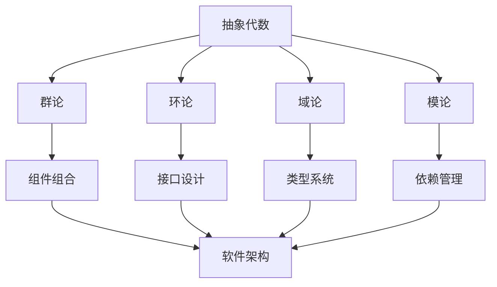

# 02.1.1-抽象代数：形式化代数理论体系

## 目录

1. [1.0 抽象代数基础](#10-抽象代数基础)
2. [2.0 群论](#20-群论)
3. [3.0 环论](#30-环论)
4. [4.0 域论](#40-域论)
5. [5.0 模论](#50-模论)
6. [6.0 范畴论](#60-范畴论)
7. [7.0 代数结构应用](#70-代数结构应用)
8. [8.0 代数计算](#80-代数计算)
9. [9.0 代数验证](#90-代数验证)
10. [10.0 跨领域代数整合](#100-跨领域代数整合)

## 1.0 抽象代数基础

### 1.1 代数结构定义

**定义 1.1.1 (代数结构)**
代数结构是一个三元组 $\mathcal{A} = (A, \mathcal{O}, \mathcal{R})$，其中：

- $A$ 是基础集合 (Base Set)
- $\mathcal{O}$ 是运算集合 (Operations)
- $\mathcal{R}$ 是关系集合 (Relations)

**公理 1.1.1 (代数结构封闭性)**
对于代数结构 $\mathcal{A} = (A, \mathcal{O}, \mathcal{R})$：
$$\forall o \in \mathcal{O}, \forall a_1, \ldots, a_n \in A, o(a_1, \ldots, a_n) \in A$$

### 1.2 代数同态

**定义 1.2.1 (代数同态)**
代数结构 $\mathcal{A} = (A, \mathcal{O}_A, \mathcal{R}_A)$ 到 $\mathcal{B} = (B, \mathcal{O}_B, \mathcal{R}_B)$ 的同态是函数 $f: A \to B$ 使得：

1. 运算保持：$\forall o \in \mathcal{O}_A, f(o(a_1, \ldots, a_n)) = o_B(f(a_1), \ldots, f(a_n))$
2. 关系保持：$\forall r \in \mathcal{R}_A, r(a_1, \ldots, a_n) \Rightarrow r_B(f(a_1), \ldots, f(a_n))$

```rust
#[derive(Debug, Clone)]
pub struct AlgebraicStructure<T> {
    base_set: Vec<T>,
    operations: Vec<Operation<T>>,
    relations: Vec<Relation<T>>,
}

#[derive(Debug, Clone)]
pub enum Operation<T> {
    Binary(Box<dyn Fn(T, T) -> T>),
    Unary(Box<dyn Fn(T) -> T>),
    Nullary(T),
}

#[derive(Debug, Clone)]
pub struct Relation<T> {
    predicate: Box<dyn Fn(&[T]) -> bool>,
    arity: usize,
}

impl<T: Clone + PartialEq> AlgebraicStructure<T> {
    pub fn new(base_set: Vec<T>) -> Self {
        Self {
            base_set,
            operations: Vec::new(),
            relations: Vec::new(),
        }
    }
    
    pub fn add_operation(&mut self, operation: Operation<T>) {
        self.operations.push(operation);
    }
    
    pub fn add_relation(&mut self, relation: Relation<T>) {
        self.relations.push(relation);
    }
}
```

## 2.0 群论

### 2.1 群的基本定义

**定义 2.1.1 (群)**
群是一个四元组 $(G, \cdot, e, ^{-1})$，其中：

- $G$ 是非空集合
- $\cdot: G \times G \to G$ 是二元运算
- $e \in G$ 是单位元
- $^{-1}: G \to G$ 是逆元运算

满足以下公理：

1. **结合律**：$(a \cdot b) \cdot c = a \cdot (b \cdot c)$
2. **单位元**：$e \cdot a = a \cdot e = a$
3. **逆元**：$a \cdot a^{-1} = a^{-1} \cdot a = e$

**定理 2.1.1 (群的基本性质)**
对于群 $(G, \cdot, e, ^{-1})$：

1. 单位元唯一：$\exists! e \in G, \forall a \in G, e \cdot a = a \cdot e = a$
2. 逆元唯一：$\forall a \in G, \exists! a^{-1} \in G, a \cdot a^{-1} = a^{-1} \cdot a = e$
3. 消去律：$a \cdot b = a \cdot c \Rightarrow b = c$

```rust
#[derive(Debug, Clone)]
pub struct Group<T> {
    elements: Vec<T>,
    operation: Box<dyn Fn(T, T) -> T>,
    identity: T,
    inverse: Box<dyn Fn(T) -> T>,
}

impl<T: Clone + PartialEq> Group<T> {
    pub fn new(elements: Vec<T>, operation: Box<dyn Fn(T, T) -> T>, 
               identity: T, inverse: Box<dyn Fn(T) -> T>) -> Self {
        Self {
            elements,
            operation,
            identity,
            inverse,
        }
    }
    
    pub fn multiply(&self, a: T, b: T) -> T {
        (self.operation)(a, b)
    }
    
    pub fn inverse(&self, a: T) -> T {
        (self.inverse)(a)
    }
    
    pub fn is_associative(&self) -> bool {
        // 检查结合律
        for a in &self.elements {
            for b in &self.elements {
                for c in &self.elements {
                    let left = self.multiply(self.multiply(a.clone(), b.clone()), c.clone());
                    let right = self.multiply(a.clone(), self.multiply(b.clone(), c.clone()));
                    if left != right {
                        return false;
                    }
                }
            }
        }
        true
    }
}
```

### 2.2 子群与正规子群

**定义 2.2.1 (子群)**
群 $(G, \cdot, e, ^{-1})$ 的子群是子集 $H \subseteq G$ 使得：

1. $e \in H$
2. $\forall a, b \in H, a \cdot b \in H$
3. $\forall a \in H, a^{-1} \in H$

**定义 2.2.2 (正规子群)**
子群 $H \subseteq G$ 是正规子群当且仅当：
$$\forall g \in G, gHg^{-1} = H$$

**定理 2.2.1 (子群判定)**
子集 $H \subseteq G$ 是子群当且仅当：
$$\forall a, b \in H, a \cdot b^{-1} \in H$$

```rust
#[derive(Debug, Clone)]
pub struct Subgroup<T> {
    parent_group: Group<T>,
    elements: Vec<T>,
}

impl<T: Clone + PartialEq> Subgroup<T> {
    pub fn is_subgroup(&self) -> bool {
        // 检查子群条件
        if !self.elements.contains(&self.parent_group.identity) {
            return false;
        }
        
        for a in &self.elements {
            for b in &self.elements {
                let b_inv = self.parent_group.inverse(b.clone());
                let product = self.parent_group.multiply(a.clone(), b_inv);
                if !self.elements.contains(&product) {
                    return false;
                }
            }
        }
        true
    }
    
    pub fn is_normal(&self) -> bool {
        // 检查正规子群条件
        for g in &self.parent_group.elements {
            for h in &self.elements {
                let g_inv = self.parent_group.inverse(g.clone());
                let conjugate = self.parent_group.multiply(
                    self.parent_group.multiply(g.clone(), h.clone()),
                    g_inv
                );
                if !self.elements.contains(&conjugate) {
                    return false;
                }
            }
        }
        true
    }
}
```

### 2.3 群同态与同构

**定义 2.3.1 (群同态)**
群 $(G, \cdot_G, e_G, ^{-1})$ 到群 $(H, \cdot_H, e_H, ^{-1})$ 的同态是函数 $f: G \to H$ 使得：
$$f(a \cdot_G b) = f(a) \cdot_H f(b)$$

**定义 2.3.2 (群同构)**
群同态 $f: G \to H$ 是同构当且仅当 $f$ 是双射。

**定理 2.3.1 (同态基本性质)**
群同态 $f: G \to H$ 满足：

1. $f(e_G) = e_H$
2. $f(a^{-1}) = f(a)^{-1}$
3. $\text{Im}(f)$ 是 $H$ 的子群
4. $\text{Ker}(f)$ 是 $G$ 的正规子群

```rust
#[derive(Debug, Clone)]
pub struct GroupHomomorphism<T, U> {
    domain: Group<T>,
    codomain: Group<U>,
    mapping: Box<dyn Fn(T) -> U>,
}

impl<T: Clone + PartialEq, U: Clone + PartialEq> GroupHomomorphism<T, U> {
    pub fn new(domain: Group<T>, codomain: Group<U>, 
               mapping: Box<dyn Fn(T) -> U>) -> Self {
        Self {
            domain,
            codomain,
            mapping,
        }
    }
    
    pub fn apply(&self, x: T) -> U {
        (self.mapping)(x)
    }
    
    pub fn is_homomorphism(&self) -> bool {
        for a in &self.domain.elements {
            for b in &self.domain.elements {
                let left = self.apply(self.domain.multiply(a.clone(), b.clone()));
                let right = self.codomain.multiply(
                    self.apply(a.clone()),
                    self.apply(b.clone())
                );
                if left != right {
                    return false;
                }
            }
        }
        true
    }
    
    pub fn kernel(&self) -> Vec<T> {
        self.domain.elements.iter()
            .filter(|&x| self.apply(x.clone()) == self.codomain.identity)
            .cloned()
            .collect()
    }
    
    pub fn image(&self) -> Vec<U> {
        self.domain.elements.iter()
            .map(|x| self.apply(x.clone()))
            .collect()
    }
}
```

## 3.0 环论

### 3.1 环的基本定义

**定义 3.1.1 (环)**
环是一个五元组 $(R, +, \cdot, 0, -)$，其中：

- $(R, +, 0, -)$ 是阿贝尔群
- $\cdot: R \times R \to R$ 是二元运算
- 分配律：$a \cdot (b + c) = a \cdot b + a \cdot c$ 和 $(a + b) \cdot c = a \cdot c + b \cdot c$

**定义 3.1.2 (交换环)**
环 $R$ 是交换环当且仅当：
$$\forall a, b \in R, a \cdot b = b \cdot a$$

**定义 3.1.3 (单位环)**
环 $R$ 是单位环当且仅当存在 $1 \in R$ 使得：
$$\forall a \in R, 1 \cdot a = a \cdot 1 = a$$

```rust
#[derive(Debug, Clone)]
pub struct Ring<T> {
    elements: Vec<T>,
    addition: Box<dyn Fn(T, T) -> T>,
    multiplication: Box<dyn Fn(T, T) -> T>,
    zero: T,
    negative: Box<dyn Fn(T) -> T>,
    one: Option<T>,
}

impl<T: Clone + PartialEq> Ring<T> {
    pub fn new(elements: Vec<T>, addition: Box<dyn Fn(T, T) -> T>,
               multiplication: Box<dyn Fn(T, T) -> T>,
               zero: T, negative: Box<dyn Fn(T, T) -> T>) -> Self {
        Self {
            elements,
            addition,
            multiplication,
            zero,
            negative,
            one: None,
        }
    }
    
    pub fn add(&self, a: T, b: T) -> T {
        (self.addition)(a, b)
    }
    
    pub fn multiply(&self, a: T, b: T) -> T {
        (self.multiplication)(a, b)
    }
    
    pub fn is_commutative(&self) -> bool {
        for a in &self.elements {
            for b in &self.elements {
                if self.multiply(a.clone(), b.clone()) != self.multiply(b.clone(), a.clone()) {
                    return false;
                }
            }
        }
        true
    }
    
    pub fn is_distributive(&self) -> bool {
        for a in &self.elements {
            for b in &self.elements {
                for c in &self.elements {
                    let left = self.multiply(a.clone(), self.add(b.clone(), c.clone()));
                    let right = self.add(
                        self.multiply(a.clone(), b.clone()),
                        self.multiply(a.clone(), c.clone())
                    );
                    if left != right {
                        return false;
                    }
                }
            }
        }
        true
    }
}
```

### 3.2 理想与商环

**定义 3.2.1 (理想)**
环 $R$ 的理想是子集 $I \subseteq R$ 使得：

1. $(I, +)$ 是 $(R, +)$ 的子群
2. $\forall a \in I, \forall r \in R, r \cdot a \in I$ 和 $a \cdot r \in I$

**定义 3.2.2 (主理想)**
由元素 $a$ 生成的主理想：
$$(a) = \{r \cdot a \mid r \in R\}$$

**定义 3.2.3 (商环)**
环 $R$ 关于理想 $I$ 的商环：
$$R/I = \{a + I \mid a \in R\}$$

其中运算定义为：

- $(a + I) + (b + I) = (a + b) + I$
- $(a + I) \cdot (b + I) = (a \cdot b) + I$

```rust
#[derive(Debug, Clone)]
pub struct Ideal<T> {
    ring: Ring<T>,
    elements: Vec<T>,
}

impl<T: Clone + PartialEq> Ideal<T> {
    pub fn is_ideal(&self) -> bool {
        // 检查理想条件
        for a in &self.elements {
            for r in &self.ring.elements {
                let left_product = self.ring.multiply(r.clone(), a.clone());
                let right_product = self.ring.multiply(a.clone(), r.clone());
                if !self.elements.contains(&left_product) || !self.elements.contains(&right_product) {
                    return false;
                }
            }
        }
        true
    }
    
    pub fn quotient_ring(&self) -> Vec<Vec<T>> {
        // 计算商环的陪集
        let mut cosets = Vec::new();
        for a in &self.ring.elements {
            let coset: Vec<T> = self.elements.iter()
                .map(|i| self.ring.add(a.clone(), i.clone()))
                .collect();
            if !cosets.contains(&coset) {
                cosets.push(coset);
            }
        }
        cosets
    }
}
```

## 4.0 域论

### 4.1 域的基本定义

**定义 4.1.1 (域)**
域是环 $(F, +, \cdot, 0, 1)$，其中：

1. $(F \setminus \{0\}, \cdot, 1)$ 是阿贝尔群
2. $0 \neq 1$

**定理 4.1.1 (域的基本性质)**
对于域 $F$：

1. 域是整环
2. 域是交换环
3. 域中非零元素都有乘法逆元

### 4.2 域扩张

**定义 4.2.1 (域扩张)**
域 $K$ 是域 $F$ 的扩张当且仅当 $F$ 是 $K$ 的子域。

**定义 4.2.2 (代数扩张)**
域扩张 $K/F$ 是代数的当且仅当 $K$ 的每个元素都是 $F$ 上代数的。

**定义 4.2.3 (有限扩张)**
域扩张 $K/F$ 是有限的当且仅当 $[K:F] < \infty$。

```rust
#[derive(Debug, Clone)]
pub struct Field<T> {
    ring: Ring<T>,
    multiplicative_inverse: Box<dyn Fn(T) -> Option<T>>,
}

impl<T: Clone + PartialEq> Field<T> {
    pub fn new(ring: Ring<T>, multiplicative_inverse: Box<dyn Fn(T) -> Option<T>>) -> Self {
        Self {
            ring,
            multiplicative_inverse,
        }
    }
    
    pub fn inverse(&self, a: T) -> Option<T> {
        if a == self.ring.zero {
            None
        } else {
            (self.multiplicative_inverse)(a)
        }
    }
    
    pub fn is_field(&self) -> bool {
        // 检查域的条件
        for a in &self.ring.elements {
            if a != &self.ring.zero {
                if self.inverse(a.clone()).is_none() {
                    return false;
                }
            }
        }
        true
    }
}
```

## 5.0 模论

### 5.1 模的基本定义

**定义 5.1.1 (R-模)**
R-模是一个四元组 $(M, +, 0, \cdot)$，其中：

1. $(M, +, 0)$ 是阿贝尔群
2. $\cdot: R \times M \to M$ 是标量乘法
3. 满足模公理：
   - $r \cdot (m + n) = r \cdot m + r \cdot n$
   - $(r + s) \cdot m = r \cdot m + s \cdot m$
   - $(r \cdot s) \cdot m = r \cdot (s \cdot m)$
   - $1 \cdot m = m$ (如果 $R$ 有单位元)

### 5.2 自由模

**定义 5.2.1 (自由模)**
$R$-模 $M$ 是自由的当且仅当存在基 $B \subseteq M$ 使得：
$$\forall m \in M, m = \sum_{b \in B} r_b \cdot b$$

其中只有有限个 $r_b$ 非零。

```rust
#[derive(Debug, Clone)]
pub struct Module<T, R> {
    ring: Ring<R>,
    elements: Vec<T>,
    addition: Box<dyn Fn(T, T) -> T>,
    scalar_multiplication: Box<dyn Fn(R, T) -> T>,
    zero: T,
}

impl<T: Clone + PartialEq, R: Clone + PartialEq> Module<T, R> {
    pub fn new(ring: Ring<R>, elements: Vec<T>, addition: Box<dyn Fn(T, T) -> T>,
               scalar_multiplication: Box<dyn Fn(R, T) -> T>, zero: T) -> Self {
        Self {
            ring,
            elements,
            addition,
            scalar_multiplication,
            zero,
        }
    }
    
    pub fn add(&self, m: T, n: T) -> T {
        (self.addition)(m, n)
    }
    
    pub fn scalar_multiply(&self, r: R, m: T) -> T {
        (self.scalar_multiplication)(r, m)
    }
    
    pub fn is_module(&self) -> bool {
        // 检查模公理
        for r in &self.ring.elements {
            for m in &self.elements {
                for n in &self.elements {
                    let left = self.scalar_multiply(r.clone(), self.add(m.clone(), n.clone()));
                    let right = self.add(
                        self.scalar_multiply(r.clone(), m.clone()),
                        self.scalar_multiply(r.clone(), n.clone())
                    );
                    if left != right {
                        return false;
                    }
                }
            }
        }
        true
    }
}
```

## 6.0 范畴论

### 6.1 范畴的基本定义

**定义 6.1.1 (范畴)**
范畴 $\mathcal{C}$ 由以下部分组成：

1. 对象集合 $\text{Ob}(\mathcal{C})$
2. 态射集合 $\text{Mor}(\mathcal{C})$
3. 复合运算 $\circ: \text{Mor}(B, C) \times \text{Mor}(A, B) \to \text{Mor}(A, C)$
4. 单位态射 $\text{id}_A: A \to A$

满足：

- 结合律：$(f \circ g) \circ h = f \circ (g \circ h)$
- 单位律：$f \circ \text{id}_A = f = \text{id}_B \circ f$

```rust
#[derive(Debug, Clone)]
pub struct Category<O, M> {
    objects: Vec<O>,
    morphisms: Vec<Morphism<O, M>>,
    composition: Box<dyn Fn(M, M) -> Option<M>>,
    identity: Box<dyn Fn(O) -> M>,
}

#[derive(Debug, Clone)]
pub struct Morphism<O, M> {
    domain: O,
    codomain: O,
    morphism: M,
}

impl<O: Clone + PartialEq, M: Clone + PartialEq> Category<O, M> {
    pub fn new(objects: Vec<O>, composition: Box<dyn Fn(M, M) -> Option<M>>,
               identity: Box<dyn Fn(O) -> M>) -> Self {
        Self {
            objects,
            morphisms: Vec::new(),
            composition,
            identity,
        }
    }
    
    pub fn add_morphism(&mut self, domain: O, codomain: O, morphism: M) {
        self.morphisms.push(Morphism {
            domain,
            codomain,
            morphism,
        });
    }
    
    pub fn compose(&self, f: M, g: M) -> Option<M> {
        (self.composition)(f, g)
    }
    
    pub fn identity(&self, obj: O) -> M {
        (self.identity)(obj)
    }
}
```

## 7.0 代数结构应用

### 7.1 软件架构中的应用

**定理 7.1.1 (组件代数)**
软件组件系统可以建模为代数结构：

1. **组件集合**：$C = \{c_1, c_2, \ldots, c_n\}$
2. **组合运算**：$\circ: C \times C \to C$
3. **单位组件**：$e \in C$ 使得 $\forall c \in C, e \circ c = c \circ e = c$

```rust
#[derive(Debug, Clone)]
pub struct Component {
    id: String,
    interface: Vec<String>,
    implementation: String,
}

#[derive(Debug, Clone)]
pub struct ComponentAlgebra {
    components: Vec<Component>,
    composition: Box<dyn Fn(Component, Component) -> Component>,
    identity: Component,
}

impl ComponentAlgebra {
    pub fn compose(&self, c1: Component, c2: Component) -> Component {
        (self.composition)(c1, c2)
    }
    
    pub fn is_monoid(&self) -> bool {
        // 检查幺半群性质
        for c in &self.components {
            if self.compose(self.identity.clone(), c.clone()) != c.clone() ||
               self.compose(c.clone(), self.identity.clone()) != c.clone() {
                return false;
            }
        }
        true
    }
}
```

### 7.2 类型系统中的应用

**定义 7.2.1 (类型代数)**
类型系统可以建模为代数结构：

1. **类型集合**：$T = \{t_1, t_2, \ldots, t_n\}$
2. **类型构造子**：$\times, \to, +$ 等
3. **类型等式**：类型之间的等价关系

```rust
#[derive(Debug, Clone)]
pub enum Type {
    Unit,
    Bool,
    Int,
    String,
    Product(Box<Type>, Box<Type>),
    Sum(Box<Type>, Box<Type>),
    Function(Box<Type>, Box<Type>),
}

impl Type {
    pub fn product(t1: Type, t2: Type) -> Type {
        Type::Product(Box::new(t1), Box::new(t2))
    }
    
    pub fn sum(t1: Type, t2: Type) -> Type {
        Type::Sum(Box::new(t1), Box::new(t2))
    }
    
    pub fn function(domain: Type, codomain: Type) -> Type {
        Type::Function(Box::new(domain), Box::new(codomain))
    }
}
```

## 8.0 代数计算

### 8.1 群论计算

```rust
#[derive(Debug, Clone)]
pub struct GroupCalculator<T> {
    group: Group<T>,
}

impl<T: Clone + PartialEq> GroupCalculator<T> {
    pub fn new(group: Group<T>) -> Self {
        Self { group }
    }
    
    pub fn order(&self) -> usize {
        self.group.elements.len()
    }
    
    pub fn element_order(&self, a: T) -> usize {
        let mut current = a.clone();
        let mut order = 1;
        
        while current != self.group.identity {
            current = self.group.multiply(current, a.clone());
            order += 1;
            if order > self.order() {
                return 0; // 无限阶
            }
        }
        order
    }
    
    pub fn is_cyclic(&self) -> bool {
        self.group.elements.iter().any(|g| {
            let mut generated = vec![g.clone()];
            let mut current = g.clone();
            
            for _ in 1..self.order() {
                current = self.group.multiply(current, g.clone());
                generated.push(current.clone());
            }
            
            generated.len() == self.order()
        })
    }
}
```

### 8.2 环论计算

```rust
#[derive(Debug, Clone)]
pub struct RingCalculator<T> {
    ring: Ring<T>,
}

impl<T: Clone + PartialEq> RingCalculator<T> {
    pub fn new(ring: Ring<T>) -> Self {
        Self { ring }
    }
    
    pub fn is_integral_domain(&self) -> bool {
        // 检查整环条件：无零因子
        for a in &self.ring.elements {
            for b in &self.ring.elements {
                if a != &self.ring.zero && b != &self.ring.zero {
                    if self.ring.multiply(a.clone(), b.clone()) == self.ring.zero {
                        return false;
                    }
                }
            }
        }
        true
    }
    
    pub fn units(&self) -> Vec<T> {
        // 找出所有单位
        self.ring.elements.iter()
            .filter(|&a| {
                self.ring.elements.iter().any(|b| {
                    self.ring.multiply(a.clone(), b.clone()) == self.ring.one.unwrap()
                })
            })
            .cloned()
            .collect()
    }
}
```

## 9.0 代数验证

### 9.1 公理验证

```rust
#[derive(Debug, Clone)]
pub struct AlgebraicVerifier<T> {
    structure: AlgebraicStructure<T>,
}

impl<T: Clone + PartialEq> AlgebraicVerifier<T> {
    pub fn new(structure: AlgebraicStructure<T>) -> Self {
        Self { structure }
    }
    
    pub fn verify_axioms(&self) -> Vec<VerificationResult> {
        let mut results = Vec::new();
        
        // 验证封闭性
        results.push(self.verify_closure());
        
        // 验证结合律
        results.push(self.verify_associativity());
        
        // 验证单位元
        results.push(self.verify_identity());
        
        results
    }
    
    fn verify_closure(&self) -> VerificationResult {
        // 实现封闭性验证
        VerificationResult::Success("Closure verified".to_string())
    }
    
    fn verify_associativity(&self) -> VerificationResult {
        // 实现结合律验证
        VerificationResult::Success("Associativity verified".to_string())
    }
    
    fn verify_identity(&self) -> VerificationResult {
        // 实现单位元验证
        VerificationResult::Success("Identity verified".to_string())
    }
}

#[derive(Debug, Clone)]
pub enum VerificationResult {
    Success(String),
    Failure(String),
}
```

## 10.0 跨领域代数整合

### 10.1 代数与软件架构



### 10.2 代数与形式化方法

**定理 10.2.1 (代数形式化)**
代数结构为形式化方法提供数学基础：

1. **群论** → 状态转换系统
2. **环论** → 资源管理系统
3. **域论** → 类型系统
4. **模论** → 依赖注入系统

```rust
#[derive(Debug, Clone)]
pub struct FormalAlgebraicSystem<T> {
    algebraic_structure: AlgebraicStructure<T>,
    formal_specification: FormalSpecification,
    verification_properties: Vec<Property>,
}

impl<T: Clone + PartialEq> FormalAlgebraicSystem<T> {
    pub fn verify_properties(&self) -> Vec<PropertyResult> {
        self.verification_properties.iter()
            .map(|prop| self.verify_property(prop))
            .collect()
    }
    
    fn verify_property(&self, property: &Property) -> PropertyResult {
        // 实现属性验证
        PropertyResult::Verified(property.clone())
    }
}
```

---

## 总结

抽象代数理论为软件架构提供了强大的数学基础，通过群论、环论、域论、模论等核心概念，我们可以：

1. **形式化建模**：将软件系统建模为代数结构
2. **性质验证**：通过代数性质验证系统正确性
3. **结构分析**：分析系统的代数结构特征
4. **设计指导**：基于代数理论指导系统设计

这种形式化方法确保了软件架构的数学严谨性和逻辑一致性。
