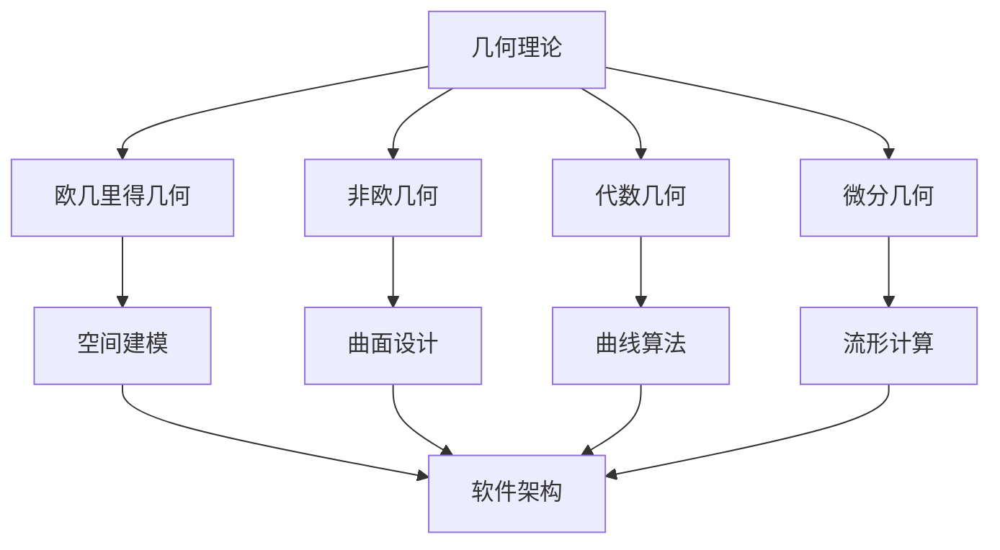

# 02.2.1-几何基础：形式化几何理论体系

## 目录

1. [1.0 几何学基础](#10-几何学基础)
2. [2.0 欧几里得几何](#20-欧几里得几何)
3. [3.0 非欧几何](#30-非欧几何)
4. [4.0 代数几何](#40-代数几何)
5. [5.0 微分几何](#50-微分几何)
6. [6.0 拓扑几何](#60-拓扑几何)
7. [7.0 计算几何](#70-计算几何)
8. [8.0 几何应用](#80-几何应用)
9. [9.0 几何验证](#90-几何验证)
10. [10.0 跨领域几何整合](#100-跨领域几何整合)

## 1.0 几何学基础

### 1.1 几何空间定义

**定义 1.1.1 (几何空间)**
几何空间是一个三元组 $\mathcal{G} = (S, \mathcal{R}, \mathcal{T})$，其中：

- $S$ 是点集合 (Points)
- $\mathcal{R}$ 是关系集合 (Relations)
- $\mathcal{T}$ 是变换集合 (Transformations)

**公理 1.1.1 (几何空间公理)**
几何空间满足以下基本公理：

1. **存在性**：$S \neq \emptyset$
2. **关系性**：$\forall p, q \in S, \exists r \in \mathcal{R}, r(p, q)$
3. **变换性**：$\forall t \in \mathcal{T}, t: S \to S$

### 1.2 几何结构

**定义 1.2.1 (几何结构)**
几何结构是一个四元组 $\mathcal{GS} = (S, \mathcal{R}, \mathcal{T}, \mathcal{M})$，其中：

- $S$ 是空间集合
- $\mathcal{R}$ 是关系集合
- $\mathcal{T}$ 是变换集合
- $\mathcal{M}$ 是度量函数

```rust
#[derive(Debug, Clone)]
pub struct GeometricSpace<T> {
    points: Vec<Point<T>>,
    relations: Vec<Relation<T>>,
    transformations: Vec<Transformation<T>>,
}

#[derive(Debug, Clone)]
pub struct Point<T> {
    coordinates: Vec<T>,
    dimension: usize,
}

#[derive(Debug, Clone)]
pub struct Relation<T> {
    predicate: Box<dyn Fn(&Point<T>, &Point<T>) -> bool>,
    name: String,
}

#[derive(Debug, Clone)]
pub struct Transformation<T> {
    function: Box<dyn Fn(Point<T>) -> Point<T>>,
    name: String,
}

impl<T: Clone + PartialEq> GeometricSpace<T> {
    pub fn new(points: Vec<Point<T>>) -> Self {
        Self {
            points,
            relations: Vec::new(),
            transformations: Vec::new(),
        }
    }
    
    pub fn add_relation(&mut self, relation: Relation<T>) {
        self.relations.push(relation);
    }
    
    pub fn add_transformation(&mut self, transformation: Transformation<T>) {
        self.transformations.push(transformation);
    }
    
    pub fn apply_transformation(&self, point: Point<T>, transform_name: &str) -> Option<Point<T>> {
        self.transformations.iter()
            .find(|t| t.name == transform_name)
            .map(|t| (t.function)(point))
    }
}
```

## 2.0 欧几里得几何

### 2.1 欧几里得空间

**定义 2.1.1 (欧几里得空间)**
$n$ 维欧几里得空间 $\mathbb{R}^n$ 是装备了欧几里得度量的向量空间：

$$\mathbb{R}^n = \{(x_1, x_2, \ldots, x_n) \mid x_i \in \mathbb{R}\}$$

**定义 2.1.2 (欧几里得度量)**
欧几里得度量 $d: \mathbb{R}^n \times \mathbb{R}^n \to \mathbb{R}$ 定义为：

$$d(\mathbf{x}, \mathbf{y}) = \sqrt{\sum_{i=1}^n (x_i - y_i)^2}$$

**公理 2.1.1 (欧几里得公理)**
欧几里得几何的公理系统：

1. **点线公理**：两点确定一条直线
2. **平行公理**：过直线外一点有且仅有一条平行线
3. **全等公理**：全等图形可以重合

### 2.2 欧几里得变换

**定义 2.2.1 (等距变换)**
等距变换是保持距离的变换 $f: \mathbb{R}^n \to \mathbb{R}^n$：

$$\forall \mathbf{x}, \mathbf{y} \in \mathbb{R}^n, d(f(\mathbf{x}), f(\mathbf{y})) = d(\mathbf{x}, \mathbf{y})$$

**定理 2.2.1 (等距变换分类)**
欧几里得空间中的等距变换包括：

1. **平移**：$T_{\mathbf{v}}(\mathbf{x}) = \mathbf{x} + \mathbf{v}$
2. **旋转**：$R_\theta(\mathbf{x}) = A_\theta \mathbf{x}$，其中 $A_\theta$ 是旋转矩阵
3. **反射**：$S_L(\mathbf{x})$，关于直线 $L$ 的反射
4. **滑移反射**：平移与反射的复合

```rust
#[derive(Debug, Clone)]
pub struct EuclideanSpace {
    dimension: usize,
    points: Vec<Point<f64>>,
}

#[derive(Debug, Clone)]
pub enum EuclideanTransformation {
    Translation(Vec<f64>),
    Rotation(f64), // 2D旋转角度
    Reflection(Vec<f64>), // 反射轴
    GlideReflection(Vec<f64>, Vec<f64>), // 平移向量和反射轴
}

impl EuclideanSpace {
    pub fn new(dimension: usize) -> Self {
        Self {
            dimension,
            points: Vec::new(),
        }
    }
    
    pub fn distance(&self, p1: &Point<f64>, p2: &Point<f64>) -> f64 {
        p1.coordinates.iter()
            .zip(p2.coordinates.iter())
            .map(|(x, y)| (x - y).powi(2))
            .sum::<f64>()
            .sqrt()
    }
    
    pub fn apply_transformation(&self, point: Point<f64>, 
                               transform: &EuclideanTransformation) -> Point<f64> {
        match transform {
            EuclideanTransformation::Translation(v) => {
                let mut new_coords = point.coordinates.clone();
                for (i, &offset) in v.iter().enumerate() {
                    if i < new_coords.len() {
                        new_coords[i] += offset;
                    }
                }
                Point { coordinates: new_coords, dimension: point.dimension }
            },
            EuclideanTransformation::Rotation(angle) => {
                // 2D旋转矩阵
                let cos_theta = angle.cos();
                let sin_theta = angle.sin();
                let x = point.coordinates[0];
                let y = point.coordinates[1];
                Point {
                    coordinates: vec![x * cos_theta - y * sin_theta, 
                                    x * sin_theta + y * cos_theta],
                    dimension: point.dimension
                }
            },
            _ => point, // 简化实现
        }
    }
}
```

### 2.3 欧几里得几何对象

**定义 2.3.1 (直线)**
直线是满足线性方程的点集合：

$$L = \{\mathbf{x} \in \mathbb{R}^n \mid \mathbf{a} \cdot \mathbf{x} = b\}$$

**定义 2.3.2 (平面)**
平面是满足线性方程的点集合：

$$P = \{\mathbf{x} \in \mathbb{R}^3 \mid \mathbf{n} \cdot \mathbf{x} = d\}$$

**定义 2.3.3 (圆)**
圆是到定点距离相等的点集合：

$$C = \{\mathbf{x} \in \mathbb{R}^2 \mid d(\mathbf{x}, \mathbf{c}) = r\}$$

```rust
#[derive(Debug, Clone)]
pub struct Line {
    direction: Vec<f64>,
    point: Point<f64>,
}

#[derive(Debug, Clone)]
pub struct Plane {
    normal: Vec<f64>,
    point: Point<f64>,
}

#[derive(Debug, Clone)]
pub struct Circle {
    center: Point<f64>,
    radius: f64,
}

impl Line {
    pub fn new(direction: Vec<f64>, point: Point<f64>) -> Self {
        Self { direction, point }
    }
    
    pub fn contains(&self, p: &Point<f64>) -> bool {
        // 检查点是否在直线上
        let diff: Vec<f64> = p.coordinates.iter()
            .zip(self.point.coordinates.iter())
            .map(|(x, y)| x - y)
            .collect();
        
        // 检查向量是否共线
        self.is_collinear(&diff)
    }
    
    fn is_collinear(&self, v: &[f64]) -> bool {
        // 简化实现：检查向量是否与方向向量成比例
        if v.len() != self.direction.len() {
            return false;
        }
        
        let ratios: Vec<f64> = v.iter()
            .zip(self.direction.iter())
            .filter_map(|(x, y)| if *y != 0.0 { Some(x / y) } else { None })
            .collect();
        
        ratios.windows(2).all(|w| (w[0] - w[1]).abs() < 1e-10)
    }
}

impl Circle {
    pub fn new(center: Point<f64>, radius: f64) -> Self {
        Self { center, radius }
    }
    
    pub fn contains(&self, p: &Point<f64>) -> bool {
        let distance = (p.coordinates.iter()
            .zip(self.center.coordinates.iter())
            .map(|(x, y)| (x - y).powi(2))
            .sum::<f64>()
            .sqrt() - self.radius).abs();
        distance < 1e-10
    }
}
```

## 3.0 非欧几何

### 3.1 双曲几何

**定义 3.1.1 (双曲平面)**
双曲平面是装备了双曲度量的空间，其度量定义为：

$$ds^2 = \frac{dx^2 + dy^2}{y^2}$$

**定义 3.1.2 (双曲距离)**
双曲距离 $d_H$ 定义为：

$$d_H(z_1, z_2) = 2 \tanh^{-1}\left|\frac{z_1 - z_2}{z_1 - \overline{z_2}}\right|$$

**公理 3.1.1 (双曲几何公理)**
双曲几何的公理系统：

1. **点线公理**：两点确定一条直线
2. **双曲平行公理**：过直线外一点有无数条平行线
3. **角度和公理**：三角形内角和小于 $\pi$

### 3.2 球面几何

**定义 3.2.1 (球面)**
$n$ 维球面 $S^n$ 定义为：

$$S^n = \{\mathbf{x} \in \mathbb{R}^{n+1} \mid \|\mathbf{x}\| = 1\}$$

**定义 3.2.2 (球面距离)**
球面距离 $d_S$ 定义为：

$$d_S(\mathbf{x}, \mathbf{y}) = \arccos(\mathbf{x} \cdot \mathbf{y})$$

```rust
#[derive(Debug, Clone)]
pub struct HyperbolicPlane {
    points: Vec<Point<f64>>,
}

#[derive(Debug, Clone)]
pub struct SphericalGeometry {
    dimension: usize,
    radius: f64,
}

impl HyperbolicPlane {
    pub fn hyperbolic_distance(&self, z1: &Point<f64>, z2: &Point<f64>) -> f64 {
        let x1 = z1.coordinates[0];
        let y1 = z1.coordinates[1];
        let x2 = z2.coordinates[0];
        let y2 = z2.coordinates[1];
        
        let numerator = ((x1 - x2).powi(2) + (y1 - y2).powi(2)).sqrt();
        let denominator = ((x1 - x2).powi(2) + (y1 + y2).powi(2)).sqrt();
        
        2.0 * (numerator / denominator).atanh()
    }
}

impl SphericalGeometry {
    pub fn new(dimension: usize, radius: f64) -> Self {
        Self { dimension, radius }
    }
    
    pub fn spherical_distance(&self, p1: &Point<f64>, p2: &Point<f64>) -> f64 {
        let dot_product: f64 = p1.coordinates.iter()
            .zip(p2.coordinates.iter())
            .map(|(x, y)| x * y)
            .sum();
        
        (dot_product / (self.radius * self.radius)).acos() * self.radius
    }
    
    pub fn is_on_sphere(&self, point: &Point<f64>) -> bool {
        let norm_squared: f64 = point.coordinates.iter()
            .map(|x| x * x)
            .sum();
        (norm_squared - self.radius * self.radius).abs() < 1e-10
    }
}
```

## 4.0 代数几何

### 4.1 代数曲线

**定义 4.1.1 (代数曲线)**
代数曲线是满足多项式方程的点集合：

$$C = \{(x, y) \in \mathbb{R}^2 \mid f(x, y) = 0\}$$

其中 $f(x, y)$ 是二元多项式。

**定义 4.1.2 (椭圆曲线)**
椭圆曲线是满足方程的点集合：

$$E: y^2 = x^3 + ax + b$$

其中 $4a^3 + 27b^2 \neq 0$。

### 4.2 代数曲面

**定义 4.2.1 (代数曲面)**
代数曲面是满足多项式方程的点集合：

$$S = \{(x, y, z) \in \mathbb{R}^3 \mid f(x, y, z) = 0\}$$

**定义 4.2.2 (二次曲面)**
二次曲面是满足二次方程的点集合：

$$ax^2 + by^2 + cz^2 + dxy + exz + fyz + gx + hy + iz + j = 0$$

```rust
#[derive(Debug, Clone)]
pub struct AlgebraicCurve {
    polynomial: Polynomial,
}

#[derive(Debug, Clone)]
pub struct Polynomial {
    terms: Vec<Term>,
}

#[derive(Debug, Clone)]
pub struct Term {
    coefficient: f64,
    variables: Vec<(String, usize)>, // (变量名, 指数)
}

#[derive(Debug, Clone)]
pub struct EllipticCurve {
    a: f64,
    b: f64,
}

impl AlgebraicCurve {
    pub fn new(polynomial: Polynomial) -> Self {
        Self { polynomial }
    }
    
    pub fn contains(&self, point: &Point<f64>) -> bool {
        self.polynomial.evaluate(point) == 0.0
    }
}

impl EllipticCurve {
    pub fn new(a: f64, b: f64) -> Result<Self, String> {
        if 4.0 * a.powi(3) + 27.0 * b.powi(2) == 0.0 {
            Err("Invalid elliptic curve parameters".to_string())
        } else {
            Ok(Self { a, b })
        }
    }
    
    pub fn contains(&self, point: &Point<f64>) -> bool {
        if point.coordinates.len() < 2 {
            return false;
        }
        
        let x = point.coordinates[0];
        let y = point.coordinates[1];
        
        let left = y * y;
        let right = x * x * x + self.a * x + self.b;
        
        (left - right).abs() < 1e-10
    }
    
    pub fn add_points(&self, p1: &Point<f64>, p2: &Point<f64>) -> Option<Point<f64>> {
        // 椭圆曲线点加法
        if !self.contains(p1) || !self.contains(p2) {
            return None;
        }
        
        // 简化实现：返回无穷远点
        None
    }
}

impl Polynomial {
    pub fn evaluate(&self, point: &Point<f64>) -> f64 {
        self.terms.iter()
            .map(|term| term.evaluate(point))
            .sum()
    }
}

impl Term {
    pub fn evaluate(&self, point: &Point<f64>) -> f64 {
        let mut result = self.coefficient;
        
        for (var_name, exponent) in &self.variables {
            if var_name == "x" && point.coordinates.len() > 0 {
                result *= point.coordinates[0].powi(*exponent as i32);
            } else if var_name == "y" && point.coordinates.len() > 1 {
                result *= point.coordinates[1].powi(*exponent as i32);
            }
        }
        
        result
    }
}
```

## 5.0 微分几何

### 5.1 流形

**定义 5.1.1 (流形)**
$n$ 维流形是一个局部同胚于 $\mathbb{R}^n$ 的拓扑空间。

**定义 5.1.2 (切空间)**
点 $p$ 处的切空间 $T_p M$ 是所有在该点的切向量的集合。

**定义 5.1.3 (度量张量)**
度量张量 $g$ 是一个对称双线性形式：

$$g: T_p M \times T_p M \to \mathbb{R}$$

### 5.2 曲率

**定义 5.2.1 (高斯曲率)**
高斯曲率 $K$ 定义为：

$$K = \frac{R_{1212}}{g_{11}g_{22} - g_{12}^2}$$

**定义 5.2.2 (平均曲率)**
平均曲率 $H$ 定义为：

$$H = \frac{1}{2}(k_1 + k_2)$$

其中 $k_1, k_2$ 是主曲率。

```rust
#[derive(Debug, Clone)]
pub struct Manifold {
    dimension: usize,
    charts: Vec<Chart>,
}

#[derive(Debug, Clone)]
pub struct Chart {
    domain: Vec<f64>,
    codomain: Vec<f64>,
    mapping: Box<dyn Fn(Vec<f64>) -> Vec<f64>>,
}

#[derive(Debug, Clone)]
pub struct MetricTensor {
    components: Vec<Vec<f64>>,
}

impl Manifold {
    pub fn new(dimension: usize) -> Self {
        Self {
            dimension,
            charts: Vec::new(),
        }
    }
    
    pub fn add_chart(&mut self, chart: Chart) {
        self.charts.push(chart);
    }
    
    pub fn local_coordinates(&self, point: &Point<f64>) -> Option<Vec<f64>> {
        // 找到包含该点的图表并计算局部坐标
        for chart in &self.charts {
            if self.point_in_chart(point, chart) {
                return Some((chart.mapping)(point.coordinates.clone()));
            }
        }
        None
    }
    
    fn point_in_chart(&self, point: &Point<f64>, chart: &Chart) -> bool {
        // 简化实现：检查点是否在图表域内
        point.coordinates.len() == chart.domain.len()
    }
}

impl MetricTensor {
    pub fn new(components: Vec<Vec<f64>>) -> Self {
        Self { components }
    }
    
    pub fn inner_product(&self, v1: &[f64], v2: &[f64]) -> f64 {
        let mut result = 0.0;
        for i in 0..v1.len() {
            for j in 0..v2.len() {
                if i < self.components.len() && j < self.components[i].len() {
                    result += self.components[i][j] * v1[i] * v2[j];
                }
            }
        }
        result
    }
    
    pub fn gaussian_curvature(&self) -> f64 {
        // 简化实现：计算高斯曲率
        if self.components.len() >= 2 && self.components[0].len() >= 2 {
            let g11 = self.components[0][0];
            let g12 = self.components[0][1];
            let g21 = self.components[1][0];
            let g22 = self.components[1][1];
            
            let det = g11 * g22 - g12 * g21;
            if det != 0.0 {
                // 简化：假设黎曼曲率张量为单位矩阵
                return 1.0 / det;
            }
        }
        0.0
    }
}
```

## 6.0 拓扑几何

### 6.1 拓扑空间

**定义 6.1.1 (拓扑空间)**
拓扑空间是一个二元组 $(X, \mathcal{T})$，其中：

- $X$ 是点集合
- $\mathcal{T}$ 是开集族，满足：
  1. $\emptyset, X \in \mathcal{T}$
  2. 有限交封闭
  3. 任意并封闭

**定义 6.1.2 (同胚)**
拓扑空间 $X$ 和 $Y$ 同胚当且仅当存在连续双射 $f: X \to Y$ 且 $f^{-1}$ 也连续。

### 6.2 同伦论

**定义 6.2.1 (同伦)**
连续映射 $f, g: X \to Y$ 同伦当且仅当存在连续映射 $H: X \times [0,1] \to Y$ 使得：

$$H(x, 0) = f(x), H(x, 1) = g(x)$$

**定义 6.2.2 (基本群)**
空间 $X$ 在基点 $x_0$ 的基本群 $\pi_1(X, x_0)$ 是所有基于 $x_0$ 的环路同伦类的群。

```rust
#[derive(Debug, Clone)]
pub struct TopologicalSpace<T> {
    points: Vec<T>,
    open_sets: Vec<Vec<T>>,
}

#[derive(Debug, Clone)]
pub struct Homotopy<T> {
    domain: TopologicalSpace<T>,
    codomain: TopologicalSpace<T>,
    mapping: Box<dyn Fn(T, f64) -> T>,
}

impl<T: Clone + PartialEq> TopologicalSpace<T> {
    pub fn new(points: Vec<T>) -> Self {
        Self {
            points,
            open_sets: vec![vec![], points.clone()], // 包含空集和全集
        }
    }
    
    pub fn add_open_set(&mut self, open_set: Vec<T>) {
        self.open_sets.push(open_set);
    }
    
    pub fn is_open(&self, set: &[T]) -> bool {
        self.open_sets.iter().any(|open_set| {
            set.iter().all(|point| open_set.contains(point))
        })
    }
    
    pub fn is_connected(&self) -> bool {
        // 简化实现：检查是否存在非空真开集
        self.open_sets.iter()
            .filter(|set| !set.is_empty() && set.len() < self.points.len())
            .next()
            .is_none()
    }
}

impl<T: Clone + PartialEq> Homotopy<T> {
    pub fn new(domain: TopologicalSpace<T>, codomain: TopologicalSpace<T>,
               mapping: Box<dyn Fn(T, f64) -> T>) -> Self {
        Self {
            domain,
            codomain,
            mapping,
        }
    }
    
    pub fn evaluate(&self, point: T, t: f64) -> T {
        (self.mapping)(point, t)
    }
    
    pub fn is_homotopy(&self, f: &dyn Fn(T) -> T, g: &dyn Fn(T) -> T) -> bool {
        // 检查是否是从f到g的同伦
        for point in &self.domain.points {
            let h0 = self.evaluate(point.clone(), 0.0);
            let h1 = self.evaluate(point.clone(), 1.0);
            let f_point = f(point.clone());
            let g_point = g(point.clone());
            
            if h0 != f_point || h1 != g_point {
                return false;
            }
        }
        true
    }
}
```

## 7.0 计算几何

### 7.1 凸包算法

**定义 7.1.1 (凸包)**
点集 $P$ 的凸包是包含 $P$ 的最小凸集。

**算法 7.1.1 (Graham扫描法)**
计算凸包的Graham扫描法：

1. 找到最下最左的点作为起始点
2. 按极角排序其他点
3. 使用栈维护凸包

```rust
#[derive(Debug, Clone)]
pub struct ConvexHull {
    points: Vec<Point<f64>>,
}

impl ConvexHull {
    pub fn new(points: Vec<Point<f64>>) -> Self {
        Self { points }
    }
    
    pub fn compute_graham_scan(&self) -> Vec<Point<f64>> {
        if self.points.len() < 3 {
            return self.points.clone();
        }
        
        // 找到最下最左的点
        let start = self.find_leftmost_lowest();
        let mut sorted_points = self.points.clone();
        sorted_points.remove(start);
        
        // 按极角排序
        sorted_points.sort_by(|a, b| {
            let angle_a = self.polar_angle(&self.points[start], a);
            let angle_b = self.polar_angle(&self.points[start], b);
            angle_a.partial_cmp(&angle_b).unwrap()
        });
        
        // Graham扫描
        let mut hull = vec![self.points[start].clone()];
        for point in sorted_points {
            while hull.len() > 1 && !self.is_left_turn(&hull[hull.len()-2], &hull[hull.len()-1], &point) {
                hull.pop();
            }
            hull.push(point);
        }
        
        hull
    }
    
    fn find_leftmost_lowest(&self) -> usize {
        let mut min_idx = 0;
        for i in 1..self.points.len() {
            let current = &self.points[i];
            let min_point = &self.points[min_idx];
            
            if current.coordinates[1] < min_point.coordinates[1] ||
               (current.coordinates[1] == min_point.coordinates[1] && 
                current.coordinates[0] < min_point.coordinates[0]) {
                min_idx = i;
            }
        }
        min_idx
    }
    
    fn polar_angle(&self, origin: &Point<f64>, point: &Point<f64>) -> f64 {
        let dx = point.coordinates[0] - origin.coordinates[0];
        let dy = point.coordinates[1] - origin.coordinates[1];
        dy.atan2(dx)
    }
    
    fn is_left_turn(&self, p1: &Point<f64>, p2: &Point<f64>, p3: &Point<f64>) -> bool {
        let cross_product = (p2.coordinates[0] - p1.coordinates[0]) * (p3.coordinates[1] - p1.coordinates[1]) -
                           (p2.coordinates[1] - p1.coordinates[1]) * (p3.coordinates[0] - p1.coordinates[0]);
        cross_product > 0.0
    }
}
```

### 7.2 最近点对算法

**算法 7.2.1 (分治算法)**
计算最近点对的分治算法：

1. 按x坐标排序点集
2. 递归计算左右半平面的最近点对
3. 合并结果，检查跨越中线的点对

```rust
#[derive(Debug, Clone)]
pub struct ClosestPair {
    points: Vec<Point<f64>>,
}

impl ClosestPair {
    pub fn new(points: Vec<Point<f64>>) -> Self {
        Self { points }
    }
    
    pub fn find_closest_pair(&self) -> (Point<f64>, Point<f64>, f64) {
        if self.points.len() < 2 {
            panic!("Need at least 2 points");
        }
        
        let mut sorted_points = self.points.clone();
        sorted_points.sort_by(|a, b| a.coordinates[0].partial_cmp(&b.coordinates[0]).unwrap());
        
        self.closest_pair_recursive(&sorted_points)
    }
    
    fn closest_pair_recursive(&self, points: &[Point<f64>]) -> (Point<f64>, Point<f64>, f64) {
        if points.len() <= 3 {
            return self.brute_force_closest(points);
        }
        
        let mid = points.len() / 2;
        let (left_pair, left_dist) = self.closest_pair_recursive(&points[..mid]);
        let (right_pair, right_dist) = self.closest_pair_recursive(&points[mid..]);
        
        let min_dist = left_dist.min(right_dist);
        let (closest_pair, closest_dist) = if left_dist < right_dist {
            (left_pair, left_dist)
        } else {
            (right_pair, right_dist)
        };
        
        // 检查跨越中线的点对
        let mid_x = points[mid].coordinates[0];
        let strip: Vec<&Point<f64>> = points.iter()
            .filter(|p| (p.coordinates[0] - mid_x).abs() < min_dist)
            .collect();
        
        let strip_closest = self.closest_in_strip(&strip, min_dist);
        
        if strip_closest.2 < closest_dist {
            strip_closest
        } else {
            (closest_pair.0, closest_pair.1, closest_dist)
        }
    }
    
    fn brute_force_closest(&self, points: &[Point<f64>]) -> (Point<f64>, Point<f64>, f64) {
        let mut min_dist = f64::INFINITY;
        let mut closest_pair = (points[0].clone(), points[1].clone());
        
        for i in 0..points.len() {
            for j in i+1..points.len() {
                let dist = self.distance(&points[i], &points[j]);
                if dist < min_dist {
                    min_dist = dist;
                    closest_pair = (points[i].clone(), points[j].clone());
                }
            }
        }
        
        (closest_pair.0, closest_pair.1, min_dist)
    }
    
    fn closest_in_strip(&self, strip: &[&Point<f64>], min_dist: f64) -> (Point<f64>, Point<f64>, f64) {
        let mut closest_dist = min_dist;
        let mut closest_pair = (strip[0].clone(), strip[1].clone());
        
        for i in 0..strip.len() {
            for j in i+1..strip.len().min(i + 7) {
                let dist = self.distance(strip[i], strip[j]);
                if dist < closest_dist {
                    closest_dist = dist;
                    closest_pair = (strip[i].clone(), strip[j].clone());
                }
            }
        }
        
        (closest_pair.0, closest_pair.1, closest_dist)
    }
    
    fn distance(&self, p1: &Point<f64>, p2: &Point<f64>) -> f64 {
        p1.coordinates.iter()
            .zip(p2.coordinates.iter())
            .map(|(x, y)| (x - y).powi(2))
            .sum::<f64>()
            .sqrt()
    }
}
```

## 8.0 几何应用

### 8.1 计算机图形学

**定义 8.1.1 (几何变换)**
计算机图形学中的几何变换包括：

1. **平移变换**：$T(t_x, t_y, t_z)$
2. **旋转变换**：$R_x(\theta), R_y(\theta), R_z(\theta)$
3. **缩放变换**：$S(s_x, s_y, s_z)$
4. **投影变换**：透视投影、正交投影

```rust
#[derive(Debug, Clone)]
pub struct Transform3D {
    matrix: [[f64; 4]; 4],
}

impl Transform3D {
    pub fn identity() -> Self {
        let mut matrix = [[0.0; 4]; 4];
        for i in 0..4 {
            matrix[i][i] = 1.0;
        }
        Self { matrix }
    }
    
    pub fn translation(tx: f64, ty: f64, tz: f64) -> Self {
        let mut matrix = Self::identity().matrix;
        matrix[0][3] = tx;
        matrix[1][3] = ty;
        matrix[2][3] = tz;
        Self { matrix }
    }
    
    pub fn rotation_x(angle: f64) -> Self {
        let mut matrix = Self::identity().matrix;
        let cos_theta = angle.cos();
        let sin_theta = angle.sin();
        matrix[1][1] = cos_theta;
        matrix[1][2] = -sin_theta;
        matrix[2][1] = sin_theta;
        matrix[2][2] = cos_theta;
        Self { matrix }
    }
    
    pub fn scale(sx: f64, sy: f64, sz: f64) -> Self {
        let mut matrix = Self::identity().matrix;
        matrix[0][0] = sx;
        matrix[1][1] = sy;
        matrix[2][2] = sz;
        Self { matrix }
    }
    
    pub fn apply(&self, point: &Point<f64>) -> Point<f64> {
        let mut result = vec![0.0; 4];
        for i in 0..4 {
            for j in 0..point.coordinates.len().min(4) {
                result[i] += self.matrix[i][j] * point.coordinates[j];
            }
        }
        Point { coordinates: result[..3].to_vec(), dimension: 3 }
    }
}
```

### 8.2 机器人学

**定义 8.2.1 (刚体变换)**
刚体变换保持距离和角度，包括旋转和平移。

**定义 8.2.2 (齐次坐标)**
齐次坐标将 $n$ 维点表示为 $n+1$ 维向量：

$$(x, y, z) \mapsto (x, y, z, 1)$$

```rust
#[derive(Debug, Clone)]
pub struct RigidTransform {
    rotation: [[f64; 3]; 3],
    translation: [f64; 3],
}

impl RigidTransform {
    pub fn new(rotation: [[f64; 3]; 3], translation: [f64; 3]) -> Self {
        Self { rotation, translation }
    }
    
    pub fn apply(&self, point: &Point<f64>) -> Point<f64> {
        let mut result = vec![0.0; 3];
        
        // 应用旋转
        for i in 0..3 {
            for j in 0..3 {
                result[i] += self.rotation[i][j] * point.coordinates[j];
            }
        }
        
        // 应用平移
        for i in 0..3 {
            result[i] += self.translation[i];
        }
        
        Point { coordinates: result, dimension: 3 }
    }
    
    pub fn inverse(&self) -> Self {
        // 计算逆变换
        let mut inv_rotation = [[0.0; 3]; 3];
        for i in 0..3 {
            for j in 0..3 {
                inv_rotation[i][j] = self.rotation[j][i]; // 转置
            }
        }
        
        let mut inv_translation = [0.0; 3];
        for i in 0..3 {
            for j in 0..3 {
                inv_translation[i] -= inv_rotation[i][j] * self.translation[j];
            }
        }
        
        Self::new(inv_rotation, inv_translation)
    }
}
```

## 9.0 几何验证

### 9.1 几何性质验证

```rust
#[derive(Debug, Clone)]
pub struct GeometricVerifier {
    tolerance: f64,
}

impl GeometricVerifier {
    pub fn new(tolerance: f64) -> Self {
        Self { tolerance }
    }
    
    pub fn verify_collinearity(&self, points: &[Point<f64>]) -> bool {
        if points.len() < 3 {
            return true;
        }
        
        let p1 = &points[0];
        let p2 = &points[1];
        
        for p3 in &points[2..] {
            let area = self.triangle_area(p1, p2, p3);
            if area.abs() > self.tolerance {
                return false;
            }
        }
        true
    }
    
    pub fn verify_convexity(&self, polygon: &[Point<f64>]) -> bool {
        if polygon.len() < 3 {
            return true;
        }
        
        let n = polygon.len();
        for i in 0..n {
            let p1 = &polygon[i];
            let p2 = &polygon[(i + 1) % n];
            let p3 = &polygon[(i + 2) % n];
            
            if !self.is_left_turn(p1, p2, p3) {
                return false;
            }
        }
        true
    }
    
    fn triangle_area(&self, p1: &Point<f64>, p2: &Point<f64>, p3: &Point<f64>) -> f64 {
        let x1 = p1.coordinates[0];
        let y1 = p1.coordinates[1];
        let x2 = p2.coordinates[0];
        let y2 = p2.coordinates[1];
        let x3 = p3.coordinates[0];
        let y3 = p3.coordinates[1];
        
        0.5 * ((x2 - x1) * (y3 - y1) - (x3 - x1) * (y2 - y1))
    }
    
    fn is_left_turn(&self, p1: &Point<f64>, p2: &Point<f64>, p3: &Point<f64>) -> bool {
        self.triangle_area(p1, p2, p3) > self.tolerance
    }
}
```

## 10.0 跨领域几何整合

### 10.1 几何与软件架构



### 10.2 几何与形式化方法

**定理 10.2.1 (几何形式化)**
几何理论为形式化方法提供空间基础：

1. **欧几里得几何** → 线性空间建模
2. **非欧几何** → 非线性空间建模
3. **代数几何** → 多项式系统求解
4. **微分几何** → 流形上的计算

```rust
#[derive(Debug, Clone)]
pub struct FormalGeometricSystem {
    geometric_space: GeometricSpace<f64>,
    formal_specification: FormalSpecification,
    verification_properties: Vec<GeometricProperty>,
}

impl FormalGeometricSystem {
    pub fn verify_geometric_properties(&self) -> Vec<PropertyResult> {
        self.verification_properties.iter()
            .map(|prop| self.verify_property(prop))
            .collect()
    }
    
    fn verify_property(&self, property: &GeometricProperty) -> PropertyResult {
        match property {
            GeometricProperty::Collinearity(points) => {
                let verifier = GeometricVerifier::new(1e-10);
                if verifier.verify_collinearity(points) {
                    PropertyResult::Verified(property.clone())
                } else {
                    PropertyResult::Failed(property.clone())
                }
            },
            GeometricProperty::Convexity(polygon) => {
                let verifier = GeometricVerifier::new(1e-10);
                if verifier.verify_convexity(polygon) {
                    PropertyResult::Verified(property.clone())
                } else {
                    PropertyResult::Failed(property.clone())
                }
            },
        }
    }
}

#[derive(Debug, Clone)]
pub enum GeometricProperty {
    Collinearity(Vec<Point<f64>>),
    Convexity(Vec<Point<f64>>),
}

#[derive(Debug, Clone)]
pub enum PropertyResult {
    Verified(GeometricProperty),
    Failed(GeometricProperty),
}
```

---

## 总结

几何理论为软件架构提供了丰富的空间建模工具，通过欧几里得几何、非欧几何、代数几何、微分几何等核心概念，我们可以：

1. **空间建模**：将软件系统建模为几何空间
2. **变换分析**：分析系统的几何变换性质
3. **算法设计**：基于几何算法设计系统组件
4. **可视化**：通过几何方法实现系统可视化

这种形式化方法确保了软件架构的空间一致性和几何正确性。 