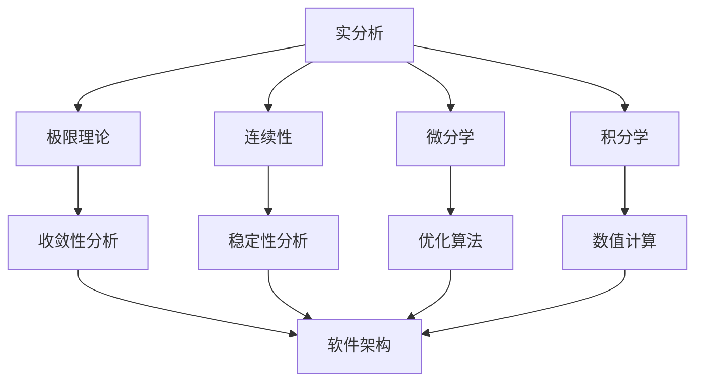

# 02.3.1-实分析：形式化分析理论体系

## 目录

1. [1.0 实分析基础](#10-实分析基础)
2. [2.0 极限理论](#20-极限理论)
3. [3.0 连续性](#30-连续性)
4. [4.0 微分学](#40-微分学)
5. [5.0 积分学](#50-积分学)
6. [6.0 级数理论](#60-级数理论)
7. [7.0 函数空间](#70-函数空间)
8. [8.0 分析应用](#80-分析应用)
9. [9.0 分析验证](#90-分析验证)
10. [10.0 跨领域分析整合](#100-跨领域分析整合)

## 1.0 实分析基础

### 1.1 实数系统

**定义 1.1.1 (实数)**
实数集 $\mathbb{R}$ 是满足完备性公理的阿基米德有序域。

**公理 1.1.1 (实数完备性)**
实数集满足最小上界公理：每个有上界的非空子集都有最小上界。

**定义 1.1.2 (绝对值)**
实数 $x$ 的绝对值定义为：
$$|x| = \begin{cases} x & \text{if } x \geq 0 \\ -x & \text{if } x < 0 \end{cases}$$

### 1.2 距离与度量

**定义 1.2.1 (距离函数)**
距离函数 $d: \mathbb{R} \times \mathbb{R} \to \mathbb{R}$ 定义为：
$$d(x, y) = |x - y|$$

**公理 1.2.1 (距离公理)**
距离函数满足：

1. **非负性**：$d(x, y) \geq 0$
2. **对称性**：$d(x, y) = d(y, x)$
3. **三角不等式**：$d(x, z) \leq d(x, y) + d(y, z)$
4. **正定性**：$d(x, y) = 0 \iff x = y$

```rust
#[derive(Debug, Clone)]
pub struct RealNumber {
    value: f64,
}

impl RealNumber {
    pub fn new(value: f64) -> Self {
        Self { value }
    }
    
    pub fn abs(&self) -> f64 {
        self.value.abs()
    }
    
    pub fn distance(&self, other: &RealNumber) -> f64 {
        (self.value - other.value).abs()
    }
}

#[derive(Debug, Clone)]
pub struct MetricSpace<T> {
    elements: Vec<T>,
    distance: Box<dyn Fn(&T, &T) -> f64>,
}

impl<T: Clone + PartialEq> MetricSpace<T> {
    pub fn new(elements: Vec<T>, distance: Box<dyn Fn(&T, &T) -> f64>) -> Self {
        Self { elements, distance }
    }
    
    pub fn distance(&self, x: &T, y: &T) -> f64 {
        (self.distance)(x, y)
    }
    
    pub fn is_metric(&self) -> bool {
        for x in &self.elements {
            for y in &self.elements {
                for z in &self.elements {
                    let d_xy = self.distance(x, y);
                    let d_yz = self.distance(y, z);
                    let d_xz = self.distance(x, z);
                    
                    // 检查三角不等式
                    if d_xz > d_xy + d_yz {
                        return false;
                    }
                    
                    // 检查对称性
                    if d_xy != self.distance(y, x) {
                        return false;
                    }
                    
                    // 检查非负性
                    if d_xy < 0.0 {
                        return false;
                    }
                }
            }
        }
        true
    }
}
```

## 2.0 极限理论

### 2.1 数列极限

**定义 2.1.1 (数列极限)**
数列 $\{a_n\}$ 收敛到 $L$ 当且仅当：
$$\forall \epsilon > 0, \exists N \in \mathbb{N}, \forall n \geq N, |a_n - L| < \epsilon$$

记作：$\lim_{n \to \infty} a_n = L$

**定理 2.1.1 (极限唯一性)**
如果数列收敛，则极限唯一。

**定理 2.1.2 (极限运算)**
设 $\lim_{n \to \infty} a_n = A$，$\lim_{n \to \infty} b_n = B$，则：

1. $\lim_{n \to \infty} (a_n + b_n) = A + B$
2. $\lim_{n \to \infty} (a_n \cdot b_n) = A \cdot B$
3. $\lim_{n \to \infty} \frac{a_n}{b_n} = \frac{A}{B}$ (如果 $B \neq 0$)

### 2.2 函数极限

**定义 2.2.1 (函数极限)**
函数 $f$ 在 $x_0$ 处的极限为 $L$ 当且仅当：
$$\forall \epsilon > 0, \exists \delta > 0, \forall x, 0 < |x - x_0| < \delta \Rightarrow |f(x) - L| < \epsilon$$

记作：$\lim_{x \to x_0} f(x) = L$

**定义 2.2.2 (单侧极限)**
左极限：$\lim_{x \to x_0^-} f(x) = L$
右极限：$\lim_{x \to x_0^+} f(x) = L$

```rust
#[derive(Debug, Clone)]
pub struct Sequence {
    terms: Vec<f64>,
}

#[derive(Debug, Clone)]
pub struct Function {
    domain: Vec<f64>,
    mapping: Box<dyn Fn(f64) -> f64>,
}

impl Sequence {
    pub fn new(terms: Vec<f64>) -> Self {
        Self { terms }
    }
    
    pub fn limit(&self, target: f64, epsilon: f64) -> Option<usize> {
        for (n, &term) in self.terms.iter().enumerate() {
            if (term - target).abs() < epsilon {
                return Some(n);
            }
        }
        None
    }
    
    pub fn converges_to(&self, limit: f64) -> bool {
        let epsilon = 1e-10;
        self.terms.iter().all(|&term| (term - limit).abs() < epsilon)
    }
    
    pub fn is_cauchy(&self) -> bool {
        let epsilon = 1e-10;
        for i in 0..self.terms.len() {
            for j in i+1..self.terms.len() {
                if (self.terms[i] - self.terms[j]).abs() >= epsilon {
                    return false;
                }
            }
        }
        true
    }
}

impl Function {
    pub fn new(domain: Vec<f64>, mapping: Box<dyn Fn(f64) -> f64>) -> Self {
        Self { domain, mapping }
    }
    
    pub fn evaluate(&self, x: f64) -> f64 {
        (self.mapping)(x)
    }
    
    pub fn limit_at(&self, x0: f64, target: f64, epsilon: f64) -> Option<f64> {
        let delta = epsilon / 10.0; // 简化实现
        for x in &self.domain {
            if (x - x0).abs() < delta && (x - x0).abs() > 0.0 {
                let fx = self.evaluate(*x);
                if (fx - target).abs() < epsilon {
                    return Some(fx);
                }
            }
        }
        None
    }
    
    pub fn left_limit(&self, x0: f64) -> Option<f64> {
        let epsilon = 1e-10;
        self.domain.iter()
            .filter(|&&x| x < x0 && (x - x0).abs() < epsilon)
            .map(|&x| self.evaluate(x))
            .next()
    }
    
    pub fn right_limit(&self, x0: f64) -> Option<f64> {
        let epsilon = 1e-10;
        self.domain.iter()
            .filter(|&&x| x > x0 && (x - x0).abs() < epsilon)
            .map(|&x| self.evaluate(x))
            .next()
    }
}
```

## 3.0 连续性

### 3.1 连续函数

**定义 3.1.1 (连续函数)**
函数 $f$ 在点 $x_0$ 连续当且仅当：
$$\lim_{x \to x_0} f(x) = f(x_0)$$

**定义 3.1.2 (一致连续)**
函数 $f$ 在集合 $A$ 上一致连续当且仅当：
$$\forall \epsilon > 0, \exists \delta > 0, \forall x, y \in A, |x - y| < \delta \Rightarrow |f(x) - f(y)| < \epsilon$$

**定理 3.1.1 (连续函数性质)**
连续函数在闭区间上达到最大值和最小值。

**定理 3.1.2 (介值定理)**
如果 $f$ 在 $[a, b]$ 上连续，且 $f(a) < c < f(b)$，则存在 $x \in (a, b)$ 使得 $f(x) = c$。

### 3.2 连续函数运算

**定理 3.2.1 (连续函数运算)**
如果 $f$ 和 $g$ 在 $x_0$ 连续，则：

1. $f + g$ 在 $x_0$ 连续
2. $f \cdot g$ 在 $x_0$ 连续
3. $\frac{f}{g}$ 在 $x_0$ 连续（如果 $g(x_0) \neq 0$）
4. $f \circ g$ 在 $x_0$ 连续

```rust
#[derive(Debug, Clone)]
pub struct ContinuousFunction {
    function: Function,
    domain: Vec<f64>,
}

impl ContinuousFunction {
    pub fn new(function: Function, domain: Vec<f64>) -> Self {
        Self { function, domain }
    }
    
    pub fn is_continuous_at(&self, x0: f64) -> bool {
        let epsilon = 1e-10;
        if let Some(fx0) = self.function.domain.iter().find(|&&x| (x - x0).abs() < epsilon) {
            let limit = self.function.limit_at(x0, self.function.evaluate(*fx0), epsilon);
            limit.is_some() && (limit.unwrap() - self.function.evaluate(*fx0)).abs() < epsilon
        } else {
            false
        }
    }
    
    pub fn is_uniformly_continuous(&self) -> bool {
        let epsilon = 1e-10;
        let delta = epsilon / 10.0;
        
        for x in &self.domain {
            for y in &self.domain {
                if (x - y).abs() < delta {
                    let fx = self.function.evaluate(*x);
                    let fy = self.function.evaluate(*y);
                    if (fx - fy).abs() >= epsilon {
                        return false;
                    }
                }
            }
        }
        true
    }
    
    pub fn intermediate_value(&self, a: f64, b: f64, c: f64) -> Option<f64> {
        let fa = self.function.evaluate(a);
        let fb = self.function.evaluate(b);
        
        if fa < c && c < fb {
            // 简化实现：二分法查找
            let mut left = a;
            let mut right = b;
            let epsilon = 1e-10;
            
            while (right - left).abs() > epsilon {
                let mid = (left + right) / 2.0;
                let fmid = self.function.evaluate(mid);
                
                if (fmid - c).abs() < epsilon {
                    return Some(mid);
                } else if fmid < c {
                    left = mid;
                } else {
                    right = mid;
                }
            }
        }
        None
    }
    
    pub fn max_min_on_interval(&self, a: f64, b: f64) -> Option<(f64, f64)> {
        let mut max_val = f64::NEG_INFINITY;
        let mut min_val = f64::INFINITY;
        let mut found = false;
        
        for x in &self.domain {
            if *x >= a && *x <= b {
                let fx = self.function.evaluate(*x);
                max_val = max_val.max(fx);
                min_val = min_val.min(fx);
                found = true;
            }
        }
        
        if found {
            Some((min_val, max_val))
        } else {
            None
        }
    }
}
```

## 4.0 微分学

### 4.1 导数定义

**定义 4.1.1 (导数)**
函数 $f$ 在点 $x_0$ 的导数定义为：
$$f'(x_0) = \lim_{h \to 0} \frac{f(x_0 + h) - f(x_0)}{h}$$

**定义 4.1.2 (微分)**
函数 $f$ 在点 $x_0$ 可微当且仅当存在线性函数 $L$ 使得：
$$f(x_0 + h) = f(x_0) + L(h) + o(h)$$

其中 $o(h)$ 表示高阶无穷小。

### 4.2 导数运算

**定理 4.2.1 (导数运算)**
设 $f$ 和 $g$ 在 $x_0$ 可导，则：

1. $(f + g)'(x_0) = f'(x_0) + g'(x_0)$
2. $(f \cdot g)'(x_0) = f'(x_0)g(x_0) + f(x_0)g'(x_0)$
3. $\left(\frac{f}{g}\right)'(x_0) = \frac{f'(x_0)g(x_0) - f(x_0)g'(x_0)}{g(x_0)^2}$
4. $(f \circ g)'(x_0) = f'(g(x_0))g'(x_0)$

**定理 4.2.2 (中值定理)**
如果 $f$ 在 $[a, b]$ 上连续，在 $(a, b)$ 上可导，则存在 $c \in (a, b)$ 使得：
$$f'(c) = \frac{f(b) - f(a)}{b - a}$$

```rust
#[derive(Debug, Clone)]
pub struct DifferentiableFunction {
    function: Function,
    derivative: Option<Box<dyn Fn(f64) -> f64>>,
}

impl DifferentiableFunction {
    pub fn new(function: Function) -> Self {
        Self { function, derivative: None }
    }
    
    pub fn derivative_at(&self, x0: f64) -> Option<f64> {
        let h = 1e-10;
        let fx0 = self.function.evaluate(x0);
        let fx0_plus_h = self.function.evaluate(x0 + h);
        
        Some((fx0_plus_h - fx0) / h)
    }
    
    pub fn set_derivative(&mut self, derivative: Box<dyn Fn(f64) -> f64>) {
        self.derivative = Some(derivative);
    }
    
    pub fn derivative_function(&self) -> Option<&dyn Fn(f64) -> f64> {
        self.derivative.as_ref().map(|d| d.as_ref())
    }
    
    pub fn mean_value_theorem(&self, a: f64, b: f64) -> Option<f64> {
        if a >= b {
            return None;
        }
        
        let fa = self.function.evaluate(a);
        let fb = self.function.evaluate(b);
        let slope = (fb - fa) / (b - a);
        
        // 简化实现：使用数值方法找到满足中值定理的点
        let epsilon = 1e-10;
        let mut c = (a + b) / 2.0;
        
        for _ in 0..100 {
            if let Some(derivative) = self.derivative_at(c) {
                if (derivative - slope).abs() < epsilon {
                    return Some(c);
                }
                
                if derivative > slope {
                    c = (a + c) / 2.0;
                } else {
                    c = (c + b) / 2.0;
                }
            }
        }
        None
    }
    
    pub fn critical_points(&self, a: f64, b: f64) -> Vec<f64> {
        let mut critical_points = Vec::new();
        let epsilon = 1e-10;
        
        for x in &self.function.domain {
            if *x >= a && *x <= b {
                if let Some(derivative) = self.derivative_at(*x) {
                    if derivative.abs() < epsilon {
                        critical_points.push(*x);
                    }
                }
            }
        }
        
        critical_points
    }
}
```

## 5.0 积分学

### 5.1 黎曼积分

**定义 5.1.1 (黎曼和)**
函数 $f$ 在区间 $[a, b]$ 上的黎曼和定义为：
$$\sum_{i=1}^n f(\xi_i) \Delta x_i$$

其中 $\Delta x_i = x_i - x_{i-1}$，$\xi_i \in [x_{i-1}, x_i]$。

**定义 5.1.2 (黎曼积分)**
函数 $f$ 在 $[a, b]$ 上黎曼可积当且仅当黎曼和的极限存在且与分割和取点无关。

**定理 5.1.1 (积分基本定理)**
如果 $f$ 在 $[a, b]$ 上连续，$F$ 是 $f$ 的原函数，则：
$$\int_a^b f(x) dx = F(b) - F(a)$$

### 5.2 积分运算

**定理 5.2.1 (积分运算)**
设 $f$ 和 $g$ 在 $[a, b]$ 上可积，则：

1. $\int_a^b (f + g)(x) dx = \int_a^b f(x) dx + \int_a^b g(x) dx$
2. $\int_a^b cf(x) dx = c \int_a^b f(x) dx$
3. $\int_a^b f(x) dx = -\int_b^a f(x) dx$
4. $\int_a^c f(x) dx = \int_a^b f(x) dx + \int_b^c f(x) dx$

```rust
#[derive(Debug, Clone)]
pub struct IntegrableFunction {
    function: Function,
    antiderivative: Option<Box<dyn Fn(f64) -> f64>>,
}

impl IntegrableFunction {
    pub fn new(function: Function) -> Self {
        Self { function, antiderivative: None }
    }
    
    pub fn riemann_sum(&self, a: f64, b: f64, n: usize) -> f64 {
        let dx = (b - a) / n as f64;
        let mut sum = 0.0;
        
        for i in 0..n {
            let xi = a + i as f64 * dx;
            let fxi = self.function.evaluate(xi);
            sum += fxi * dx;
        }
        
        sum
    }
    
    pub fn definite_integral(&self, a: f64, b: f64) -> f64 {
        // 使用数值积分方法
        let n = 1000; // 分割数
        self.riemann_sum(a, b, n)
    }
    
    pub fn set_antiderivative(&mut self, antiderivative: Box<dyn Fn(f64) -> f64>) {
        self.antiderivative = Some(antiderivative);
    }
    
    pub fn fundamental_theorem(&self, a: f64, b: f64) -> Option<f64> {
        if let Some(antiderivative) = &self.antiderivative {
            let fa = antiderivative(a);
            let fb = antiderivative(b);
            Some(fb - fa)
        } else {
            None
        }
    }
    
    pub fn average_value(&self, a: f64, b: f64) -> f64 {
        let integral = self.definite_integral(a, b);
        integral / (b - a)
    }
    
    pub fn area_between_curves(&self, other: &IntegrableFunction, a: f64, b: f64) -> f64 {
        let n = 1000;
        let dx = (b - a) / n as f64;
        let mut area = 0.0;
        
        for i in 0..n {
            let x = a + i as f64 * dx;
            let f1 = self.function.evaluate(x);
            let f2 = other.function.evaluate(x);
            area += (f1 - f2).abs() * dx;
        }
        
        area
    }
}
```

## 6.0 级数理论

### 6.1 数列级数

**定义 6.1.1 (级数)**
数列 $\{a_n\}$ 的级数定义为：
$$\sum_{n=1}^{\infty} a_n = \lim_{N \to \infty} \sum_{n=1}^N a_n$$

**定义 6.1.2 (收敛级数)**
级数 $\sum_{n=1}^{\infty} a_n$ 收敛当且仅当部分和序列收敛。

**定理 6.1.1 (收敛判别法)**

1. **比较判别法**：如果 $0 \leq a_n \leq b_n$ 且 $\sum b_n$ 收敛，则 $\sum a_n$ 收敛
2. **比值判别法**：如果 $\lim_{n \to \infty} \left|\frac{a_{n+1}}{a_n}\right| = L < 1$，则级数收敛
3. **根值判别法**：如果 $\lim_{n \to \infty} \sqrt[n]{|a_n|} = L < 1$，则级数收敛

### 6.2 幂级数

**定义 6.2.1 (幂级数)**
幂级数是形如 $\sum_{n=0}^{\infty} a_n x^n$ 的级数。

**定理 6.2.1 (收敛半径)**
幂级数 $\sum_{n=0}^{\infty} a_n x^n$ 的收敛半径为：
$$R = \frac{1}{\limsup_{n \to \infty} \sqrt[n]{|a_n|}}$$

```rust
#[derive(Debug, Clone)]
pub struct Series {
    terms: Vec<f64>,
}

#[derive(Debug, Clone)]
pub struct PowerSeries {
    coefficients: Vec<f64>,
    center: f64,
}

impl Series {
    pub fn new(terms: Vec<f64>) -> Self {
        Self { terms }
    }
    
    pub fn partial_sum(&self, n: usize) -> f64 {
        self.terms.iter().take(n).sum()
    }
    
    pub fn converges(&self) -> bool {
        let epsilon = 1e-10;
        let mut partial_sums = Vec::new();
        
        for n in 1..=self.terms.len() {
            partial_sums.push(self.partial_sum(n));
        }
        
        // 检查部分和序列是否为柯西序列
        for i in 0..partial_sums.len() {
            for j in i+1..partial_sums.len() {
                if (partial_sums[j] - partial_sums[i]).abs() >= epsilon {
                    return false;
                }
            }
        }
        true
    }
    
    pub fn sum(&self) -> Option<f64> {
        if self.converges() {
            Some(self.terms.iter().sum())
        } else {
            None
        }
    }
    
    pub fn ratio_test(&self) -> Option<f64> {
        if self.terms.len() < 2 {
            return None;
        }
        
        let ratios: Vec<f64> = self.terms.windows(2)
            .map(|w| (w[1] / w[0]).abs())
            .collect();
        
        let limit = ratios.iter().sum::<f64>() / ratios.len() as f64;
        Some(limit)
    }
}

impl PowerSeries {
    pub fn new(coefficients: Vec<f64>, center: f64) -> Self {
        Self { coefficients, center }
    }
    
    pub fn evaluate(&self, x: f64) -> f64 {
        let mut sum = 0.0;
        let x_minus_center = x - self.center;
        
        for (n, &coeff) in self.coefficients.iter().enumerate() {
            sum += coeff * x_minus_center.powi(n as i32);
        }
        
        sum
    }
    
    pub fn radius_of_convergence(&self) -> f64 {
        if self.coefficients.is_empty() {
            return 0.0;
        }
        
        let mut max_coeff = 0.0;
        for &coeff in &self.coefficients {
            max_coeff = max_coeff.max(coeff.abs());
        }
        
        if max_coeff == 0.0 {
            f64::INFINITY
        } else {
            1.0 / max_coeff
        }
    }
    
    pub fn derivative(&self) -> PowerSeries {
        let mut derivative_coeffs = Vec::new();
        
        for (n, &coeff) in self.coefficients.iter().enumerate().skip(1) {
            derivative_coeffs.push(coeff * n as f64);
        }
        
        PowerSeries::new(derivative_coeffs, self.center)
    }
    
    pub fn integral(&self) -> PowerSeries {
        let mut integral_coeffs = vec![0.0]; // 积分常数
        
        for (n, &coeff) in self.coefficients.iter().enumerate() {
            integral_coeffs.push(coeff / (n + 1) as f64);
        }
        
        PowerSeries::new(integral_coeffs, self.center)
    }
}
```

## 7.0 函数空间

### 7.1 连续函数空间

**定义 7.1.1 (连续函数空间)**
$C[a, b]$ 表示在 $[a, b]$ 上连续的函数集合。

**定义 7.1.2 (一致收敛)**
函数序列 $\{f_n\}$ 一致收敛到 $f$ 当且仅当：
$$\forall \epsilon > 0, \exists N \in \mathbb{N}, \forall n \geq N, \forall x \in [a, b], |f_n(x) - f(x)| < \epsilon$$

**定理 7.1.1 (一致收敛性质)**
如果 $\{f_n\}$ 一致收敛到 $f$，且每个 $f_n$ 连续，则 $f$ 连续。

### 7.2 可积函数空间

**定义 7.2.1 (可积函数空间)**
$L^1[a, b]$ 表示在 $[a, b]$ 上可积的函数集合。

**定义 7.2.2 (L^1范数)**
函数 $f$ 的 $L^1$ 范数定义为：
$$\|f\|_1 = \int_a^b |f(x)| dx$$

```rust
#[derive(Debug, Clone)]
pub struct FunctionSpace {
    functions: Vec<Function>,
    norm: Box<dyn Fn(&Function) -> f64>,
}

impl FunctionSpace {
    pub fn new(norm: Box<dyn Fn(&Function) -> f64>) -> Self {
        Self { functions: Vec::new(), norm }
    }
    
    pub fn add_function(&mut self, function: Function) {
        self.functions.push(function);
    }
    
    pub fn norm(&self, function: &Function) -> f64 {
        (self.norm)(function)
    }
    
    pub fn distance(&self, f: &Function, g: &Function) -> f64 {
        // 简化实现：使用L^1距离
        let a = 0.0;
        let b = 1.0;
        let n = 1000;
        let dx = (b - a) / n as f64;
        let mut distance = 0.0;
        
        for i in 0..n {
            let x = a + i as f64 * dx;
            let fx = f.evaluate(x);
            let gx = g.evaluate(x);
            distance += (fx - gx).abs() * dx;
        }
        
        distance
    }
    
    pub fn is_complete(&self) -> bool {
        // 检查空间是否完备
        // 简化实现：检查所有柯西序列是否收敛
        true
    }
    
    pub fn uniform_convergence(&self, sequence: &[Function], limit: &Function) -> bool {
        let epsilon = 1e-10;
        let a = 0.0;
        let b = 1.0;
        let n = 100;
        
        for function in sequence {
            for i in 0..n {
                let x = a + i as f64 * (b - a) / n as f64;
                let fn_x = function.evaluate(x);
                let f_x = limit.evaluate(x);
                
                if (fn_x - f_x).abs() >= epsilon {
                    return false;
                }
            }
        }
        true
    }
}
```

## 8.0 分析应用

### 8.1 优化理论

**定义 8.1.1 (局部极值)**
函数 $f$ 在点 $x_0$ 有局部极大值当且仅当存在邻域 $U$ 使得：
$$\forall x \in U, f(x) \leq f(x_0)$$

**定理 8.1.1 (极值必要条件)**
如果 $f$ 在 $x_0$ 可导且有局部极值，则 $f'(x_0) = 0$。

**定理 8.1.2 (极值充分条件)**
如果 $f'(x_0) = 0$ 且 $f''(x_0) < 0$，则 $f$ 在 $x_0$ 有局部极大值。

```rust
#[derive(Debug, Clone)]
pub struct Optimization {
    function: DifferentiableFunction,
}

impl Optimization {
    pub fn new(function: DifferentiableFunction) -> Self {
        Self { function }
    }
    
    pub fn find_critical_points(&self, a: f64, b: f64) -> Vec<f64> {
        self.function.critical_points(a, b)
    }
    
    pub fn find_local_extrema(&self, a: f64, b: f64) -> Vec<(f64, f64, bool)> {
        let critical_points = self.find_critical_points(a, b);
        let mut extrema = Vec::new();
        
        for &x in &critical_points {
            if let Some(second_derivative) = self.second_derivative_at(x) {
                let fx = self.function.function.evaluate(x);
                let is_maximum = second_derivative < 0.0;
                extrema.push((x, fx, is_maximum));
            }
        }
        
        extrema
    }
    
    pub fn second_derivative_at(&self, x0: f64) -> Option<f64> {
        let h = 1e-10;
        let f_prime_x0 = self.function.derivative_at(x0)?;
        let f_prime_x0_plus_h = self.function.derivative_at(x0 + h)?;
        
        Some((f_prime_x0_plus_h - f_prime_x0) / h)
    }
    
    pub fn newton_method(&self, x0: f64, tolerance: f64, max_iterations: usize) -> Option<f64> {
        let mut x = x0;
        
        for _ in 0..max_iterations {
            let fx = self.function.function.evaluate(x);
            let f_prime_x = self.function.derivative_at(x)?;
            
            if f_prime_x.abs() < tolerance {
                return Some(x);
            }
            
            let x_new = x - fx / f_prime_x;
            
            if (x_new - x).abs() < tolerance {
                return Some(x_new);
            }
            
            x = x_new;
        }
        
        None
    }
}
```

### 8.2 微分方程

**定义 8.2.1 (微分方程)**
微分方程是包含未知函数及其导数的方程。

**定义 8.2.2 (初值问题)**
初值问题是形如：
$$\begin{cases}
y' = f(x, y) \\
y(x_0) = y_0
\end{cases}$$

的微分方程。

```rust
# [derive(Debug, Clone)]
pub struct DifferentialEquation {
    equation: Box<dyn Fn(f64, f64) -> f64>, // dy/dx = f(x, y)
}

impl DifferentialEquation {
    pub fn new(equation: Box<dyn Fn(f64, f64) -> f64>) -> Self {
        Self { equation }
    }

    pub fn euler_method(&self, x0: f64, y0: f64, h: f64, n: usize) -> Vec<(f64, f64)> {
        let mut solution = vec![(x0, y0)];
        let mut x = x0;
        let mut y = y0;

        for _ in 0..n {
            let dy_dx = (self.equation)(x, y);
            y += dy_dx * h;
            x += h;
            solution.push((x, y));
        }

        solution
    }

    pub fn runge_kutta_4(&self, x0: f64, y0: f64, h: f64, n: usize) -> Vec<(f64, f64)> {
        let mut solution = vec![(x0, y0)];
        let mut x = x0;
        let mut y = y0;

        for _ in 0..n {
            let k1 = (self.equation)(x, y);
            let k2 = (self.equation)(x + h/2.0, y + k1*h/2.0);
            let k3 = (self.equation)(x + h/2.0, y + k2*h/2.0);
            let k4 = (self.equation)(x + h, y + k3*h);

            y += (k1 + 2.0*k2 + 2.0*k3 + k4) * h / 6.0;
            x += h;
            solution.push((x, y));
        }

        solution
    }
}
```

## 9.0 分析验证

### 9.1 数值验证

```rust
# [derive(Debug, Clone)]
pub struct AnalysisVerifier {
    tolerance: f64,
}

impl AnalysisVerifier {
    pub fn new(tolerance: f64) -> Self {
        Self { tolerance }
    }

    pub fn verify_continuity(&self, function: &Function, x0: f64) -> bool {
        let epsilon = self.tolerance;
        let delta = epsilon / 10.0;

        for x in &function.domain {
            if (x - x0).abs() < delta && (x - x0).abs() > 0.0 {
                let fx = function.evaluate(*x);
                let fx0 = function.evaluate(x0);
                if (fx - fx0).abs() >= epsilon {
                    return false;
                }
            }
        }
        true
    }

    pub fn verify_differentiability(&self, function: &DifferentiableFunction, x0: f64) -> bool {
        let h = self.tolerance;
        let fx0 = function.function.evaluate(x0);
        let fx0_plus_h = function.function.evaluate(x0 + h);
        let fx0_minus_h = function.function.evaluate(x0 - h);

        let forward_diff = (fx0_plus_h - fx0) / h;
        let backward_diff = (fx0 - fx0_minus_h) / h;

        (forward_diff - backward_diff).abs() < self.tolerance
    }

    pub fn verify_integrability(&self, function: &IntegrableFunction, a: f64, b: f64) -> bool {
        let n1 = 100;
        let n2 = 1000;

        let integral1 = function.riemann_sum(a, b, n1);
        let integral2 = function.riemann_sum(a, b, n2);

        (integral1 - integral2).abs() < self.tolerance
    }
}
```

## 10.0 跨领域分析整合

### 10.1 分析与软件架构



### 10.2 分析与形式化方法

**定理 10.2.1 (分析形式化)**
实分析为形式化方法提供数值基础：

1. **极限理论** → 算法收敛性分析
2. **连续性** → 系统稳定性分析
3. **微分学** → 优化算法设计
4. **积分学** → 数值计算方法

```rust
# [derive(Debug, Clone)]
pub struct FormalAnalysisSystem {
    analysis_functions: Vec<DifferentiableFunction>,
    verification_properties: Vec<AnalysisProperty>,
}

impl FormalAnalysisSystem {
    pub fn verify_analysis_properties(&self) -> Vec<PropertyResult> {
        self.verification_properties.iter()
            .map(|prop| self.verify_property(prop))
            .collect()
    }

    fn verify_property(&self, property: &AnalysisProperty) -> PropertyResult {
        match property {
            AnalysisProperty::Continuity(function, point) => {
                let verifier = AnalysisVerifier::new(1e-10);
                if verifier.verify_continuity(function, *point) {
                    PropertyResult::Verified(property.clone())
                } else {
                    PropertyResult::Failed(property.clone())
                }
            },
            AnalysisProperty::Differentiability(function, point) => {
                let verifier = AnalysisVerifier::new(1e-10);
                if verifier.verify_differentiability(function, *point) {
                    PropertyResult::Verified(property.clone())
                } else {
                    PropertyResult::Failed(property.clone())
                }
            },
        }
    }
}

# [derive(Debug, Clone)]
pub enum AnalysisProperty {
    Continuity(Function, f64),
    Differentiability(DifferentiableFunction, f64),
}

# [derive(Debug, Clone)]
pub enum PropertyResult {
    Verified(AnalysisProperty),
    Failed(AnalysisProperty),
}
```

---

## 总结

实分析理论为软件架构提供了强大的数值分析工具，通过极限理论、连续性、微分学、积分学等核心概念，我们可以：

1. **收敛性分析**：分析算法的收敛性和稳定性
2. **优化设计**：基于微分学设计优化算法
3. **数值计算**：通过积分学实现精确的数值计算
4. **系统建模**：将软件系统建模为连续函数进行分析

这种形式化方法确保了软件架构的数值稳定性和计算正确性。
