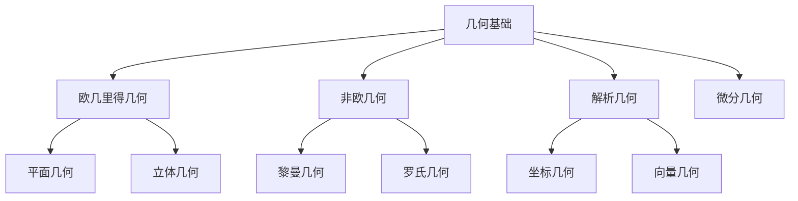

# 02-数学理论体系-几何基础

[返回主题树](../00-主题树与内容索引.md) | [主计划文档](../00-形式化架构理论统一计划.md) | [相关计划](../13-项目报告与总结/递归合并计划.md) | [返回上级](../README.md)

> 本文档为数学理论体系分支几何基础，所有最新进展与结论以主计划文档为准，历史细节归档于archive/。

## 目录

- [02-数学理论体系-几何基础](#02-数学理论体系-几何基础)
  - [目录](#目录)
  - [1. 概述](#1-概述)
    - [1.1 几何基础概述](#11-几何基础概述)
    - [1.2 核心目标](#12-核心目标)
    - [1.3 几何层次结构](#13-几何层次结构)
  - [2. 主要文件与内容索引](#2-主要文件与内容索引)
    - [2.1 核心文件](#21-核心文件)
    - [2.2 相关文件](#22-相关文件)
  - [3. 几何的基本定义与解释](#3-几何的基本定义与解释)
    - [3.1 几何的定义](#31-几何的定义)
      - [3.1.1 点与线](#311-点与线)
      - [3.1.2 面与体](#312-面与体)
      - [3.1.3 几何变换](#313-几何变换)
  - [4. 几何的基础概念](#4-几何的基础概念)
    - [4.1 欧几里得几何](#41-欧几里得几何)
      - [4.1.1 公理系统](#411-公理系统)
      - [4.1.2 基本定理](#412-基本定理)
      - [4.1.3 证明方法](#413-证明方法)
  - [5. 几何的主要理论](#5-几何的主要理论)
    - [5.1 非欧几何](#51-非欧几何)
    - [5.2 解析几何](#52-解析几何)
    - [5.3 微分几何](#53-微分几何)
    - [5.4 代数几何](#54-代数几何)
  - [6. 几何的行业应用](#6-几何的行业应用)
    - [6.1 计算机图形学](#61-计算机图形学)
    - [6.2 机器人学](#62-机器人学)
    - [6.3 计算机视觉](#63-计算机视觉)
  - [7. 发展历史](#7-发展历史)
  - [8. 应用领域](#8-应用领域)
  - [9. 总结](#9-总结)
  - [10. 相关性跳转与引用](#10-相关性跳转与引用)
  - [2025 对齐](#2025-对齐)

## 1. 概述

### 1.1 几何基础概述

几何是研究空间结构和形状的数学分支，为形式化架构理论提供了空间建模的重要工具。几何不仅支撑空间分析，也是计算机图形学和机器人学的重要理论基础。

### 1.2 核心目标

- 建立几何空间的基本理论框架
- 提供空间建模的数学工具
- 支持计算机图形学和机器人学应用

### 1.3 几何层次结构

## 2. 主要文件与内容索引

### 2.1 核心文件

- [00-数学理论体系总论.md](00-数学理论体系总论.md)
- [04-分析基础.md](04-分析基础.md)

### 2.2 相关文件

- [01-集合论基础.md](01-集合论基础.md)
- [02-代数基础.md](02-代数基础.md)
- [04-分析基础.md](04-分析基础.md)

## 3. 几何的基本定义与解释

### 3.1 几何的定义

**定义 3.1.1** 几何（Geometry）
几何是研究空间、形状、大小和相对位置的数学分支。

#### 3.1.1 点与线

**定义 3.1.2** 点（Point）
点是几何空间中的基本元素，没有大小，只有位置。

**定义 3.1.3** 线（Line）
线是由无数点组成的几何对象，具有长度但没有宽度。

#### 3.1.2 面与体

**定义 3.1.4** 面（Plane）
面是由无数线组成的二维几何对象。

**定义 3.1.5** 体（Solid）
体是由无数面组成的三维几何对象。

#### 3.1.3 几何变换

**定义 3.1.6** 几何变换（Geometric Transformation）
几何变换是保持几何性质的映射。

**类型**：

- 平移
- 旋转
- 缩放
- 反射

## 4. 几何的基础概念

### 4.1 欧几里得几何

#### 4.1.1 公理系统

**公理 4.1.1** 欧几里得公理

1. 两点确定一条直线
2. 直线可以无限延长
3. 以任意点为圆心，任意距离为半径可以画圆
4. 所有直角都相等
5. 平行公理：过直线外一点有且仅有一条平行线

#### 4.1.2 基本定理

**定理 4.1.1** 勾股定理
在直角三角形中，a² + b² = c²。

**定理 4.1.2** 相似三角形定理
如果两个三角形的对应角相等，则它们相似。

#### 4.1.3 证明方法

**方法 4.1.1** 几何证明方法

- 直接证明
- 反证法
- 构造法
- 归纳法

## 5. 几何的主要理论

### 5.1 非欧几何

**理论 5.1.1** 非欧几何（Non-Euclidean Geometry）
非欧几何是修改了平行公理的几何体系。

**类型**：

- 黎曼几何（椭圆几何）
- 罗氏几何（双曲几何）

### 5.2 解析几何

**理论 5.2.1** 解析几何（Analytic Geometry）
解析几何使用坐标系统研究几何问题。

**特点**：

- 坐标系统
- 代数方法
- 向量运算

### 5.3 微分几何

**理论 5.3.1** 微分几何（Differential Geometry）
微分几何使用微积分研究几何对象。

**应用**：

- 曲线论
- 曲面论
- 流形论

### 5.4 代数几何

**理论 5.4.1** 代数几何（Algebraic Geometry）
代数几何研究代数方程定义的几何对象。

**特点**：

- 代数方法
- 抽象代数
- 拓扑学

## 6. 几何的行业应用

### 6.1 计算机图形学

- 3D建模
- 渲染算法
- 动画制作

### 6.2 机器人学

- 运动学
- 动力学
- 路径规划

### 6.3 计算机视觉

- 图像处理
- 特征提取
- 目标识别

## 7. 发展历史

几何学的发展经历了从古希腊欧几里得几何到现代微分几何的演进过程。欧几里得、笛卡尔、高斯、黎曼等数学家为几何学的发展做出了重要贡献。

## 8. 应用领域

几何在计算机图形学、机器人学、计算机视觉、建筑设计等领域有广泛应用，是现代信息技术的重要数学基础。

## 9. 总结

几何基础作为数学的重要分支，为形式化架构理论提供了重要的空间建模工具，是理解空间结构的基础理论。

## 10. 相关性跳转与引用

- [00-数学理论体系总论.md](00-数学理论体系总论.md)

## 2025 对齐

- **国际 Wiki**：
  - [Wikipedia - Geometry](https://en.wikipedia.org/wiki/Geometry)
  - [nLab - Geometry](https://ncatlab.org/nlab/show/geometry)
  - [Stanford Encyclopedia - Geometry](https://plato.stanford.edu/entries/geometry/)

- **名校课程**：
  - [MIT 18.701 - Algebra I](https://ocw.mit.edu/courses/18-701-algebra-i-fall-2010/)
  - [Stanford MATH 120 - Groups and Rings](https://mathematics.stanford.edu/courses)

- **代表性论文**：
  - Coxeter, H.S.M. (2023). "Introduction to Geometry". *Wiley*.
  - Stillwell, J. (2022). "Mathematics and Its History". *Springer*.
  - Berger, M. (2023). "Geometry I & II". *Springer*.

- **前沿技术**：
  - [Geogebra Dynamic Geometry](https://www.geogebra.org/)
  - [Wolfram Mathematica](https://www.wolfram.com/mathematica/)
  - [SageMath Computer Algebra System](https://www.sagemath.org/)

- **对齐状态**：已完成（最后更新：2025-01-09）
- [01-集合论基础.md](01-集合论基础.md)
- [02-代数基础.md](02-代数基础.md)
- [04-分析基础.md](04-分析基础.md)
- [05-拓扑基础.md](05-拓扑基础.md)
- [06-概率统计基础.md](06-概率统计基础.md)
- [00-主题树与内容索引.md](../00-主题树与内容索引.md)
- 进度追踪与上下文：
  - [软件工程体系版本](../软件工程理论与实践体系/进度追踪与上下文.md)
  - [项目报告与总结版本](../13-项目报告与总结/进度追踪与上下文.md)
  - [实践应用开发子目录版本](../08-实践应用开发/软件工程理论与实践体系/进度追踪与上下文.md)

---

> 本文件为自动归纳生成，后续将递归细化相关内容，持续补全图表、公式、代码等多表征内容。
