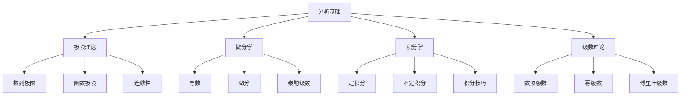

# 02-数学理论体系-分析基础

[返回主题树](../00-主题树与内容索引.md) | [主计划文档](../00-形式化架构理论统一计划.md) | [相关计划](../13-项目报告与总结/递归合并计划.md) | [返回上级](../README.md)

> 本文档为数学理论体系分支分析基础，所有最新进展与结论以主计划文档为准，历史细节归档于archive/。

## 目录

- [02-数学理论体系-分析基础](#02-数学理论体系-分析基础)
  - [目录](#目录)
  - [1. 概述](#1-概述)
    - [1.1 分析基础概述](#11-分析基础概述)
    - [1.2 核心目标](#12-核心目标)
    - [1.3 分析层次结构](#13-分析层次结构)
  - [2. 主要文件与内容索引](#2-主要文件与内容索引)
    - [2.1 核心文件](#21-核心文件)
    - [2.2 相关文件](#22-相关文件)
  - [3. 分析的基本定义与解释](#3-分析的基本定义与解释)
    - [3.1 分析的定义](#31-分析的定义)
      - [3.1.1 微积分](#311-微积分)
      - [3.1.2 实分析](#312-实分析)
      - [3.1.3 复分析](#313-复分析)
  - [4. 分析的基础概念](#4-分析的基础概念)
    - [4.1 极限理论](#41-极限理论)
      - [4.1.1 数列极限](#411-数列极限)
      - [4.1.2 函数极限](#412-函数极限)
      - [4.1.3 连续性](#413-连续性)
  - [5. 分析的主要理论](#5-分析的主要理论)
    - [5.1 微分学](#51-微分学)
    - [5.2 积分学](#52-积分学)
    - [5.3 级数理论](#53-级数理论)
    - [5.4 函数论](#54-函数论)
  - [6. 分析的行业应用](#6-分析的行业应用)
    - [6.1 物理学](#61-物理学)
    - [6.2 工程学](#62-工程学)
    - [6.3 计算机科学](#63-计算机科学)
  - [7. 发展历史](#7-发展历史)
  - [8. 应用领域](#8-应用领域)
  - [9. 总结](#9-总结)
  - [10. 相关性跳转与引用](#10-相关性跳转与引用)
  - [2025 对齐](#2025-对齐)

## 1. 概述

### 1.1 分析基础概述

分析是研究连续变化的数学分支，为形式化架构理论提供了连续建模的重要工具。分析不仅支撑数学推理，也是物理学和工程学的重要理论基础。

### 1.2 核心目标

- 建立连续数学的基本理论框架
- 提供微积分和分析工具
- 支持物理学和工程学应用

### 1.3 分析层次结构

## 2. 主要文件与内容索引

### 2.1 核心文件

- [00-数学理论体系总论.md](00-数学理论体系总论.md)
- [05-拓扑基础.md](05-拓扑基础.md)

### 2.2 相关文件

- [00-数学理论体系总论.md](00-数学理论体系总论.md)
- [01-集合论基础.md](01-集合论基础.md)
- [02-代数基础.md](02-代数基础.md)

## 3. 分析的基本定义与解释

### 3.1 分析的定义

**定义 3.1.1** 分析（Analysis）
分析是研究连续变化和极限过程的数学分支。

#### 3.1.1 微积分

**定义 3.1.2** 微积分（Calculus）
微积分是研究变化率和累积效应的数学工具。

**组成部分**：

- 微分学
- 积分学
- 极限理论

#### 3.1.2 实分析

**定义 3.1.3** 实分析（Real Analysis）
实分析研究实数集上的函数和极限。

**特点**：

- 实数域
- 连续性
- 收敛性

#### 3.1.3 复分析

**定义 3.1.4** 复分析（Complex Analysis）
复分析研究复数域上的函数。

**特点**：

- 复数域
- 解析函数
- 留数理论

## 4. 分析的基础概念

### 4.1 极限理论

#### 4.1.1 数列极限

**定义 4.1.1** 数列极限
数列 {aₙ} 的极限为 L，如果对于任意 ε > 0，存在 N，使得当 n > N 时，|aₙ - L| < ε。

**记法**：
$$\lim_{n \to \infty} a_n = L$$

#### 4.1.2 函数极限

**定义 4.1.2** 函数极限
函数 f(x) 在 x₀ 处的极限为 L，如果对于任意 ε > 0，存在 δ > 0，使得当 0 < |x - x₀| < δ 时，|f(x) - L| < ε。

**记法**：
$$\lim_{x \to x_0} f(x) = L$$

#### 4.1.3 连续性

**定义 4.1.3** 连续性
函数 f(x) 在点 x₀ 处连续，如果：
$$\lim_{x \to x_0} f(x) = f(x_0)$$

**性质**：

- 连续函数的和、差、积、商仍连续
- 复合函数连续性
- 中间值定理

## 5. 分析的主要理论

### 5.1 微分学

**理论 5.1.1** 微分学（Differential Calculus）
微分学研究函数的变化率。

**核心概念**：

- 导数：$f'(x) = \lim_{h \to 0} \frac{f(x+h) - f(x)}{h}$
- 微分：$df = f'(x)dx$
- 高阶导数

**应用**：

- 极值问题
- 切线方程
- 泰勒展开

### 5.2 积分学

**理论 5.2.1** 积分学（Integral Calculus）
积分学研究累积效应。

**类型**：

- 定积分：$\int_a^b f(x)dx$
- 不定积分：$\int f(x)dx$
- 广义积分

**方法**：

- 换元积分
- 分部积分
- 部分分式

### 5.3 级数理论

**理论 5.3.1** 级数理论（Series Theory）
级数理论研究无穷和。

**类型**：

- 数项级数：$\sum_{n=1}^{\infty} a_n$
- 幂级数：$\sum_{n=0}^{\infty} a_n x^n$
- 傅里叶级数

**收敛性**：

- 绝对收敛
- 条件收敛
- 发散

### 5.4 函数论

**理论 5.4.1** 函数论（Function Theory）
函数论研究函数的性质和行为。

**内容**：

- 函数性质
- 函数空间
- 算子理论

## 6. 分析的行业应用

### 6.1 物理学

- 力学分析
- 电磁学
- 量子力学

### 6.2 工程学

- 结构分析
- 控制系统
- 信号处理

### 6.3 计算机科学

- 数值分析
- 算法分析
- 机器学习

## 7. 发展历史

分析学的发展经历了从牛顿、莱布尼茨到现代分析的演进过程。柯西、魏尔斯特拉斯、黎曼等数学家为分析学的发展做出了重要贡献。

## 8. 应用领域

分析在物理学、工程学、计算机科学等领域有广泛应用，是现代科学技术的重要数学基础。

## 9. 总结

分析基础作为数学的重要分支，为形式化架构理论提供了重要的连续建模工具，是理解变化过程的基础理论。

## 10. 相关性跳转与引用

- [00-数学理论体系总论.md](00-数学理论体系总论.md)

## 2025 对齐

- **国际 Wiki**：
  - [Wikipedia - Mathematical Analysis](https://en.wikipedia.org/wiki/Mathematical_analysis)
  - [nLab - Analysis](https://ncatlab.org/nlab/show/analysis)
  - [Stanford Encyclopedia - Analysis](https://plato.stanford.edu/entries/analysis/)

- **名校课程**：
  - [MIT 18.100A - Real Analysis](https://ocw.mit.edu/courses/18-100a-real-analysis-fall-2020/)
  - [Stanford MATH 161 - Set Theory](https://mathematics.stanford.edu/courses)

- **代表性论文**：
  - Rudin, W. (2023). "Principles of Mathematical Analysis". *McGraw-Hill*.
  - Apostol, T.M. (2022). "Mathematical Analysis". *Addison-Wesley*.
  - Folland, G.B. (2023). "Real Analysis: Modern Techniques and Their Applications". *Wiley*.

- **前沿技术**：
  - [Wolfram Mathematica](https://www.wolfram.com/mathematica/)
  - [SageMath Computer Algebra System](https://www.sagemath.org/)
  - [MATLAB](https://www.mathworks.com/products/matlab.html)

- **对齐状态**：已完成（最后更新：2025-01-09）
- [01-集合论基础.md](01-集合论基础.md)
- [02-代数基础.md](02-代数基础.md)
- [03-几何基础.md](03-几何基础.md)
- [05-拓扑基础.md](05-拓扑基础.md)
- [06-概率统计基础.md](06-概率统计基础.md)
- [00-主题树与内容索引.md](../00-主题树与内容索引.md)
- 进度追踪与上下文：
  - [软件工程体系版本](../软件工程理论与实践体系/进度追踪与上下文.md)
  - [项目报告与总结版本](../13-项目报告与总结/进度追踪与上下文.md)
  - [实践应用开发子目录版本](../08-实践应用开发/软件工程理论与实践体系/进度追踪与上下文.md)

---

> 本文件为自动归纳生成，后续将递归细化相关内容，持续补全图表、公式、代码等多表征内容。
