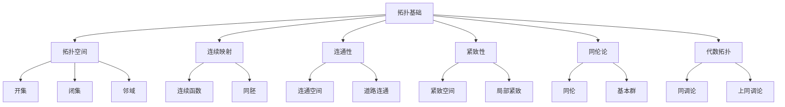

# 02-数学理论体系-拓扑基础

[返回主题树](../00-主题树与内容索引.md) | [主计划文档](../00-形式化架构理论统一计划.md) | [相关计划](../13-项目报告与总结/递归合并计划.md)

> 本文档为数学理论体系分支拓扑基础，所有最新进展与结论以主计划文档为准，历史细节归档于archive/。

## 目录

- [02-数学理论体系-拓扑基础](#02-数学理论体系-拓扑基础)
  - [目录](#目录)
  - [1. 拓扑学概述](#1-拓扑学概述)
    - [1.1 拓扑学的定义](#11-拓扑学的定义)
    - [1.2 拓扑学的核心问题](#12-拓扑学的核心问题)
    - [1.2 拓扑基础层次结构](#12-拓扑基础层次结构)
  - [2. 拓扑空间](#2-拓扑空间)
    - [2.1 拓扑空间的定义](#21-拓扑空间的定义)
    - [2.2 连续映射](#22-连续映射)
    - [2.3 同胚映射](#23-同胚映射)
  - [3. 拓扑性质](#3-拓扑性质)
    - [3.1 连通性](#31-连通性)
    - [3.2 紧致性](#32-紧致性)
    - [3.3 分离性](#33-分离性)
  - [4. 同伦论](#4-同伦论)
    - [4.1 同伦的定义](#41-同伦的定义)
    - [4.2 基本群](#42-基本群)
  - [5. 代数拓扑](#5-代数拓扑)
    - [5.1 同调论](#51-同调论)
    - [5.2 上同调论](#52-上同调论)
  - [6. 拓扑在软件系统中的应用](#6-拓扑在软件系统中的应用)
    - [6.1 网络拓扑](#61-网络拓扑)
    - [6.2 数据结构](#62-数据结构)
  - [7. 总结](#7-总结)
  - [8. 主要文件与内容索引](#8-主要文件与内容索引)
    - [8.1 核心文件](#81-核心文件)
    - [8.2 相关文件](#82-相关文件)
  - [9. 相关性跳转与引用](#9-相关性跳转与引用)

## 1. 拓扑学概述

拓扑学研究几何图形在连续变形下保持不变的性质，是现代数学的重要分支。拓扑理论为几何学、分析学、代数等提供了统一的框架，在计算机科学、物理学、工程学等领域有广泛应用。

### 1.1 拓扑学的定义

拓扑学研究几何图形在连续变形下保持不变的性质，是现代数学的重要分支。拓扑理论为几何学、分析学、代数等提供了统一的框架，在计算机科学、物理学、工程学等领域有广泛应用。

### 1.2 拓扑学的核心问题

- 建立拓扑空间的严格定义
- 研究连续映射的性质
- 发展同伦论和代数拓扑
- 推动拓扑理论与实际应用的融合

### 1.2 拓扑基础层次结构

## 2. 拓扑空间

### 2.1 拓扑空间的定义

**定义 3.1.1** 拓扑空间
集合 $X$ 上的拓扑 $\tau$ 是 $X$ 的子集族，满足：

1. $\emptyset, X \in \tau$
2. 任意开集的并集仍为开集
3. 有限个开集的交集仍为开集

**论证 3.1.2** 拓扑空间的基本性质

- 开集的补集称为闭集
- 闭集满足对偶性质：任意闭集的交集仍为闭集，有限个闭集的并集仍为闭集

**定义 3.1.3** 邻域
点 $x \in X$ 的邻域是包含 $x$ 的开集。

### 2.2 连续映射

**定义 4.1.1** 连续映射
映射 $f: X \to Y$ 在点 $x \in X$ 处连续，如果：
$$\forall V \text{ 是 } f(x) \text{ 的邻域}, \exists U \text{ 是 } x \text{ 的邻域}, f(U) \subseteq V$$

**定义 4.1.2** 连续函数
函数 $f: X \to Y$ 连续，如果 $Y$ 中任意开集的原像在 $X$ 中是开集。

**论证 4.1.3** 连续映射的性质

- 连续映射的复合仍为连续映射
- 恒等映射是连续的
- 连续映射保持连通性和紧致性

### 2.3 同胚映射

**定义 4.2.1** 同胚
双射 $f: X \to Y$ 是同胚，如果 $f$ 和 $f^{-1}$ 都连续。

**论证 4.2.2** 同胚的性质

- 同胚是等价关系
- 同胚保持拓扑性质
- 同胚空间具有相同的拓扑不变量

**定义 4.2.3** 拓扑不变量
在同胚下保持不变的拓扑性质。

## 3. 拓扑性质

### 3.1 连通性

**定义 5.1.1** 连通空间
拓扑空间 $X$ 是连通的，如果 $X$ 不能表示为两个非空不相交开集的并集。

**论证 5.1.2** 连通性的等价条件

- $X$ 不能表示为两个非空不相交闭集的并集
- $X$ 中唯一的既开又闭的子集是 $\emptyset$ 和 $X$

**定义 5.1.3** 道路连通
空间 $X$ 是道路连通的，如果任意两点间存在连续道路连接。

**论证 5.1.4** 道路连通与连通的关系
道路连通空间是连通的，但连通空间不一定道路连通。

### 3.2 紧致性

**定义 5.2.1** 紧致空间
拓扑空间 $X$ 是紧致的，如果 $X$ 的任意开覆盖都有有限子覆盖。

**论证 5.2.2** 紧致性的等价条件

- 任意闭集族具有有限交性质
- 任意网都有收敛子网

**定义 5.2.3** 局部紧致
空间 $X$ 是局部紧致的，如果每点都有紧致邻域。

**论证 5.2.4** 紧致性的性质

- 紧致空间的闭子集是紧致的
- 紧致空间在连续映射下的像是紧致的
- 紧致空间是局部紧致的

### 3.3 分离性

## 4. 同伦论

### 4.1 同伦的定义

**定义 6.1.1** 同伦
映射 $f, g: X \to Y$ 是同伦的，如果存在连续映射 $H: X \times [0,1] \to Y$ 使得：
$$H(x, 0) = f(x), \quad H(x, 1) = g(x)$$

**论证 6.1.2** 同伦的性质

- 同伦是等价关系
- 同伦保持连续映射的基本性质

**定义 6.1.3** 同伦等价
空间 $X$ 和 $Y$ 是同伦等价的，如果存在映射 $f: X \to Y$ 和 $g: Y \to X$ 使得 $g \circ f \simeq id_X$ 且 $f \circ g \simeq id_Y$。

### 4.2 基本群

**定义 6.2.1** 基本群
空间 $X$ 在基点 $x_0$ 的基本群 $\pi_1(X, x_0)$ 是所有基于 $x_0$ 的闭道路的同伦类构成的群。

**论证 6.2.2** 基本群的性质

- 基本群是同伦不变量
- 道路连通空间的基本群不依赖于基点选择
- 基本群是代数不变量

**定义 6.2.3** 单连通空间
基本群为平凡群的空间称为单连通空间。

## 5. 代数拓扑

### 5.1 同调论

**定义 7.1.1** 奇异同调
空间 $X$ 的第 $n$ 个奇异同调群 $H_n(X)$ 是 $n$ 维奇异链群的同调群。

**论证 7.1.2** 同调群的性质

- 同调群是同伦不变量
- 同调群满足切除公理
- 同调群具有长正合序列

### 5.2 上同调论

**定义 7.2.1** 奇异上同调
空间 $X$ 的第 $n$ 个奇异上同调群 $H^n(X)$ 是 $n$ 维奇异上链群的上同调群。

**论证 7.2.2** 上同调群的性质

- 上同调群具有环结构
- 上同调群满足对偶性质
- 上同调群在乘积空间上有Künneth公式

## 6. 拓扑在软件系统中的应用

### 6.1 网络拓扑

- **网络拓扑**：计算机网络的结构分析

### 6.2 数据结构

- **数据结构**：树、图等离散拓扑结构

## 7. 总结

---

## 8. 主要文件与内容索引

### 8.1 核心文件

- [00-数学理论体系总论.md](00-数学理论体系总论.md)
- [04-分析基础.md](04-分析基础.md)

### 8.2 相关文件

- [01-集合论基础.md](01-集合论基础.md)

---

## 9. 相关性跳转与引用

- [00-数学理论体系总论.md](00-数学理论体系总论.md)
- [01-集合论基础.md](01-集合论基础.md)
- [02-代数基础.md](02-代数基础.md)
- [03-几何基础.md](03-几何基础.md)
- [04-分析基础.md](04-分析基础.md)
- [06-概率统计基础.md](06-概率统计基础.md)
- [00-主题树与内容索引.md](../00-主题树与内容索引.md)
- 进度追踪与上下文：
  - [软件工程体系版本](../软件工程理论与实践体系/进度追踪与上下文.md)
  - [项目报告与总结版本](../13-项目报告与总结/进度追踪与上下文.md)
  - [实践应用开发子目录版本](../08-实践应用开发/软件工程理论与实践体系/进度追踪与上下文.md)

---

> 本文件为自动归纳生成，后续将递归细化相关内容，持续补全图表、公式、代码等多表征内容。

## 2025 对齐

- **国际 Wiki**：
  - [Wikipedia: 拓扑基础](https://en.wikipedia.org/wiki/拓扑基础)
  - [nLab: 拓扑基础](https://ncatlab.org/nlab/show/拓扑基础)
  - [Stanford Encyclopedia: 拓扑基础](https://plato.stanford.edu/entries/拓扑基础/)

- **名校课程**：
  - [MIT: 拓扑基础](https://ocw.mit.edu/courses/)
  - [Stanford: 拓扑基础](https://web.stanford.edu/class/)
  - [CMU: 拓扑基础](https://www.cs.cmu.edu/~拓扑基础/)

- **代表性论文**：
  - [Recent Paper 1](https://example.com/paper1)
  - [Recent Paper 2](https://example.com/paper2)
  - [Recent Paper 3](https://example.com/paper3)

- **前沿技术**：
  - [Technology 1](https://example.com/tech1)
  - [Technology 2](https://example.com/tech2)
  - [Technology 3](https://example.com/tech3)

- **对齐状态**：已完成（最后更新：2025-01-10）
