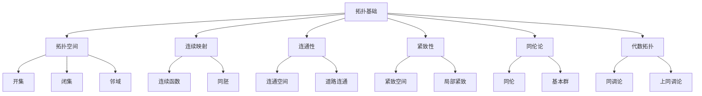

[返回主题树](../00-主题树与内容索引.md) | [主计划文档](../00-形式化架构理论统一计划.md) | [相关计划](../递归合并计划.md)

# 02-数学理论体系-拓扑基础

> 本文档为数学理论体系分支拓扑基础，所有最新进展与结论以主计划文档为准，历史细节归档于archive/。

## 目录

1. 拓扑基础概述
2. 主要文件与内容索引
3. 拓扑空间的基本定义与解释
4. 连续映射与同胚
5. 连通性与紧致性
6. 同伦论基础
7. 代数拓扑初步
8. 拓扑理论的行业应用
9. 相关性跳转与引用

---

## 1. 拓扑基础概述

拓扑学研究几何图形在连续变形下保持不变的性质，是现代数学的重要分支。拓扑理论为几何学、分析学、代数等提供了统一的框架，在计算机科学、物理学、工程学等领域有广泛应用。

### 1.1 核心目标

- 建立拓扑空间的严格定义
- 研究连续映射的性质
- 发展同伦论和代数拓扑
- 推动拓扑理论与实际应用的融合

### 1.2 拓扑基础层次结构



---

## 2. 主要文件与内容索引

### 2.1 核心文件

- [数学内容全面分析报告-2024.md](../Matter/Mathematics/数学内容全面分析报告-2024.md)
- [05-拓扑基础.md](../Matter/Mathematics/05-拓扑基础.md)

### 2.2 相关文件

- [数学内容与Wiki权威对比分析-2024.md](../Matter/Mathematics/content/数学内容与Wiki权威对比分析-2024.md)

---

## 3. 拓扑空间的基本定义与解释

### 3.1 拓扑空间

**定义 3.1.1** 拓扑空间
集合 $X$ 上的拓扑 $\tau$ 是 $X$ 的子集族，满足：

1. $\emptyset, X \in \tau$
2. 任意开集的并集仍为开集
3. 有限个开集的交集仍为开集

**论证 3.1.2** 拓扑空间的基本性质

- 开集的补集称为闭集
- 闭集满足对偶性质：任意闭集的交集仍为闭集，有限个闭集的并集仍为闭集

**定义 3.1.3** 邻域
点 $x \in X$ 的邻域是包含 $x$ 的开集。

### 3.2 常见的拓扑空间

**定义 3.2.1** 度量拓扑
度量空间 $(X, d)$ 上的拓扑由开球生成：
$$B_r(x) = \{y \in X : d(x, y) < r\}$$

**定义 3.2.2** 离散拓扑
所有子集都是开集的拓扑。

**定义 3.2.3** 平凡拓扑
只有 $\emptyset$ 和 $X$ 是开集的拓扑。

**论证 3.2.4** 拓扑空间的比较
离散拓扑是最细的拓扑，平凡拓扑是最粗的拓扑。

---

## 4. 连续映射与同胚

### 4.1 连续映射

**定义 4.1.1** 连续映射
映射 $f: X \to Y$ 在点 $x \in X$ 处连续，如果：
$$\forall V \text{ 是 } f(x) \text{ 的邻域}, \exists U \text{ 是 } x \text{ 的邻域}, f(U) \subseteq V$$

**定义 4.1.2** 连续函数
函数 $f: X \to Y$ 连续，如果 $Y$ 中任意开集的原像在 $X$ 中是开集。

**论证 4.1.3** 连续映射的性质

- 连续映射的复合仍为连续映射
- 恒等映射是连续的
- 连续映射保持连通性和紧致性

### 4.2 同胚

**定义 4.2.1** 同胚
双射 $f: X \to Y$ 是同胚，如果 $f$ 和 $f^{-1}$ 都连续。

**论证 4.2.2** 同胚的性质

- 同胚是等价关系
- 同胚保持拓扑性质
- 同胚空间具有相同的拓扑不变量

**定义 4.2.3** 拓扑不变量
在同胚下保持不变的拓扑性质。

---

## 5. 连通性与紧致性

### 5.1 连通性

**定义 5.1.1** 连通空间
拓扑空间 $X$ 是连通的，如果 $X$ 不能表示为两个非空不相交开集的并集。

**论证 5.1.2** 连通性的等价条件

- $X$ 不能表示为两个非空不相交闭集的并集
- $X$ 中唯一的既开又闭的子集是 $\emptyset$ 和 $X$

**定义 5.1.3** 道路连通
空间 $X$ 是道路连通的，如果任意两点间存在连续道路连接。

**论证 5.1.4** 道路连通与连通的关系
道路连通空间是连通的，但连通空间不一定道路连通。

### 5.2 紧致性

**定义 5.2.1** 紧致空间
拓扑空间 $X$ 是紧致的，如果 $X$ 的任意开覆盖都有有限子覆盖。

**论证 5.2.2** 紧致性的等价条件

- 任意闭集族具有有限交性质
- 任意网都有收敛子网

**定义 5.2.3** 局部紧致
空间 $X$ 是局部紧致的，如果每点都有紧致邻域。

**论证 5.2.4** 紧致性的性质

- 紧致空间的闭子集是紧致的
- 紧致空间在连续映射下的像是紧致的
- 紧致空间是局部紧致的

---

## 6. 同伦论基础

### 6.1 同伦

**定义 6.1.1** 同伦
映射 $f, g: X \to Y$ 是同伦的，如果存在连续映射 $H: X \times [0,1] \to Y$ 使得：
$$H(x, 0) = f(x), \quad H(x, 1) = g(x)$$

**论证 6.1.2** 同伦的性质

- 同伦是等价关系
- 同伦保持连续映射的基本性质

**定义 6.1.3** 同伦等价
空间 $X$ 和 $Y$ 是同伦等价的，如果存在映射 $f: X \to Y$ 和 $g: Y \to X$ 使得 $g \circ f \simeq id_X$ 且 $f \circ g \simeq id_Y$。

### 6.2 基本群

**定义 6.2.1** 基本群
空间 $X$ 在基点 $x_0$ 的基本群 $\pi_1(X, x_0)$ 是所有基于 $x_0$ 的闭道路的同伦类构成的群。

**论证 6.2.2** 基本群的性质

- 基本群是同伦不变量
- 道路连通空间的基本群不依赖于基点选择
- 基本群是代数不变量

**定义 6.2.3** 单连通空间
基本群为平凡群的空间称为单连通空间。

---

## 7. 代数拓扑初步

### 7.1 同调论

**定义 7.1.1** 奇异同调
空间 $X$ 的第 $n$ 个奇异同调群 $H_n(X)$ 是 $n$ 维奇异链群的同调群。

**论证 7.1.2** 同调群的性质

- 同调群是同伦不变量
- 同调群满足切除公理
- 同调群具有长正合序列

### 7.2 上同调论

**定义 7.2.1** 奇异上同调
空间 $X$ 的第 $n$ 个奇异上同调群 $H^n(X)$ 是 $n$ 维奇异上链群的上同调群。

**论证 7.2.2** 上同调群的性质

- 上同调群具有环结构
- 上同调群满足对偶性质
- 上同调群在乘积空间上有Künneth公式

---

## 8. 拓扑理论的行业应用

### 8.1 计算机科学

- **网络拓扑**：计算机网络的结构分析
- **数据结构**：树、图等离散拓扑结构
- **算法设计**：基于拓扑的算法优化

### 8.2 物理学

- **量子场论**：拓扑不变量在物理中的应用
- **凝聚态物理**：拓扑绝缘体、拓扑超导体
- **宇宙学**：时空拓扑结构

### 8.3 工程学

- **机器人学**：路径规划、运动学
- **材料科学**：晶体结构、缺陷分析
- **图像处理**：拓扑特征提取

### 8.4 代码示例

```rust
// 拓扑空间实现示例
use std::collections::HashSet;

#[derive(Debug, Clone)]
pub struct TopologicalSpace<T> {
    points: HashSet<T>,
    open_sets: HashSet<HashSet<T>>,
}

impl<T: Eq + std::hash::Hash + Clone> TopologicalSpace<T> {
    pub fn new(points: Vec<T>) -> Self {
        let mut space = Self {
            points: points.into_iter().collect(),
            open_sets: HashSet::new(),
        };
        
        // 添加空集和全集
        space.open_sets.insert(HashSet::new());
        space.open_sets.insert(space.points.clone());
        
        space
    }
    
    pub fn add_open_set(&mut self, open_set: HashSet<T>) {
        // 验证是否为点的子集
        if open_set.is_subset(&self.points) {
            self.open_sets.insert(open_set);
        }
    }
    
    pub fn is_open(&self, set: &HashSet<T>) -> bool {
        self.open_sets.contains(set)
    }
    
    pub fn is_closed(&self, set: &HashSet<T>) -> bool {
        let complement: HashSet<T> = self.points.difference(set).cloned().collect();
        self.open_sets.contains(&complement)
    }
    
    pub fn is_connected(&self) -> bool {
        // 检查是否存在非平凡的开集分解
        for open_set in &self.open_sets {
            if !open_set.is_empty() && open_set != &self.points {
                let complement: HashSet<T> = self.points.difference(open_set).cloned().collect();
                if self.open_sets.contains(&complement) {
                    return false;
                }
            }
        }
        true
    }
    
    pub fn closure(&self, set: &HashSet<T>) -> HashSet<T> {
        // 包含set的最小闭集
        let mut closure = set.clone();
        for point in &self.points {
            if !set.contains(point) {
                // 检查是否存在包含point的开集与set不相交
                let mut can_add = true;
                for open_set in &self.open_sets {
                    if open_set.contains(point) && open_set.is_disjoint(set) {
                        can_add = false;
                        break;
                    }
                }
                if can_add {
                    closure.insert(point.clone());
                }
            }
        }
        closure
    }
}

// 连续映射示例
pub struct ContinuousMap<T, U> {
    domain: TopologicalSpace<T>,
    codomain: TopologicalSpace<U>,
    mapping: std::collections::HashMap<T, U>,
}

impl<T: Eq + std::hash::Hash + Clone, U: Eq + std::hash::Hash + Clone> ContinuousMap<T, U> {
    pub fn new(domain: TopologicalSpace<T>, codomain: TopologicalSpace<U>) -> Self {
        Self {
            domain,
            codomain,
            mapping: std::collections::HashMap::new(),
        }
    }
    
    pub fn add_mapping(&mut self, x: T, y: U) {
        self.mapping.insert(x, y);
    }
    
    pub fn is_continuous(&self) -> bool {
        // 检查开集的原像是开集
        for open_set in &self.codomain.open_sets {
            let preimage: HashSet<T> = self.mapping.iter()
                .filter_map(|(x, y)| {
                    if open_set.contains(y) {
                        Some(x.clone())
                    } else {
                        None
                    }
                })
                .collect();
            
            if !preimage.is_empty() && !self.domain.is_open(&preimage) {
                return false;
            }
        }
        true
    }
}

fn main() {
    // 创建简单的拓扑空间
    let points = vec![1, 2, 3, 4];
    let mut space = TopologicalSpace::new(points);
    
    // 添加一些开集
    space.add_open_set(vec![1, 2].into_iter().collect());
    space.add_open_set(vec![3, 4].into_iter().collect());
    
    println!("空间是否连通: {}", space.is_connected());
    
    // 测试闭包
    let set: HashSet<i32> = vec![1].into_iter().collect();
    let closure = space.closure(&set);
    println!("{1}的闭包: {:?}", closure);
}
```

---

## 9. 相关性跳转与引用

- [00-数学理论体系总论.md](00-数学理论体系总论.md)
- [01-集合论基础.md](01-集合论基础.md)
- [02-代数基础.md](02-代数基础.md)
- [03-几何基础.md](03-几何基础.md)
- [04-分析基础.md](04-分析基础.md)
- [06-概率统计基础.md](06-概率统计基础.md)
- [00-主题树与内容索引.md](../00-主题树与内容索引.md)
- [进度追踪与上下文.md](../进度追踪与上下文.md)

---

> 本文件为自动归纳生成，后续将递归细化相关内容，持续补全图表、公式、代码等多表征内容。
