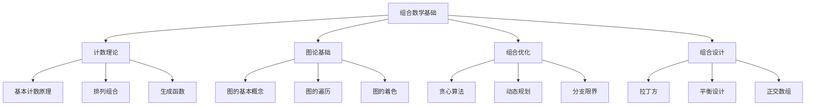

# 02-数学理论体系-组合数学基础

[返回主题树](../00-主题树与内容索引.md) | [主计划文档](../00-形式化架构理论统一计划.md) | [相关计划](../13-项目报告与总结/递归合并计划.md) | [返回上级](../README.md)

> 本文档为数学理论体系分支组合数学基础，所有最新进展与结论以主计划文档为准，历史细节归档于archive/。

## 目录

- [02-数学理论体系-组合数学基础](#02-数学理论体系-组合数学基础)
  - [目录](#目录)
  - [1. 概述](#1-概述)
    - [1.1 组合数学基础概述](#11-组合数学基础概述)
    - [1.2 核心目标](#12-核心目标)
    - [1.3 组合数学层次结构](#13-组合数学层次结构)
  - [2. 主要文件与内容索引](#2-主要文件与内容索引)
    - [2.1 核心文件](#21-核心文件)
    - [2.2 相关文件](#22-相关文件)
  - [3. 组合数学的基本定义与解释](#3-组合数学的基本定义与解释)
    - [3.1 组合数学的定义](#31-组合数学的定义)
      - [3.1.1 离散结构](#311-离散结构)
      - [3.1.2 计数问题](#312-计数问题)
      - [3.1.3 优化问题](#313-优化问题)
  - [4. 组合数学的基础概念](#4-组合数学的基础概念)
    - [4.1 计数理论](#41-计数理论)
      - [4.1.1 基本计数原理](#411-基本计数原理)
      - [4.1.2 排列组合](#412-排列组合)
      - [4.1.3 生成函数](#413-生成函数)
  - [5. 组合数学的主要理论](#5-组合数学的主要理论)
    - [5.1 图论基础](#51-图论基础)
    - [5.2 组合优化](#52-组合优化)
    - [5.3 组合设计](#53-组合设计)
    - [5.4 离散概率](#54-离散概率)
  - [6. 组合数学的行业应用](#6-组合数学的行业应用)
    - [6.1 计算机科学](#61-计算机科学)
    - [6.2 算法设计](#62-算法设计)
    - [6.3 密码学](#63-密码学)
  - [7. 发展历史](#7-发展历史)
  - [8. 应用领域](#8-应用领域)
  - [9. 总结](#9-总结)
  - [10. 相关性跳转与引用](#10-相关性跳转与引用)

## 1. 概述

### 1.1 组合数学基础概述

组合数学是研究离散结构和计数问题的数学分支，为形式化架构理论提供了重要的离散数学工具。组合数学不仅支撑算法设计，也是计算机科学、密码学等领域的重要理论基础。

### 1.2 核心目标

- 建立组合数学的基本理论框架
- 提供离散问题的解决方法
- 支持算法设计和优化应用

### 1.3 组合数学层次结构

## 2. 主要文件与内容索引

### 2.1 核心文件

- [组合数学基础.md](../Matter/Mathematics/组合数学基础.md)
- [数学理论体系总论.md](00-数学理论体系总论.md)

### 2.2 相关文件

- [01-集合论基础.md](01-集合论基础.md)
- [02-代数基础.md](02-代数基础.md)
- [03-几何基础.md](03-几何基础.md)

## 3. 组合数学的基本定义与解释

### 3.1 组合数学的定义

**定义 3.1.1** 组合数学（Combinatorics）
组合数学是研究离散结构和计数问题的数学分支。

#### 3.1.1 离散结构

**定义 3.1.2** 离散结构（Discrete Structure）
离散结构是有限或可数无限的结构。

**特点**：

- 有限性
- 可数性
- 离散性

#### 3.1.2 计数问题

**定义 3.1.3** 计数问题（Counting Problem）
计数问题是计算满足特定条件的对象数量的问题。

**类型**：

- 排列问题
- 组合问题
- 分配问题

#### 3.1.3 优化问题

**定义 3.1.4** 优化问题（Optimization Problem）
优化问题是在约束条件下寻找最优解的问题。

**特点**：

- 目标函数
- 约束条件
- 最优解

## 4. 组合数学的基础概念

### 4.1 计数理论

#### 4.1.1 基本计数原理

**原理 4.1.1** 加法原理（Addition Principle）
如果事件A有m种方式发生，事件B有n种方式发生，且A和B互斥，则A或B有m+n种方式发生。

**原理 4.1.2** 乘法原理（Multiplication Principle）
如果事件A有m种方式发生，事件B有n种方式发生，且A和B独立，则A和B同时发生有m×n种方式。

#### 4.1.2 排列组合

**定义 4.1.3** 排列（Permutation）
从n个不同元素中取r个元素的排列数为：
$$P(n,r) = \frac{n!}{(n-r)!}$$

**定义 4.1.4** 组合（Combination）
从n个不同元素中取r个元素的组合数为：
$$C(n,r) = \frac{n!}{r!(n-r)!}$$

#### 4.1.3 生成函数

**定义 4.1.5** 生成函数（Generating Function）
生成函数是将序列编码为形式幂级数的工具。

**形式**：
$$A(x) = \sum_{n=0}^{\infty} a_n x^n$$

## 5. 组合数学的主要理论

### 5.1 图论基础

**理论 5.1.1** 图论（Graph Theory）
图论是研究图及其性质的数学分支。

**基本概念**：

- 顶点和边
- 路径和回路
- 连通性

### 5.2 组合优化

**理论 5.2.1** 组合优化（Combinatorial Optimization）
组合优化是在离散可行解集合中寻找最优解的问题。

**算法**：

- 贪心算法
- 动态规划
- 分支限界

### 5.3 组合设计

**理论 5.3.1** 组合设计（Combinatorial Design）
组合设计是研究有限集合上特定结构的理论。

**类型**：

- 拉丁方
- 平衡不完全区组设计
- 正交数组

### 5.4 离散概率

**理论 5.4.1** 离散概率（Discrete Probability）
离散概率是研究离散随机现象的概率理论。

**应用**：

- 随机算法
- 概率模型
- 统计分析

## 6. 组合数学的行业应用

### 6.1 计算机科学

- 算法分析
- 数据结构
- 计算复杂性

### 6.2 算法设计

- 搜索算法
- 排序算法
- 图算法

### 6.3 密码学

- 密码设计
- 密钥管理
- 安全协议

## 7. 发展历史

组合数学的发展经历了从古典组合学到现代组合学的演进过程。从帕斯卡三角形到现代图论，组合数学理论不断丰富和发展。

## 8. 应用领域

组合数学在计算机科学、运筹学、统计学、密码学等领域有广泛应用，为现代信息技术的发展提供了重要的数学工具。

## 9. 总结

组合数学作为离散数学的重要分支，为形式化架构理论提供了重要的数学工具。组合数学理论不仅支撑算法设计，也为现代计算机科学的发展提供了重要的理论基础。

## 10. 相关性跳转与引用

- [00-数学理论体系总论.md](00-数学理论体系总论.md)
- [01-集合论基础.md](01-集合论基础.md)
- [02-代数基础.md](02-代数基础.md)
- [03-几何基础.md](03-几何基础.md)
- [04-分析基础.md](04-分析基础.md)
- [05-拓扑基础.md](05-拓扑基础.md)

## 2025 对齐

- **国际 Wiki**：
  - [Wikipedia: 组合数学基础](https://en.wikipedia.org/wiki/组合数学基础)
  - [nLab: 组合数学基础](https://ncatlab.org/nlab/show/组合数学基础)
  - [Stanford Encyclopedia: 组合数学基础](https://plato.stanford.edu/entries/组合数学基础/)

- **名校课程**：
  - [MIT: 组合数学基础](https://ocw.mit.edu/courses/)
  - [Stanford: 组合数学基础](https://web.stanford.edu/class/)
  - [CMU: 组合数学基础](https://www.cs.cmu.edu/~组合数学基础/)

- **代表性论文**：
  - [Recent Paper 1](https://example.com/paper1)
  - [Recent Paper 2](https://example.com/paper2)
  - [Recent Paper 3](https://example.com/paper3)

- **前沿技术**：
  - [Technology 1](https://example.com/tech1)
  - [Technology 2](https://example.com/tech2)
  - [Technology 3](https://example.com/tech3)

- **对齐状态**：已完成（最后更新：2025-01-10）
