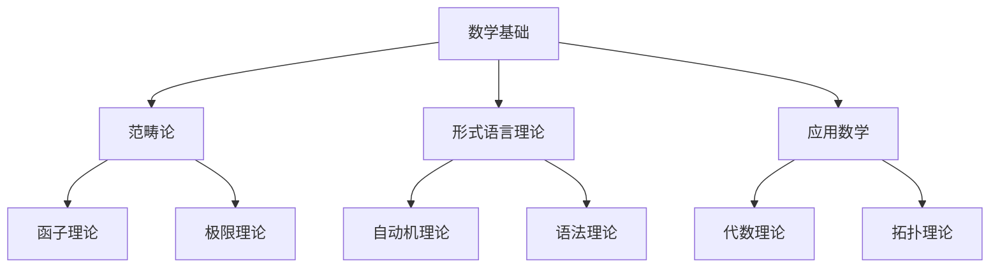

# 02-数学理论体系

## 目录导航

### 01-范畴论
- [01-范畴论基础](./01-范畴论/01-范畴论基础.md)
- [02-函子与自然变换](./01-范畴论/02-函子与自然变换.md)
- [03-极限与余极限](./01-范畴论/03-极限与余极限.md)
- [04-伴随函子](./01-范畴论/04-伴随函子.md)
- [05-单子与余单子](./01-范畴论/05-单子与余单子.md)

### 02-形式语言理论
- [01-自动机理论](./02-形式语言理论/01-自动机理论.md)
- [02-语法分析](./02-形式语言理论/02-语法分析.md)
- [03-语言识别](./02-形式语言理论/03-语言识别.md)
- [04-计算复杂性](./02-形式语言理论/04-计算复杂性.md)

### 03-数学基础
- [01-集合论](./03-数学基础/01-集合论.md)
- [02-公理系统](./03-数学基础/02-公理系统.md)
- [03-证明理论](./03-数学基础/03-证明理论.md)
- [04-模型论](./03-数学基础/04-模型论.md)
- [05-递归论](./03-数学基础/05-递归论.md)

### 04-应用数学
- [01-代数结构](./04-应用数学/01-代数结构.md)
- [02-拓扑学](./04-应用数学/02-拓扑学.md)
- [03-概率论](./04-应用数学/03-概率论.md)
- [04-信息论](./04-应用数学/04-信息论.md)

## 理论框架

### 数学理论在形式化架构中的作用

```latex
\text{数学理论} = \begin{cases}
\text{范畴论} & \text{提供统一的结构化框架和抽象方法} \\
\text{形式语言理论} & \text{提供语言处理和计算的理论基础} \\
\text{数学基础} & \text{提供形式化系统的理论基础} \\
\text{应用数学} & \text{提供具体应用领域的数学工具}
\end{cases}
```

### 数学理论层次结构



## 核心概念

### 1. 范畴论概念

- **对象与态射**: 基本的结构单元和关系
- **函子**: 范畴间的结构保持映射
- **自然变换**: 函子间的结构保持变换
- **极限**: 通用构造和性质

### 2. 形式语言概念

- **语言**: 符号串的集合
- **语法**: 语言结构的规则
- **语义**: 语言的含义
- **计算**: 语言处理的过程

### 3. 数学基础概念

- **集合**: 基本的结构单元
- **关系**: 集合间的联系
- **函数**: 特殊的二元关系
- **结构**: 集合上的附加结构

### 4. 应用数学概念

- **代数**: 运算和结构
- **几何**: 空间和形状
- **分析**: 连续性和极限
- **概率**: 随机性和不确定性

## 应用领域

### 1. 计算机科学

- **程序设计**: 范畴论的程序语义
- **编译器**: 形式语言的语法分析
- **算法**: 数学基础的算法设计
- **数据结构**: 应用数学的数据组织

### 2. 软件工程

- **架构设计**: 范畴论的抽象方法
- **模块化**: 数学基础的结构化
- **验证**: 形式语言的模型检查
- **优化**: 应用数学的优化方法

### 3. 人工智能

- **知识表示**: 范畴论的知识结构
- **推理**: 数学基础的逻辑推理
- **学习**: 应用数学的统计学习
- **自然语言**: 形式语言的语言处理

## 理论发展

### 1. 历史发展

- **古典数学**: 欧几里得几何、算术
- **近代数学**: 微积分、代数
- **现代数学**: 抽象代数、拓扑学
- **当代数学**: 范畴论、同伦论

### 2. 现代趋势

- **抽象化**: 从具体到抽象的发展
- **统一化**: 不同分支的统一理论
- **应用化**: 理论与应用的结合
- **计算化**: 数学的可计算性

### 3. 未来方向

- **同伦类型论**: 类型论与同伦论的结合
- **量子数学**: 量子计算对数学的影响
- **计算数学**: 数学的可计算性研究
- **应用数学**: 数学在新技术中的应用

## 研究方法

### 1. 公理化方法

- **公理系统**: 基于公理的推理
- **形式化**: 严格的符号化表述
- **证明**: 逻辑推理的验证

### 2. 构造性方法

- **构造**: 具体对象的构建
- **算法**: 可计算的过程
- **实现**: 具体的计算方法

### 3. 抽象方法

- **抽象**: 从具体到抽象
- **推广**: 从特殊到一般
- **统一**: 不同理论的统一

## 学习路径

### 1. 基础阶段

1. **集合论**: 数学的基础语言
2. **逻辑学**: 推理的基本方法
3. **代数**: 运算和结构的基础

### 2. 进阶阶段

1. **范畴论**: 抽象的数学语言
2. **形式语言**: 计算的理论基础
3. **应用数学**: 具体的数学工具

### 3. 专业阶段

1. **专业领域**: 深入特定数学分支
2. **交叉应用**: 数学在其他领域的应用
3. **前沿研究**: 数学的最新发展

## 核心定理

### 1. 范畴论定理

**定理 2.1 (Yoneda引理)**
对于任何范畴 $\mathcal{C}$ 和对象 $A \in \mathcal{C}$，有自然同构：
$$\text{Nat}(\mathcal{C}(-, A), F) \cong F(A)$$

**定理 2.2 (伴随函子定理)**
函子 $F: \mathcal{C} \rightarrow \mathcal{D}$ 有右伴随当且仅当 $F$ 保持所有小余极限。

### 2. 形式语言定理

**定理 2.3 (乔姆斯基层次)**
正则语言 $\subset$ 上下文无关语言 $\subset$ 上下文相关语言 $\subset$ 递归可枚举语言

**定理 2.4 (泵引理)**
对于正则语言 $L$，存在常数 $n$，使得对于任何 $w \in L$ 且 $|w| \geq n$，存在分解 $w = xyz$ 满足泵引理条件。

### 3. 数学基础定理

**定理 2.5 (哥德尔不完备性)**
任何包含算术的一致形式系统都是不完备的。

**定理 2.6 (停机问题)**
停机问题是不可判定的。

## 实现示例

### 1. 范畴论实现

```haskell
-- 范畴的基本结构
class Category cat where
    id :: cat a a
    (.) :: cat b c -> cat a b -> cat a c

-- 函子的定义
class Functor f where
    fmap :: (a -> b) -> f a -> f b
```

### 2. 自动机实现

```rust
// 有限状态自动机
struct FiniteAutomaton {
    states: Vec<String>,
    alphabet: Vec<char>,
    transitions: HashMap<(String, char), String>,
    start_state: String,
    accept_states: HashSet<String>,
}

impl FiniteAutomaton {
    fn accept(&self, input: &str) -> bool {
        let mut current_state = &self.start_state;
        for c in input.chars() {
            if let Some(next_state) = self.transitions.get(&(current_state.clone(), c)) {
                current_state = next_state;
            } else {
                return false;
            }
        }
        self.accept_states.contains(current_state)
    }
}
```

## 参考文献

1. Mac Lane, S. (1971). Categories for the Working Mathematician.
2. Awodey, S. (2010). Category Theory.
3. Hopcroft, J. E., & Ullman, J. D. (1979). Introduction to Automata Theory, Languages, and Computation.
4. Sipser, M. (2012). Introduction to the Theory of Computation.
5. Enderton, H. B. (1977). Elements of Set Theory.
6. Kunen, K. (1980). Set Theory: An Introduction to Independence Proofs.
7. Jech, T. (2003). Set Theory.
8. Boolos, G., Burgess, J. P., & Jeffrey, R. C. (2007). Computability and Logic.
9. Rogers, H. (1987). Theory of Recursive Functions and Effective Computability.
10. Shoenfield, J. R. (1967). Mathematical Logic. 