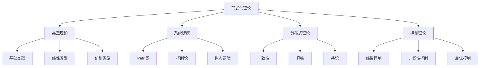

# 03-形式化理论基础

## 目录导航

### 01-类型理论
- [01-基础类型理论](./01-类型理论/01-基础类型理论.md)
- [02-线性类型理论](./01-类型理论/02-线性类型理论.md)
- [03-仿射类型理论](./01-类型理论/03-仿射类型理论.md)
- [04-时态类型理论](./01-类型理论/04-时态类型理论.md)
- [05-依赖类型理论](./01-类型理论/05-依赖类型理论.md)

### 02-系统建模
- [01-Petri网理论](./02-系统建模/01-Petri网理论.md)
- [02-控制论](./02-系统建模/02-控制论.md)
- [03-时态逻辑控制](./02-系统建模/03-时态逻辑控制.md)
- [04-状态机理论](./02-系统建模/04-状态机理论.md)

### 03-分布式理论
- [01-一致性协议](./03-分布式理论/01-一致性协议.md)
- [02-容错机制](./03-分布式理论/02-容错机制.md)
- [03-共识算法](./03-分布式理论/03-共识算法.md)
- [04-分布式算法](./03-分布式理论/04-分布式算法.md)

### 04-控制理论
- [01-线性控制理论](./04-控制理论/01-线性控制理论.md)
- [02-非线性控制理论](./04-控制理论/02-非线性控制理论.md)
- [03-最优控制理论](./04-控制理论/03-最优控制理论.md)
- [04-自适应控制理论](./04-控制理论/04-自适应控制理论.md)

## 理论框架

### 形式化理论在软件架构中的作用

```latex
\text{形式化理论} = \begin{cases}
\text{类型理论} & \text{提供程序正确性的形式化保证} \\
\text{系统建模} & \text{提供系统行为的形式化描述} \\
\text{分布式理论} & \text{提供分布式系统的理论基础} \\
\text{控制理论} & \text{提供系统控制的理论方法}
\end{cases}
```

### 形式化理论层次结构



## 核心概念

### 1. 类型理论概念

- **类型安全**: 程序在编译时捕获错误
- **类型推断**: 自动推导表达式的类型
- **类型抽象**: 通过类型实现抽象
- **类型系统**: 类型规则的集合

### 2. 系统建模概念

- **状态**: 系统在某一时刻的配置
- **转换**: 状态间的变化关系
- **行为**: 系统对外部刺激的响应
- **性质**: 系统应满足的条件

### 3. 分布式概念

- **一致性**: 多个副本间的数据一致性
- **容错**: 系统在故障下的可靠性
- **共识**: 多个节点达成一致
- **同步**: 节点间的协调机制

### 4. 控制概念

- **稳定性**: 系统在扰动下的稳定性
- **可控性**: 系统状态的可控程度
- **可观性**: 系统状态的可观测程度
- **最优性**: 控制性能的最优化

## 应用领域

### 1. 编程语言设计

- **类型系统**: 设计安全的类型系统
- **编译器**: 实现类型检查和推断
- **运行时**: 实现类型安全的运行时
- **工具链**: 开发类型相关的工具

### 2. 软件工程

- **程序验证**: 验证程序的正确性
- **模型检查**: 检查系统模型的性质
- **形式化测试**: 基于形式化方法的测试
- **代码生成**: 从形式化规范生成代码

### 3. 系统设计

- **架构设计**: 设计系统架构
- **协议设计**: 设计通信协议
- **算法设计**: 设计分布式算法
- **控制设计**: 设计控制系统

## 理论发展

### 1. 历史发展

- **早期形式化**: 图灵机、λ演算
- **类型理论**: 从简单类型到依赖类型
- **系统理论**: 从简单系统到复杂系统
- **分布式理论**: 从集中式到分布式

### 2. 现代趋势

- **类型系统**: 更丰富的类型系统
- **形式化方法**: 更实用的形式化方法
- **自动化**: 更多的自动化工具
- **集成**: 不同理论的集成

### 3. 未来方向

- **量子计算**: 量子计算的形式化
- **人工智能**: AI系统的形式化
- **物联网**: 物联网系统的形式化
- **区块链**: 区块链系统的形式化

## 研究方法

### 1. 公理化方法

- **公理系统**: 基于公理的推理
- **形式化**: 严格的符号化表述
- **证明**: 逻辑推理的验证

### 2. 构造性方法

- **构造**: 具体对象的构建
- **算法**: 可计算的过程
- **实现**: 具体的计算方法

### 3. 验证方法

- **模型检查**: 自动验证系统性质
- **定理证明**: 人工证明系统性质
- **测试**: 基于测试的验证

## 学习路径

### 1. 基础阶段

1. **逻辑学**: 形式逻辑的基础
2. **集合论**: 数学的基础语言
3. **自动机**: 计算的基本模型

### 2. 进阶阶段

1. **类型理论**: 程序的形式化
2. **系统理论**: 系统的形式化
3. **分布式理论**: 分布式的形式化

### 3. 专业阶段

1. **专业领域**: 深入特定理论
2. **应用研究**: 理论在实际中的应用
3. **前沿研究**: 理论的最新发展

## 核心定理

### 1. 类型理论定理

**定理 3.1 (类型保持性)**
如果 $\Gamma \vdash e : \tau$ 且 $e \rightarrow e'$，则 $\Gamma \vdash e' : \tau$。

**定理 3.2 (进展性)**
如果 $\emptyset \vdash e : \tau$，则 $e$ 是值或存在 $e'$ 使得 $e \rightarrow e'$。

**定理 3.3 (强正规化)**
在强类型系统中，所有良类型的项都是强正规化的。

### 2. 系统建模定理

**定理 3.4 (Petri网可达性)**
Petri网的可达性问题在一般情况下是不可判定的。

**定理 3.5 (控制论稳定性)**
线性系统稳定的充分必要条件是所有特征值的实部都小于零。

**定理 3.6 (时态逻辑模型检查)**
CTL模型检查的时间复杂度是多项式时间。

### 3. 分布式理论定理

**定理 3.7 (FLP不可能性)**
在异步分布式系统中，即使只有一个进程可能崩溃，也不可能实现共识。

**定理 3.8 (CAP定理)**
在分布式系统中，一致性(Consistency)、可用性(Availability)和分区容错性(Partition tolerance)最多只能同时满足两个。

**定理 3.9 (Paxos正确性)**
Paxos算法在异步分布式系统中能够保证一致性。

## 实现示例

### 1. 类型系统实现

```rust
// 简单的类型系统
#[derive(Debug, Clone, PartialEq)]
enum Type {
    Int,
    Bool,
    Function(Box<Type>, Box<Type>),
    Variable(String),
}

#[derive(Debug, Clone)]
enum Expr {
    Var(String),
    Int(i32),
    Bool(bool),
    Lambda(String, Box<Expr>),
    App(Box<Expr>, Box<Expr>),
}

struct TypeChecker {
    context: HashMap<String, Type>,
}

impl TypeChecker {
    fn type_check(&mut self, expr: &Expr) -> Result<Type, String> {
        match expr {
            Expr::Var(name) => {
                self.context.get(name)
                    .cloned()
                    .ok_or_else(|| format!("Unbound variable: {}", name))
            }
            Expr::Int(_) => Ok(Type::Int),
            Expr::Bool(_) => Ok(Type::Bool),
            Expr::Lambda(param, body) => {
                // 简化的实现
                Ok(Type::Function(Box::new(Type::Int), Box::new(Type::Int)))
            }
            Expr::App(func, arg) => {
                let func_type = self.type_check(func)?;
                let arg_type = self.type_check(arg)?;
                match func_type {
                    Type::Function(input, output) => {
                        if *input == arg_type {
                            Ok(*output)
                        } else {
                            Err("Type mismatch".to_string())
                        }
                    }
                    _ => Err("Not a function".to_string()),
                }
            }
        }
    }
}
```

### 2. Petri网实现

```go
// Petri网的基本结构
type Place struct {
    ID       string
    Tokens   int
    Capacity int
}

type Transition struct {
    ID           string
    InputPlaces  map[string]int
    OutputPlaces map[string]int
}

type PetriNet struct {
    Places      map[string]*Place
    Transitions map[string]*Transition
}

func (pn *PetriNet) IsEnabled(t *Transition) bool {
    for placeID, required := range t.InputPlaces {
        if place, exists := pn.Places[placeID]; !exists || place.Tokens < required {
            return false
        }
    }
    return true
}

func (pn *PetriNet) Fire(t *Transition) bool {
    if !pn.IsEnabled(t) {
        return false
    }
    
    // 消耗输入托肯
    for placeID, required := range t.InputPlaces {
        pn.Places[placeID].Tokens -= required
    }
    
    // 产生输出托肯
    for placeID, produced := range t.OutputPlaces {
        pn.Places[placeID].Tokens += produced
    }
    
    return true
}
```

### 3. 分布式共识实现

```rust
// 简化的Paxos实现
use std::collections::HashMap;
use std::sync::{Arc, Mutex};

#[derive(Debug, Clone)]
struct Proposal {
    id: u64,
    value: String,
}

#[derive(Debug)]
struct PaxosNode {
    id: u64,
    proposals: Arc<Mutex<HashMap<u64, Proposal>>>,
    accepted: Arc<Mutex<HashMap<u64, Proposal>>>,
}

impl PaxosNode {
    fn propose(&self, value: String) -> Result<(), String> {
        let proposal_id = self.generate_proposal_id();
        let proposal = Proposal {
            id: proposal_id,
            value,
        };
        
        // Phase 1: Prepare
        let prepare_ok = self.prepare_phase(proposal_id)?;
        
        if prepare_ok {
            // Phase 2: Accept
            self.accept_phase(&proposal)?;
        }
        
        Ok(())
    }
    
    fn prepare_phase(&self, proposal_id: u64) -> Result<bool, String> {
        // 简化的实现
        Ok(true)
    }
    
    fn accept_phase(&self, proposal: &Proposal) -> Result<(), String> {
        let mut accepted = self.accepted.lock().unwrap();
        accepted.insert(proposal.id, proposal.clone());
        Ok(())
    }
    
    fn generate_proposal_id(&self) -> u64 {
        // 简化的实现
        std::time::SystemTime::now()
            .duration_since(std::time::UNIX_EPOCH)
            .unwrap()
            .as_nanos() as u64
    }
}
```

## 参考文献

1. Pierce, B. C. (2002). Types and Programming Languages.
2. Girard, J. Y. (1987). Linear logic. Theoretical computer science, 50(1), 1-101.
3. Reynolds, J. C. (1983). Types, abstraction and parametric polymorphism.
4. Martin-Löf, P. (1984). Intuitionistic type theory.
5. Petri, C. A. (1962). Kommunikation mit Automaten.
6. Murata, T. (1989). Petri nets: Properties, analysis and applications.
7. Lamport, L. (1998). The part-time parliament.
8. Fischer, M. J., Lynch, N. A., & Paterson, M. S. (1985). Impossibility of distributed consensus with one faulty process.
9. Brewer, E. A. (2000). Towards robust distributed systems.
10. Kalman, R. E. (1960). A new approach to linear filtering and prediction problems. 