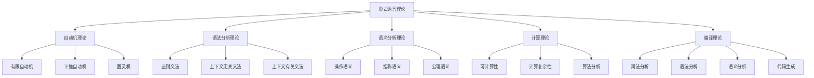

# 形式语言理论总论

## 概述

形式语言理论是计算机科学和软件工程的基础理论，为编程语言设计、编译器构建、语法分析和语义处理提供严格的数学基础。本文档系统性地阐述形式语言理论的核心概念、形式化表示和在软件架构中的应用。

## 1. 理论框架

### 1.1 形式语言理论体系



### 1.2 核心概念

#### 自动机概念

- **有限自动机**: 识别正则语言的自动机
- **下推自动机**: 识别上下文无关语言的自动机
- **图灵机**: 通用计算模型
- **状态转换**: 自动机的状态转移机制

#### 文法概念

- **正则文法**: 生成正则语言的文法
- **上下文无关文法**: 生成上下文无关语言的文法
- **上下文有关文法**: 生成上下文有关语言的文法
- **产生式规则**: 文法的重写规则

#### 语义概念

- **操作语义**: 通过操作步骤定义语义
- **指称语义**: 通过数学对象定义语义
- **公理语义**: 通过公理系统定义语义
- **类型语义**: 通过类型系统定义语义

## 2. 形式化表示

### 2.1 自动机理论形式化

```rust
// 有限自动机
#[derive(Debug, Clone)]
pub struct FiniteAutomaton {
    states: HashSet<String>,
    alphabet: HashSet<char>,
    transitions: HashMap<(String, char), HashSet<String>>,
    initial_state: String,
    accepting_states: HashSet<String>,
}

impl FiniteAutomaton {
    pub fn new(
        states: HashSet<String>,
        alphabet: HashSet<char>,
        initial_state: String,
        accepting_states: HashSet<String>,
    ) -> Self {
        Self {
            states,
            alphabet,
            transitions: HashMap::new(),
            initial_state,
            accepting_states,
        }
    }
    
    pub fn add_transition(&mut self, from: String, symbol: char, to: String) {
        let key = (from, symbol);
        self.transitions.entry(key).or_insert_with(HashSet::new).insert(to);
    }
    
    pub fn accepts(&self, input: &str) -> bool {
        let mut current_states = HashSet::new();
        current_states.insert(self.initial_state.clone());
        
        for symbol in input.chars() {
            let mut next_states = HashSet::new();
            for state in &current_states {
                if let Some(transitions) = self.transitions.get(&(state.clone(), symbol)) {
                    for next_state in transitions {
                        next_states.insert(next_state.clone());
                    }
                }
            }
            current_states = next_states;
        }
        
        current_states.iter().any(|state| self.accepting_states.contains(state))
    }
    
    pub fn is_deterministic(&self) -> bool {
        for ((_, _), targets) in &self.transitions {
            if targets.len() > 1 {
                return false;
            }
        }
        true
    }
    
    pub fn minimize(&self) -> FiniteAutomaton {
        // Hopcroft算法实现最小化
        let mut partitions = vec![
            self.accepting_states.clone(),
            self.states.difference(&self.accepting_states).cloned().collect(),
        ];
        
        loop {
            let mut new_partitions = Vec::new();
            for partition in &partitions {
                if partition.len() <= 1 {
                    new_partitions.push(partition.clone());
                    continue;
                }
                
                let mut refined = self.refine_partition(partition, &partitions);
                new_partitions.append(&mut refined);
            }
            
            if new_partitions.len() == partitions.len() {
                break;
            }
            partitions = new_partitions;
        }
        
        self.build_minimized_automaton(&partitions)
    }
    
    fn refine_partition(&self, partition: &HashSet<String>, partitions: &[HashSet<String>]) -> Vec<HashSet<String>> {
        let mut refined = Vec::new();
        let mut groups = HashMap::new();
        
        for state in partition {
            let mut signature = Vec::new();
            for symbol in &self.alphabet {
                let mut target_partition = 0;
                if let Some(transitions) = self.transitions.get(&(state.clone(), *symbol)) {
                    for target in transitions {
                        for (i, partition) in partitions.iter().enumerate() {
                            if partition.contains(target) {
                                target_partition = i;
                                break;
                            }
                        }
                    }
                }
                signature.push(target_partition);
            }
            groups.entry(signature).or_insert_with(Vec::new).push(state.clone());
        }
        
        for group in groups.values() {
            refined.push(group.iter().cloned().collect());
        }
        
        refined
    }
    
    fn build_minimized_automaton(&self, partitions: &[HashSet<String>]) -> FiniteAutomaton {
        let mut minimized = FiniteAutomaton::new(
            (0..partitions.len()).map(|i| i.to_string()).collect(),
            self.alphabet.clone(),
            self.find_partition_index(&self.initial_state, partitions).to_string(),
            HashSet::new(),
        );
        
        // 设置接受状态
        for (i, partition) in partitions.iter().enumerate() {
            if partition.iter().any(|state| self.accepting_states.contains(state)) {
                minimized.accepting_states.insert(i.to_string());
            }
        }
        
        // 设置转移
        for (i, partition) in partitions.iter().enumerate() {
            for state in partition {
                for symbol in &self.alphabet {
                    if let Some(transitions) = self.transitions.get(&(state.clone(), *symbol)) {
                        for target in transitions {
                            let target_partition = self.find_partition_index(target, partitions);
                            minimized.add_transition(i.to_string(), *symbol, target_partition.to_string());
                        }
                    }
                }
            }
        }
        
        minimized
    }
    
    fn find_partition_index(&self, state: &str, partitions: &[HashSet<String>]) -> usize {
        for (i, partition) in partitions.iter().enumerate() {
            if partition.contains(state) {
                return i;
            }
        }
        0
    }
}

// 下推自动机
#[derive(Debug, Clone)]
pub struct PushdownAutomaton {
    states: HashSet<String>,
    input_alphabet: HashSet<char>,
    stack_alphabet: HashSet<char>,
    transitions: Vec<PDATransition>,
    initial_state: String,
    initial_stack_symbol: char,
    accepting_states: HashSet<String>,
}

#[derive(Debug, Clone)]
pub struct PDATransition {
    from_state: String,
    input_symbol: Option<char>,
    stack_top: char,
    to_state: String,
    stack_push: Vec<char>,
}

impl PushdownAutomaton {
    pub fn new(
        states: HashSet<String>,
        input_alphabet: HashSet<char>,
        stack_alphabet: HashSet<char>,
        initial_state: String,
        initial_stack_symbol: char,
        accepting_states: HashSet<String>,
    ) -> Self {
        Self {
            states,
            input_alphabet,
            stack_alphabet,
            transitions: Vec::new(),
            initial_state,
            initial_stack_symbol,
            accepting_states,
        }
    }
    
    pub fn add_transition(
        &mut self,
        from_state: String,
        input_symbol: Option<char>,
        stack_top: char,
        to_state: String,
        stack_push: Vec<char>,
    ) {
        self.transitions.push(PDATransition {
            from_state,
            input_symbol,
            stack_top,
            to_state,
            stack_push,
        });
    }
    
    pub fn accepts(&self, input: &str) -> bool {
        let mut configurations = vec![PDAConfiguration {
            state: self.initial_state.clone(),
            input_remaining: input.chars().collect(),
            stack: vec![self.initial_stack_symbol],
        }];
        
        while !configurations.is_empty() {
            let mut next_configurations = Vec::new();
            
            for config in configurations {
                if config.input_remaining.is_empty() && self.accepting_states.contains(&config.state) {
                    return true;
                }
                
                for transition in &self.transitions {
                    if transition.from_state == config.state
                        && config.stack.last() == Some(&transition.stack_top)
                        && (transition.input_symbol.is_none()
                            || config.input_remaining.first() == transition.input_symbol.as_ref())
                    {
                        let mut new_stack = config.stack.clone();
                        new_stack.pop(); // 移除栈顶
                        for symbol in transition.stack_push.iter().rev() {
                            new_stack.push(*symbol);
                        }
                        
                        let mut new_input = config.input_remaining.clone();
                        if transition.input_symbol.is_some() {
                            new_input.remove(0);
                        }
                        
                        next_configurations.push(PDAConfiguration {
                            state: transition.to_state.clone(),
                            input_remaining: new_input,
                            stack: new_stack,
                        });
                    }
                }
            }
            
            configurations = next_configurations;
        }
        
        false
    }
}

#[derive(Debug, Clone)]
pub struct PDAConfiguration {
    state: String,
    input_remaining: Vec<char>,
    stack: Vec<char>,
}

// 图灵机
#[derive(Debug, Clone)]
pub struct TuringMachine {
    states: HashSet<String>,
    input_alphabet: HashSet<char>,
    tape_alphabet: HashSet<char>,
    transitions: HashMap<(String, char), TuringTransition>,
    initial_state: String,
    blank_symbol: char,
    accepting_states: HashSet<String>,
    rejecting_states: HashSet<String>,
}

#[derive(Debug, Clone)]
pub struct TuringTransition {
    to_state: String,
    write_symbol: char,
    move_direction: MoveDirection,
}

#[derive(Debug, Clone)]
pub enum MoveDirection {
    Left,
    Right,
    Stay,
}

impl TuringMachine {
    pub fn new(
        states: HashSet<String>,
        input_alphabet: HashSet<char>,
        tape_alphabet: HashSet<char>,
        initial_state: String,
        blank_symbol: char,
        accepting_states: HashSet<String>,
        rejecting_states: HashSet<String>,
    ) -> Self {
        Self {
            states,
            input_alphabet,
            tape_alphabet,
            transitions: HashMap::new(),
            initial_state,
            blank_symbol,
            accepting_states,
            rejecting_states,
        }
    }
    
    pub fn add_transition(
        &mut self,
        from_state: String,
        read_symbol: char,
        to_state: String,
        write_symbol: char,
        move_direction: MoveDirection,
    ) {
        self.transitions.insert(
            (from_state, read_symbol),
            TuringTransition {
                to_state,
                write_symbol,
                move_direction,
            },
        );
    }
    
    pub fn run(&self, input: &str) -> TuringResult {
        let mut tape = input.chars().collect::<Vec<char>>();
        let mut head_position = 0;
        let mut current_state = self.initial_state.clone();
        let mut step_count = 0;
        let max_steps = 10000; // 防止无限循环
        
        while step_count < max_steps {
            if self.accepting_states.contains(&current_state) {
                return TuringResult::Accept(tape);
            }
            
            if self.rejecting_states.contains(&current_state) {
                return TuringResult::Reject(tape);
            }
            
            // 扩展磁带如果需要
            while head_position >= tape.len() {
                tape.push(self.blank_symbol);
            }
            while head_position < 0 {
                tape.insert(0, self.blank_symbol);
                head_position += 1;
            }
            
            let current_symbol = tape[head_position];
            let key = (current_state.clone(), current_symbol);
            
            if let Some(transition) = self.transitions.get(&key) {
                tape[head_position] = transition.write_symbol;
                current_state = transition.to_state.clone();
                
                match transition.move_direction {
                    MoveDirection::Left => head_position -= 1,
                    MoveDirection::Right => head_position += 1,
                    MoveDirection::Stay => {}
                }
            } else {
                return TuringResult::Reject(tape);
            }
            
            step_count += 1;
        }
        
        TuringResult::Timeout(tape)
    }
}

#[derive(Debug, Clone)]
pub enum TuringResult {
    Accept(Vec<char>),
    Reject(Vec<char>),
    Timeout(Vec<char>),
}
```

### 2.2 语法分析理论形式化

```rust
// 上下文无关文法
#[derive(Debug, Clone)]
pub struct ContextFreeGrammar {
    variables: HashSet<String>,
    terminals: HashSet<String>,
    productions: Vec<Production>,
    start_symbol: String,
}

#[derive(Debug, Clone)]
pub struct Production {
    left_hand_side: String,
    right_hand_side: Vec<String>,
}

impl ContextFreeGrammar {
    pub fn new(
        variables: HashSet<String>,
        terminals: HashSet<String>,
        start_symbol: String,
    ) -> Self {
        Self {
            variables,
            terminals,
            productions: Vec::new(),
            start_symbol,
        }
    }
    
    pub fn add_production(&mut self, lhs: String, rhs: Vec<String>) {
        self.productions.push(Production {
            left_hand_side: lhs,
            right_hand_side: rhs,
        });
    }
    
    pub fn derive(&self, input: &[String]) -> bool {
        let mut current = vec![self.start_symbol.clone()];
        
        while current != input {
            let mut changed = false;
            
            for i in 0..current.len() {
                for production in &self.productions {
                    if current[i] == production.left_hand_side {
                        let mut new_current = current.clone();
                        new_current.splice(i..i + 1, production.right_hand_side.clone());
                        
                        if new_current.len() <= input.len() {
                            let prefix_match = new_current.iter()
                                .zip(input.iter())
                                .all(|(a, b)| a == b);
                            
                            if prefix_match {
                                current = new_current;
                                changed = true;
                                break;
                            }
                        }
                    }
                }
                if changed {
                    break;
                }
            }
            
            if !changed {
                return false;
            }
        }
        
        true
    }
    
    pub fn is_chomsky_normal_form(&self) -> bool {
        for production in &self.productions {
            match production.right_hand_side.len() {
                1 => {
                    // A -> a 或 A -> B
                    if !self.terminals.contains(&production.right_hand_side[0])
                        && !self.variables.contains(&production.right_hand_side[0]) {
                        return false;
                    }
                }
                2 => {
                    // A -> BC
                    if !self.variables.contains(&production.right_hand_side[0])
                        || !self.variables.contains(&production.right_hand_side[1]) {
                        return false;
                    }
                }
                _ => return false,
            }
        }
        true
    }
    
    pub fn convert_to_chomsky_normal_form(&self) -> ContextFreeGrammar {
        let mut cnf_grammar = ContextFreeGrammar::new(
            self.variables.clone(),
            self.terminals.clone(),
            self.start_symbol.clone(),
        );
        
        // 步骤1: 消除ε产生式
        let epsilon_free = self.eliminate_epsilon_productions();
        
        // 步骤2: 消除单位产生式
        let unit_free = epsilon_free.eliminate_unit_productions();
        
        // 步骤3: 转换为CNF
        for production in &unit_free.productions {
            match production.right_hand_side.len() {
                1 => {
                    cnf_grammar.add_production(
                        production.left_hand_side.clone(),
                        production.right_hand_side.clone(),
                    );
                }
                2 => {
                    cnf_grammar.add_production(
                        production.left_hand_side.clone(),
                        production.right_hand_side.clone(),
                    );
                }
                _ => {
                    // 分解长产生式
                    let mut current_lhs = production.left_hand_side.clone();
                    for (i, symbol) in production.right_hand_side.iter().enumerate() {
                        if i == production.right_hand_side.len() - 2 {
                            cnf_grammar.add_production(
                                current_lhs,
                                vec![symbol.clone(), production.right_hand_side[i + 1].clone()],
                            );
                            break;
                        } else {
                            let new_variable = format!("{}_aux_{}", current_lhs, i);
                            cnf_grammar.variables.insert(new_variable.clone());
                            cnf_grammar.add_production(
                                current_lhs,
                                vec![symbol.clone(), new_variable.clone()],
                            );
                            current_lhs = new_variable;
                        }
                    }
                }
            }
        }
        
        cnf_grammar
    }
    
    fn eliminate_epsilon_productions(&self) -> ContextFreeGrammar {
        // 实现ε产生式消除
        self.clone()
    }
    
    fn eliminate_unit_productions(&self) -> ContextFreeGrammar {
        // 实现单位产生式消除
        self.clone()
    }
}

// 递归下降分析器
#[derive(Debug, Clone)]
pub struct RecursiveDescentParser {
    grammar: ContextFreeGrammar,
    input: Vec<String>,
    position: usize,
}

impl RecursiveDescentParser {
    pub fn new(grammar: ContextFreeGrammar) -> Self {
        Self {
            grammar,
            input: Vec::new(),
            position: 0,
        }
    }
    
    pub fn parse(&mut self, input: Vec<String>) -> Result<ParseTree, String> {
        self.input = input;
        self.position = 0;
        
        self.parse_nonterminal(&self.grammar.start_symbol)
    }
    
    fn parse_nonterminal(&mut self, nonterminal: &str) -> Result<ParseTree, String> {
        let start_position = self.position;
        
        // 尝试每个产生式
        for production in &self.grammar.productions {
            if production.left_hand_side == nonterminal {
                let mut children = Vec::new();
                let mut success = true;
                
                for symbol in &production.right_hand_side {
                    if self.grammar.variables.contains(symbol) {
                        match self.parse_nonterminal(symbol) {
                            Ok(child) => children.push(child),
                            Err(_) => {
                                success = false;
                                break;
                            }
                        }
                    } else if self.grammar.terminals.contains(symbol) {
                        if self.position < self.input.len() && self.input[self.position] == *symbol {
                            children.push(ParseTree::Terminal(symbol.clone()));
                            self.position += 1;
                        } else {
                            success = false;
                            break;
                        }
                    }
                }
                
                if success {
                    return Ok(ParseTree::NonTerminal(
                        nonterminal.to_string(),
                        children,
                    ));
                }
                
                // 回溯
                self.position = start_position;
            }
        }
        
        Err(format!("Failed to parse nonterminal: {}", nonterminal))
    }
}

#[derive(Debug, Clone)]
pub enum ParseTree {
    Terminal(String),
    NonTerminal(String, Vec<ParseTree>),
}
```

### 2.3 语义分析理论形式化

```rust
// 操作语义
#[derive(Debug, Clone)]
pub struct OperationalSemantics {
    rules: Vec<InferenceRule>,
    configurations: HashMap<String, Configuration>,
}

#[derive(Debug, Clone)]
pub struct InferenceRule {
    premises: Vec<Judgment>,
    conclusion: Judgment,
    name: String,
}

#[derive(Debug, Clone)]
pub struct Judgment {
    configuration: Configuration,
    result: Configuration,
    condition: Option<String>,
}

#[derive(Debug, Clone)]
pub struct Configuration {
    program: String,
    environment: Environment,
    store: Store,
}

#[derive(Debug, Clone)]
pub struct Environment {
    variables: HashMap<String, Value>,
}

#[derive(Debug, Clone)]
pub struct Store {
    locations: HashMap<String, Value>,
}

#[derive(Debug, Clone)]
pub enum Value {
    Integer(i64),
    Boolean(bool),
    String(String),
    Function(Function),
    Reference(String),
}

#[derive(Debug, Clone)]
pub struct Function {
    parameters: Vec<String>,
    body: String,
    environment: Environment,
}

impl OperationalSemantics {
    pub fn new() -> Self {
        Self {
            rules: Vec::new(),
            configurations: HashMap::new(),
        }
    }
    
    pub fn add_rule(&mut self, rule: InferenceRule) {
        self.rules.push(rule);
    }
    
    pub fn evaluate(&self, program: &str, initial_env: Environment) -> Result<Value, String> {
        let mut config = Configuration {
            program: program.to_string(),
            environment: initial_env,
            store: Store {
                locations: HashMap::new(),
            },
        };
        
        while !config.program.is_empty() {
            config = self.step(config)?;
        }
        
        // 提取结果值
        Ok(Value::Integer(0)) // 简化实现
    }
    
    fn step(&self, config: Configuration) -> Result<Configuration, String> {
        // 实现单步执行
        for rule in &self.rules {
            if let Some(next_config) = self.apply_rule(rule, &config) {
                return Ok(next_config);
            }
        }
        
        Err("No applicable rule found".to_string())
    }
    
    fn apply_rule(&self, rule: &InferenceRule, config: &Configuration) -> Option<Configuration> {
        // 检查规则是否适用
        if self.match_premises(&rule.premises, config) {
            Some(rule.conclusion.configuration.clone())
        } else {
            None
        }
    }
    
    fn match_premises(&self, premises: &[Judgment], config: &Configuration) -> bool {
        // 检查前提条件是否匹配
        premises.iter().all(|premise| {
            // 简化的匹配逻辑
            true
        })
    }
}

// 指称语义
#[derive(Debug, Clone)]
pub struct DenotationalSemantics {
    domains: HashMap<String, Domain>,
    semantic_functions: HashMap<String, SemanticFunction>,
}

#[derive(Debug, Clone)]
pub struct Domain {
    name: String,
    elements: Vec<DomainElement>,
    operations: HashMap<String, Box<dyn Fn(&[DomainElement]) -> DomainElement>>,
}

#[derive(Debug, Clone)]
pub enum DomainElement {
    Bottom,
    Top,
    Value(Value),
    Function(Box<dyn Fn(&DomainElement) -> DomainElement>),
}

#[derive(Debug, Clone)]
pub struct SemanticFunction {
    name: String,
    domain: String,
    codomain: String,
    definition: Box<dyn Fn(&DomainElement) -> DomainElement>,
}

impl DenotationalSemantics {
    pub fn new() -> Self {
        Self {
            domains: HashMap::new(),
            semantic_functions: HashMap::new(),
        }
    }
    
    pub fn add_domain(&mut self, domain: Domain) {
        self.domains.insert(domain.name.clone(), domain);
    }
    
    pub fn add_semantic_function(&mut self, function: SemanticFunction) {
        self.semantic_functions.insert(function.name.clone(), function);
    }
    
    pub fn interpret(&self, program: &str) -> Result<DomainElement, String> {
        // 实现程序解释
        let mut result = DomainElement::Bottom;
        
        // 解析程序并应用语义函数
        for token in self.tokenize(program) {
            if let Some(function) = self.semantic_functions.get(&token) {
                result = (function.definition)(&result);
            }
        }
        
        Ok(result)
    }
    
    fn tokenize(&self, program: &str) -> Vec<String> {
        // 简化的词法分析
        program.split_whitespace().map(|s| s.to_string()).collect()
    }
}

// 公理语义
#[derive(Debug, Clone)]
pub struct AxiomaticSemantics {
    axioms: Vec<Axiom>,
    inference_rules: Vec<InferenceRule>,
    theorems: Vec<Theorem>,
}

#[derive(Debug, Clone)]
pub struct Axiom {
    name: String,
    assertion: Assertion,
}

#[derive(Debug, Clone)]
pub struct Assertion {
    precondition: Option<Predicate>,
    postcondition: Predicate,
    program: String,
}

#[derive(Debug, Clone)]
pub struct Predicate {
    formula: String,
    variables: Vec<String>,
}

#[derive(Debug, Clone)]
pub struct Theorem {
    name: String,
    assertion: Assertion,
    proof: Vec<ProofStep>,
}

#[derive(Debug, Clone)]
pub struct ProofStep {
    step_number: usize,
    assertion: Assertion,
    justification: String,
    rule_applied: Option<String>,
}

impl AxiomaticSemantics {
    pub fn new() -> Self {
        Self {
            axioms: Vec::new(),
            inference_rules: Vec::new(),
            theorems: Vec::new(),
        }
    }
    
    pub fn add_axiom(&mut self, axiom: Axiom) {
        self.axioms.push(axiom);
    }
    
    pub fn add_inference_rule(&mut self, rule: InferenceRule) {
        self.inference_rules.push(rule);
    }
    
    pub fn prove(&self, assertion: Assertion) -> Result<Theorem, String> {
        let mut proof = Vec::new();
        
        // 尝试从公理推导
        for axiom in &self.axioms {
            if self.match_axiom(&axiom.assertion, &assertion) {
                proof.push(ProofStep {
                    step_number: 1,
                    assertion: axiom.assertion.clone(),
                    justification: format!("Axiom: {}", axiom.name),
                    rule_applied: None,
                });
                
                return Ok(Theorem {
                    name: format!("Theorem_{}", self.theorems.len()),
                    assertion,
                    proof,
                });
            }
        }
        
        // 尝试应用推理规则
        for rule in &self.inference_rules {
            if let Some(new_proof) = self.apply_inference_rule(rule, &assertion, &mut proof) {
                return Ok(Theorem {
                    name: format!("Theorem_{}", self.theorems.len()),
                    assertion,
                    proof: new_proof,
                });
            }
        }
        
        Err("Cannot prove assertion".to_string())
    }
    
    fn match_axiom(&self, axiom: &Assertion, assertion: &Assertion) -> bool {
        // 简化的匹配逻辑
        axiom.program == assertion.program
    }
    
    fn apply_inference_rule(
        &self,
        rule: &InferenceRule,
        assertion: &Assertion,
        proof: &mut Vec<ProofStep>,
    ) -> Option<Vec<ProofStep>> {
        // 简化的推理规则应用
        None
    }
}
```

## 3. 软件架构应用

### 3.1 自动机在架构中的应用

```rust
// 状态机架构模式
pub struct StateMachineArchitecture {
    states: HashSet<String>,
    events: HashSet<String>,
    transitions: HashMap<(String, String), StateTransition>,
    current_state: String,
    initial_state: String,
    final_states: HashSet<String>,
}

#[derive(Debug, Clone)]
pub struct StateTransition {
    from_state: String,
    event: String,
    to_state: String,
    action: Option<Box<dyn Fn() -> ()>>,
    guard: Option<Box<dyn Fn() -> bool>>,
}

impl StateMachineArchitecture {
    pub fn new(initial_state: String) -> Self {
        let mut states = HashSet::new();
        states.insert(initial_state.clone());
        
        Self {
            states,
            events: HashSet::new(),
            transitions: HashMap::new(),
            current_state: initial_state.clone(),
            initial_state,
            final_states: HashSet::new(),
        }
    }
    
    pub fn add_state(&mut self, state: String) {
        self.states.insert(state);
    }
    
    pub fn add_event(&mut self, event: String) {
        self.events.insert(event);
    }
    
    pub fn add_transition(
        &mut self,
        from_state: String,
        event: String,
        to_state: String,
        action: Option<Box<dyn Fn() -> ()>>,
        guard: Option<Box<dyn Fn() -> bool>>,
    ) {
        self.transitions.insert(
            (from_state.clone(), event.clone()),
            StateTransition {
                from_state,
                event,
                to_state,
                action,
                guard,
            },
        );
    }
    
    pub fn trigger_event(&mut self, event: String) -> Result<(), String> {
        let key = (self.current_state.clone(), event.clone());
        
        if let Some(transition) = self.transitions.get(&key) {
            // 检查守卫条件
            if let Some(guard) = &transition.guard {
                if !guard() {
                    return Err("Guard condition not satisfied".to_string());
                }
            }
            
            // 执行动作
            if let Some(action) = &transition.action {
                action();
            }
            
            // 转换状态
            self.current_state = transition.to_state.clone();
            Ok(())
        } else {
            Err(format!("No transition for event {} in state {}", event, self.current_state))
        }
    }
    
    pub fn is_in_final_state(&self) -> bool {
        self.final_states.contains(&self.current_state)
    }
    
    pub fn reset(&mut self) {
        self.current_state = self.initial_state.clone();
    }
}

// 工作流引擎
pub struct WorkflowEngine {
    workflow_definition: WorkflowDefinition,
    current_execution: WorkflowExecution,
}

#[derive(Debug, Clone)]
pub struct WorkflowDefinition {
    activities: HashMap<String, Activity>,
    transitions: HashMap<String, Vec<WorkflowTransition>>,
    start_activity: String,
    end_activities: HashSet<String>,
}

#[derive(Debug, Clone)]
pub struct Activity {
    id: String,
    name: String,
    activity_type: ActivityType,
    parameters: HashMap<String, Value>,
}

#[derive(Debug, Clone)]
pub enum ActivityType {
    Task,
    Decision,
    Parallel,
    Subprocess,
}

#[derive(Debug, Clone)]
pub struct WorkflowTransition {
    from_activity: String,
    to_activity: String,
    condition: Option<String>,
}

#[derive(Debug, Clone)]
pub struct WorkflowExecution {
    execution_id: String,
    current_activities: HashSet<String>,
    completed_activities: HashSet<String>,
    variables: HashMap<String, Value>,
    history: Vec<ExecutionStep>,
}

#[derive(Debug, Clone)]
pub struct ExecutionStep {
    activity_id: String,
    timestamp: DateTime<Utc>,
    result: ExecutionResult,
}

#[derive(Debug, Clone)]
pub enum ExecutionResult {
    Success(Value),
    Failure(String),
    Pending,
}

impl WorkflowEngine {
    pub fn new(definition: WorkflowDefinition) -> Self {
        let mut execution = WorkflowExecution {
            execution_id: Uuid::new_v4().to_string(),
            current_activities: HashSet::new(),
            completed_activities: HashSet::new(),
            variables: HashMap::new(),
            history: Vec::new(),
        };
        execution.current_activities.insert(definition.start_activity.clone());
        
        Self {
            workflow_definition: definition,
            current_execution: execution,
        }
    }
    
    pub fn execute_step(&mut self) -> Result<ExecutionResult, String> {
        let mut next_activities = HashSet::new();
        
        for activity_id in &self.current_execution.current_activities {
            if let Some(activity) = self.workflow_definition.activities.get(activity_id) {
                // 执行活动
                let result = self.execute_activity(activity)?;
                
                // 记录历史
                self.current_execution.history.push(ExecutionStep {
                    activity_id: activity_id.clone(),
                    timestamp: Utc::now(),
                    result: result.clone(),
                });
                
                match result {
                    ExecutionResult::Success(_) => {
                        self.current_execution.completed_activities.insert(activity_id.clone());
                        
                        // 查找后续活动
                        if let Some(transitions) = self.workflow_definition.transitions.get(activity_id) {
                            for transition in transitions {
                                if self.evaluate_condition(&transition.condition)? {
                                    next_activities.insert(transition.to_activity.clone());
                                }
                            }
                        }
                    }
                    ExecutionResult::Failure(_) => {
                        return Ok(result);
                    }
                    ExecutionResult::Pending => {
                        next_activities.insert(activity_id.clone());
                    }
                }
            }
        }
        
        self.current_execution.current_activities = next_activities;
        
        // 检查是否完成
        if self.current_execution.current_activities.is_empty() {
            Ok(ExecutionResult::Success(Value::String("Workflow completed".to_string())))
        } else {
            Ok(ExecutionResult::Pending)
        }
    }
    
    fn execute_activity(&self, activity: &Activity) -> Result<ExecutionResult, String> {
        match activity.activity_type {
            ActivityType::Task => {
                // 执行任务
                Ok(ExecutionResult::Success(Value::String("Task completed".to_string())))
            }
            ActivityType::Decision => {
                // 执行决策
                Ok(ExecutionResult::Success(Value::Boolean(true)))
            }
            ActivityType::Parallel => {
                // 并行执行
                Ok(ExecutionResult::Success(Value::String("Parallel completed".to_string())))
            }
            ActivityType::Subprocess => {
                // 子流程
                Ok(ExecutionResult::Success(Value::String("Subprocess completed".to_string())))
            }
        }
    }
    
    fn evaluate_condition(&self, condition: &Option<String>) -> Result<bool, String> {
        match condition {
            Some(cond) => {
                // 简化的条件求值
                Ok(true)
            }
            None => Ok(true),
        }
    }
}
```

## 4. 交叉引用

- [[01-哲学基础理论/00-哲学基础理论总论|哲学基础理论]]
- [[02-数学理论体系/00-数学理论体系总论|数学理论体系]]
- [[04-软件架构理论/00-软件架构理论总论|软件架构理论]]
- [[05-编程语言理论/00-编程语言理论总论|编程语言理论]]
- [[06-形式模型理论/00-形式模型理论总论|形式模型理论]]
- [[07-理论统一与整合/00-理论统一与整合总论|理论统一与整合]]

## 导航

- [返回总目录](../README.md)
- [01-自动机理论](01-自动机理论.md)
- [02-语法分析理论](02-语法分析理论.md)
- [03-语义分析理论](03-语义分析理论.md)
- [04-计算理论](04-计算理论.md)
- [05-编译理论](05-编译理论.md)
